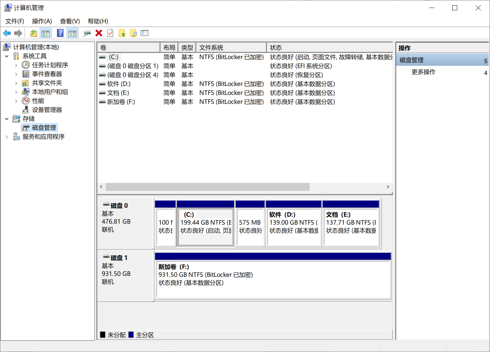
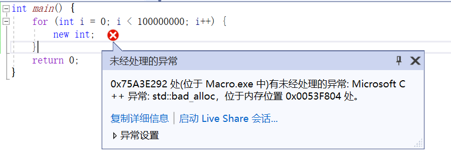
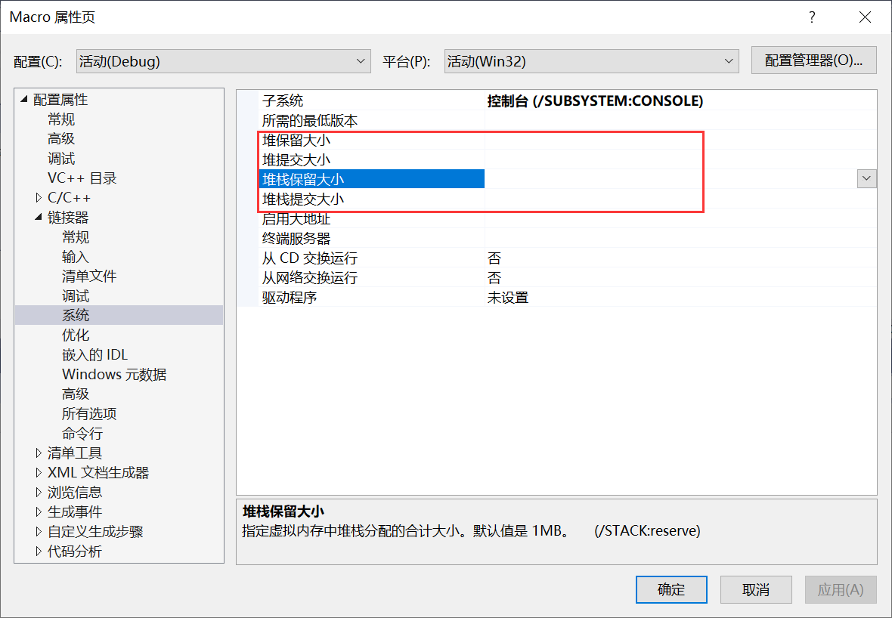

# 内存管理

这里有一篇很好的文章详细讲解了内存中需要注意的事项：

-   https://blog.csdn.net/zju_fish1996/article/details/108858577

珠玉在前，本节内容就做一些补充。

## 基础概念

计算机上的各种数据，一般都是 **存储** 在 **磁盘** 上面，`鼠标右键` 点击桌面图标 `此电脑` — `管理` — `存储` — `磁盘管理`，可以浏览和操作磁盘：



在 **任务管理器** 和 **资源监视器** 中，还能看到磁盘当前的运行情况：


当磁盘中的数据被使用时，操作系统会将其加载到内存之中，关于内存，[百度百科](https://baike.baidu.com/item/%E5%86%85%E5%AD%98/103614)中有如下说明：

> 内存是[计算机](https://baike.baidu.com/item/计算机/140338?fromModule=lemma_inlink)的重要部件，也称[内存储器](https://baike.baidu.com/item/内存储器/834392?fromModule=lemma_inlink)和[主存储器](https://baike.baidu.com/item/主存储器/10635399?fromModule=lemma_inlink)，它用于暂时存放CPU中的运算数据，以及与[硬盘](https://baike.baidu.com/item/硬盘/159825?fromModule=lemma_inlink)等[外部存储器](https://baike.baidu.com/item/外部存储器/4843180?fromModule=lemma_inlink)交换的数据。它是[外存](https://baike.baidu.com/item/外存/2445612?fromModule=lemma_inlink)与[CPU](https://baike.baidu.com/item/CPU/120556?fromModule=lemma_inlink)进行沟通的桥梁，计算机中所有程序的运行都在内存中进行，内存性能的强弱影响计算机整体发挥的水平。只要计算机开始运行，[操作系统](https://baike.baidu.com/item/操作系统/192?fromModule=lemma_inlink)就会把需要运算的数据从内存调到CPU中进行运算，当运算完成，CPU将结果传送出来。

### 堆、栈

程序（Windows下的`exe`）同样也是一种数据，它在启动时，操作系统会给它预分配两块 **固定大小** 的内存，分别作为：

- **栈（Stack）** ：主要用于函数栈的调用执行
- **堆（Memroy）** ：用于存储程序运行时动态申请内存的地址

> 栈的大小是固定的，而堆的大小特定于实现，并且取决于所使用的编译器，堆可以看做是链式存储了动态分配内存的地址，虽然MSVC 中的堆 **预分配** 的默认大小为 1MB，但运行时使用的空间是允许超过1MB的

不同的编译器和平台有不同的默认大小，以Windows下的MSVC为例，执行下面的程序：

``` c++
int main() {
	char arr[10000000];
	return 0;
}
```

由于我们在栈中创建或使用了超出程序预分配大小的内存，此时会报 Stack Overflow：


再执行下面的程序：

``` c++
int main() {
	for (int i = 0; i < 100000000; i++) {
		new int;
	}
	return 0;
}
```

当没有相应的空闲内存块时，动态分配会失败



可以通过编译器来手动设置程序预分配的栈和堆的空间大小，在 Visual Studio中，你可以在项目配置中进行修改：



> 笔者使用的VS2022有 **汉化异常** ，Stack 被错误翻译为了 堆栈

- 指令：https://learn.microsoft.com/en-us/cpp/build/reference/stack-stack-allocations

### 内存碎片

在C++中，我们一般使用 `new`/`delete` 创建和销毁动态内存，实际上，不同操作系统的内存分配接口都不同，比如，Windows实际上使用的是 `VirtualAlloc`/ `VirtualFree`， Unix和Mac使用的是`mmap`/`munmap`

在程序的执行过程中，频繁的分配与回收内存会导致大量的、连续且小的内存夹杂在已分配内存的中间，由于操作系统的内存分配算法并不能到达很完美的效果，导致这些 **空闲的内存无法被继续使用** ，这些内存我们称之为—— **内存碎片**

### 内存对齐

大部分CPU并不是以字节为单位来读写内存，它一般会以2、4、6、8字节作为内存存取粒度，这有利于提升内存的IO效率，具体的细节可查阅：

- https://zhuanlan.zhihu.com/p/83449008

不同的操作，不同的硬件，不同的平台，内存的对齐都会有一些差异，对于开发者而言，如果不了解那些黑话，很容易走到坑里，就比如：

- 使用SIMD必须保证16字节对齐

- 在GPU上申请的Buffer之间有最小对齐偏移的限制

- 在不同的渲染API上，向量的对齐方式也存在差异

  ``` c++
  
  D3D9:{
      {  4,  4,  4,  4 }, // Uint8
      {  4,  4,  4,  4 }, // Uint10
      {  4,  4,  8,  8 }, // Int16
      {  4,  4,  8,  8 }, // Half
      {  4,  8, 12, 16 }, // Float
  };
  
  D3D11:{
      {  1,  2,  4,  4 }, // Uint8
      {  4,  4,  4,  4 }, // Uint10
      {  2,  4,  8,  8 }, // Int16
      {  2,  4,  8,  8 }, // Half
      {  4,  8, 12, 16 }, // Float
  };
  
  GL、Vulkan、Metal: {
      {  1,  2,  4,  4 }, // Uint8
      {  4,  4,  4,  4 }, // Uint10
      {  2,  4,  6,  8 }, // Int16
      {  2,  4,  6,  8 }, // Half
      {  4,  8, 12, 16 }, // Float
  };
  ```

### 高速缓存

内存的读写速度确实很快，但CPU运算速度更快，这就导致CPU需要花费很长时间来等待数据的到来（读取）和送走（存储），为了减少CPU访问内存的平均时间，计算机存储体系中还引入的 **CPU高速缓存** 的部件，在[百度百科](https://baike.baidu.com/item/CPU%E7%BC%93%E5%AD%98)中，有如下定义：

> 在[计算机](https://baike.baidu.com/item/计算机)系统中， **CPU高速缓存** （英语：CPU Cache）是用于减少[处理器](https://baike.baidu.com/item/处理器)访问内存所需平均时间的部件。
>
> 在金字塔式存储体系中它位于自顶向下的第二层，仅次于CPU寄存器。其容量远小于[内存](https://baike.baidu.com/item/内存)，但速度却可以接近处理器的频率。
>
> 当处理器发出内存访问请求时，会先查看缓存内是否有请求数据。如果存在（命中），则不经访问内存直接返回该数据；如果不存在（失效），则要先把内存中的相应数据载入缓存，再将其返回处理器。
>
> 缓存之所以有效，主要是因为程序运行时对内存的访问呈现局部性（Locality）特征。这种局部性既包括空间局部性（Spatial Locality），也包括时间局部性（Temporal Locality）。有效利用这种局部性，缓存可以达到极高的命中率。
>
> 在处理器看来，缓存是一个透明部件。因此，程序员通常无法直接干预对缓存的操作。但是，确实可以根据缓存的特点对程序代码实施特定优化，从而更好地利用缓存。

在Windows下，你可以打开任务管理器，查看电脑的Cache信息：


当程序访问一块内存的时候，可能会把它的周边区域一起给加载到缓存中（因为额外加载一部分内容并没有太多开销），如果我们下次需要访问的内存已经被加载到缓存中（称作缓存命中），CPU就不用再到内存中访问，从而提升速度

这个示例代码可以让你了解到缓存的重要性：

``` c++
#include <iostream>
#include <chrono>
#include <vector>

class ClockGuard {			//用于打印一个作用域的执行耗时
public:
	ClockGuard(const std::string& inDest)
		:mDesc(inDest)
	{
		mStartTime = std::chrono::steady_clock::now();
	}
	~ClockGuard() {
		std::chrono::steady_clock::time_point currentTime = std::chrono::steady_clock::now();
		double durationNs = std::chrono::duration<double, std::nano>(currentTime - mStartTime).count();
		std::cout << mDesc << " Cost: " << durationNs << " Ns" << std::endl;
	}
private:
	std::string mDesc;
	std::chrono::steady_clock::time_point mStartTime;
};

const size_t bigger_than_cachesize = 10 * 1024 * 1024;
long* ptr = new long[bigger_than_cachesize];
void ClearCPUCache() {				//尝试清空缓存
	for (int i = 0; i < bigger_than_cachesize; i++){
		ptr[i] = rand();
	}
}

int main(int argc,char** argv) {
	std::vector<int*> continuous(1000);		//内存连续的数组
	std::vector<int*> dispersive(1000);		//内存分散的数组

	for (int*& item : continuous) {		
		item = new int;
	}

	const int spacing = 10000;	   		//内存间隔，调整该数以查看cache的影响
	for (int*& item : dispersive) {	   		
		item = new int[spacing];
	}

	ClearCPUCache();
	{
		ClockGuard guard("continuous");		//对连续的内存进行赋值，缓存命中率高
		for (int*& item : continuous) {
			*item = 1;
		}
	}
    
	ClearCPUCache();
	{
		ClockGuard guard("dispersive");		//对离散的内存进行赋值，缓存命中率低 
		for (int*& item : dispersive) {
			*item = 1;
		}
	}

	return 0;
}
```

尽量避免内存上下文的调整，可以有效增加缓存的命中率，人的大脑其实也有这样的机制，不信你看：

<p style="text-align:center"><iframe width="560" height="315" src="//player.bilibili.com/player.html?aid=218871639&bvid=BV1o8411x7aE&cid=855664393&page=1&autoplay=false" scrolling="no" border="0" frameborder="0" framespacing="0" allowfullscreen="true"></iframe></p>

关于缓存，这里有一篇更深入的文章：

- https://zhuanlan.zhihu.com/p/490910129

### 硬件加速

内存除了缓存机制，在使用上，也存在一些 **黑魔法** ，比如下面的代码：

``` C++
#include <iostream>
#include <chrono>
#include <vector>

class ClockGuard {
public:
	ClockGuard(const std::string& inDest)
		:mDesc(inDest) {
		mStartTime = std::chrono::steady_clock::now();
	}
	~ClockGuard() {
		std::chrono::steady_clock::time_point currentTime = std::chrono::steady_clock::now();
		double durationNs = std::chrono::duration<double, std::nano>(currentTime - mStartTime).count();
		std::cout << mDesc << " Cost: " << durationNs << " Ns" << std::endl;
	}
private:
	std::string mDesc;
	std::chrono::steady_clock::time_point mStartTime;
};

const size_t bigger_than_cachesize = 10 * 1024 * 1024;
long* ptr = new long[bigger_than_cachesize];
void ClearCPUCache() {
	for (int i = 0; i < bigger_than_cachesize; i++) {
		ptr[i] = rand();
	}
}

int main(int argc, char** argv) {
	std::vector<int> src(100000);
	std::vector<int> dst(100000);

	ClearCPUCache();
	{
		ClockGuard guard("Copy");		//普通C++拷贝
		for (int i = 0; i < src.size(); ++i) {
			dst[i] = src[i];
		}
	}
	ClearCPUCache();
	{
		ClockGuard guard("Map");		//内存拷贝
		memcpy(dst.data(), src.data(), src.size());
	}

	return 0;
}
```

在C++语法中，已经不能写出比 `for (int i = 0; i < src.size(); ++i) { dst[i] = src[i]; }`更简单的代码了，但使用 `memcpy` 做同样的事情，性能却能够大幅提升，这主要是因为 memory 使用了汇编级别的优化，并且跟硬件特性有着很强的关联：

- ARM64架构下memcpy实现原理：https://blog.csdn.net/m0_46250244/article/details/115055101

在以后学习图形学的路上，在GPU上同样也会接触到许多类似的操作，因此读者需要多深入了解硬件的体系结构

### 优化方向

综上，内存优化的主要策略其实主要就是围绕着以下几点：

- **减少内存碎片，增加缓存的命中率**
- **结合应用场景和硬件特性，使用高效的内存操作方法**

## 对象生命周期管理

在现代程序开发过程中，充斥着大量的对象，对于在栈上申请的对象，在离开其作用域之后，会自动进行释放，但对于在堆上申请的对象，就需要我们手动去管理它们的生命周期，在c++中，也就是需要我们保证new和delete情况下一一对应，理想情况下，是这样的：

``` c++
void Func(){
    Object* object = new Object;
    //...
    delete object;
}
```

但现实总是残酷的，当代码中出现逻辑分支，或者是嵌套函数，对象的生命周期发生转移，想要再手动操控它的delete就会有些困难：

``` c++
void Func(){
    Object* object = new Object;
    if(...){
        //Do something 
        delete object;
        return;
    }
    else if(...){
        //Do something 
        delete object;
        return;
    }
    else if(...){
        //Do something 
        delete object;
        return;
    }
}
```

对此，我们往往需要一种自动管理对象生命周期的策略，而当下主要有两种方式：

- 智能指针
- 垃圾回收

### 智能指针

在c++的各种库中，往往提供共享指针的概念，它的核心思想就是：

-   用一个外部对象包裹实际的对象指针，通过监控外部对象的构造、析构和拷贝，使用一块公共内存来记录指针的引用，当引用为0时，再销毁对象

一个简易的模仿如下：

```c++
struct SharedPtrRefData{
    uint refCount = 0; 
};

template<Typename _Ty>
class SharedPtr{
public:
	SharedPtr(_Ty* rawPtr)						//构造函数
    	: mRawPtr(rawPtr)
        : mRefData(new SharedPtrRefData);		//新建公共内存
    {
        mRefData->refCount++;					//引用计数+1
	}
    
    SharedPtr(const SharedPtr<_Ty>& other){		//拷贝函数
        mRefData = other.mRefData;				//传递公共内存
        mRefData->refCount++;					//引用计数+1
    }
    
    ~SharedPtr(){								//析构函数
        mRefData->refCount--;					//引用计数-1
        if(SharedPtrRefData->refCount == 0){	
            delete mRawPtr;						//销毁对象
            delete mRefData;					//销毁公共内存
        }
    }
private:
    _Ty* mRawPtr;
    SharedPtrRefData* mRefData;
};
```

这个结构在以下框架的实现是：

-   C++标准库： **std::shared_ptr**
-   Unreal Engine： **TSharedPtr**
-   Qt： **QSharedPointer**

使用SharedPtr能保证我们在访问指针对象的时候，一定没有被释放，但有时候我们可能希望 “共享指针"  **不再延续对象的生命周期，但可以在之后判断对象是否已经被销毁** ，框架中一般会称这个结构为 **WeakPtr** ，在框架中对应：

- C++标准库： **std::weak_ptr**
- Unreal Engine： **TWeakPtr**
- Qt： **QWeakPointer**

以std为例：

```c++
#include <iostream>

int main() {
	std::shared_ptr<int> sptr(new int);
	std::weak_ptr<int> wptr(sptr);
	if (const std::shared_ptr<int>& lock = wptr.lock()) {
		std::cout << "exist !!!" << std::endl;
	}
	else {
		std::cout << "not exist" << std::endl;
	}
	sptr.reset();
	if (const std::shared_ptr<int>& lock = wptr.lock()) {
		std::cout << "exist !!!" << std::endl;
	}
	else {
		std::cout << "not exist !" << std::endl;
	}
	return 0;
}

/*
exist !!!
not exist !
*/
```

在上面SharePtr的简易代码中，当 `refCount` 为0时，同时销毁了对象和公共内存，但实际上， `SharedPtrRefData` 中存在着两个计数器：`refCount` 和 `weakCount`，当 `refCount` 为0时，只会销毁对象，并不会销毁公共内存，这使得WeakPtr依旧可以访问共享内存从而查询对象是否还存在，只有当 `weakCount` 也为 0 时，公共内存才会被销毁。

对于裸指针，delete只会销毁对象的内存，指针所指向的地址依然存在，如果管理不当，就会出现野指针，导致内存泄漏，而WeakPtr就解决了这一痛点。

还有一种情况，有时候我们可能希望一个new出来的对象，像普通对象那样，离开它的作用域之后销毁，比如说：

``` c++
class Example{
public:
    Example()
   		: mObject(new Object)
    {}
    ~Example(){
        delete mObject;
    } 
private:
    Object* mObject;
}
```

这种情况，我们可以使用：

- C++标准库： **std::unique_ptr**
- Unreal Engine： **TUniquePtr**
- Qt： **QScopedPointer**

> Qt的命名似乎更能体现它的作用

上面的代码用UniquePtr，可以改写为：

``` c++
class Example{
public:
    Example()
   		: mObject(new Object)
    {}
private:
    std::unique_ptr<Object> mObject;
};
```

智能指针能解决开发过程中的绝大部分问题，但它并不是完美的，这里有一些 **注意事项** ：

- 使用智能指针，尽量在构造或 `reset` 函数中 new 对象，尽量不要在智能指针之外去操纵裸指针

  ``` c++
  
  ```
  
- 不能使用  `std::shared<int> sptr(this)`，如果希望使用this创建共享指针，需要让this的类继承自模板`enable_shared_from_this`

- 大量使用不必要的SharedPtr会有一定的浪费，使用SharedPtr的本意是为了维护对象的生命周期，如果你在封装接口的时候，不需要接口将对象的生命周期传递出去，那么你不应该将SharedPtr暴露出来，而是WeakPtr或者RawPtr

- 在多线程环境下使用，应确保所使用的SharedPtr是线程安全的，以保证引用计数能够正常工作

此外，还有一些 **隐患** ：

- 使用共享指针时，容易忽略捕获参数的生命周期，如果内部有共享指针，则会导致内存泄漏：

  ``` c++
  #include <iostream>
  #include <functional>
  
  class Exmaple {
  public:
  	Exmaple() {
  		std::cout << "Create" << std::endl;
  	}
  	~Exmaple() {
  		std::cout << "Destroy" << std::endl;
  	}
  };
  
  int main(int argc, char** argv) {
  	{
  		std::function<void()> func0;
  		{
  			std::shared_ptr<Exmaple> sptr(new Exmaple);
  			std::function<void()> func1 = [sptr]() {};	//将共享指针作为捕获参数
  			std::cout << "---------0" << std::endl;
  			//func0 = func1;		//取消注释，那么Example将会在 1 2 之间释放
  		}
  		std::cout << "---------1" << std::endl;
  	}
  	std::cout << "---------2" << std::endl;
  	return 0;
  }
  /*
  lambda的捕获参数在离开其作用域且没有function引用时才会被释放
  如果没有及时销毁或重置function，那么捕获参数将一直存在，导致内存泄漏
  */
  ```

- SharedPtr存在循环引用的问题

  ```c++
  #include <iostream>
  
  struct B;
  
  struct A {
  	~A() {
  		std::cout << "destruct A" << std::endl;
  	}
  	std::shared_ptr<B> mB;
  };
  
  struct B {
  	~B() {
  		std::cout << "destruct B" << std::endl;
  	}
  	std::shared_ptr<A> mA;
  };
  
  int main() {
  	{
  		std::shared_ptr<A> a(new A);
  		std::shared_ptr<B> b(new B); 
  		a->mB = b;
  		b->mA = a;
  	}
  	return 0;	//对象无法释放
  }
  ```

- SharedPtr的销毁是立即的，在大项系统中，一次性销毁大量对象将会造成卡顿

关于共享指针，这里有一篇更深入的文章：

- https://zhuanlan.zhihu.com/p/532215950

### 垃圾回收

为了解决共享指针的缺陷，一些高级语言和大型框架就提供了垃圾回收（Garbage Collection）机制，旨在解决循环引用的问题以及实现延迟销毁

> 由于C++的特性（历史原因），如果让一个蹩脚的垃圾回收机制进入到C++标准中，只会让它的变得更加混乱，因此C++中的垃圾回收往往是由框架自己定制的，就像UE和Qt，它们已经脱离了C++标准的范畴，网友们戏称其为U++和Q++

目前，笔者了解较多的GC机制有：

- Unreal Engine
- Qt、FBX SDK
- Lua

于开发者而言，关于GC主要需要了解两点：

- 如何标记对象之间的引用关系
- 如何进行垃圾回收

对于一些高级语言，如Java，C#，Python，Lua，因为虚拟机的缘故，想要监控对象之间的引用，很容易做到，而在C++中，对象之间的引用就只能靠手动设置或是通过反射分析。

Qt使用QObject为基类，它的内存回收很简单，就像是下面这样：

```cpp
class QObject{
public:
    QObject(QObject * parent = nullptr);
private:
    QVector<QObejct*> children;
    QObject *parent;
}
```

- QObject中有一个parent指针，children列表，销毁QObject时会同时销毁children
- QObject的还提供一个deleteLater()函数，会将对象添加到一个数组中，在事件处理循环结束之后，才会进行销毁。

FBX SDK使用FbxObject为基类，在创建实例时，必须指定其父对象，就像是这样：

```cpp
FbxManager* lManager = FbxManager::Create();
FbxIOSettings* lIOSettings = FbxIOSettings::Create(lManager, "");
FbxScene* scene = FbxScene::Create(lManager,"");
FbxSkeleton* skeletonNode = FbxSkeleton::Create(scene,"SkeletonRoot");
FbxCluster* rootCluster = FbxCluster::Create(skeletonNode, "");
```

- 当父对象释放时，会释放子对象

上面两个框架的内存回收的主体结构非常简单，对于环路问题，它们会在指定parent时进行检测，出现环路直接给出报错。

而UE的GC机制，就复杂太多了，在UE中，构建引用主要通过两种方式：

- UProperty（反射）：UE通过分析UObject的Property，来确定两个对象之间的引用
- FGCObject：手动构建引用关系的接口类，UE中的绝大多数框架，比如UMG，Editor，Niagara...，都派生FGCObject实现了一套GC引用的管理机制，使得开发者在调用某些接口的时候，就已经隐式地构建对象之间的引用

UE的回收方式方式比较复杂，在这里不进行展开，一般只需要了解它是定时定量的回收即可

这里介绍一种简单的标记清理算法，它的核心在于：

- 将所有可回收对象存储到一个数组中。
- 存储对象间的引用关系。
- 拥有一个全局的根节点，其他节点如果具有到达该节点的引用关系，那么说明该节点是可达的。
- 垃圾回收时，需要挂起游戏线程，保证所有对象不被使用。
- 从根节点遍历，标记所有可达节点。
- 遍历对象数组，将不可达节点进行销毁。

一个简易版本的实现如下（更多细节请查看：[Mark-and-Sweep：垃圾收集算法](https://link.zhihu.com/?target=https%3A//www.geeksforgeeks.org/mark-and-sweep-garbage-collection-algorithm/)）：

```cpp
class ObjectBase{
public:
    typedef short ID;
public:
    ObjectBase();
    virtual ~ObjectBase();
    void addRefrence(ObjectBase * ref);     //添加对象引用
    void removeRefrence(ObjectBase* ref);   //删除对象引用
private:
    friend class ObjectManagement;
    ID id;                      //为该对象分配唯一的id
    std::list<ID> refrence;     //引用对象的id列表
};
```

> 这里使用short是因为它只有两字节，可表示2^15（32767）个数，已经足够用作ID

为了能够管理所有的ObjectBase对象，这里创建了一个全局的管理对象 **GObjectManagement** ，在构造时将该对象添加到其中，销毁时删除该对象：

```cpp
ObjectBase::ObjectBase(){
    GObjectManagement.AddObject(this);
}

ObjectBase::~ObjectBase(){
    GObjectManagement.RemoveObject(this);
}
```

ObjectManagement的定义如下：

```cpp
class ObjectManagement {
public:
    ObjectManagement() {
        for (int i = 0; i < mObjects.size(); i++) {     //初始化Id栈
            mObjects[i].object = nullptr;
            mIdStack[i] = i;
        }
    }
    void AddObject(ObjectBase* obj) {       //添加对象
        if (obj != nullptr) {
            obj->id = allocId();
            mObjects[obj->id].object = obj;
            ++mCurrentNumberOfObject;
            mMaxIdOfObject = std::max(mMaxIdOfObject, obj->id);
        }
    }
    void RemoveObject(ObjectBase* obj) {    //删除对象
        if (obj != nullptr) {
            mObjects[obj->id].object = nullptr;
            freeId(obj->id);
            --mCurrentNumberOfObject;
        }
    }
    void GarbageCollection() {              //垃圾回收
        MarkObjects(0);        //这里假设0号节点是游戏全局的根节点，从它开始遍历，标记可达对象
        for (int i = 0; i <= mMaxIdOfObject; i++) {     //简单遍历所有对象，销毁不可达对象
            if (!mObjects[i].reachable) {
                delete mObjects[i].object;
            }
            else {      //还原状态，为下一此可达性遍历做准备
                mObjects[i].reachable = false;
            }
        }
    }

    void MarkObjects(const ObjectBase::ID& Id) {                //深度遍历所有节点
        ObjectBase* obj = mObjects[Id].object;
        if (obj != nullptr && !mObjects[Id].reachable) {        //要求节点不可达，为了避免出现环路
            mObjects[Id].reachable = true;
            for (auto& subId : obj->refrence) {
                MarkObjects(subId);
            }
        }
    }

private:
    ObjectBase::ID allocId() {                  //从栈顶分配Id
        assert(mIdStackTop < mIdStack.size());
        return mIdStack[mIdStackTop++];
    }
    
    void freeId(ObjectBase::ID id) {            //回收Id
        assert(mIdStackTop > 0);
        mIdStack[--mIdStackTop] = id;
    }

public:
    struct ObjectItem{
        ObjectBase* object;
        bool reachable = false;
    };

    static const int MAX_NUMBER_OF_OBJECT = std::numeric_limits<ObjectBase::ID>().max();

    std::array<ObjectItem, MAX_NUMBER_OF_OBJECT> mObjects;      //这里创建了32767大小的定长数组，用于存储所有的Object
    
    std::array<ObjectBase::ID, MAX_NUMBER_OF_OBJECT> mIdStack;  //该定长数组用于模拟栈来分配和回收ID，保证Id不会快速膨胀
    ObjectBase::ID mIdStackTop = 0;                             //栈顶索引

    ObjectBase::ID mCurrentNumberOfObject = 0;                  //当前存在的Object数量
    ObjectBase::ID mMaxIdOfObject = 0;                          //整个程序中所使用过的最大ID，用于减少遍历数
};

//全局静态对象
static ObjectManagement GObjectManagement;
```

下面编写代码进行简单测试：

```cpp
class Object : public ObjectBase {
public:
    Object(std::string name):mName(name){
        std::cout << "construct object : " << mName << std::endl;
    }
    virtual ~Object(){
        std::cout << "destruct object : " << mName << std::endl;
    }
private:
    std::string mName;
protected:
};

int main() {
    Object* root = new Object("Root");                      //默认把第一个节点当做游戏根节点
    Object* a = new Object("A");
    Object* b = new Object("B");
    Object* c = new Object("C");                            
    Object* d = new Object("D");
    Object* e = new Object("E");
    Object* f = new Object("F");

    root->addRefrence(a);                                   //    root
    root->addRefrence(b);                                   //    /  \ 
    b->addRefrence(c);                                      //   A    B
    b->addRefrence(d);                                      //       / \ 
    c->addRefrence(e);                                      //      C   D
    c->addRefrence(f);                                      //     / \ 
    e->addRefrence(f);                                      //    E - F

    std::cout << "Garbage Collection : 0" <<std::endl;      // 没有对象被回收
    GarbageCollection();
    std::cout << "-----------------------" << std::endl;

    b->removeRefrence(c);                                   //  去除B对C的引用，C、E、F将会被销毁
    std::cout << "Garbage Collection : 1" << std::endl;
    GarbageCollection();
    std::cout << "-----------------------" << std::endl;
}
```

``` c++
construct object : Root
construct object : A
construct object : B
construct object : C
construct object : D
construct object : E
construct object : F
Garbage Collection : 0
-----------------------
Garbage Collection : 1
destruct object : C
destruct object : E
destruct object : F
-----------------------
```

## 内存调度框架

开源社区涌现了很多内存调度框架旨在 减少内存碎片 以及 增加缓存的命中率，其中比较知名的有：

### [mimalloc](https://github.com/microsoft/mimalloc)

mimalloc是一种通用分配器，具有出色的[性能](https://github.com/microsoft/mimalloc#performance)特征。最初由 Daan Leijen 为[Koka](https://koka-lang.github.io/)和[Lean](https://github.com/leanprover/lean)语言的运行时系统开发 

- **小而一致** ：该库使用简单且一致的数据结构，大约有 8k LOC。这使得它非常适合集成和适应其他项目。对于运行时系统，它提供了用于单调*心跳*和延迟释放的钩子（对于具有引用计数的有界最坏情况时间）。
- **空闲列表分片** ：每个“mimalloc 页”有许多较小的列表，而不是一个大的空闲列表（每个大小类），这减少了碎片并增加了局部性——及时分配的东西在内存中分配得很近。（一个 mimalloc 页包含一个大小级别的块，在 64 位系统上通常是 64KiB）。
- **自由列表多分片** ：好主意！我们不仅将每个 mimalloc 页面的空闲列表分片，而且对于每个页面，我们都有多个空闲列表。特别是，有一个用于线程本地`free`操作的列表，另一个用于并发`free` 操作。从另一个线程中释放现在可以是单个 CAS，而无需线程之间的复杂协调。由于将有数千个单独的空闲列表，争用自然分布在堆上，并且在单个位置上竞争的机会将很低——这与跳过列表等随机算法非常相似，其中添加随机预言机消除了需要对于更复杂的算法。
- **急切页面重置** ：当“页面”变空时（由于空闲列表分片的机会增加），内存被标记为操作系统未使用（“重置”或“清除”）减少（真实）内存压力和碎片，特别是在长时间运行的程序。
- **安全** : *mimalloc*可以在安全模式下构建，添加保护页、随机分配、加密空闲列表等，以防止各种堆漏洞。性能损失通常比我们的基准平均高出 10% 左右。
- **一流的堆** ：有效地创建和使用多个堆来跨不同区域进行分配。堆可以一次销毁，而不是单独释放每个对象。
- **有界** ：它不会受到*膨胀* 的影响，有界最坏情况分配时间 ( *wcat* )，有界空间开销（约 0.2% 元数据，分配大小最多浪费 12.5%），并且没有内部点仅使用原子操作的争用。
- **快速** ：在我们的基准测试中， *mimalloc*优于其他领先的分配器（*jemalloc*、*tcmalloc*、*Hoard*等），并且通常使用更少的内存。一个不错的特性是它在广泛的基准测试中始终表现良好。对于较大的服务器程序，也有很好的巨大操作系统页面支持。

### [oneTBB](https://www.intel.com/content/www/us/en/developer/tools/oneapi/onetbb.html)

英特尔® oneAPI 线程构建块 (oneTBB) 是一个灵活的性能库，即使您不是线程专家，也可以简化为跨加速架构的复杂应用程序添加并行性的工作。

- **指定逻辑性能，而不是线程**
  运行时库自动将逻辑并行映射到线程上，从而最有效地利用处理器资源。
- **以线程为目标提高性能**
  专注于并行化计算密集型工作的特定目标，提供更高级别、更简单的解决方案。
- **与其他线程包共存 **
  它能够与其他线程无缝兼容，使您可以灵活地保持旧代码不变，并使用 oneTBB 进行新的实现。
- **强调可扩展的数据并行编程**
  oneTBB 强调数据并行编程，而不是将程序分解成功能块并为每个功能块分配一个单独的线程，从而使多个线程能够在集合的不同部分上工作。通过将集合分成更小的部分，这可以很好地扩展到更多的处理器。随着您添加处理器和加速器，程序性能会提高。

### [jemalloc](https://github.com/jemalloc/jemalloc)

jemalloc 是一个通用的`malloc(3)`实现，它强调避免碎片化和可扩展的并发支持。它旨在用作系统提供的内存分配器，如在 FreeBSD 的 libc 库中，以及用于链接到 C/C++ 应用程序。jemalloc 提供了许多超出标准分配器功能的内省、内存管理和调整功能。

### [tcmalloc](https://github.com/google/tcmalloc)

TCMalloc 是 Google 对 C`malloc()`和 C++ 的自定义实现，`operator new`用于C 和 C++ 代码中的分配内存。此自定义内存分配框架是 C 标准库（在 Linux 上通常通过`glibc`）和 C++ 标准库提供框架的替代方案。

- 性能随应用程序的并行程度提升
- 依附于C++14 和 C++17 进行了优化，并且在保证性能优势的情况下与标准略有不同（这些在[TCMalloc 参考](https://github.com/google/tcmalloc/blob/master/docs/reference.md)中注明）
- 允许在某些架构下提高性能的扩展，以及其他行为，例如指标收集

- 通过管理特定大小的内存块（称为“页面”）从操作系统执行分配。
- 将单独的页面（或在 TCMalloc 中称为“跨度”的页面运行）用于特定的对象大小。例如，所有 16 字节的对象都放置在专门为该大小的对象分配的“跨度”中。在这种情况下获取或释放内存的操作要简单得多。
- 将内存保存在*缓存中*以加快对常用对象的访问。如果以后重新分配此类内存，即使在释放后保留此类缓存也有助于避免代价高昂的系统调用。

### 使用方法

这些框架的使用方法也很简单，它们提供了自己的内存分配和释放接口，我们只需覆盖C++的operator，并使用这些内存接口来操作内存即可：

> 以mimalloc，使用下面的代码可以覆盖C++的 `new` 和 `delete`

```c++
#include <vcruntime_new.h>

_NODISCARD _Ret_notnull_ _Post_writable_byte_size_(_Size) _VCRT_ALLOCATOR
void* __CRTDECL  operator new  (size_t Size) { return mi_malloc(Size ? Size : 1); }

_NODISCARD _Ret_notnull_ _Post_writable_byte_size_(_Size) _VCRT_ALLOCATOR
void* __CRTDECL operator new[](size_t Size) { return mi_malloc(Size ? Size : 1); }

_NODISCARD _Ret_maybenull_ _Success_(return != NULL) _Post_writable_byte_size_(_Size) _VCRT_ALLOCATOR
void* __CRTDECL operator new  (size_t Size, const std::nothrow_t&) { return mi_malloc(Size ? Size : 1); }

_NODISCARD _Ret_maybenull_ _Success_(return != NULL) _Post_writable_byte_size_(_Size) _VCRT_ALLOCATOR
void* __CRTDECL operator new[](size_t Size, const std::nothrow_t&) { return mi_malloc(Size ? Size : 1); }

void __CRTDECL operator delete  (void* Ptr) { mi_free(Ptr); }
void __CRTDECL operator delete[](void* Ptr) { mi_free(Ptr); }
void __CRTDECL operator delete  (void* Ptr, const std::nothrow_t&) { mi_free(Ptr); }
void __CRTDECL operator delete[](void* Ptr, const std::nothrow_t&) { mi_free(Ptr); }
void __CRTDECL operator delete  (void* Ptr, size_t Size) { mi_free(Ptr); }
void __CRTDECL operator delete[](void* Ptr, size_t Size) { mi_free(Ptr); }
void __CRTDECL operator delete  (void* Ptr, size_t Size, const std::nothrow_t&) { mi_free(Ptr); }
void __CRTDECL operator delete[](void* Ptr, size_t Size, const std::nothrow_t&) { mi_free(Ptr); }

_NODISCARD _Ret_notnull_ _Post_writable_byte_size_(_Size) _VCRT_ALLOCATOR
void* __CRTDECL operator new  (size_t Size, std::align_val_t Alignment) { return mi_malloc_aligned(Size ? Size : 1, (std::size_t)Alignment); }

_NODISCARD _Ret_notnull_ _Post_writable_byte_size_(_Size) _VCRT_ALLOCATOR
void* __CRTDECL operator new[](size_t Size, std::align_val_t Alignment) { return mi_malloc_aligned(Size ? Size : 1, (std::size_t)Alignment); }

_NODISCARD _Ret_maybenull_ _Success_(return != NULL) _Post_writable_byte_size_(_Size) _VCRT_ALLOCATOR
void* __CRTDECL operator new  (size_t Size, std::align_val_t Alignment, const std::nothrow_t&) { return mi_malloc_aligned(Size ? Size : 1, (std::size_t)Alignment); }

_NODISCARD _Ret_maybenull_ _Success_(return != NULL) _Post_writable_byte_size_(_Size) _VCRT_ALLOCATOR
void* __CRTDECL operator new[](size_t Size, std::align_val_t Alignment, const std::nothrow_t&) { return mi_malloc_aligned(Size ? Size : 1, (std::size_t)Alignment); }

void __CRTDECL operator delete  (void* Ptr, std::align_val_t Alignment) { mi_free(Ptr); }
void __CRTDECL operator delete[](void* Ptr, std::align_val_t Alignment) { mi_free(Ptr); }
void __CRTDECL operator delete  (void* Ptr, std::align_val_t Alignment, const std::nothrow_t&) { mi_free(Ptr); }
void __CRTDECL operator delete[](void* Ptr, std::align_val_t Alignment, const std::nothrow_t&) { mi_free(Ptr); }
void __CRTDECL operator delete  (void* Ptr, size_t Size, std::align_val_t Alignment) { mi_free(Ptr); }
void __CRTDECL operator delete[](void* Ptr, size_t Size, std::align_val_t Alignment) { mi_free(Ptr); }
void __CRTDECL operator delete  (void* Ptr, size_t Size, std::align_val_t Alignment, const std::nothrow_t&) { mi_free(Ptr); }
void __CRTDECL operator delete[](void* Ptr, size_t Size, std::align_val_t Alignment, const std::nothrow_t&) { mi_free(Ptr); }
```

在 Unreal Engine 中，它实现了一个内存分配器基类 **FMalloc** ，派生了以下子类，使用`FMemory::Malloc` / `FMemory::Free`调用内存分配器的接口，从而允许在不同内存分配器之间进行切换：

- **Ansi** ：标准的c分配器，直接调用malloc、free、realloc。
- **Stomp** ：有助于追踪分配过程中读写造成的问题，如野指针，内存越界等。

- **TBB** ：Thread Building Blocks，Intel提供的64位可伸缩内存分配器

- **Jemalloc** ：主要用于 Unix 的内存分配器。

- **Binned** ：装箱内存分配器，主要用于IOS。

  - **Binned** ：装箱分配器将一块内存（ **Pool** ）划分为许多不同大小的槽位，比如Binned在PC上把64KB划分成41个不同的槽位，从尾部往前分配空闲槽位：

  - **Binned2** ：Binned2分配器支持线程本地内存分配，不需要每次都加锁。这在频繁小块内存分配、释放时可以提升不少性能。

  - **Binned3** ：使用虚拟内存地址（逻辑内存地址），可以通过排列它来高速执行Pool的Index搜索，以便可以从内存的指针计算出目标大小的Pool 。

- **Mimalloc** ：一个优于 tcmalloc 和 jemalloc 的通用内存分配器

Unreal Engine中不同平台内存分配器的支持情况如下

|              | **Ansi** | **TBB** ® | **Jemalloc** ® | **Binned** | **Binned2** | **Binned3** | **Mimalloc** ® | **Stomp** |
| :----------: | :------: | :------: | :-----------: | :--------: | :---------: | :---------: | :-----------: | :-------: |
| **Android**  |    √     |          |               |     √      |   default   | √（64bits） |               |           |
|   **IOS**    |    √     |          |               |  default   |             |             |               |           |
| **Windows**  |    √     | defalut  |               |     √      |      √      | √（64bits） |       √       |     √     |
|  **Linux**   |    √     |          |       √       |     √      |   default   |             |               |     √     |
|   **Mac**    |    √     | default  |               |     √      |      √      |             |               |     √     |
| **HoloLens** |    √     |          |               |            |             |   default   |               |           |


## 基础库优化

在内存的应用级别，C++的基础容器和算法有很大的优化空间，这就不得不谈一下 C++ STL 库，它的缺点很多：

- 某些 STL 实现（尤其是 Microsoft STL）具有较差的性能特征，使其不适合游戏开发。
- STL 有时很难调试，因为大多数 STL 实现都使用神秘的变量名和不寻常的数据结构。
- STL 分配器有时使用起来很痛苦，因为它们有很多要求并且一旦绑定到容器就无法修改。
- STL 包含过多的功能，这些功能可能会导致代码超出预期。告诉程序员他们不应该使用该功能并不容易。
- STL 是通过非常深入的函数调用实现的。这导致在非优化构建中的性能不可接受，有时在优化构建中也是如此。
- STL 不支持包含对象的对齐。
- STL 容器不允许您在不提供要从中复制的条目的情况下将条目插入容器。这可能效率低下。
- 在 STLPort 等现有 STL 实现中发现的有用 STL 扩展（例如 slist、hash_map、shared_ptr）不可移植，因为它们在其他 STL 版本中不存在或在 STL 版本之间不一致。
- STL 缺少游戏程序员认为有用的有用扩展（例如 intrusive_list），但可以在可移植的 STL 环境中对其进行最佳优化。
- STL 的规范限制了我们有效使用它的能力。例如，STL 向量不能保证使用连续内存，因此不能安全地用作数组。
- STL 在性能之前强调正确性，而有时您可以通过减少学术上的纯粹性来获得显着的性能提升。
- STL 容器具有私有实现，不允许您以可移植的方式处理它们的数据，但有时这却是很重要的（例如节点池）。
- 所有现有版本的 STL 都至少在其某些容器的空版本中分配内存。这并不理想，并且会阻止优化，例如在某些情况下可以大大提高性能的容器内存重置。
- STL 的编译速度很慢，因为大多数现代 STL 实现都非常大。

> 摘自 https://github.com/electronicarts/EASTL/blob/master/doc/Design.md

它最大的缺点就是：

- **STL在性能之前强调正确性，为了追求学术的纯粹性，它并没有为了性能铤而走险，剑走偏锋**

举个例子，相信很多小伙伴在使用 `std::vector` 的时候，都知道应该尽量使用`reserve` 提前分配从而避免扩容导致的内存重分配，而对于 `set`、`map` 这类容器，其实也可以提前分配好节点的内存，这样不仅可以减少内存的分配次数，还能保证容器元素在内存中是连续的，访问时缓存的命中率可以大幅提升

如果你对比过 STL 和 UE 的内存分配器，可以发现明显的区别：

- STL 使用 Allocator 为容器中新增的元素分配内存
- UE 的 Allocator 为整个容器存重新分配内存，UE中容器都支持像 `std::vector` 那样的扩容机制

为了解决上面的问题，很多引擎都维护着一套自己的基础库，而开源的，主要有以下的一些方案：

### [EASTL](https://github.com/electronicarts/EASTL)

EASTL 是一个包含容器、算法和迭代器的 C++ 模板库，可用于跨多个平台的运行时和工具开发，它的实现相当广泛和健壮，并且强调性能高于所有其他考虑因素。

- EASTL 具有简化且更灵活的自定义分配方案。
- EASTL 的代码更易于阅读。
- EASTL 有扩展容器和算法。
- EASTL 具有专为游戏开发而设计的优化。

在上述各项中，唯一与 STL 不兼容的区别是内存分配的情况。

### [foonathan](https://github.com/foonathan/memory)

foonathan也是为了解决STL存在的缺陷，但与EASTL不同，它并没有尝试更改 STL。

### [STL C++17 polymorphic memory source](https://www.rkaiser.de/wp-content/uploads/2021/03/embo2021-pmr-STL-for-Embedded-Applications-en.pdf)

在C++17以前，完成STL容器的内存分配需要借助allocator，它主要有以下缺陷：

- allocator是模板签名的一部分，不同allocator的容器，无法混用

  ```c++
  vector<int,allocator0> v0;
  vector<int,allocator1> v1;
  v0 = v1;  //Error
  ```

- allocator内存对齐无法控制，需要传入自定义allocator

- allocator没有内部状态

C++17中为容器提供了新的内存分配方法 ——` <memory_resource>`

它的用法就像是下面这样：

```C++
#include <memory_resource>
#include <vector>
#include <string>            
#include <iostream>

class CustomMemoryResource :public std::pmr::memory_resource{   //自定义memory_source
public:
    CustomMemoryResource() {}
private:
    virtual void* do_allocate(const size_t _Bytes, const size_t _Align) override {
        return ::operator new(_Bytes,std::align_val_t(_Align));
    }                                                                                                                                             
    virtual void do_deallocate(void* _Ptr, size_t _Bytes, size_t _Align){
        ::operator delete(_Ptr,_Bytes, std::align_val_t(_Align));
    };
    virtual bool do_is_equal(const memory_resource& _That) const noexcept {
        return this==&_That;
    };
};
int main() {
    std::pmr::unsynchronized_pool_resource ms1; //非线程安全的池分配器
    std::pmr::synchronized_pool_resource ms2;   //同步池分配器
    CustomMemoryResource custom_memory_source;  //自定义分配器
    char buffer[20];
    std::pmr::monotonic_buffer_resource mbr(std::data(buffer),std::size(buffer),&custom_memory_source);   //单调缓存分配器，从buffer中分配内存，直到调用mbr.release()内存才会释放，超出缓存会使用上级分配器进行分配
    {
        std::pmr::vector<std::pmr::string> vec{ &mbr };
        vec.push_back("Hello World");
        vec.push_back("One Two Three");
    }   //vec 的内存不会释放
    mbr.release();  //此时才会释放mbr中的内存
}
```

从上面的代码可以看出 **MemoryResouce** 完美解决了 **allocator** 存在的问题，我们只需使用来自于命名空间`std::pmr`的容器。

它是怎么做到的呢？

以`std::pmr::vector`为例，找到它的定义：

```C++
namespace pmr {
    template <class _Ty>
    using vector = std::vector<_Ty, polymorphic_allocator<_Ty>>;
} // namespace pmr
```

非常简单，它只是一个使用了`polymorphic_allocator`的`std::vector`，找到它定义，可以发现如下代码：

```C++
template <class _Ty>
class polymorphic_allocator {
public:
    //...
    _NODISCARD __declspec(allocator) _Ty* allocate(_CRT_GUARDOVERFLOW const size_t _Count) {
        // get space for _Count objects of type _Ty from _Resource
        void* const _Vp = _Resource->allocate(_Get_size_of_n<sizeof(_Ty)>(_Count), alignof(_Ty));
        return static_cast<_Ty*>(_Vp);
    }

    void deallocate(_Ty* const _Ptr, const size_t _Count) noexcept /* strengthened */ {
        // return space for _Count objects of type _Ty to _Resource
        // No need to verify that size_t can represent the size of _Ty[_Count].
        _Resource->deallocate(_Ptr, _Count * sizeof(_Ty), alignof(_Ty));
        
private:
    memory_resource* _Resource = _STD pmr::get_default_resource();    
};
```

不难发现它其实只是在原来的Allocator接口上调用memory_resource的方法。

## 参考资料

[[UE4\] Memory Allocationについて - Qiita](https://qiita.com/EGJ-Yutaro_Sawada/items/4983d0ebfa945611d324)

[UE4内存分配器概述 - 可可西 - 博客园](https://www.cnblogs.com/kekec/p/12012537.html)

[UE4 Gamedev Guide - Allocators malloc](https://ikrima.dev/ue4guide/engine-programming/memory/allocators-malloc/)

[游戏引擎开发新感觉！(6) c++17内存管理](https://zhuanlan.zhihu.com/p/96089089)
