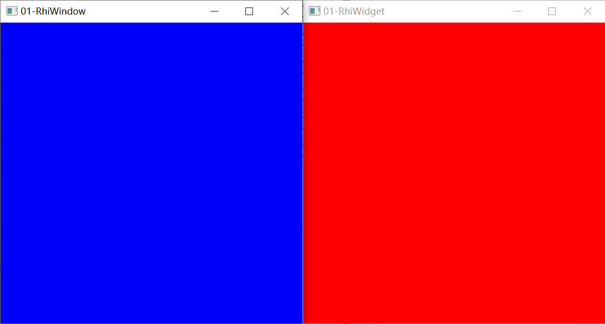

# 渲染窗口

在计算机上，窗口是图形的载体，在GUI章节中，我们简单了解了窗口的概念，下面将开始使用Qt封装好的窗口搭建基本的图形渲染结构：

新建一个`CMakeLists.txt`和`main.cpp`

在`CMakeLists.txt`中创建一个`Target`并链接Qt的模块：

``` cmake
cmake_minimum_required(VERSION 3.12)

project(FirstRhiWindowProj)

add_executable(FirstRhiWindow main.cpp)

find_package(Qt6 COMPONENTS Core Widgets Gui REQUIRED)     

target_link_libraries(FirstRhiWindow                        
    PRIVATE 
        Qt6::Core  
        Qt6::Widgets
        Qt6::WidgetsPrivate
        Qt6::Gui
        Qt6::GuiPrivate        	//qrhi是GUI的私有模块       
)
```

使用QRhi，需要包含：

``` c++
#include <private/qrhi_p.h>
```

下面的代码可以创建一个以DX11进行渲染的QRhi，可以用于测试环境是否正常：

```C++
#include <private/qrhi_p.h>
#include <private/qrhid3d11_p.h>

int main(int argc, char** argv) {
	QRhiD3D11InitParams params;
	QRhi::Flags flags;
	QSharedPointer<QRhi> rhi(QRhi::create(QRhi::D3D11, &params, flags));
	qDebug() << rhi->driverInfo();		//打印显卡设备信息
	return 0;
}
```

> 如果想让Vulkan能正常工作，需要下载 [Vulkan SDK](https://www.lunarg.com/vulkan-sdk/)

## QRhiWindow

操作系统提供的窗口有非常细粒度的控制，在开发者想要调整窗口的某个效果时，可能会需要改变窗口的多个属性和事件，当大量的效果堆叠设置的时候，就很比较容易出现冲突。打个比方：

> 假如 **A** 效果需要开启属性`a`和`b`， **B** 效果需要开启属性`b`和`c`，如果窗口一开始需要效果 **A** 和 **B** （即开启属性`a`、`b`、`c`），之后如果想要关闭效果 **B** ，如果不稍加验证，直接关闭了与之关联的属性`b`和`c`，那么开启的属性只剩下`a`，效果 **A** 的显示就会出现问题。

开发者往往只希望关注窗口的表现效果，而不是操作系统级别的窗口属性和事件，所以在窗口管理中，效果间的设置就存在了大量属性和事件的重叠

如果给每个属性的设置都加一遍关联验证，会使得代码变得很臃肿，且难以维护，也更容易出Bug

因此Qt采用了状态机的方式来跟管理原生窗口：

- 在Qt层面对Window的各种设置并没有立即生效，而是将这些设置存储起来，等到特定时机，比如说Show，Qt才会根据当前上下文的配置来创建实际的操作系统窗口

换而言之：

- 对于Qt的窗口，只有在调用了show函数之后，才实际创建了Window，才能拿到它的窗口句柄

而我们如果要创建窗口的图形渲染结构，由于需要实际的窗口句柄，也必须在show之后进行初始化，不过好在Qt提供了相关的事件 ：

- [void QWindow:: exposeEvent (QExposeEvent* ev )](https://doc.qt.io/qt-6/qwindow.html#exposeEvent)
  - 当窗口从 `un-exposed` 切换到 `exposed` 状态时，会执行此事件
  - 在第一次显示窗口时，会在此事件之前执行resizeEvent

> 需要注意的是，对于一个窗口而言，exposeEvent会多次执行，但初始化只需要进行一次，因此需要增加一些限制。

而图形渲染结构主要指的是：

- `QScopedPointer<QRhiEx> mRhi`
- `QScopedPointer<QRhiSwapChain> mSwapChain`：交换链
- `QScopedPointer<QRhiRenderBuffer> mDSBuffer`：深度模板缓冲区
- `QScopedPointer<QRhiRenderPassDescriptor> mSwapChainPassDesc`：交换链的RenderPass描述符

成功初始化之后，我们只需要在窗口上增加渲染和Resize的逻辑即可，这里有一个标准的Window实现示例：

- https://github.com/qt/qtbase/blob/dev/tests/manual/rhi/shared/examplefw.h

还需要注意的是，使用QRhi创建的资源，必须在QRhi销毁之间进行销毁，使用智能指针可以很好的管理这些资源的生命周期

## QRhiWidget

Widget与Window最大的不同是：

- Widget通过某些事件来触发界面的重绘，而Window则是每帧都在重绘

使用Widget能更好的节约性能，避免不必要的刷新，但在游戏和图形这种需要实时刷新的界面时，使用Window能更好的分摊性能。

这里有一个标准的Widget实现：

- https://github.com/qt/qtbase/tree/dev/tests/manual/rhi/rhiwidget

## 封装

为了能够简化上述结构的使用，笔者在[QEngineUtilities](https://github.com/Italink/QEngineUtilities/)中做了一些简单的封装，你可以把这个仓库Pull下来：

- 在CMakeLists.txt中使用[add_subdirectory ](https://cmake.org/cmake/help/latest/command/add_subdirectory.html)添加 **QEngineUtilities**
- 并且给 `Target` 链接 **QEngineUtilities**

如果成功，你可以使用如下代码来创建Widget和Window：

``` c++
#include <QApplication>
#include "Render/RHI/QRhiWidget.h"
#include "Render/RHI/QRhiWindow.h"

class ExampleRhiWidget : public QRhiWidget {
public:
	ExampleRhiWidget() {
		setDebugLayer(true);		//开启验证层
	}
	void render(QRhiCommandBuffer* inCmdBuffer) override {
		const QColor clearColor = QColor::fromRgbF(1.0f, 0.0f, 0.0f, 1.0f);
		const QRhiDepthStencilClearValue dsClearValue = { 1.0f,0 };
		inCmdBuffer->beginPass(mRenderTarget.data(), clearColor, dsClearValue);
		inCmdBuffer->endPass();
	}
};

class ExampleRhiWindow : public QRhiWindow {
public:
	ExampleRhiWindow(QRhiWindow::InitParams inInitParams) :QRhiWindow(inInitParams) {}
protected:
	virtual void onRenderTick() override {
		QRhiRenderTarget* renderTarget = mSwapChain->currentFrameRenderTarget();
		QRhiCommandBuffer* cmdBuffer = mSwapChain->currentFrameCommandBuffer();

		const QColor clearColor = QColor::fromRgbF(0.0f, 0.0f, 1.0f, 1.0f);
		const QRhiDepthStencilClearValue dsClearValue = { 1.0f,0 };

		cmdBuffer->beginPass(renderTarget, clearColor, dsClearValue);
		cmdBuffer->endPass();
	}
};

int main(int argc, char **argv){
    QApplication app(argc, argv);

    QRhiWindow::InitParams initParams;
    ExampleRhiWindow window(initParams);
	window.setTitle("01-RhiWindow");
	window.resize({ 400,400 });
	window.show();

	ExampleRhiWidget widget;
	widget.setWindowTitle("01-RhiWidget");
	widget.setApi(QRhiWidget::Vulkan);
	widget.resize({ 400,400 });
	widget.show();

    return app.exec();
}
```

运行它可以看到：



如果遇到困难，可以参考 [ModernGraphicsEngineGuide](https://github.com/Italink/ModernGraphicsEngineGuide/tree/main/Source/1-GraphicsAPI) 中的 **01-WindowAndWidget** 项目，也可以在[此处](https://github.com/Italink/ModernGraphicsEngineGuide/issues)提问

## 基础概念

上面的代码中出现了很多莫名其妙的结构，暂时不用去深入考虑它们的意义，这些名词只不过是给一些特定结构和流程一个能够称呼的简短昵称，当你了解它的应用场景和熟悉它的使用流程，自然会明白它们的意义。

这里会做一个简单的介绍，在后面的章节中会有更多细节。

### 交换链（[SwapChain](https://en.wikipedia.org/wiki/Swap_chain)）

在前两节中，我们通过控制台程序阐述了交换链的作用，它能有效的避免窗口绘制的闪烁和撕裂。


> https://mkblog.co.kr/vulkan-tutorial-10-create-swap-chain/

QWidget拥有一套自己的SwapChain机制，而在QRhiWindow中，需要我们通过 **QRhiSwapChain** 来获取当前的操作对象。

### 流水线（Pipeline）

也叫做管线，它们在GPU上运行，在计算机图形中，有两类管线：

- 图形渲染管线（[Graphics Pipeline](https://en.wikipedia.org/wiki/Graphics_pipeline)）：将一系列数据转换为图形的过程
- 计算管线（[Compute Pipeline](https://en.wikipedia.org/wiki/Pipeline_(computing))）：对一系列数据进行处理的过程

上一节中我们通过控制台程序以及简单的了解了一下图形渲染管线，而这里有一个更完整的流程图：


> https://graphicscompendium.com/intro/01-graphics-pipeline

### 着色器（[Shader](https://en.wikipedia.org/wiki/Shader)）

着色器是一种运行在GPU上的微小程序，它们主要用于扩展管线的功能，比如上面的图形渲染管线中：

- 输入的顶点数组被 **顶点着色器（Vertex Shader）** 进行处理
- 光栅化之后，每个像素又被 **片段着色器（Fragment Shader ）** 处理

一条图形渲染管线要求至少有一个顶点着色器和片段着色器，但实际上，现代图形API还支持额外的着色器扩展：

- **镶嵌控制着色器（Tessellation Control Shader）** 
- **镶嵌评估着色器（Tessellation Evaluation Shader）** 
- **几何着色器（Geometry Shader）**
- **计算着色器（Compute Shader）**

它们使用其API特有的 **Shader Language** 进行编写，比如：

- [GLSL](https://en.wikipedia.org/wiki/OpenGL_Shading_Language)：用于OpenGL、Vulkan
- [HLSL](https://en.wikipedia.org/wiki/High-Level_Shader_Language)：用于Direct3D
- [MSL](https://en.wikipedia.org/wiki/Metal_(API))：用于Metal

QRhi使用Vulkan风格的GLSL，因此这个文档是非常重要的：

- https://registry.khronos.org/OpenGL/specs/gl/GLSLangSpec.4.60.html

### 缓冲区（Buffer）

缓冲区可以

### 纹理（Texture）

### 采样器（Sampler）

### 渲染目标（[RenderTarget](https://en.wikipedia.org/wiki/Render_Target)）

它等价于OpenGL中的 [Frame Buffer Object](https://en.wikipedia.org/wiki/Framebuffer_object)，它由一个或多个颜色附件组成，可能包含深度附件和模板附件。

![Esquema representando a estrutura de um Frame Buffer Object [Green 2005]  ](Resources/Figura-5-Esquema-representando-a-estrutura-de-um-Frame-Buffer-Object-Green-2005.png)

通常，我们的绘制其实就是在RenderTarget上填充颜色数据，对于深度和模板的数据，GPU会自动进行处理，我们只需要去配置一些处理规则。

它对应Qt中的 **QRhiRenderTarget** ，在上面的ExampleRhiWindow示例中，对SwapChain中的当前RenderTarget使用蓝色进行清屏。

```c++
virtual void onRenderTick() override {
	QRhiRenderTarget* renderTarget = mSwapChain->currentFrameRenderTarget();
	QRhiCommandBuffer* cmdBuffer = mSwapChain->currentFrameCommandBuffer();

	const QColor clearColor = QColor::fromRgbF(0.0f, 0.0f, 1.0f, 1.0f);
	const QRhiDepthStencilClearValue dsClearValue = { 1.0f,0 };

	cmdBuffer->beginPass(renderTarget, clearColor, dsClearValue);
	cmdBuffer->endPass();
}
```

在QRhi中，创建一个RenderTarget是一件非常容易的事情：

``` c++
/*创建带有一个颜色附件的RT*/
QSharedPointer<QRhiTexture> colorAttachment;
colorAttachment.reset(rhi->newTexture(QRhiTexture::RGBA32F, QSize(800, 600), 1, QRhiTexture::RenderTarget | QRhiTexture::UsedAsTransferSource));
colorAttachment->create();
QSharedPointer<QRhiTextureRenderTarget> renderTarget;
QSharedPointer<QRhiRenderPassDescriptor> renderPassDesc;
renderTarget.reset(rhi->newTextureRenderTarget({ colorAttachment.get() }));
renderPassDesc.reset(renderTarget->newCompatibleRenderPassDescriptor());
renderTarget->setRenderPassDescriptor(renderPassDesc.get());
renderTarget->create();
```

### 命令缓冲区（CommandBuffer）

### 渲染通道（RenderPass）


