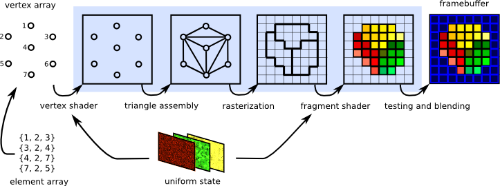

# 图形渲染管线

上一节中，我们简单了解了一下图形渲染管线的概念，它的基本流程如下：



眼过千遍，不如手过一遍，确保你已经克隆了 [QEngineUtilities](https://github.com/Italink/QEngineUtilities) ，并将其链接到了自己的工程里面，由于我们的学习目标是图形渲染，而不是 UI ，所以 QRhiWindow 是一个更好的起点，它的核心结构如下：

``` c++
class QRhiWindow :public QWindow {
protected:
	virtual void onInit(){}									//初式化渲染资源之后会调用
	virtual void onRenderTick() {}							//每帧都会调用
	virtual void onResize(const QSize& inSize) {}			//当窗口尺寸发生变化时会调用
	virtual void onExit() {}								//当关闭窗口时调用
protected:
	QSharedPointer<QRhiEx> mRhi;
	QScopedPointer<QRhiSwapChain> mSwapChain;
	QScopedPointer<QRhiRenderBuffer> mDSBuffer  ;
	QScopedPointer<QRhiRenderPassDescriptor> mSwapChainPassDesc;
};
```

我们可以新建一个继承自QRhiWindow的类，通过覆写上述的几个虚函数和使用几个保护性成员变量，来实现自己的渲染逻辑。

## 初始化渲染数据

我们在创建开始自己渲染逻辑的时候，往往也会创建一些渲染资源，通常情况下，我们并不会把自身渲染资源的初始化放在 `onInit` 函数里面，而是放在 `onRenderTick` 里面，通过一个逻辑开关去控制初始化，整个过程看起来就像是这样：

``` c++
class MyRhiWindow :public QRhiWindow {
private:
    bool bNeedInit;
public:
    MyRhiWindow()
        :bNeedInit(true)
    {}
protected:				
	virtual void onRenderTick() override {
        if(bNeedInit){
            /*
            * 执行初始化渲染资源的逻辑
            */
          
            bNeedInit = false;    // 清除需要初始化的开关
        }
    }								
};
```

由于 `onRenderTick`是每帧执行的，这样做的好处是：当我们需要重建某些资源的时候，只需要把开关重新打开就行，而不用统一的调用 `onInit`。

QEngineUtilities中对这个结构做了一些简单的封装，能够让使用方式看上去更 **人性化** 一些，上面的代码可以等价替换为：

``` c++
class MyRhiWindow :public QRhiWindow {
private:
    QRhiEx::Signal mSigInit;		//初式化信号
public:
    MyRhiWindow(){
        mSigInit.request();			//请求初始化
    }
protected:				
	virtual void onRenderTick() override {
        if(mSigInit.ensure()){		//确保初始化逻辑能执行
            /*
            * 执行初始化渲染资源的逻辑
            */
        }
    }								
};
```

### 顶点输入

想要绘制图形，首先我们需要一些顶点数据，就像这样：

``` c++
static float VertexData[] = {										//顶点数据
	//position(xy)		color(rgba)
	 0.0f,  -0.5f,		1.0f, 0.0f, 0.0f, 1.0f,
	-0.5f,   0.5f,		0.0f, 1.0f, 0.0f, 1.0f,
	 0.5f,   0.5f,		0.0f, 0.0f, 1.0f, 1.0f,
};
```

> 顶点数据 并不单指 顶点位置，它可以是任何能影响几何表现效果的数据，常见的有：位置，颜色，法向量，UV（纹理坐标）等。

为了让图形渲染管线能够访问这些顶点数据，我们需要创建一个用于存储顶点数据的缓冲区（VertexBuffer）：

``` c++
QScopedPointer<QRhiBuffer> mVertexBuffer;	
```

```c++
mVertexBuffer.reset(mRhi->newBuffer(QRhiBuffer::Immutable, QRhiBuffer::VertexBuffer, sizeof(VertexData)));
mVertexBuffer->create(); //在QRhi中，调用渲染资源对象的create函数才实际创建对应的GPU资源，在这之前，我们都是调整参数状态机而已
```

并且为了让流水线能够解析顶点数据的结构，我们还需要创建一个描述顶点输入布局的结构——**QRhiVertexInputLayout**：

```c++
QRhiVertexInputLayout inputLayout;
inputLayout.setBindings({
    QRhiVertexInputBinding(6 * sizeof(float))		
});

inputLayout.setAttributes({
    QRhiVertexInputAttribute(0, 0 , QRhiVertexInputAttribute::Float2, 0),
    QRhiVertexInputAttribute(0, 1 , QRhiVertexInputAttribute::Float4,  sizeof(float) * 2 ),
});
```

`setBindings` 用于描述每个 VertexBuffer 中，单个顶点数据的跨度。

- 由于我们只有一个VertexBuffer，所以只需要创建一个 **QRhiVertexInputBinding** ，并且由于我们在这个VertexBuffer中使用2个float表示位置，4个float表示颜色，所以单个顶点数据的跨度也就是 `6*sizeof(float)`

`setAttributes` 用于确定流水线顶点数据中，每个属性的布局。

**QRhiVertexInputAttribute** 构造的关键参数有：

- **binding（int）**：用于确定该顶点属性位于哪个QRhiVertexInputBinding（也就是从哪个VertexBuffer中去读取数据）
- **location（int）**：用于定义该顶点属性在着色器中的位置，它可以是乱序且任意的，但需要保证它的值在inputLayout中是唯一的，且没有超出硬件的限制
- **format（Format）**：用于说明该顶点属性的数据类型，常见的比如Float，Float2，Float3，Float4...
- **offset（quint32）**：用于描述该顶点属性在单个`顶点数据`中内存的偏移

综上，我们也就创建了顶点输入的布局描述，如果在顶点着色器中使用它，它的结构定义必须是：

```glsl
layout(location = 0) in vec2 position;		//这里需要与上面的inputLayout对应
layout(location = 1) in vec4 color;
```

### 创建流水线

在QRhi中，创建图形渲染管线非常简单，就像这样：

``` c++
QScopedPointer<QRhiGraphicsPipeline> mPipeline;		
```

``` c++
mPipeline.reset(mRhi->newGraphicsPipeline());
```

创建流水线需要我们至少配置：

- 顶点输入布局（Vertex Input Layout）
- 着色器资源绑定（Shader Resource Bindings），也就是上一节所提到的 描述符集布局绑定
- 顶点着色器（Vertex Shader）和片段着色器（Fragment Shader）
- 和 渲染目标（RenderTarget） 一致的 重采样数（SampleCount） 和 渲染通道描述（RenderPassDescriptor）

首先，我们先装配之前创建好的顶点输入布局：

``` 
mPipeline->setVertexInputLayout(inputLayout);
```

由于我们目前还没有Uniform输入，因此可以创建一个空的着色器资源绑定：

```
QScopedPointer<QRhiShaderResourceBindings> mShaderBindings;
```

```c++
mShaderBindings.reset(mRhi->newShaderResourceBindings());
mShaderBindings->create();
mPipeline->setShaderResourceBindings(mShaderBindings.get());	
```

由于图像是直接绘制在交换链的 当前渲染目标 上，所以 重采样数 和 渲染通道描述 可以直接从交换链中 获取：

``` c++
mPipeline->setSampleCount(mSwapChain->sampleCount());
mPipeline->setRenderPassDescriptor(mSwapChainPassDesc.get());
```

GLSL代码的语法跟C语言非常相似，比较明显的区别就是：

- 着色器代码中会定义各种 `in`，`out`，`uniform` 描述的变量
- 着色器代码中只有一些[基础类型](https://registry.khronos.org/OpenGL/specs/gl/GLSLangSpec.4.60.html#variables-and-types)，可以使用Block（类似struct），但需要注意内存布局和对齐。
- 着色器代码中拥有很多 **GPU版本** 的[内置数学函数](https://registry.khronos.org/OpenGL/specs/gl/GLSLangSpec.4.60.html#built-in-functions)
- 各个阶段的着色器有它固定的[代码结构](https://registry.khronos.org/OpenGL/specs/gl/GLSLangSpec.4.60.html#built-in-variables)和[内置变量](https://registry.khronos.org/OpenGL/specs/gl/GLSLangSpec.4.60.html#built-in-variables)

GLSL的基础结构并不复杂，就比如我们接下来要使用的代码，相信读懂它，对你来说很轻松：

```c++
QShader vs = mRhi->newShaderFromCode(QShader::VertexStage, R"(#version 440
    layout(location = 0) in vec2 position;		//这里需要与上面的inputLayout 对应
    layout(location = 1) in vec4 color;

    layout (location = 0) out vec4 vColor;		//输出变量，这里的location是out的，而不是in

    out gl_PerVertex { 							//Vulkan GLSL中固定的定义
        vec4 gl_Position;						
    };

    void main(){
        gl_Position = vec4(position,0.0f,1.0f);	//根据输入的position，设置实际的顶点输出
        vColor = color;							//将输入的color传递给fragment shader
    }
)");
Q_ASSERT(vs.isValid());

QShader fs = mRhi->newShaderFromCode(QShader::FragmentStage, R"(#version 440
    layout (location = 0) in vec4 vColor;		//上一阶段的out变成了这一阶段的in
    layout (location = 0) out vec4 fragColor;	//片段着色器输出，location 为 0 表示输出到 render target 的第一个颜色附件上
    void main(){
        fragColor = vColor;
    }
)");
Q_ASSERT(fs.isValid());

mPipeline->setShaderStages({					//将着色器安装到流水线上
    QRhiShaderStage(QRhiShaderStage::Vertex, vs),
    QRhiShaderStage(QRhiShaderStage::Fragment, fs)
});
```

最后，我们要做的就是：

``` c++
mPipeline->create();
```

## 上传数据

## 录制渲染指令


，这里有一个简短的视频能告诉你该怎么操作：

在main.cpp中y
