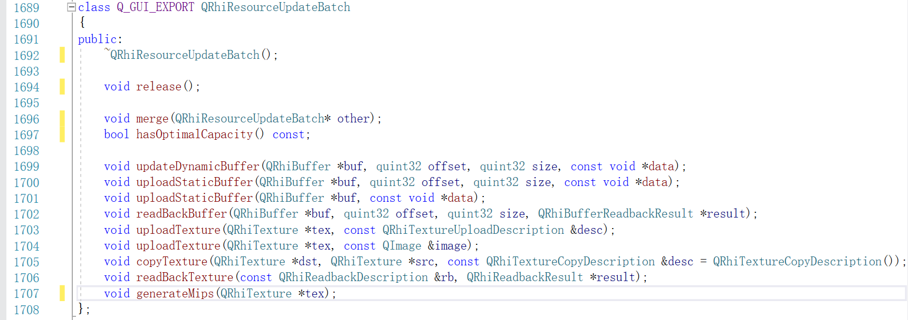

# 图形渲染管线

上一节中，我们简单了解了一下图形渲染管线的概念，它的基本流程如下：


眼过千遍，不如手过一遍，确保你已经克隆了 [QEngineUtilities](https://github.com/Italink/QEngineUtilities) ，并将其链接到了自己的工程里面，由于我们的学习目标是图形渲染，而不是 UI ，所以 QRhiWindow 是一个更好的起点，它的核心结构如下：

``` c++
class QRhiWindow :public QWindow {
protected:
	virtual void onInit(){}									//初式化渲染资源之后会调用
	virtual void onRenderTick() {}							//每帧都会调用
	virtual void onResize(const QSize& inSize) {}			//当窗口尺寸发生变化时会调用
	virtual void onExit() {}								//当关闭窗口时调用
protected:
	QSharedPointer<QRhiEx> mRhi;
	QScopedPointer<QRhiSwapChain> mSwapChain;
	QScopedPointer<QRhiRenderBuffer> mDSBuffer  ;
	QScopedPointer<QRhiRenderPassDescriptor> mSwapChainPassDesc;
};
```

我们可以新建一个继承自QRhiWindow的类，通过覆写上述的几个虚函数和使用几个保护性成员变量，来实现自己的渲染逻辑。

## 渲染结构初始化

在开始渲染之前，通常需要创建一些用于渲染的结构，但需要注意的是：我们并不会把渲染结构的初始化放在 `onInit` 函数里面，而是放在 `onRenderTick` 里面，通过一个逻辑开关去控制初始化。

整个过程看起来就像是这样：

``` c++
class MyRhiWindow :public QRhiWindow {
private:
    bool bNeedInit;
public:
    MyRhiWindow()
        :bNeedInit(true)
    {}
protected:				
	virtual void onRenderTick() override {
        if(bNeedInit){
            /*
            * 执行初始化渲染资源的逻辑
            */
          
            bNeedInit = false;    // 清除初始化的开关
        }
    }								
};
```

由于 `onRenderTick`是每帧执行的，这样做的好处是：当我们需要重建某些结构的时候，只需要把开关重新打开就行，而不用统一的调用 `onInit`。

QEngineUtilities中对这个结构做了一些简单的封装，能够让使用方式看上去更 **人性化** 一些，上面的代码可以等价替换为：

``` c++
class MyRhiWindow :public QRhiWindow {
private:
    QRhiEx::Signal mSigInit;		//初式化信号
public:
    MyRhiWindow(){
        mSigInit.request();			//请求初始化
    }
protected:				
	virtual void onRenderTick() override {
        if(mSigInit.ensure()){		//确保初始化逻辑能执行
            /*
            * 执行初始化渲染资源的逻辑
            */
        }
    }								
};
```

### 创建顶点缓冲区

假如我们使用这样的顶点数据：

``` c++
static float VertexData[] = {										//顶点数据
	//position(xy)		color(rgba)
	 0.0f,  -0.5f,		1.0f, 0.0f, 0.0f, 1.0f,
	-0.5f,   0.5f,		0.0f, 1.0f, 0.0f, 1.0f,
	 0.5f,   0.5f,		0.0f, 0.0f, 1.0f, 1.0f,
};
```

> 顶点数据 并不单指 顶点位置，它可以是任何能影响几何表现效果的数据，常见的有：位置，颜色，法向量，UV（纹理坐标）等。

为了让图形渲染管线能够访问这些顶点数据，我们需要创建一个在GPU侧用于存储顶点数据的缓冲区（VertexBuffer）：

``` c++
QScopedPointer<QRhiBuffer> mVertexBuffer;	
```

```c++
mVertexBuffer.reset(mRhi->newBuffer(QRhiBuffer::Immutable, QRhiBuffer::VertexBuffer, sizeof(VertexData)));
mVertexBuffer->create(); //在QRhi中，调用渲染资源对象的create函数才实际创建对应的GPU资源，在这之前，我们都是调整参数状态机而已
```

### 创建顶点输入布局

为了让流水线能够解析顶点数据的结构，我们还需要创建一个描述顶点输入布局的结构—— **QRhiVertexInputLayout** ：

```c++
QRhiVertexInputLayout inputLayout;
inputLayout.setBindings({
    QRhiVertexInputBinding(6 * sizeof(float))		
});

inputLayout.setAttributes({
    QRhiVertexInputAttribute(0, 0 , QRhiVertexInputAttribute::Float2, 0),
    QRhiVertexInputAttribute(0, 1 , QRhiVertexInputAttribute::Float4,  sizeof(float) * 2 ),
});
```

`setBindings` 用于描述每个 VertexBuffer 中，单个顶点数据的跨度。

- 由于我们只有一个VertexBuffer，所以只需要创建一个 **QRhiVertexInputBinding** ，并且由于我们在这个VertexBuffer中使用2个float表示位置，4个float表示颜色，所以单个顶点数据的跨度也就是 `6*sizeof(float)`

`setAttributes` 用于确定流水线顶点数据中，每个属性的布局。

**QRhiVertexInputAttribute** 构造的关键参数有：

- **binding（int）** ：用于确定该顶点属性位于哪个QRhiVertexInputBinding（也就是从哪个VertexBuffer中去读取数据）
- **location（int）** ：用于定义该顶点属性在着色器中的位置，它可以是乱序且任意的，但需要保证它的值在inputLayout中是唯一的，且没有超出硬件的限制
- **format（Format）** ：用于说明该顶点属性的数据类型，常见的比如Float，Float2，Float3，Float4...
- **offset（quint32）** ：用于描述该顶点属性在单个`顶点数据`中内存的偏移

综上，我们创建了这样的顶点输入的布局描述：


如果在顶点着色器中使用它，它的结构定义必须是：

```glsl
layout(location = 0) in vec2 position;		//这里需要与上面的inputLayout对应，变量名可以是任意的
layout(location = 1) in vec4 color;
```

### 创建流水线

在QRhi中，创建图形渲染管线非常简单，就像这样：

``` c++
QScopedPointer<QRhiGraphicsPipeline> mPipeline;		
```

``` c++
mPipeline.reset(mRhi->newGraphicsPipeline());
```

创建流水线需要我们至少配置：

- 顶点输入布局（Vertex Input Layout）
- 着色器资源绑定（Shader Resource Bindings），也就是上一节所提到的 描述符集布局绑定
- 顶点着色器（Vertex Shader）和片段着色器（Fragment Shader）
- 和 渲染目标（RenderTarget） 一致的 重采样数（SampleCount） 和 渲染通道描述（RenderPassDescriptor）

首先，我们先装配之前创建好的顶点输入布局：

``` 
mPipeline->setVertexInputLayout(inputLayout);
```

由于我们目前还没有Uniform输入，因此可以创建一个空的着色器资源绑定：

```
QScopedPointer<QRhiShaderResourceBindings> mShaderBindings;
```

```c++
mShaderBindings.reset(mRhi->newShaderResourceBindings());
mShaderBindings->create();
mPipeline->setShaderResourceBindings(mShaderBindings.get());	
```

由于图像是直接绘制在交换链的 当前渲染目标 上，所以 重采样数 和 渲染通道描述 可以直接从交换链中 获取：

``` c++
mPipeline->setSampleCount(mSwapChain->sampleCount());
mPipeline->setRenderPassDescriptor(mSwapChainPassDesc.get());
```

GLSL代码的语法跟C语言非常相似，比较明显的区别就是：

- 着色器代码中会定义各种 `in`，`out`，`uniform` 描述的变量
- 着色器代码中只有一些[基础类型](https://registry.khronos.org/OpenGL/specs/gl/GLSLangSpec.4.60.html#variables-and-types)，可以使用Block（类似struct），但需要注意内存布局和对齐。
- 着色器代码中拥有很多 **GPU版本** 的[内置数学函数](https://registry.khronos.org/OpenGL/specs/gl/GLSLangSpec.4.60.html#built-in-functions)
- 各个阶段的着色器有它固定的[代码结构](https://registry.khronos.org/OpenGL/specs/gl/GLSLangSpec.4.60.html#built-in-variables)和[内置变量](https://registry.khronos.org/OpenGL/specs/gl/GLSLangSpec.4.60.html#built-in-variables)

GLSL的基础结构并不复杂，就比如我们接下来要使用的代码，相信读懂它，对你来说很轻松：

```c++
QShader vs = mRhi->newShaderFromCode(QShader::VertexStage, R"(#version 440
    layout(location = 0) in vec2 position;		//这里需要与上面的inputLayout 对应
    layout(location = 1) in vec4 color;

    layout (location = 0) out vec4 vColor;		//输出变量，这里的location是out的，而不是in

    out gl_PerVertex { 							//Vulkan GLSL中固定的定义
        vec4 gl_Position;						
    };

    void main(){
        gl_Position = vec4(position,0.0f,1.0f);	//根据输入的position，设置实际的顶点输出
        vColor = color;							//将输入的color传递给fragment shader
    }
)");
Q_ASSERT(vs.isValid());

QShader fs = mRhi->newShaderFromCode(QShader::FragmentStage, R"(#version 440
    layout (location = 0) in vec4 vColor;		//上一阶段的out变成了这一阶段的in
    layout (location = 0) out vec4 fragColor;	//片段着色器输出，location 为 0 表示输出到 render target 的第一个颜色附件上
    void main(){
        fragColor = vColor;
    }
)");
Q_ASSERT(fs.isValid());

mPipeline->setShaderStages({					//将着色器安装到流水线上
    QRhiShaderStage(QRhiShaderStage::Vertex, vs),
    QRhiShaderStage(QRhiShaderStage::Fragment, fs)
});
```

最后，我们要做的就是，创建流水线：

``` c++
mPipeline->create();
```

## 上传渲染数据

上面创建好了流水线和顶点缓冲区（VertexBuffer），现在我们需要将顶点数据上传到顶点缓冲区中，这里我们使用另一个信号 ：

``` c++
QRhiEx::Signal mSigSubmit;		//用于提交资源的信号
```

在QRhi中， **QRhiResourceUpdateBatch** 可以用来合并 资源 的提交指令，我们可以通过下面的方式来创建它：

``` c++
QRhiResourceUpdateBatch* batch = mRhi->nextResourceUpdateBatch();
```

它提供了以下操作：



由于我们的 VertexBuffer 是 `QRhiBuffer::Immutable` 类型（即静态不可变）的，所以可以这样来上传：

```c++
batch->uploadStaticBuffer(mVertexBuffer.get(), VertexData);		//上传顶点数据
```

之后，我们再将这些资源提交指令录制在 指令缓冲（Command Buffer）中：

```C++
cmdBuffer->resourceUpdate(batch);
```

结合上面的 渲染结构初始化，现在`onRenderTick`的代码看上去应该是：

``` c++
virtual void onRenderTick() override {
    if(mSigInit.ensure()){		
        // doing somethin
    }
    QRhiRenderTarget* renderTarget = mSwapChain->currentFrameRenderTarget();	//交互链中的当前渲染目标
	QRhiCommandBuffer* cmdBuffer = mSwapChain->currentFrameCommandBuffer();		//交互链中的当前指令缓冲
    
    if (mSigSubmit.ensure()) {
		QRhiResourceUpdateBatch* batch = mRhi->nextResourceUpdateBatch();
		batch->uploadStaticBuffer(mVertexBuffer.get(), VertexData);				//上传顶点数据
		cmdBuffer->resourceUpdate(batch);
	}
}	
```

## 录制渲染指令

在QRhi中，想对一个渲染目标（Render Target）进行渲染，需要开启一个渲染通道（Render Pass），并在渲染结束时关闭，就像是这样：

```c++
const QColor clearColor = QColor::fromRgbF(0.0f, 0.0f, 0.0f, 1.0f);			//使用该值来清理 渲染目标 中的 颜色附件
const QRhiDepthStencilClearValue dsClearValue = { 1.0f,0 };					//使用该值来清理 渲染目标 中的 深度和模板附件
cmdBuffer->beginPass(renderTarget, clearColor, dsClearValue, nullptr);		//开启一个渲染通道

/*
* 渲染逻辑
*/

cmdBuffer->endPass();														//关闭渲染通道
```

`beginPass` 和 `endPass` 的定义如下：

``` c++
void beginPass(QRhiRenderTarget *rt,
               const QColor &colorClearValue,
               const QRhiDepthStencilClearValue &depthStencilClearValue,
               QRhiResourceUpdateBatch *resourceUpdates = nullptr,
               BeginPassFlags flags = {});

void endPass(QRhiResourceUpdateBatch *resourceUpdates = nullptr)
```

可以看到`beginPass` 和 `endPass` 中也能使用 **QRhiResourceUpdateBatch** ，它与 `cmdBuffer->resourceUpdate(batch)` 作用一致，这里我们需要注意的是：

- `nextResourceUpdateBatch()` 是从池中获取可操作的 **QRhiResourceUpdateBatch** 实例，而当前可操作实例仅有一个，这意味着：在调用`nextResourceUpdateBatch`之后，再调用一次`nextResourceUpdateBatch` 就会出错。除非我们使用 `QRhiCommandBuffer::resourceUpdate` ， `beginPass` 或者 `endPass`，这些函数会处理  **QRhiResourceUpdateBatch** 实例，并destory它，让池中的下一个 **QRhiResourceUpdateBatch** 实例可以被正常使用。

而执行渲染，主要是以下几个固定步骤：

- 设置渲染管线（QRhiGraphicsPipeline）
- 设置视口（QRhiViewport）
- 设置描述符集布局绑定（QRhiShaderResourceBindings）
- 设置顶点输入（QRhiCommandBuffer::VertexInput）
- 调用draw函数

也就对应这样的代码：

```C++
//设置图形渲染管线
cmdBuffer->setGraphicsPipeline(mPipeline.get());	

//设置图像的绘制区域
cmdBuffer->setViewport(QRhiViewport(0, 0, mSwapChain->currentPixelSize().width(), mSwapChain->currentPixelSize().height()));		
//设置描述符集布局绑定，如果不填参数（为nullptr），则会使用渲染管线创建时所使用的描述符集布局绑定
cmdBuffer->setShaderResources();	

//将 mVertexBuffer 绑定到 Binding 0
const QRhiCommandBuffer::VertexInput vertexInput(mVertexBuffer.get(), 0);	
//内存偏移值为0，只有一个VertexInput
cmdBuffer->setVertexInput(0, 1, &vertexInput);		

//执行绘制，其中 3 代表着有 3个顶点数据输入
cmdBuffer->draw(3);															
```

在创建图形渲染管线的时候，我们创建了顶点缓冲区和顶点输入布局，但并没有构建顶点缓冲区和图形渲染管线的连接，知道录制渲染指令的时候，才做了实际的绑定。

在绑定之后，流水线会从对应Binding Index 的Buffer中，按住之前定义好的布局去读取数据，就像是这样：


由于我们draw的参数为3，所以流水线只会读取三个顶点数据，交由 顶点着色器 进行处理：


在几何装配阶段，会按不同的策略来挑选顶点，组装成一个基础图元（Point，Line，Tirangle），流水线默认的策略是 `QRhiGraphicsPipeline::Topology::Triangles`，该策略会依次读取三个顶点数据组装成三角形：


在经由光栅化阶段后，几何图形上的每个片段（像素）都会被片段处理器进行处理：


### 图元拓扑（Primitive Topology）

在上面创建流水线的代码中，我们并没有设置流水线的图元拓扑，如果想要设置，可以调用：

``` c++
mPipeline->setTopology(QRhiGraphicsPipeline::Topology::Triangles);
```

图元拓扑就决定了在几何装配阶段，流水线如何挑选顶点来组装基础图元，在QRhi中，支持以下几种拓扑策略：

```c++
enum Topology {
    Triangles,
    TriangleStrip,
    TriangleFan,
    Lines,
    LineStrip,
    Points,
    Patches   //用于镶嵌控制和评估着色器
};
```

QRhi默认使用的是 `Triangles`，假设现在有六个顶点（下方使用索引描述），不同拓扑对应的组装策略是：

- **Triangles** ：组装得到2个三角形`{0,1,2},{3,4,5}`
- **TriangleStrip** ：组装得到4个三角形`{0,1,2},{2,1,3}{2,3,4},{4,3,5}`，顶点的异常索引顺序，是由于流水线会依据顶点的时钟顺序来判断三角形的正反面，所以在组装TriangleStrip的时候会确保时钟顺序不变。
- **TriangleFan** ：组装得到4个三角形`{0,1,2},{0,2,3},{0,3,4},{0,4,5}`
- **Lines** ：组装得到3条线`{0,1},{2,3},{4,5}`
- **LineStrip** ：组装得到5条线`{0,1},{1,2},{2,3},{3,4},{4,5}`
- **Points** ：组装得到6个点`{0},{1},{2},{3},{4},{5}`

这里有一个Vulkan中的图示：


## 大功告成

执行程序，如果可以看到下方图像，说明你已经成功了：


你能在此处找到完整的代码：

- https://github.com/Italink/ModernGraphicsEngineGuide/blob/main/Source/1-GraphicsAPI/02-GraphicRenderingPipeline/Source/main.cpp

这里有一个很好的视频讲解了图形渲染管线基础：

- [上帝视角看GPU（1）：图形流水线基础](https://www.bilibili.com/video/BV1P44y1V7bu)

此外，你还可以尝试一下：

- 修改 图元 拓扑，绘制点，线。
- 绘制矩形，圆形或者其他多边形图像。
- 增加一些其他的顶点属性

