# 着色器基础

上一节中，主要讲述了如何使用QRhi搭建基础的图形渲染管线，你或许没有发现，你其实已经能用GPU绘制任何图形了！要做的不过是填充顶点数据而已~

那按这样来说，后面的东西都不用学了

在现代图形API中，我们追求的不仅仅是把某些事情给做出来，还在于把能做的事情变得更多，把不可能的事情变得可能。

所以在图形API系列接下来的文章中，主要是围绕着如何使用符合硬件特性的操作来加速图形的绘制。

## 历史

GPU的出现是为了给当时的图形渲染体系提供一个可靠的硬件加速设备，所以在GPU发展的初期，图形API旨在提供一些简单通用的接口，将原先在CPU上的固定渲染流程转移到GPU上。

如果你接触过早期的OpenGL，对这样的代码应该并不陌生：

```c++
void init(void)
{
    glMatrixMode(GL_MODELVIEW);								//设置模型视图矩阵为单位矩阵
    glLoadIdentity();
}
void display(void)
{
    glClear(GL_COLOR_BUFFER_BIT);							//清屏
    glBegin(GL_TRIANGLES);									//开始写入 三角形图元
    glColor3f(1.0, 0.0, 0.0); glVertex3f(-1.0, -1.0, 0.0);	//写入顶点数据0
    glColor3f(0.0, 1.0, 0.0); glVertex3f( 0.0,  1.0, 0.0);	//写入顶点数据1
    glColor3f(0.0, 0.0, 1.0); glVertex3f( 1.0, -1.0, 0.0);  //写入顶点数据2
    glEnd();												//结束	
    glutSwapBuffers();										//刷新交换链
}
void reshape(int w, int h)
{
    glViewport(0, 0, (GLsizei) w, (GLsizei) h);				//调整视口大小
    glMatrixMode(GL_PROJECTION);							//设置裁剪矩阵为单位矩阵
    glLoadIdentity();
}
```

在这一阶段的图形API，渲染管线各个流程的处理逻辑都是固定的，开发者只需要向图形API提供顶点数据，纹理，矩阵，光源等信息，就能通过GPU加速完成一个3D场景的渲染。

虽然图形API允许通过少量参数和标识对进行图形渲染管线中的流程进行配置，但随着图形学的快速发展，各种渲染理论层出不穷，很显然，官方提供的接口已经跟不上学术界和工业界的发展，甚至还制约了开发者和研究人员的进一步探索，因此，**可编程的流水线 ([Programmable Pipeline](https://www.khronos.org/opengl/wiki/Rendering_Pipeline_Overview))** 应运而生。

而现在，我们称旧时代的使用方式为 **固定功能的流水线([Fixed Function Pipeline](https://www.khronos.org/opengl/wiki/Fixed_Function_Pipeline))**。

可编程管线允许开发者编写 **着色器 （Shader）**来定制流水线某一阶段的处理逻辑。

而各个图形API都有自己的 **着色器语言（Shader Language）**，比如：

- OpenGL、Vulkan 使用 [GLSL](https://link.zhihu.com/?target=https%3A//en.wikipedia.org/wiki/OpenGL_Shading_Language)
- Direct3D使用 [HLSL](https://learn.microsoft.com/en-us/windows/win32/direct3dhlsl/dx-graphics-hlsl)
- Metal使用 [MSL](https://link.zhihu.com/?target=https%3A//en.wikipedia.org/wiki/Metal_(API))

这些着色器语言的整体工作流程都差不多，比较大的区别就是符合自己API风格（标新立异）的语法。

这里有一个功能相同的片段着色器（Fragment Shader）在不同着色器语言下的实现：

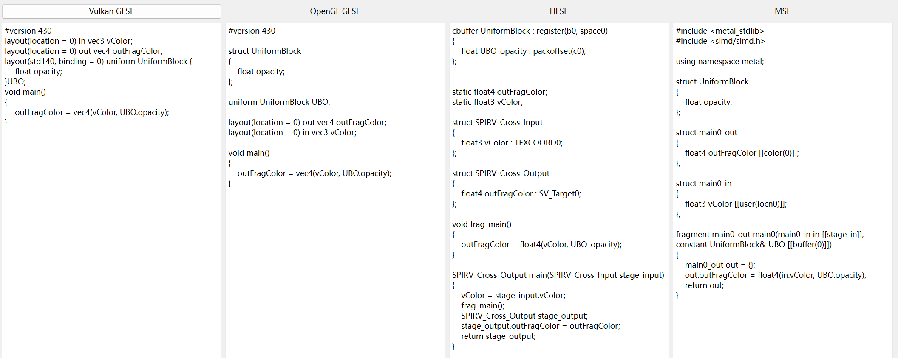

早期的游戏开发商，往往会使用一种图形API来作为自己游戏引擎的渲染后端，但随着各个操作平台的用户数量逐渐上升，跨平台也吸引了各大厂商的注意，毕竟多支持一个平台，也就意味着多一个市场。

因此，现今大多的游戏引擎都会将这些图形API封装成统一的接口，可以在不同的平台上切换，来追求更好的图形性能，我们一般称这套接口为 **RHI** （Rendering Hardware Interface）

而在封装过程中，除了要注意图形API的指令和资源，跨平台的着色器也是一个非常头疼的问题。

目前，大多数引擎都会在一种着色器语言下进行开发，再转译成其他图形API可用的着色器语言，比如：

- UE使用 HLSL 进行开发 ，借助开源库 [Glslang](https://github.com/KhronosGroup/glslang) 和 [Spirv-Cross](https://github.com/KhronosGroup/SPIRV-Cross) 来实现跨平台的着色器转译
- Unity，O3DE，Godot，Bgfx等引擎自定义了一种新的着色器语言来进行开发，通过内置编译器再搭配开源库来实现跨平台的着色器转译

这里有一些相关的阅读：

- [[知乎-unwind] 跨平台引擎Shader编译流程分析](https://zhuanlan.zhihu.com/p/56510874)

- [[知乎-网页游戏雷火事业群] 游戏着色器（Shader）基础介绍](https://zhuanlan.zhihu.com/p/599456569)

## 着色器转译

QRhi的跨平台着色器方案跟UE相似，只不过QRhi使用Vulkan风格的GLSL开发而非HLSL，它的转译流程如下：

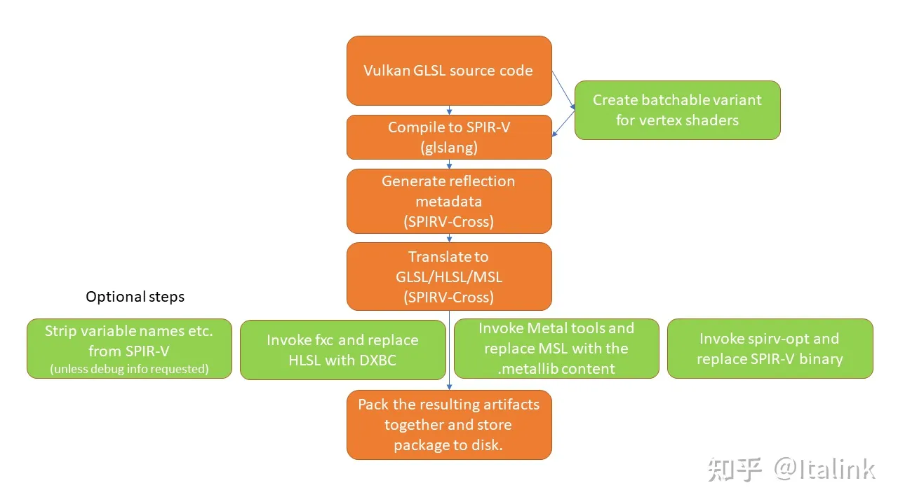

在上一节中，我们使用了这样的代码来创建着色器：

``` c++
QShader vs = mRhi->newShaderFromCode(QShader::VertexStage, R"(#version 440
    layout(location = 0) in vec2 position;		//这里需要与上面的inputLayout 对应
    layout(location = 1) in vec4 color;

    layout (location = 0) out vec4 vColor;		//输出变量，这里的location是out的，而不是in

    out gl_PerVertex { 							//Vulkan GLSL中固定的定义
        vec4 gl_Position;						
    };

    void main(){
        gl_Position = vec4(position,0.0f,1.0f);	//根据输入的position，设置实际的顶点输出
        vColor = color;							//将输入的color传递给fragment shader
    }
)");
Q_ASSERT(vs.isValid());

QShader fs = mRhi->newShaderFromCode(QShader::FragmentStage, R"(#version 440
    layout (location = 0) in vec4 vColor;		//上一阶段的out变成了这一阶段的in
    layout (location = 0) out vec4 fragColor;	//片段着色器输出，location 为 0 表示输出到 render target 的第一个颜色附件上
    void main(){
        fragColor = vColor;
    }
)");
Q_ASSERT(fs.isValid());
```

其中`newShaderFromCode()`并非是QRhi提供的原生函数，而是笔者调用**QtShaderTools**模块中接口进行了一些简单封装，它的真实逻辑如下：

``` c++
#include "private/qshaderbaker_p.h"

QShader newShaderFromCode(QShader::Stage stage, const char* code) {
	QShaderBaker baker;						//着色器烘培器
	baker.setGeneratedShaderVariants({ QShader::StandardShader });
	baker.setGeneratedShaders({
	    QShaderBaker::GeneratedShader{QShader::Source::SpirvShader,QShaderVersion(100)},
		QShaderBaker::GeneratedShader{QShader::Source::GlslShader,QShaderVersion(430)},
		QShaderBaker::GeneratedShader{QShader::Source::MslShader,QShaderVersion(12)},
		QShaderBaker::GeneratedShader{QShader::Source::HlslShader,QShaderVersion(60)},
	});
	baker.setSourceString(code, stage);		//装配GLSL源码
	QShader shader = baker.bake();			//执行烘培，将之转译成各个图形API的着色器代码

	if (!shader.isValid()) {				//打印编译报错
		QStringList codelist = QString(code).split('\n');
		for (int i = 0; i < codelist.size(); i++) {
			qWarning() << i + 1 << codelist[i].toLocal8Bit().data();
		}
		qWarning(baker.errorMessage().toLocal8Bit());
	}
	return shader;
}
```

QShaderBaker 来自于 **Qt Shader Tools** 的私有模块，在使用CMake构建的时候，需要为自己的构建目标链接`Qt::ShaderToolsPrivate`，使用它可以将Vulkan风格的GLSL编译成一个QShader对象（里面包含了各个版本图形API的着色器代码），这是一种在 **运行时转译** 着色器代码的方法。

此外，我们还可以利用Qt提供的 **qsb** 命令行工具 **离线转译** 着色器代码，该工具位于如下的目录中：


> 你可以给该目录添加到系统环境变量中，这样就能在全局访问qsb工具

在窗口地址栏中输入 `cmd`， 按下回车，可以打开命令行窗口，在其中输入 `qsb.exe -h` 可以看到该命令行工具的使用说明：

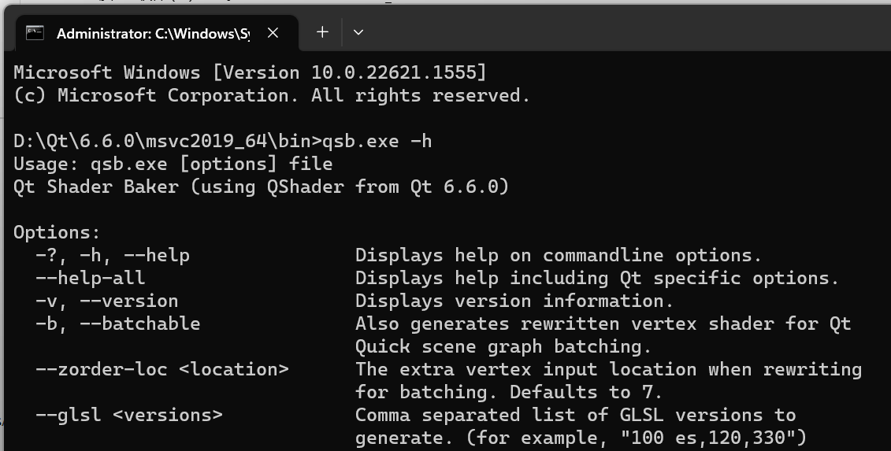

比如使用指令`qsb.exe -c color.frag -o color.frag.qsb --glsl 430 --msl 12 --hlsl 60 ` 可以将当前目录的`color.frag`文件转译生成一个 `color.frag.qsb`文件，该文件包含了 430版本的GLSL，12版本的MSL，60版本的HLSL。

在Qt中，可以通过如下方式来使用`*.qsb`文件：

```c++
QShader newShaderFromQSBFile(const char* filename) {
	QFile file(filename);
	if (file.open(QIODevice::ReadOnly))
		return QShader::fromSerialized(file.readAll());
	return QShader();
}
```

在CMake中，还提供了一个有用的功能：当某些文件发生变动时，执行一些操作。

通过这个功能，我们还可以实现 **编译时** 的着色器转译。

该功能通过CMake指令 [add_custom_command](https://cmake.org/cmake/help/latest/command/add_custom_command.html) 来实现，我们可以在CMake中增加以下函数来添加Shader

```cmake
function(add_shader TARGET_NAME SHADER_PATH)
    set(OUTPUT_SHADER_PATH ${SHADER_PATH}.qsb)  #输出文件路径
    add_custom_command(
        OUTPUT ${OUTPUT_SHADER_PATH}        #指定输出文件
        COMMAND qsb.exe -c ${SHADER_PATH} -o ${OUTPUT_SHADER_PATH} --glsl 430 --msl 12 --hlsl 60    #执行QSB工具
        MAIN_DEPENDENCY ${SHADER_PATH}      #指定依赖文件，即该文件变动时，触发上述命令
    )  
    set_property(TARGET ${TARGET_NAME} APPEND PROPERTY SOURCES ${OUTPUT_SHADER_PATH})               #需要把输出文件添加到一个构建目标中，才会触发CustomCommand
    source_group("Shader Files" FILES ${SHADER_PATH} ${OUTPUT_SHADER_PATH})                         #将着色器文件分类
endfunction()
```

这样的话，在构建每次`TARGET_NAME` 时，CMake都会检测`SHADER_PATH`有没有发生改变，如果发生改变，则会调用自定义指令，这里也就是调用`QSB`工具生成`*.qsb`文件，报错信息也会出现在IDE的错误面板上：

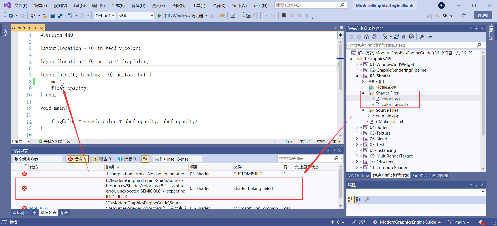

关于Qt的着色器工具，可以在这里发现一些测试示例：

- https://github.com/qt/qtshadertools/blob/dev/tests/auto/qshaderbaker/tst_qshaderbaker.cpp

在该教程仓库中有一个示例演示了QRhi中编译着色器的各种方式：

- https://github.com/Italink/ModernGraphicsEngineGuide/blob/main/Source/1-GraphicsAPI/03-Shader/Source/main.cpp

## 着色器编写

### 基本类型

GLSL中一些常见的基础类型如下：

| Type       | Meaning                                                  |
| :--------- | :------------------------------------------------------- |
| **void**   | for functions that do not return a value                 |
| **bool**   | a conditional type, taking on values of true or false    |
| **int**    | a signed integer                                         |
| **uint**   | an unsigned integer                                      |
| **float**  | a single-precision floating-point scalar                 |
| **double** | a double-precision floating-point scalar                 |
| **vec2**   | a two-component single-precision floating-point vector   |
| **vec3**   | a three-component single-precision floating-point vector |
| **vec4**   | a four-component single-precision floating-point vector  |
| **mat2** | a 2 × 2 single-precision floating-point matrix |
| **mat3** | a 3 × 3 single-precision floating-point matrix |
| **mat4** | a 4 × 4 single-precision floating-point matrix |
| **sampler1D** **texture1D** **image1D**                      | a handle for accessing a 1D texture             |
| **sampler1DArray** **texture1DArray** **image1DArray**       | a handle for accessing a 1D array texture       |
| **sampler2D** **texture2D** **image2D**                      | a handle for accessing a 2D texture             |
| **sampler2DArray** **texture2DArray** **image2DArray**       | a handle for accessing a 2D array texture       |
| **sampler2DRect** **texture2DRect** **image2DRect**          | a handle for accessing a rectangle texture      |
| **sampler3D** **texture3D** **image3D**                      | a handle for accessing a 3D texture             |
| **samplerCube** **textureCube** **imageCube**                | a handle for accessing a cube mapped texture    |
| **samplerCubeArray** **textureCubeArray** **imageCubeArray** | a handle for accessing a cube map array texture |
| **samplerBuffer** **textureBuffer** **imageBuffer**          | a handle for accessing a buffer texture         |

完整的类型名单可以参阅：

- https://www.khronos.org/registry/OpenGL/specs/gl/GLSLangSpec.4.60.html#basic-types

其中主要需要注意的是 **vec（向量**）和 **mat（矩阵）** ，这里我们并不讨论它们的几何意义，如果对这些不熟，笔者推荐可以看一下《3D数学基础：图形和游戏开发》

#### 向量

在数学中，向量（也称为欧几里得向量、几何向量、矢量），指具有大小（magnitude）和方向的量。而在计算机中，向量只是几个连续的数字。GLSL支持二维（vec2），三维（vec3），四维（vec4）向量。

关于向量的一些基础使用方式，以vec4为例：

``` c++
vec4 mVector = vec4(1,2,3,4);
float x   = mVector.x;		//1
vec2  xy  = mVector.xy;		//[1,2]
vec3  xzy = mVector.xzy;	//[1,3,2]
vec2  xxw = mVector.xxw;	//[1,1,4]
vec4  newVecotr = vec4(mVector.xx,-1,-2);	//[1,1,-1,-2]
```

这里我们使用`xyzw`访问向量的分量，GLSL还支持使用其他几组关键字`rgba`和`pqst`，使用哪组关键字取决于使用场景以及个人喜好。

GLSL当然也支持向量的加，减，乘，除，点乘等。

#### 矩阵

在数学中，矩阵（Matrix）是一个按照长方阵列排列的复数或实数集合。在计算机中，它同样只是一堆连续的数字。GLSL支持的最大矩阵尺寸为4x4，也就是mat4x4（这里用字母x代指乘号），因为是方阵所以可以简写为mat4

需要特别注意的是：GLSL使用的矩阵是按列存储的

``` c++
mat3 mMatrix = mat4(0,1,2,
             	    3,4,5,
             	    6,7,8);
```

如果换成按行存储，它的表示就变成了：

``` c++
{
  0,3,6,
  1,4,7,
  2,5,8
}
```

存储方式的不同不仅仅影响矩阵的访问方式，更为重要的是它将影响矩阵的运算顺序，下图描述了不同存储方式下，三维矩阵与三维向量相乘的结果是什么类型：

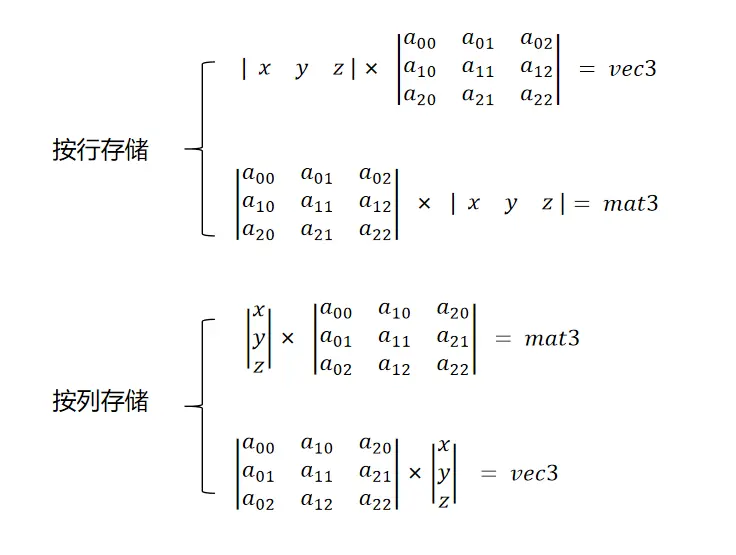

我们在GLSL中使用矩阵一般是对向量进行变换，因此我们运算是一般是从右往左进行计算。如下所示：

``` c++
vec3 pos    = vec3(0.5,1.0,0);
mat3 model  = mat3(...);
vec3 newPos = mat * pos; 
```

另外，我们还需要注意的是，除了矩阵和向量的运算要反过来，矩阵的一些内部运算也得反着来。比如我们在客户端中使用QMatrix4x4想对一个图形先进行旋转，再进行平移，应该这么来使用：

```c++
QMatrix4x4 mat4;
mat4.translate(0,1);					//先执行的操作后调用
mat4.rotate(60,QVector3D(0,0,1));		//所以这里是先旋转后平移
```

> 还需要注意的是 QMatrix4x4 的内存大小并不是 `16 * sizeof(float)`，它还带有一个四字节的标识位，当需要将QMatrix4x4上传到GPU时，请调用`mat.toGenericMatrix<4,4>()`转换为 **QGenericMatrix** 类型

### 限定符

GLSL中，我们会使用一些限定符来描述变量的一些相关信息，常见的限定符类型有：

- 存储限定符：描述变量的存储位置
- 布局限定符：描述变量的布局

常见的存储限定符有：

| Storage Qualifier | Meaning                                    |
| :---------------- | :----------------------------------------- |
| 无                | 可读写的本地变量                           |
| **const**         | 常量                                       |
| **in**            | 说明该变量为输入变量，来自于前一阶段的输出 |
| **out**           | 说明该变量为输出变量，将作为下一阶段的输入 |
| **uniform**       | 说明该变量为Uniform数据                    |

需要注意的就是`in`，`out`和`uniform`之间的区别：

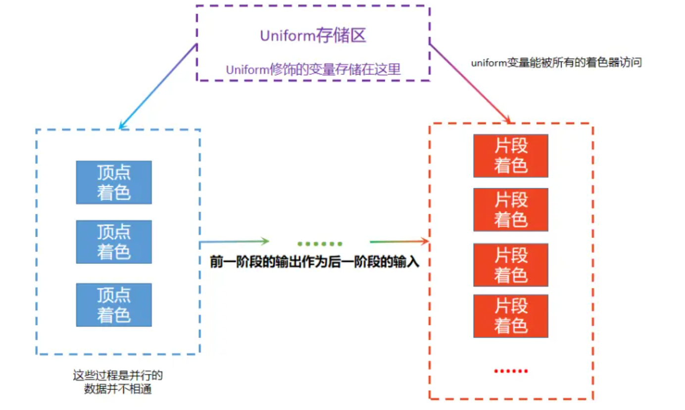

布局限定符的格式为：

- `layout( layout-qualifier-id-list )`

其中`layout-qualifier-id-list` 是一个特征数组，它的元素可以是一个标识，也可以是一个键值对（Key-Value），其他常见的布局限定符特征有：

| 布局限定符特征                                               | 描述                                                         |
| :----------------------------------------------------------- | :----------------------------------------------------------- |
| **binding** =                                                | 用于对应uniform数据在 描述符集绑定布局 中的index             |
| **location** =                                               | 用于确定 所有 输入 输出变量 的 位置，着色器前一阶段的输入变量和后一阶段的输出变量是通过location来确定连接的，而不是变量名 |
| **shared**, **packed**, **std140**, **std430**               | 用于声明 Block 所采用的结构体内存对齐方式                    |
| **local_size_x** = ,**local_size_y** = ,**local_size_z** =   | 在计算着色器中，说明计算单元的大小                           |
| **max_vertices** =                                           | 在几何着色器中，定义最大的顶点数量                           |
| **rgba32f** **rgba16f** **rg32f** **rg16f** **r11f_g11f_b10f** **r32f** **r16f** **rgba16** **rgb10_a2** **rgba8** **rg16** **rg8** **r16** **r8** **rgba16_snorm** **rgba8_snorm** **rg16_snorm** **rg8_snorm** **r16_snorm** **r8_snorm** **rgba32i** **rgba16i** **rgba8i** **rg32i** **rg16i** **rg8i** **r32i** **r16i** **r8i** **rgba32ui** **rgba16ui** **rgb10_a2ui** **rgba8ui** **rg32ui** **rg16ui** **rg8ui** **r32ui** **r16ui** **r8ui** | 在计算着色器中，说明Image变量的图像格式                      |

在Vulkan风格的GLSL中，我们需要注意的是：

- 任意的`in`或`out`变量都需要使用 `layout(location = ${index})`  去修饰，因为这一阶段的`in变量`会根据`Location Index` 去找上一阶段对应的`out变量`
  - 对于顶点着色器，它的in变量会根据`Location Index`是去从流水线的顶点输入布局去找
  - 对于片段着色器，它的out变量会`Location Index` 输出到渲染目标对应索引的颜色附件中
- 任意的 `uniform` 变量都需要使用 `layout(binding = ${index})`去修饰，`Binding Index`需要与流水线中所使用的描述符集布局（QRhiShaderResourceBindings）对应

限定符完整的文档，请查阅：

- https://registry.khronos.org/OpenGL/specs/gl/GLSLangSpec.4.60.html#storage-qualifiers

### 基础阶段

一个完整的图形渲染管线执行流程如下：

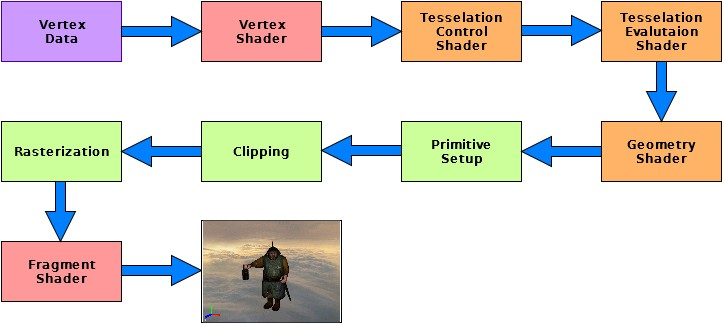

- 红色部分的 **Vertex Shader** 和 **Fragment Shader** 是图形渲染管线中的 **必填项**

- 黄色部分的 **Tesselation Control Shader** ， **Tesselation Evaluation Shader** 和 **Geometry Shader** 是图形渲染管线中的 **可填项**

- 绿色部分的  **Primitive Setup**，  **Clipping** 和 **Rasterization**  是 **不可编程阶段** ，但图形API提供了一些参数可以调整它们的行为

想要编写着色器，我们首先要了解图形渲染管线中各个阶段的工作职责，这里笔者主要对顶点着色器和片段着色器进行说明，图形API中还有其他的处理阶段和流水线，提前展开会给读者带来大量的认知负担，如果觉得感兴趣，可以先尝试了解，这些内容也会在后续的文章进一步深入。

#### 顶点着色器（Vertex Shader）

**顶点着色器 （Vertex Shader ）**的职责在于：根据 `输入的顶点数据`  和  `Uniform数据（如果有）` ，来填写当前顶点 **内置的输出变量**  ，并将一些有用数据传递给下一阶段。

一个核心的顶点着色器模板如下：

``` c++
layout(location = 0) in vec2 position;		

out gl_PerVertex { 							
    vec4 gl_Position;
};

void main(){
    gl_Position = vec4(position,0.0f,1.0f); 
}
```

解读：

- `layout(location = 0)` 代表了值对应流水线创建时顶点输入布局中 索引为0 的顶点属性
- `in` 代表是输入变量
- `vec2`表示该变量类型是二维向量，它需要与顶点输入布局中的格式（Float2）对应
- `position`是输入变量的名称，它可以是任意的
- `out gl_PerVertex { vec4 gl_Position; };` 是顶点着色器中固定输出定义
- `gl_Position = vec4(position,0.0f,1.0f);`就是根据输入的顶点位置，填充顶点着色器实际的顶点数据输出

需要注意的是：千万不用受定式思维的影响， 以为这里必须要输入一个position，实际上，我们可以输入任意的顶点数据，甚至不包括顶点位置，只需要在顶点着色器中，确定`gl_PerVertex`中`gl_Position`的值即可，比如可以是这样：

```c++
layout(location = 0) in vec2 anyVertexData;

out gl_PerVertex { 				
    vec4 gl_Position;
};

vec1 calcPosition(vec2 vertexData){
	// do something
	return position;
}

void main(){
    gl_Position = calcPosition(anyVertexData)
}
```

如果我们想要让该阶段的一些数据传递到下一阶段，那么只需要定义 `out` 修饰且带有`布局(layout)描述`的变量：

```c++
layout(location = 0) in vec2 position;		
layout(location = 0) out vec4 color;		//定义输出变量，in和out的location是分离的

out gl_PerVertex { 							
    vec4 gl_Position;
};

void main(){
    gl_Position = vec4(position,0.0f,1.0f);	
    color = vec4(position.xy,0.0f,1.0f);
}
```

如果流水线中有顶点着色器的 Uniform数据 ，只需要定义用`uniform`修饰且带有`绑定(binding)描述`的变量：

```c++
layout(location = 0) in vec2 position;		
layout(location = 0) out vec4 color;	

layout(binding = 0) uniform UniformBlock {	//这里的binding=0对应流水线创建时，描述符集布局绑定的设置
	vec4 color;								//UniformBlock是该数据结构块的名称，它可以是任意的
} ubo;


out gl_PerVertex { 							
    vec4 gl_Position;
};

void main(){
    gl_Position = vec4(position,0.0f,1.0f);	
    color = ubo.Color;						// 通过Uniform数据设置颜色
}
```

#### 片段着色器（Fragment Shader）

**顶点着色器 （Vertex Shader ）**的职责在于：根据 `前一阶段的输入数据` 和  `Uniform数据（如果有）` ，写入到渲染目标（Render Target）的`颜色附件`上。

一个核心的片段着色器模板如下：

``` c++
layout(location = 0) out vec4 fragColor;	
void main(){
    fragColor = vec4(1,1,1,1);
}
```

解读：

- `layout(location = 0) out`  表明该片段将输出到 渲染目标 `索引为0的颜色附件` 上，一个渲染目标往往至少包含一个颜色附件，交换链的渲染目标上就只有一个四通道的颜色附件 。
- `vec4`代表着颜色附件具有四个颜色通道，例如`RGBA8888`
- `fragColor` 是输出变量的名称，它可以是任意的

- `fragColor = vec4(1,1,1,1)`说明了最终的片段为不透明的白色（R=1，G=1，B=1，A=1）

片段着色器也能像顶点着色器那样增加一些Uniform输入。

在笔者学习的初期，因为顶点着色器和片段着色器中的输入输出变量是一一对应的关系，笔者就把顶点着色器和顶点着色器也是一一对应的，还记得上一节的程序吗？

我们通过 `3` 个顶点数据：

```c++
static float VertexData[] = {                                       //顶点数据
    //position(xy)      color(rgba)
     0.0f,  -0.5f,      1.0f, 0.0f, 0.0f, 1.0f,
    -0.5f,   0.5f,      0.0f, 1.0f, 0.0f, 1.0f,
     0.5f,   0.5f,      0.0f, 0.0f, 1.0f, 1.0f,
};
```

绘制出了这样的图像：


仔细查看，输入3个顶点颜色，最终的图像中有多少种颜色呢？

很显然，不是3种，那这是怎么做到呢？

通过下图，我们很容易发现，顶点着色器和片段着色器并不是一一对应的，顶点在被装配成几何图元之后，经由光栅化阶段，会生成很多片段：

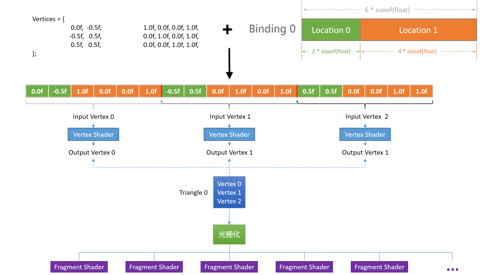

而这个过程在着色器层面可以看做是：顶点着色器的输出变量，在经过光栅化之后，变成了很多片段的输入变量。

而输出变量到输入变量之间多对多的转换，是通过 **光栅化插值** 完成的，关于它的细节，请查阅：

- [[知乎-木头骨头石头] 图形渲染基础：光栅化算法](https://zhuanlan.zhihu.com/p/370059588)

### 内置变量

在流水线中，往往还会提供一些内置变量，用于给着色器程序传递一些上下文信息。

比如在顶点着色器中：

``` c++
in int gl_VertexIndex;    	// 当前顶点的索引
in int gl_InstanceIndex;  	// 当前实例的索引
in int gl_DrawID; 			// Requires GLSL 4.60 or ARB_shader_draw_parameters
in int gl_BaseVertex; 		// Requires GLSL 4.60 or ARB_shader_draw_parameters
in int gl_BaseInstance; 	// Requires GLSL 4.60 or ARB_shader_draw_parameters

out gl_PerVertex {
    vec4 gl_Position;		// gl_Position是必要的，可以了解一下其他变量的作用	
    float gl_PointSize;		
    float gl_ClipDistance[];
    float gl_CullDistance[];
};

```

片段着色器中也有：

``` c++
in vec4 gl_FragCoord;		//当前片段的坐标
in bool gl_FrontFacing;		//当前片段是否是正面
in float gl_ClipDistance[];
in float gl_CullDistance[];
in vec2 gl_PointCoord;
in int gl_PrimitiveID;
in int gl_SampleID;
in vec2 gl_SamplePosition;
in int gl_SampleMaskIn[];
in int gl_Layer;
in int gl_ViewportIndex;
in bool gl_HelperInvocation;

out float gl_FragDepth;
out int gl_SampleMask[];
```

关于内置变量，详见：

- https://registry.khronos.org/OpenGL/specs/gl/GLSLangSpec.4.60.html#built-in-language-variables

### 内置函数

GLSL基本上内置了所有在图形开发中所使用的函数，比如：

数学函数，向量运算（点乘，叉乘），矩阵转置，求逆，混合函数，插值函数等等的，基本你能想到的，需要的，基本都会有。

关于这些函数使用细节，请查阅下面的官方文档：

- https://www.khronos.org/registry/OpenGL/specs/gl/GLSLangSpec.4.60.html#built-in-functions 

### 逻辑分支

着色器语言相对于开发者来说，不能将简单地将它看做是一个不同语法的编程语言，它最特殊点就在于它是在GPU上执行的，它的内置函数实现都是基于 GPU 硬件特性的。

由于GPU是通过大量计算单元堆叠而成，从而也造就了它对逻辑的执行并不友好的缺点。

在编写GLSL的时候，我们需要尽可能地避免在GLSL中出现 **分支指令** ，而是从另一种策略去思考问题：

- 首先可以明确：在着色器中调用`return`，并不会影响后续的阶段，如果必要的参数没有填写，则可能会使用默认值
- 我们想要实现逻辑分支的主要目标，一般是为了让一部分情况输出A，另一个部分情况输出B，其他情况输出...

GPU是对数学运算友好的，如果我们能确定 逻辑条件 到 输出结果 的函数式，通过数值计算的方式，就能避开逻辑分支，这里涉及到了一个关键函数：

- `step` （阶跃）函数

一般情况下，数学函数的图像都是连续平缓的，阶跃函数特殊的点就在于，它存在值的跳变，它的函数图像是这样的：

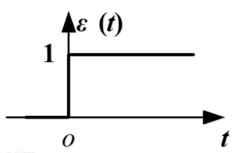


这个跳变的特征非常适用于数值上的逻辑分支，但它的使用却不太符合人的直觉，所以在GLSL中，允许我们使用条件运算符来完成相关的逻辑，就比如：`(a < b) ? a : b`

GLSL中的一些内置函数，比如min，max等，它是特定于GPU的实现，所以我们无需关心逻辑分支的问题。我们只需要注意`if`的使用，而`if` 并不等价于分支，真正重要的是编译器是否生成了 **分支指令**。

关于这些问题细节和注意事项，这里有一个非常好的说明：

- [[知乎-YAO] Shader中的 if 和分支](https://zhuanlan.zhihu.com/p/122467342)

## 流水线缓存（Pipeline Cache）

上文我们提到，游戏引擎中，通常会在一种着色器语言下开发，再转译成各个图形API的着色器代码，这种转译我们一般得到的是具体图形API的`源代码` 或者 `字节码（中间）文件`。

在GPU使用着色器的时候，其实还需要将`源代码` 或者 `字节码（中间）文件`编译成机器可执行的二进制码，而这个编译过程是依赖于图形驱动的，而由于每个用户的图形驱动版本可能是不同的，开发商很难覆盖所有的图形驱动，这也就意味着我们必须在用户的电脑上去编译着色器的二进制码。

为了避免在程序执行过程中，着色器编译导致出现卡顿，现代图形API都提供了流水线缓存（Pipeline Cache）的功能，这个功能可以让程序在首次启动时，编译完所有的流水线，并将它存储到磁盘上，这样程序在运行时或者下次启动时就不会因为编译着色器出现卡顿。

在Unreal Engine中，称这个技术为 [PSO缓存（Pipeline State Object Cache）](https://docs.unrealengine.com/5.1/zh-CN/optimizing-rendering-with-pso-caches-in-unreal-engine/)

这里有一个很好的文章说明了PSO缓存相关知识：

- [[知乎-mike] UE4 PSO缓存](https://zhuanlan.zhihu.com/p/572503905)

在QRhi中，我们可以在创建QRhi的时候，开启流水线缓存的功能：

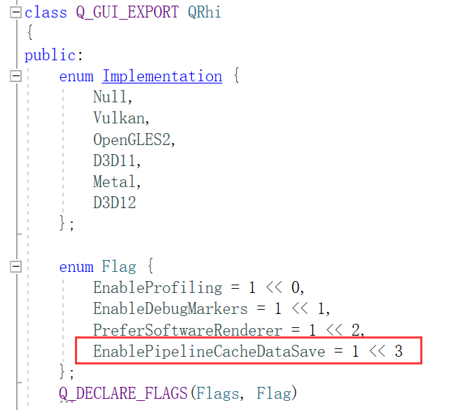

使用函数 `QByteArray QRhi::pipelineCacheData()`可以获取到当前程序已经编译好的流水线缓存数据

使用函数 `void QRhi::setPipelineCacheData(const QByteArray &data)`可以设置流水线缓存数据

在程序调用`QRhiGraphicsPipeline::create()`时，会根据当前的流水线参数状态，去查询是否存在流式线状态，如果有，则直接复用，而不会重新编译。

## 学习平台

外网有两个非常有意思的平台，它们通过固定流程的流水线，在仅提供一些外部输入变量和修改片段着色器代码的前提下，就能制作出很多非常炫酷的图形效果：

- Shadertoy：https://www.shadertoy.com/


- Glsl Sandbox：http://glslsandbox.com/ 

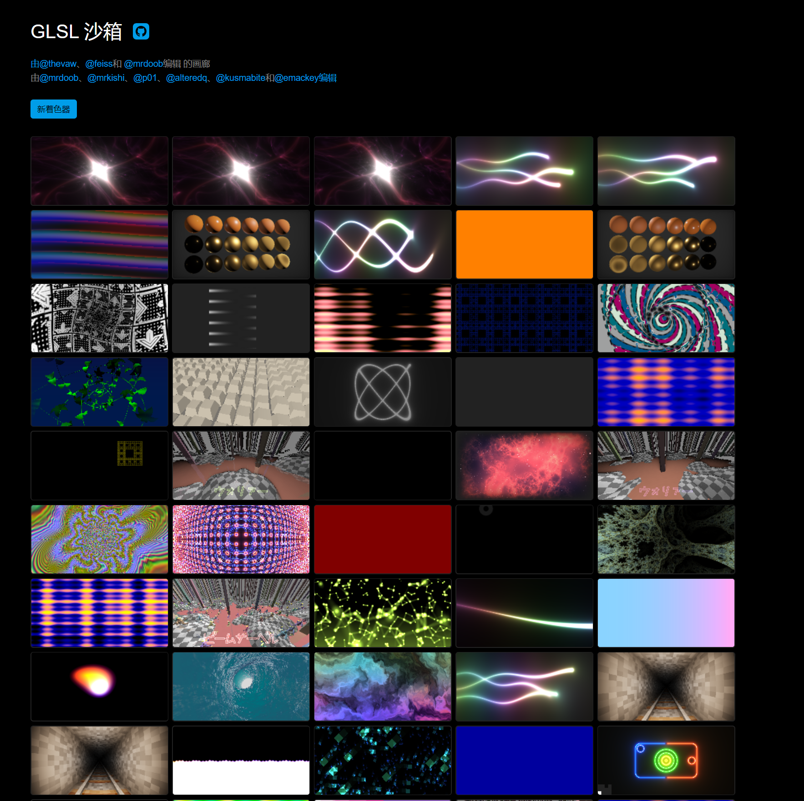

这两个平台都搭配了完善的在线Shader编辑器，你可以在上面尝试模仿一些简单的效果，并熟悉着色器的基本语法。

祝你好运！
