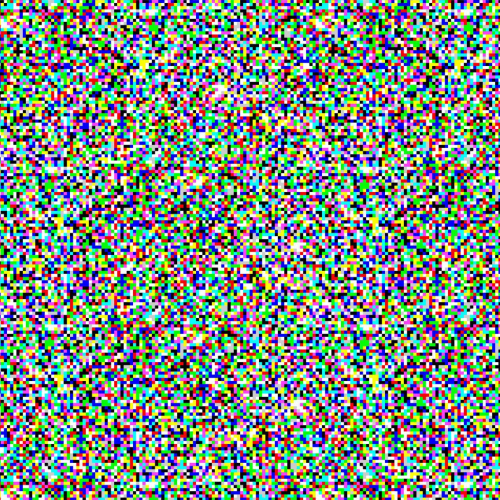
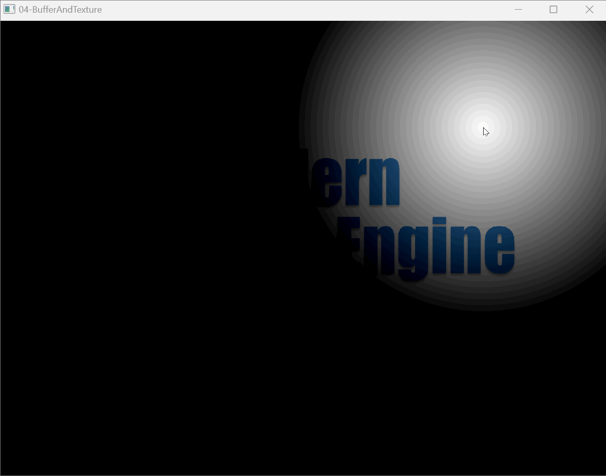

# 缓冲区与纹理

## 缓冲区

**缓冲区（Buffer）**持有一段GPU上的内存（Memory）以及一些相关特征——**类型（Type）** 和 **用途（Usage）**

**类型（Type）** 决定的Buffer的存储特性，图形API一般将其划分为：

- **Host Local Memory** ：只对Host可见的内存，通常称之为普通内存
- **Device Local Memory** ：只对Device可见的内存，通常称之为显存
- **Host Local Device Memory** ：由Host管理的，对Device看见的内存
- **Device Local Host Memory** ：由Device管理的，对Host可见的内存

> Host 往往是 CPU端， Device 指 GPU 端

关于细节，请查阅：

- [Vulkan 内存管理](https://zhuanlan.zhihu.com/p/166387973)

使用合适的内存类型能大幅提升内存的读写效率，在现代图形引擎中的流水线中，会尽可能地使用 **Device Memory** ，当我们要从CPU中提交数据给它时，由于Host无法访问，一般会将数据上传到一个 **Host可见的Memroy** 上，再通过指令拷贝到对应的 **Device Memory** 上，我们一般称这个持有主机可见内存的Buffer为 [Staging Buffer](https://link.zhihu.com/?target=https%3A//vulkan-tutorial.com/Vertex_buffers/Staging_buffer)

在 **用途（Usage）** 上，Buffer 通常可具备以下 **标识（Flag）** ：

- **VertexBuffer** ：用于存放顶点数据
- **IndexBuffer** ：用于存放索引数据
- **UniformBuffer** ：用于存储常量数据
- **StorageBuffer** ：用于Compute管线中的数据计算
- **IndirectDrawBuffer** ：用于间接渲染提供渲染参数

在图形渲染管线章节中，我们使用QRhi很轻松地创建了一个用于存储顶点数据的缓冲区（**VertexBuffer**）：

``` c++
QScopedPointer<QRhiBuffer> mVertexBuffer;   
mVertexBuffer.reset(mRhi->newBuffer(QRhiBuffer::Immutable, QRhiBuffer::VertexBuffer, sizeof(VertexData)));
mVertexBuffer->create(); //在QRhi中，调用渲染资源对象的create函数才实际创建对应的GPU资源，在这之前，我们都是调整参数状态机而已
```

使用函数`newBuffer`就能申请一个新的缓冲区：

```c++
QRhiBuffer* QRhi::newBuffer(QRhiBuffer::Type type,
                      		QRhiBuffer::UsageFlags usage,
                      		quint32 size);
```

函数参数所代表的意义如下：

- **Type**：Buffer的类型，决定了Buffer的存储特性。

  - **Immutable** ：用于存放希望永远不会发生改变的数据，具有非常高效的GPU读写性能，它通常放置在 **Devices Local** 的 GPU 内存上，无法被CPU直接读写，但QRhi却支持它的上传，其原理是：每次上传数据新建一个 **Host Local** 的 **Staging Buffer** 作为中转来上传新数据，这样操作的代价是非常高昂的。

  - **Static** ：同样存储在 **Devices Local** 的 GPU 内存上，与 Immutable 不同的是，首次上传数据创建的 **Staging Buffer** 会一直保留。

  - **Dynamic** ：用于存放频繁发生变化的数据，它放置 **Host Local** 的GPU内存中，为了不拖延图形渲染管线，它通常会使用双缓冲机制。

- **Usage**：Buffer的用途，`Flags`说明是可以使用运算符`|`让多个`Flag`共存

  - **VertexBuffer**：表明该Buffer可作为顶点缓冲区，存储顶点数据，作为图形渲染管线的输入
  - **IndexBuffer**：表明该Buffer可作为索引缓冲区，存储索引数据，用于挑选顶点数据
  - **UniformBuffer**：表明该Buffer可作为Uniform缓冲区，存储Uniform数据，作为着色器的公共输入
  - **StorageBuffer**：表明该Buffer可作为Storage缓冲区，该缓冲区可被计算着色器读写

- **Size**：Buffer的事情大小（单位为字节）

### 顶点缓冲区

**顶点缓冲区（VertexBuffer）** 用作流水线的输入

在QRhi中，体现在录制渲染指令时必须为图形渲染管线指定顶点输入：

```c++
cmdBuffer->setGraphicsPipeline(mPipeline.get());							
cmdBuffer->setViewport(QRhiViewport(0, 0, mSwapChain->currentPixelSize().width(), mSwapChain->currentPixelSize().height()));
cmdBuffer->setShaderResources();										
const QRhiCommandBuffer::VertexInput vertexInput(mVertexBuffer.get(), 0);	//将 mVertexBuffer 绑定到Buffer0，内存偏移值为0
cmdBuffer->setVertexInput(0, 1, &vertexInput);								
cmdBuffer->draw(3);															
```

而在创建流水线的时候，必须为流水线设置**顶点输入布局（VertexInputLayout）**，它用于制定缓冲区的解析规则，在之前的章节中，我们使用了这样的顶点数据：

``` c++
static float VertexData[] = {										//顶点数据
	//position(xy)		color(rgba)
	 0.0f,  -0.5f,		1.0f, 0.0f, 0.0f, 1.0f,
	-0.5f,   0.5f,		0.0f, 1.0f, 0.0f, 1.0f,
	 0.5f,   0.5f,		0.0f, 0.0f, 1.0f, 1.0f,
};
```

为了让顶点数据能够被下面的 顶点着色器输入 使用：

``` glsl
layout(location = 0) in vec2 position;	
layout(location = 1) in vec4 color;
```

我们可以定义这样的顶点输入布局：

``` c++
QRhiVertexInputLayout inputLayout;
inputLayout.setBindings({		 //定义每个VertexBuffer单组顶点数据的跨度，这里只使用了一个VertexBuffer
    //这里是6*sizeof(float)，可以当作是GPU会从索引为0的Buffer中读取24字节数据作为单组顶点数据传给VertexShader
    QRhiVertexInputBinding(6 * sizeof(float)) 
});

inputLayout.setAttributes({
    //在从Buffer 0得到的单组顶点数据中，以偏移值为0，读取Float2大小的数据作为 location 0 的输入
    QRhiVertexInputAttribute(0, 0 , QRhiVertexInputAttribute::Float2, 0),
   
    //在从Buffer 0得到的单组顶点数据中，以偏移值为sizeof(float)*2，读取Float4大小的数据作为 location 1 的输入
    QRhiVertexInputAttribute(0, 1 , QRhiVertexInputAttribute::Float4, sizeof(float) * 2),	
});
```

在图形渲染的处理过程中，计算机关注的只是内存上的数据，并不在意这些数据的象征意义，正因为顶点输入布局的存在，使得我们可以编程时自行组织顶点的存储结构。

上面我们将所有的数据都放在了一个`float数组`中，现在我们可以使用一个更直观的结构：

``` c++
struct Vertex{					//顶点的结构
	QVector2D position;
	QVector4D color;
};
QVector<Vertex> vertices = {	//顶点数据
    { { 0.0f,  -0.5f},	{1.0f, 0.0f, 0.0f, 1.0f	}},
    { {-0.5f,   0.5f},	{0.0f, 1.0f, 0.0f, 1.0f	}},
    { { 0.5f,   0.5f},	{0.0f, 0.0f, 1.0f, 1.0f	}},
};
```

我们只需填充顶点数据，使用`sizeof(Vertex) * vertices.size()`创建顶点缓冲区：

```c++
QScopedPointer<QRhiBuffer> mVertexBuffer;   

mVertexBuffer.reset(mRhi->newBuffer(QRhiBuffer::Immutable, QRhiBuffer::VertexBuffer, sizeof(Vertex) * vertices.size()));
mVertexBuffer->create(); 
```

并使用这样的顶点输入布局：

```c++
QRhiVertexInputLayout inputLayout;
inputLayout.setBindings({	
    QRhiVertexInputBinding(sizeof(Vertex)) 		//单个顶点数据的跨度也就是Vertex结构的大小
});

inputLayout.setAttributes({
    QRhiVertexInputAttribute(0, 0 , QRhiVertexInputAttribute::Float2, offsetof(Vertex,position)),
    QRhiVertexInputAttribute(0, 1 , QRhiVertexInputAttribute::Float4, offsetof(Vertex,color)),	
});
```

> **offsetof**运算符可用于获取成员变量在结构体或类中的内存偏移

上传时使用数组的裸数据即可：

```c++
batch->uploadStaticBuffer(mVertexBuffer.get(), mVertices.data());
```

### 索引缓冲区

**索引缓冲区（IndexBuffer）**用于挑选输入到流水线中的顶点数据

一个通用的应用场景是：

- 由于图形API支持的基础图元只有点，线和三角形，在绘制多边形的时候，会使用多个三角形进行拼接，以四边形为例，一个四边形可划分为两个三角形，而两个三角形有六个顶点，但实际上四边形只有四个顶点，如果使用三角形拼接，会需要浪费两个顶点数据的空间大小来存储重叠的顶点，所有我们需要一种策略，来复用顶点缓冲区中的顶点数据，以完成 使用四个顶点就能绘制出由两个三角形组成的四边形。

流水线处理顶点输入时，会根据顶点输入布局，将顶点缓冲区中的数据划分成一组组有序的顶点数据，在**默认情况**下，会将这些顶点数据都交给VertexShader进行处理。

而索引缓冲区的作用，就是在划分成一组组有序的顶点数据之后，通过一系列索引（Index），在原先的顶点数据上进行挑选，组装出新的顶点数据交给VertexShader处理。

假如我们使用这样的顶点数据：

``` c++
static float VertexData[] = {
	//position(xy)
	 1.0f,   1.0f,
	 1.0f,  -1.0f,
	-1.0f,  -1.0f,
	-1.0f,   1.0f,	
};
```

可以使用这样的索引数据，从上述顶点中，使用6个索引来组装新的顶点数据：

```c++
static uint32_t IndexData[] = {
	0,1,2,
	2,3,0
};
```

与VertexBuffer一样，我们只需创建一个IndexBuffer：

```c++
QScopedPointer<QRhiBuffer> mIndexBuffer;

mIndexBuffer.reset(mRhi->newBuffer(QRhiBuffer::Immutable, QRhiBuffer::IndexBuffer, sizeof(IndexData)));
mIndexBuffer->create();
```

并在首次录制渲染指令时提交索引数据：

```c++
batch->uploadStaticBuffer(mIndexBuffer.get(), IndexData);
```

渲染指令变成了：

```c++
cmdBuffer->setGraphicsPipeline(mPipeline.get());
cmdBuffer->setViewport(QRhiViewport(0, 0, mSwapChain->currentPixelSize().width(), mSwapChain->currentPixelSize().height()));
cmdBuffer->setShaderResources();
const QRhiCommandBuffer::VertexInput vertexBindings(mVertexBuffer.get(), 0);

//指定IndexBuffer，并明确IndexBuffer使用UInt32格式的索引数据
cmdBuffer->setVertexInput(0, 1, &vertexBindings, mIndexBuffer.get(), 0, QRhiCommandBuffer::IndexUInt32);  

//使用drawIndexed而不是draw，这样渲染会从IndexBuffer中，读取6个索引，利用顶点缓冲区中数据组装出6个顶点，来绘制三角形
cmdBuffer->drawIndexed(6);
```

### Uniform 缓冲区

**Uniform 缓冲区（Uniform Buffer）**用于给流水线提供一些着色器公共的只读数据。

在QRhi中，可以使用如下代码来创建一个UniformBuffer：

``` c++
QScopedPointer<QRhiBuffer> mUniformBuffer;   

mUniformBuffer.reset(mRhi->newBuffer(QRhiBuffer::Dynamic, QRhiBuffer::UniformBuffer, mUniformBuffer));
mUniformBuffer->create();
```

- UniformBuffer 的类型必须是  `QRhiBuffer::Dynamic`
- `UniformBufferSize` 表示所需缓冲区的字节大小

通常在创建UniformBuffer的时候，我们不会直接使用`UniformBufferSize` 来创建一块内存，而是通过一个辅助的结构体定义，比如：

```c++
struct UniformBlock{
	QVector2D mousePos;
	float time;
};

//...
mUniformBuffer.reset(mRhi->newBuffer(QRhiBuffer::Dynamic, QRhiBuffer::UniformBuffer, sizeof(UniformBlock)));
//...
```

这样做的好处是：可以通过结构体定义来给这段内存一些直观的结构

比如上述结构体中，一共申请了`12字节`的内存，其中`前8字节`存储了一个二维向量，`后4字节`存储了一个浮点。

Uniform Buffer 属于 **着色器资源（Shader Resource）**，要使用它，需要在流水线的 着色器资源绑定（即描述符集布局）中，添加一个绑定项：

```c++
mShaderBindings.reset(mRhi->newShaderResourceBindings());
mShaderBindings->setBindings({
	QRhiShaderResourceBinding::uniformBuffer(0, QRhiShaderResourceBinding::StageFlag::FragmentStage, mUniformBuffer.get())
});
mShaderBindings->create();
```

- QRhiShaderResourceBinding中提供了一些静态方法添加着色器资源绑定项，这里我们使用静态函数`QRhiShaderResourceBinding::uniformBuffer()`
- `0`代表绑定的索引
- `QRhiShaderResourceBinding::StageFlag::VertexStage`表示该UniformBlock可以在片段着色阶段使用，`Flag`表明这是一个可组合的标识。

在C++代码中有了上述结构的支撑，就可以这样在顶点着色器中使用UniformBuffer数据：

```c++
QShader vs = mRhi->newShaderFromCode(QShader::FragmentStage, R"(#version 440
    layout(binding = 0) uniform UniformBlock{	// 0 与 ShaderResourceBinding 的定义对应
        vec2 mousePos;
        float time;
    }UBO;
    //...
)");
Q_ASSERT(vs.isValid());
```

为了能够正确解析UniformBuffer中的内存结构，我们在Shader中定义了一个与C++结构体内存布局一样的 [接口块 （Interface Block）](https://www.khronos.org/opengl/wiki/Interface_Block_(GLSL))，上面的是一种简化的写法，下面的写法对大家来说可能会更亲切一些：

```c++
QShader vs = mRhi->newShaderFromCode(QShader::FragmentStage, R"(#version 440	
	struct UniformBlock{
        vec2 mousePos;
        float time;
	};
    layout(binding = 0) uniform UniformBlock UBO;
    //...
)");
Q_ASSERT(vs.isValid());
```

提交UniformBlock数据的方式跟其他Buffer大同小异：

``` c++
UniformBlock ubo;
ubo.mousePos = QVector2D(mapFromGlobal(QCursor::pos())) * qApp->devicePixelRatio();		//获取鼠标位置
ubo.time = QTime::currentTime().msecsSinceStartOfDay() / 1000.0f;						//获取当前时间
batch->updateDynamicBuffer(mUniformBuffer.get(), 0, sizeof(UniformBlock), &ubo);
```

在上述代码中，我们使用了这样的结构体定义：

```c++
struct UniformBlock{		//c++
	QVector2D mousePos;
	float time;
};

struct UniformBlock{		// shader
    vec2 mousePos;
    float time;
};
```

需要注意的是，在Shader中定义的块结构，图形API可能会在块成员之间做一些填充来保持硬件对齐，还可能优化掉未使用的成员。

在上述结构中，假如我们更换`vec2 mousePos;`和 `float time;`位置，

```c++
struct UniformBlock{		//c++
    float time;
	QVector2D mousePos;
};

struct UniformBlock{		// shader
    float time;
    vec2 mousePos;
};
```

虽然在结构定义上看上去他们是一样的，但在内存布局上，却有着严重的差异。

以OpneGL为例，OpenGL中要求`vec2`遵循`8字节`对齐，这就导致shader中UniformBlock的结构定义，`time`和`mousePos`之间会填充`4字节`以保证`mousePos`是`8字节`对齐，这也意味着shader端的结构体，实际大小并非`12字节`，而是`16字节`，如果此时C++还当成是`12字节`进行处理，就会导致C++端上传的Uniform数据，跟Shader这边收到的数据对不上。

要解决这个问题，比较粗暴的方式是在C++侧去手动填充数据来保证对齐：

```C++
struct UniformBlock{		//c++
    float time;
   	uint32_t __padding; 	//该变量用于填充对齐,保证跟Shader中内存结构的一致
	QVector2D mousePos;
};

struct UniformBlock{		// shader
    float time;
    vec2 mousePos;
};
```

在C++11中，提供了更优雅的方式—— [alignas](https://en.cppreference.com/w/cpp/language/alignas)

```c++
struct UniformBlock{		//c++
	float time;
	alignas(8) QVector2D mousePos;		//使用alignas指定该成员使用8字节对齐
};

struct UniformBlock{		// shader
    float time;
    vec2 mousePos;
};
```

关于缓冲区对齐，这里有一些更详细的资料：

- [Learn OpenGL Uniform Block Layout](https://learnopengl-cn.github.io/04%20Advanced%20OpenGL/08%20Advanced%20GLSL/#uniform_1)
- [OpenGL Wiki - Interface_Block ](https://www.khronos.org/opengl/wiki/Interface_Block_(GLSL)#Memory_layout)

### Storage 缓冲区

**Storage 缓冲区（Storage Buffer）**用于在计算管线（Compute Pipelines）中提供可读可写的数据。

它的用法与UniformBuffer几乎一模一样，它们之间的主要区别是：

- **Storage Buffer 可以申请非常大的显存**： OpenGL 规范保证 Uniform Buffer 的大小可以达到 **16KB**，而 Storage Buffer 可以达到  **128 MB**。
- **Storage Buffer 是可写的，甚至支持原子（Atomic）操作**：Storage Buffer 的读写可能是乱序的，因此它们往往需要增加一些内存屏障来保证同步。
- **Storage Buffer 支持可变存储**：这意味着在Storage Buffer中的块（Block），可以定义一个无界数组，就像是 `int arr[];`， 在着色器中可以使用`arr.length`得到数组长度，而在 Uniform Buffer 中的块，在定义数组时需要明确指定数组大小。
- **相同条件下，SSBO的访问会比Uniform Buffer要慢**：Storage Buffer 通常像缓冲区纹理一样访问，而 Uniform Buffer 数据是通过内部着色器可访问的内存进行读取。

在后面的计算着色器章节，会讲解它的使用，这里有一个完善的文档：

- https://www.khronos.org/opengl/wiki/Shader_Storage_Buffer_Object

## 纹理

在之前的章节中，我们通过三个顶点特征，借助光栅化插值，来生成了一个彩色的三角形图像：


而在计算机中，如果我们想绘制一张图片，由于图片中往往具有非常多的特征，而这些特征往往不是线性渐变的，如果继续采用顶点的方式来传递图片的颜色特征，一张图片可能会有上百上千万个三角形，虽然这点数据量对GPU来说不在话下，但这么多数量的三角形，无疑会给几何和光栅化阶段带来巨大的压力

例如这是一张大小仅`500*500`的噪声图：



它的每个颜色都不是线性渐变的，如果以顶点的方式来描述这些特征，那么将需要两百五十万的顶点，这也就意味着图形渲染管线如果想渲染这张图片，将需要处理近百万数量的三角形，很显然，这个操作的性能消耗是非常昂贵的。

为了解决图片渲染的难题，图形API提出了另一个概念 —— **纹理（Texture）**

它以 **着色器资源（Shader Resource）** 的形式存在于图形渲染管线中，与缓冲区相似，它也持有一段GPU上的内存，并且还包含一些特征—— **图像格式（Format），采样数（Sample Count），类型标识（Flags）**

在QRhi中，可以使用如下接口来创建纹理：

```c++
QRhiTexture* QRhi::newTexture(QRhiTexture::Format format,
                        const QSize &pixelSize,
                        int sampleCount = 1,
                        QRhiTexture::Flags flags = {});
```

- **format**：图像格式，常见的图像格式有：
  - `RGBA8`：拥有红`R`，绿`G`，蓝`B`和透明度`A`四个通道，`8`表示每个通道占`8 bit`，也就是一字节，它能表示256个特征值
  - `R8`：拥有红色（R）单通道，`8`表示每个通道占`8 bit`
  - `RGBA32F`：浮点格式的纹理，拥有红`R`，绿`G`，蓝`B`和透明度`A`四个通道，`32`表示每个通道占`32 bit`，也就是四字节，非浮点纹理只能存储[0,1]之间的值，超出部分会被丢弃，浮点纹理就允许图像上的数值可以越界。
  - `D24S8`：表示用`24 bit`作为深度通道，`8 bit` 作为模板通道
  - ...
- **pixelSize**：想要创建的图像的尺寸。
- **sampleCount**：采样数，默认为1，不进行多重采样（用于抗锯齿，反走样），一般情况下，电脑会支持设置采样数为{1，2，4，8}
- **flags**：纹理标识，默认情况下，QRhi创建的是一个2维纹理，可以通过这个标识来指定是其他类型，比如一维纹理，三维纹理，立方体纹理，纹理数组等，还能指定纹理的一些行为特征，比如是否生成Mipmap，是否可作为传输源，是否可用于计算着色器读写，是否可用做RenderTarget的附件等。

我们可以用这样的代码来创建一张纹理：

```c++
QImgae mImage;
QScopedPointer<QRhiTexture> mTexture;

mImage = QImage("{Your Image Path}").convertedTo(QImage::Format_RGBA8888);
mTexture.reset(mRhi->newTexture(QRhiTexture::RGBA8, mImage.size()));
mTexture->create();
```

为了将图像隐射到几何图形上面，我们会给几何图形的顶点增加一个属性——**纹理坐标(Texture Coordinate)**

> 纹理坐标在x和y轴上，范围为0到1之间。使用纹理坐标获取纹理颜色叫做采样(Sampling)。纹理坐标起始于(0, 0)，也就是纹理图片的左下角，终始于(1, 1)，即纹理图片的右上角。下面的图片展示了如何把纹理坐标映射到三角形上的。
>
> 

> 为了跟空间位置的坐标分量进行区分，纹理坐标一般不使用x，y，z，而是使用u，v，w，又因为二维纹理比较常用，所以也经常将 纹理坐标 称作 **UV**

另外，还有一些我们需要考虑的问题：

- 假如一张存储在磁盘上尺寸为`100*100`的图像，在我们预览的时候放大到了`1000*1000`，那么原本只有一万像素数据的图像，却要在屏幕上显示出一百万像素的效果，这你可能会想到之前的光栅化插值，可现在我们并不是以顶点的方式来绘制图像，而是以着色器纹理资源的方式，插值肯定是要做的，但以什么插值方式进行呢？
- 假如我们要对一个图像上的每个点都执行这样的操作：每个像素点都算一遍跟邻近8个像素的平均值。这看似简单的操作却有一个非常麻烦的问题，边界的一圈像素周边并没有8个像素点，所以就意味着要对他们做特殊处理，而特殊处理就意味着存在逻辑分支，还记得上一章节所说的吗？ GPU 对逻辑处理并不友好。那有没有其他办法呢，如果可以在采样边界部分空缺像素的时候，也能正常采样，返回一个值（比如说是0），那就可以不用对边界做特殊处理了。这个操作就意味着我们可能会超出纹理坐标的范围[0,1]去对图像进行采样，那这种情况的采样，该返回什么值合适呢？

这就是**采样器（Sampler）**的职责所在 —— 定义 **插值过滤行为** 和 **越界处理策略**

这里有一个非常好的文章介绍了这些行为，请读者务必查看：

- https://learnopengl-cn.github.io/01%20Getting%20started/06%20Textures/#_3

在QRhi中，可以使用下方函数来创建采样器：

```c++
enum Filter {
    None,
    Nearest,		//邻近过滤（Nearest Neighbor Filtering），取距离纹理坐标最近的像素值
    Linear			//线性过滤（Linear Filtering），根据纹理坐标周边的像素进行插值			
};
enum AddressMode {
    Repeat,			//重复，越界部分会使用重复的图像
    ClampToEdge,	//约束到边界：越界部分会使用图形边界的像素值
    Mirror,			//镜像：越界部分会使用图像的镜像
};
QRhiSampler*QRhi::newSampler(QRhiSampler::Filter magFilter,
                        QRhiSampler::Filter minFilter,
                        QRhiSampler::Filter mipmapMode,
                        QRhiSampler::AddressMode addressU,
                        QRhiSampler::AddressMode addressV,
                        QRhiSampler::AddressMode addressW = QRhiSampler::Repeat);
```

- **magFilter**：放大（Magnify）过滤，即图像放大时采样何种方式进行采样过滤
- **minFilter**：缩小（Minify）过滤，即图像缩小时采样何种方式进行采样过滤
- **mipmapMode**：多级渐远纹理的采样模式，下一篇文章会细说。
- **addressU**：在水平方向的越界处理策略
- **addressV**：在竖直方向的越界处理处理
- **addressW**：3D空间中，垂直于屏幕方向的越界处理策略，二维纹理可无视这个参数。

可以使用这样的方式来创建采样器：

```c++
QScopedPointer<QRhiSampler> mSapmler;

mSapmler.reset(mRhi->newSampler(
    QRhiSampler::Filter::Linear,
    QRhiSampler::Filter::Linear,
    QRhiSampler::Filter::Nearest,
    QRhiSampler::AddressMode::Repeat,
    QRhiSampler::AddressMode::Repeat,
    QRhiSampler::AddressMode::Repeat
));
mSapmler->create();
```

而纹理跟 UniformBuffer 一样，都属于 **着色器资源（Shader Resource）**，使用它也需要在 **着色器资源绑定（ShaderResourceBinding）** 中进行绑定：

```c++
mShaderBindings->setBindings({
    QRhiShaderResourceBinding::sampledTexture(1,													//流水线中绑定的索引
                                              QRhiShaderResourceBinding::StageFlag::FragmentStage, 	//可在片段着色器中使用
                                              mTexture.get(),										//纹理对象
                                              mSapmler.get())										//采样器对象
});
```

有了上述代码的支撑，我们可以在片段着色器中使用如下代码去采样纹理：

```glsl
layout(location = 0) in vec2 vUV;			//从顶点着色阶段经光栅化传递过来的纹理坐标
layout(location = 0) out vec4 outFragColor;	//片段颜色输出

layout(binding = 1) uniform sampler2D inTexture;	//着色器纹理资源

void main(){
    outFragColor = texture(inTexture,vUV);	//通过texture函数根据UV坐标对图像采样，得到值的类型是vec4
}
```

这里有几个有用小Tips：

- GLSL中可以使用函数`textureSize(inTexture, 0)`获取纹理的尺寸
- 在一些章节中测试一些Pass的效果可能会经常要到全屏纹理的绘制，有一个简单的方法，在不使用任何顶点输入的情况下，根据顶点着色器的内置变量`gl_VertexIndex`去生成一个矩形的顶点和纹理坐标，只需要用一个空的**InputVertexLayout**，并调用`cmdBuffer->draw(4)`就能绘制矩形纹理，其中顶点着色器的创建如下：

```c++
QShader vs = mRhi->newShaderFromCode(QShader::VertexStage, R"(#version 450
    layout (location = 0) out vec2 vUV;
    out gl_PerVertex{
        vec4 gl_Position;
    };
    void main() {
        vUV = vec2((gl_VertexIndex << 1) & 2, gl_VertexIndex & 2);		/
        gl_Position = vec4(vUV * 2.0f - 1.0f, 0.0f, 1.0f);
#if Y_UP_IN_NDC				 //因为DX和GL，VK的NDC坐标不一致，因此这里需要做一些兼容处理
        vUV.y = 1 - vUV.y;
#endif 
    })"
    , QShaderDefinitions()	 //该参数只是简单的在代码开头添加 #define Y_UP_IN_NDC 1		
    .addDefinition("Y_UP_IN_NDC", mRhi->isYUpInNDC())
);
```

> 详见：https://stackoverflow.com/questions/2588875/whats-the-best-way-to-draw-a-fullscreen-quad-in-opengl-3-2

## 示例

在该教程的[04-BufferAndTexture](https://github.com/Italink/ModernGraphicsEngineGuide/blob/main/Source/1-GraphicsAPI/04-BufferAndTexture/Source/main.cpp)示例中，演示了如何使用 **Uniform Buffer** 和 **Texture**，你可以以它为参考，去实现一些有意思的东西：



## 内存管理

在 [C++内存管理](https://zhuanlan.zhihu.com/p/603325037) 的章节中，我们介绍了一些C++中管理CPU内存的方法，而在GPU中，它的内存使用同样也有一些黑话，这里有一些详细的文档：

- **Vulkan中该做和不该做的事情**：https://developer.nvidia.com/blog/vulkan-dos-donts/
- **DX12中该做和不该做的事情**：https://developer.nvidia.com/dx12-dos-and-donts

- **Vulkan 内存管理** ：https://www.youtube.com/watch?v=rXSdDE7NWmA
  - B站转载：https://www.bilibili.com/video/BV17W411S7a1/?p=3
  - 演讲PPT：https://www.khronos.org/assets/uploads/developers/library/2018-vulkan-devday/03-Memory.pdf

同样也有一些我们可以依赖的三方库：

- **Vulkan 内存分配器**：https://github.com/GPUOpen-LibrariesAndSDKs/VulkanMemoryAllocator
- **D3D12 内存分配器**：https://github.com/GPUOpen-LibrariesAndSDKs/D3D12MemoryAllocator

> 幸运的是，QRhi已经在内部装载了这两个内存分配器：https://github.com/qt/qtbase/tree/dev/src/gui/rhi

