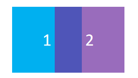

# 混合与测试

在之前的章节中，大家应该都已经熟悉了如何在C++中搭建现代图形API的基本渲染流程：

``` C++
void renderTick(){
    ensureResourcesInit();				//确保初始化渲染资源
 
    updateResources();					//更新渲染资源
    
    beginRenderPass(RenderTarget，ClearValues);	//开启渲染通道
   	for(auto item : RenderItems){						
        setupPipeline();						 //装载流水线
        setDrawState();							 //设置渲染状态
        drawCommand();							 //录制draw命令
    }
    endRenderPass();							 //结束渲染通道
}
```

通过使用 [QRhiGraphicsPipeline](https://alpqr.github.io/qtrhi/qrhigraphicspipeline.html) 和 [QRhiCommandBuffer](https://alpqr.github.io/qtrhi/qrhicommandbuffer.html) ，并编写 Vertex Shader 和 Fragment Shader，对图形渲染管线也有了一定认知：


图形渲染管线本质上只是进行数据的处理，它并没有图形和空间的概念，开发者只是利用这个高效的数据处理器，根据自己的思维去定制相应的流程，从而得到预期的产物。

假如我们画了两个矩形：


我们可能会有以下需求：

- 如果出现重叠，让后画的矩形将之前的矩形覆盖

  

- 如果出现重叠，让矩形的颜色按照一定策略混合

  

- 让矩形按照一定的空间遮挡关系进行显示

  

- 让前画的矩形作为蒙版，来确定后方矩形的绘制区域

  

这对大家来说应该是一些比较简单的数据处理逻辑，但图形渲染管线依附于GPU，它的执行过程非常高效，而通过图形API我们才能操作GPU，这也就是我们这一节的目标：认识图形渲染管线中的**测试与混合（Testing And Blending）**阶段，学会怎么配置 **重叠片段的处理机制** 和 **片段的筛选手段**。

在图形渲染管线中，光栅化产生的片段将经过一些[片段操作（Fragment Operations）](https://registry.khronos.org/vulkan/specs/1.3/html/chap26.html#fragops)，来确定是否或如何在帧缓冲上写入片段着色器产生的值，这些操作通常按如下顺序进行：

1. [裁剪测试（Scissor test）](https://registry.khronos.org/vulkan/specs/1.3/html/chap26.html#fragops-scissor)：通过一个矩形区域来裁剪图像。
2. [深度边界测试（Depth bounds test）](https://registry.khronos.org/vulkan/specs/1.3/html/chap26.html#fragops-dbt)：根据深度值范围来裁剪图像。
3. [模板测试（Stencil test）](https://registry.khronos.org/vulkan/specs/1.3/html/chap26.html#fragops-stencil)：可以通过模板（遮罩：Mask），实现异形区域的裁剪。
4. [深度测试（Depth test）](https://registry.khronos.org/vulkan/specs/1.3/html/chap26.html#fragops-depth)：通过比较深度值来筛选片段，从而让图像表现出前后遮挡的空间关系。
5. [混合（Blending）](https://registry.khronos.org/vulkan/specs/1.3/html/chap27.html#framebuffer-blending)：通过一些策略来混合重叠的片段。

> 需要注意的是：上面只是比较常见且对开发者作用较大的片段操作，这里有一个完整的描述文档：
>
> - (https://registry.khronos.org/vulkan/specs/1.3/html/chap26.html#fragops

## 裁剪测试（Scissor Test）

- 使用裁剪测试的目的很简单：就是希望通过一个矩形对图像进行裁剪，就像是这样：


在QRhi中，使用裁剪测试很容易，只需要在绘制时使用`QRhiCommandBuffer::setScissor(const QRhiScissor &scissor)`：

```C++
cmdBuffer->beginPass(renderTarget, clearColor, dsClearValue, batch);
cmdBuffer->setGraphicsPipeline(mPipeline.get());
cmdBuffer->setViewport(QRhiViewport(0, 0, width, height));
cmdBuffer->setScissor(QRhiScissor(0, 0, width/2, height/2));		//通过裁剪只保留左上角区域
cmdBuffer->setShaderResources(mCubeShaderBindings.get());
const QRhiCommandBuffer::VertexInput vertexInput(mCubeVertexBuffer.get(), 0);
cmdBuffer->setVertexInput(0, 1, &vertexInput);
cmdBuffer->draw(36);
cmdBuffer->endPass();
```

## 模板测试(Stencil Test)

通常情况下，我们使用模板测试是为了弥补裁剪测试只能使用矩形区域进行裁剪的缺陷，而模板测试允许我们使用模板（遮罩/Mask）来进行裁剪，而这个模板可以由我们自行制作，就像是这样：


[模板测试 - LearnOpenGL CN (learnopengl-cn.github.io)](https://learnopengl-cn.github.io/04 Advanced OpenGL/02 Stencil testing/)

## 深度测试(Depth Test)

开启深度测试，是为了让图像能够呈现出前后遮挡的关系，如果没有深度测试，就会出现错误的遮挡关系，就像是这样：


关于深度测试，这里有一篇非常好的文章：

- [深度测试 - LearnOpenGL CN (learnopengl-cn.github.io)](https://learnopengl-cn.github.io/04 Advanced OpenGL/01 Depth testing/)

此外，在使用深度测试时，一般需要注意几个问题：

- **是否需要开启深度写入和测试？**
  - 开启深度写入和测试是为了让图形在三维空间上具有一定的遮挡关系，但并非三维空间中的所有图形都需要开启深度写入和测试，这其中一个特例就是半透明物体的渲染，大部分引擎会在渲染场景元素的时候，将不透明物体和透明物体进行排序，先开启深度测试和写入，绘制完所有的不透明物体，之后再关闭深度写入，保留深度测试，完成透明物体的渲染，详见：[一篇文章能不能说清楚半透明渲染 - 知乎 (zhihu.com)](https://zhuanlan.zhihu.com/p/579419607)

- **不同图形API之前的深度值范围并不一致！**
  - OpenGL的深度值范围是`[-1,1]`，DX，Vulkan，Metal的深度值范围是`[0，1]`，在QRhi中，可以使用OpenGL的标准，只需要在上传MVP矩阵时，乘上`clipSpaceCorrMatrix`

- **明确RenderTarget是否具有深度附件以及它的精度是多少**
  - 具有深度附件的RenderTarget才能进行深度测试，通常情况下，窗口交换链中使用的深度模板附件是24位用于存储深度值，8位用于存储模板值，这也就代表了深度附件只能存储一定精度的深度值，假如两个平面的距离小于深度附件的最小精度，当进行深度测试的时候，两个平面得到的深度值是相同的，因此我们无法根据数据来明确 重叠像素之间的遮挡顺序 ，这个时候绘制顺序就决定了测试的结果， 又因为图形渲染管线是并行的，图形之间的执行顺序也无法保证，就会导致两个图形交替闪烁的现象，我们称之为 **深度冲突(Z-fighting)** 现象

- **如何避免深度冲突？**
  - 增加深度附件的精度，比如去除模板位，扩充深度到32位
  - 错开图形的位置，使用 [深度偏差（Depth Bias） ](https://learn.microsoft.com/zh-cn/windows/win32/direct3d11/d3d10-graphics-programming-guide-output-merger-stage-depth-bias?redirectedfrom=MSDN)

## 混合(Blending)

[混合 - LearnOpenGL CN (learnopengl-cn.github.io)](https://learnopengl-cn.github.io/04 Advanced OpenGL/03 Blending/)

## 面剔除

[面剔除 - LearnOpenGL CN (learnopengl-cn.github.io)](https://learnopengl-cn.github.io/04 Advanced OpenGL/04 Face culling/)


