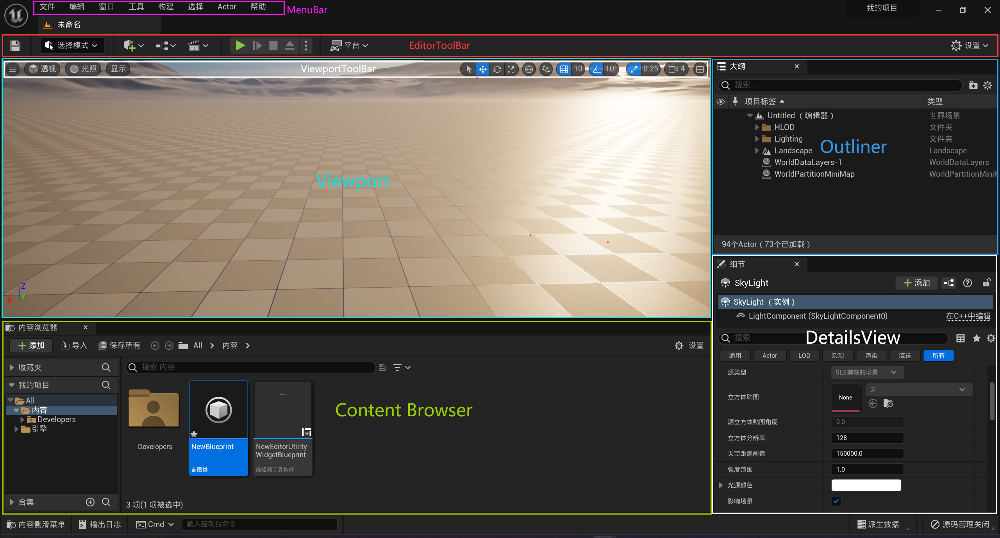
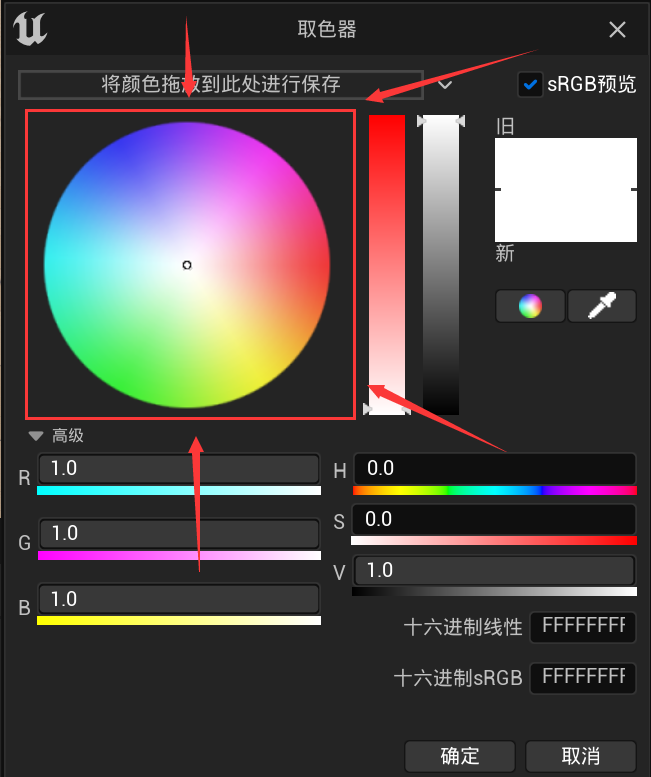

# 编辑器架构

笔者近几年开发中的绝大部分代码积累，大多花在了引擎编辑器上，在此处罗列一些心得，给大家一些参考，文章会从以下几个维度去分析怎么去做好编辑器的设计：

- 设计美感
- 用户体验
- 基于反射的编辑器架构
- 性能优化

## 设计美感

设计美感是大多数开发者所欠缺的东西，因为他们在代码上花费了非常多的心思，所以很少人会愿意绞尽脑汁去思考怎样去制作出精美的界面。

当然，虽然他们没有一个懂得设计的大脑，但却也长了一双欣赏美丽事物的眼睛，只要有合适的参考，开发者们能很快的复刻出相应的效果。

在大多数软件开发团队中，往往会有专业的UI设计师，他们主要关注UI的：

- 排版
- 色调
- 图标
- 布局

在笔者使用过的一些软件系统中，有一部分虽然确实考虑了以上几点，制作出了精美的界面效果，但往往忽略了UI的 **组件化设计** ，从而导致：

- 用户无法快速建立起软件的使用规律，产生了很大的认知负担。
- 破坏软件代码的组织架构，一个组件化设计优秀的UI，可以从界面上看出代码的层次结构，一个条例混乱的界面，它的代码往往也是乱作一团。

以UnrealEngine为例，它的组件化设计就很直观：



用户只需理解和掌握界面上各个组件元素的职责，很多时候都可以在不借助教程或文档的情况下，举一反三地进行操作。

UI设计师大多专注于于UI效果，因此让他们去制作一个适用于代码架构的组件化设计往往是比较困难的，所以关于这方面的内容，需要开发者去思考，讨论，引导，并学会说 "不"。

关于UI设计上的一些概念和风格，这里有更详细的参考：

- [All Time Design - UI  Style Guide](https://alltimedesign.com/ui-style-guide/)

## 用户体验

关于用户体验，主要围绕：

- 减少用户的认知负担：在界面布局，标签命名，操作上遵循一些常识和规范
- 支持撤销，重做：让一些误操作能够被快速修正
- 合理的操作反馈：当执行一些操作时，可以使用日志，对话框，进度条，通知气泡，状态栏...来告知用户 操作的执行状态
- 及时的状态备份或保存：避免意料之外的崩溃导致大量工作数据的丢失
- 可配置的操作方式：让用户可以自定义快捷键，布局方式，操作风格等

关于减少用户的认知负担，这里有一个非常完善的文档：

- [O3DE - Component Card UX Pattern](https://docs.o3de.org/docs/tools-ui/ux-patterns/component-card/)

- [O3DE - Component Card Error Handling](https://docs.o3de.org/docs/tools-ui/ux-patterns/error/)

关于撤销重做，它是一个代码设计的问题，通常情况下，我们会在设计模式层面使用备忘录模式和命令模式来实现撤销重做功能，这在Qt中对应的结构是 **QUndoCommand** 和 **QUndoStack** ，其中 **QUndoCommand** 的核心定义如下：

``` c++
class QUndoCommand
{
    virtual void undo();
    virtual void redo();
    virtual int id() const;
    virtual bool mergeWith(const QUndoCommand *other);
}；
```

在使用时，我们会派生QUndoCommand，覆写函数去实现undo和redo的操作行为，之后再将具体的Command推入到UndoStack中。

这里有一个简单的代码示例：

``` c++
#include <QUndoCommand>
#include <QUndoStack>
#include <QDebug>

class QAssignCommand : public QUndoCommand {
public:
	QAssignCommand(int* ptr, int dstValue)
		: mValuePtr(ptr)
		, mSrcValue(*ptr)
		, mDstValue(dstValue) {}
protected:
	virtual void undo() override {
		*mValuePtr = mSrcValue;
	}
	virtual void redo() override {
		*mValuePtr = mDstValue;
	}
private:
	int* mValuePtr = nullptr;
	int mSrcValue;
	int mDstValue;
};

int main(int argc, char** argv) {
	QUndoStack stack;
	int value = 0;
	stack.push(new QAssignCommand(&value, 1));
	qDebug() << value;		//1
	
	stack.undo();
	qDebug() << value;		//0
	
	stack.redo();
	qDebug() << value;		//1

	stack.beginMacro("Merge");	
	stack.push(new QAssignCommand(&value, 2));
	stack.push(new QAssignCommand(&value, 3));
	stack.endMacro();
	qDebug() << value;		//3

	stack.undo();
	qDebug() << value;		//1

	return 0;
}
```

它的实现思路比较简单，但也有一些比较难处理的点：

- Command中操作对象如果在其他地方被销毁了，但Command还存在于Stack中，如果此时执行撤销重做，可能会导致程序的崩溃

对于这种问题，我们主要可以通过以下几个方案去解决：

- 考虑是不是撤销重做操作的指令没有完全覆盖操作对象的生命周期

- 为Command增加有效性验证
- 使用序列化 对 对象 进行保存和重建

在Unreal Engine，提供了一种基于对象系统的撤销重做机制 —— **Transactional**

对于任意携有`RF_Transactional`标识的UObject实例，都可以使用如下代码来实现撤销重做

``` c++
GEditor->BeginTransaction(FText::FromString("Assign Value"));	//开始事务

MyObject->Modify();												//保存初始状态
MyObject->ValueProperty = 123;									//修改属性

GEditor->EndTransaction();										//结束事务
```

由于UObject的GC可以让对象延迟回收，这也使得我们无需考虑操作对象生命周期的问题，关于它的实现原理，详见：

- [CSDN - UE4 编辑器(UObject)的Undo撤回系统Transactional](https://blog.csdn.net/qq_29523119/article/details/96778797)

关于状态保存，相信大家都遇到过程序突然崩溃或者电脑突然关机的情况，这个时候如果没有及时的保存工作数据，几小时的工作成果就得打水漂了，而这个时候，如果程序提供保存或备份的辅助手段，在意外来临时，就能救自己一命~

而这种手段一般是指自动保存，除了让用户手动点击去保存工作数据，我们还可以在特定时机去自动保存或备份工作数据，就比如：

- 用户关闭某个界面时进行保存
- 定时自动保存
- 程序崩溃时保存（使用`SetUnhandledExceptionFilter`函数可设置程序崩溃时的系统回调）

上述手段可以尽可能的减少工作数据丢失的风险，当然，对于一些保存性能损耗不大的数据，比如小型配置文件，就可以直接在执行完操作后，立即保存。

## Meta思维

Meta思维在现代工业软件开发过程中可以提供极大的便捷度，它能提供一劳永逸的代码扩展方式。

> 关于 meta 思维的联想词有：`求导`，`高阶维度`，`上帝视角`，...
>
> 详见： [[ 知乎 ] bus waiter- 谈meta](https://zhuanlan.zhihu.com/p/406257437)

假如将写代码比作盖房子，我们考虑的是如何盖好房子，那在Meta层面，我们考虑的是如何构建一台自动盖房子的机器，Meta思维让我们从一个工程问题转换成了另一个，虽然难度有所上升，但只要方法得当，它能带来无可比拟的收益。

笔者接触过一些自研引擎和软件，只要涉及到 **自研引擎编辑器** 相关的话题，那下面基本就是骂声一片~~~

究其原因，无外乎：

- 界面简陋
- 用户体验差

而大部分开发者的想法是：

- “并不是不能做好，只是要做好得花很多时间，会很麻烦，没必要浪费时间，将就能用就行了。”

当然，这种想法对一些小工具来说无可厚非，但是对于一些高频使用的工具，如果依旧是这样的态度对待，那对使用人员来说，就是一场痛苦的折磨...

笔者在Qt上有数十万行代码的积累，但在Unreal Engine上只使用了数万行的代码，却出做出了更多更完备的功能，并且在Unreal Engine中，界面风格和用户体验的需求是非常容易满足的，这很大程度得益于 Unreal Engine 的 “**基础建设**” 。

在游戏引擎中，基于Meta理念的架构比比皆是，而在这其中最有用最强大的无疑是 —— **基于反射的编辑器架构**

相信大家都见过一些参数调节面板，比如：


在代码层面，这些可配置参数往往对应具体的数据结构，它可能是这样的：

``` c++
struct Options{
	bool 			Option0;
    int 			Option1;
    string 			Option2;
    vector<string> 	Option3;
};
```

大部分开发者为针对数据结构`Options`去手动编写代码去创建编辑面板，而在Meta层面，我们会对这类复杂结构进一步拆解，因为C++中的基本类型是有限的，开发者所创建的类型也只是通过那些基础类型按照一定层次组织起来的，我们完全可以根据成员变量的类型来创建控件，根据`Options`的结构来组织控件的布局，简而言之，也就是 **基于类型的控件，基于结构的面板** 。

由于我们需要在运行时获取到数据结构的相关信息，因此就必须依靠 **反射** ，此外，数据结构组织往往是树状的，因此我们会使用GUI框架中的`TreeView控件`来组织控件面板。

这里有一个简单的伪代码：

``` c++
class Options: public Object{		//数据结构，Object是对象系统的基类
    OBJECT_ENTRY()					//OBJECT_ENTRY是反射系统的入口宏
    
   	PROPERTY()	bool 			Option0;	//使用PROPERTY宏反射属性
    PROPERTY()  int 			Option1;
    PROPERTY()  string 			Option2;
    PROPERTY()  vector<string> 	Option3;
};

class DetailView: public TreeView{
public:
	void setObject(Object* object){											
        clearTreeView();
        for(auto metaProperty: object->metaObject()){						//根据MetaObject遍历对象所有的属性
            Widget* widget = generateWidgetForType(metaProperty.type());	//根据类型创建控件
            widget->bind(Object,metaProperty);								//将控件于反射的属性进行绑定
            this->addRow(widget);											//将控件添加到TreeView中
        }
    }
};
```

对于类型，我们主要根据以下分类去归纳：

- 基本类型：逻辑，数值，枚举，字符串
- 复合类型：类，结构体
- 容器类型：
    - 连续（sequential）容器：list，array，vector，set，queue...
    - 组合（associative）容器：map，hashmap...

通过这样的分类，开发者只需要为基本类型制作控件，为复合类型组织属性面板布局，而容器类型的编辑面板，往往是通过内部元素类型自动生成和组合的，此外，为了能够让开发者能够随心所欲的扩展基本属性和覆盖对象的面板和布局，一般会提供两个结构：

```C++
class IDetailCustomization{
public:
	virtual void CustomizeDetails(DetailsBuilder* builder) = 0;		//用于自定义对象的调节面板
};

class IPropertyTypeCustomization{
public:
	virtual void CustomizeHeader(RowBuilder* builder) = 0;		//用于自定义属性类型的 Header Row
	virtual void CustomizeChildren(DetailsBuilder* builder) {}	//用于附加该属性类型的 Child Row
};
```

为了能够管理属性，还会派生`IPropertyHandle`，它主要用作：

- 使用多态处理层次关系的组织。
- 作为属性设置和获取的唯一入口，加入撤销重做，变动通知，编辑器同步等相关功能。

``` c++
class IPropertyHandle{
    void SetValue(Variant var);
    Variant GetValue();
    virtual Widget* GenerateNameWidget();		//生成属性的名称控件
	virtual Widget* GenerateValueWidget();		//生成属性的值控件
	virtual void GenerateChildrenRow(DetailsBuilder* builder);	//生成属性的子行
};
```

有了如上结构的支撑，DetailsView的创建过程可以简单看作是：

``` C++
map<typeid,IDetailCustomization*> GloabalDetailCustomizationMap;
map<typeid,IPropertyTypeCustomization*> GloabalPropertyTypeCustomizationMap;

class DetailView: public TreeView{
public:
	void setObject(Object* object){											
        clearTreeView();
        
        auto DetailCustomization = GloabalDetailCustomizationMap[object->metaObject()->type()];	
        DetailsBuilder builder(this);
        DetailCustomization->CustomizeDetails(&builder);
        /* 获取到对象类型所对应的DetailCustomization，调用CustomizeDetails会遍历其所有的Property，
        并创建IPropertyHandle，而IPropertyHandle又会根据属性类型所对应的IPropertyTypeCustomization，
        创建具体的属性调节控件
        */
    }
};
```

实际的架构会让比上面的结构复杂一些，但只要掌握了核心思路，实现起来并不困难，此处有一个简单版本的Qt实现（参考了Unreal Engine 的 DetailsView）：

- 代码：https://github.com/Italink/QEngineUtilities/tree/main/Source/Editor/Source/Public/DetailView
- 示例工程：https://github.com/Italink/QEngineUtilities/tree/main/Samples/DetailViewExample


## 性能优化

计算机的计算资源始终是有限的，而在游戏引擎中，性能消耗的大头毫无疑问是Game，因此我们需要尽可能的降低编辑器的性能损耗以减少它对Game执行的影响。

一般情况下，我们可以通过以下手段来优化编辑器的性能（游戏内UI也适用）：

- **不要为了追求美观和使用高损耗的界面效果** ：

  - 尽可能不去使用界面动画和滤镜（模糊，阴影，拟态，毛玻璃，投影变换...）

  - 不要使用高分辨率的图像资源

  - 对于静态的UI，尽可能使用已制作好的图像，或者预先绘制RT（Bitmap），而不是使用GUI框架每帧实时绘制，如取色器的调色板：

    

- **管控界面重绘的时机** ：假如某个`操作A`会触发界面更新，但有时候我们往往在一帧执行多次`操作A`，很显然我们没必须要一帧重绘多次界面，所以我们往往不会在`操作A`中直接更新UI，而是设置标识，在UI的`Tick`事件中，根据标识去重绘UI，就像是这样(伪代码)：

  ``` c++
  class MyWidget : public Widget{
  private:
      bool bNeedRepaint = false;
  public:
      void setFont(...){				//设置字体，触发界面重绘
       	bNeedRepaint = true;
      }
      
      void tick() override{			//覆写UI的Tick事件，在Tick时检查是否需要重绘UI
          if(bNeedRepaint){
              repaintUI();			//UI的重绘接口
              bNeedRepaint = false;
          }
      }  
  };
  ```

- **使用离屏绘制缓存和局部刷新** ：对于一些上帧图像复用性很高的UI，可以将UI先绘制到一张RT（Bitmap）上，每帧只要按需更新部分区域的UI即可，这种做法在图表，画布相关的UI上较为常见。

- **避免主线程中执行高消耗的逻辑操作阻塞UI** ：UI的处理往往是位于主线程，如果一些在主线程逻辑操作的执行耗时比较高，就会导致UI的阻塞，解决这个问题主要有两个方法：

  - 在逻辑操作中插入UI系统的更新操作强制UI刷新。
  - 将逻辑操作放到异步线程去执行，逻辑执行完毕，再在主线程中执行UI相关的更新。

