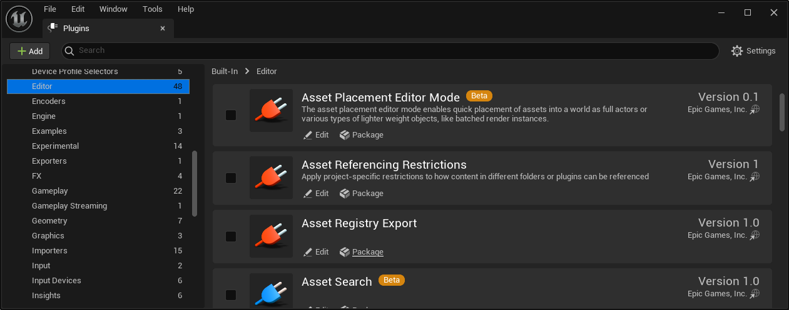
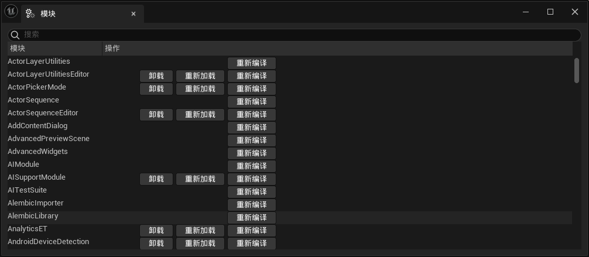

一个标准的UE工程的文件结构如下：


-   `Config`：存放项目中的各类配置文件（Runtime，Engine，Editor，Plugins...）
-   `Content`：存放项目的资源文件
-   `Saved`：暂存目录，项目开发过程中生成的文件一般都位于此，包括日志，崩溃记录，烘焙，本地编辑器配置等
-   `Source`：存放项目的源码文件
-   `MyProj.uproject`：项目工程文件

## uproject

`*.uproject` 存储了工程的一些基本信息，它的初始结构如下：

```json
{
	"FileVersion": 3,
	"EngineAssociation": "5.2",		
	"Category": "",
	"Description": "",
	"Modules": [					
		{
			"Name": "MyProj",
			"Type": "Runtime",
			"LoadingPhase": "Default"
		}
	],
	"Plugins": [
		{
			"Name": "ModelingToolsEditorMode",
			"Enabled": true,
			"TargetAllowList": [
				"Editor"
			]
		}
	]
}
```

该文件的关键参数有：

-   `EngineAssociation`：引擎的版本
-   `Modules`：该工程拥有的代码模块
-   `Plugins`：该工程开启的 **内置** 插件

这些参数虽然可以手动修改，但大多时候，在UE的编辑器上进行变更会更加安全和任意。

### 切换引擎版本

在`*.uproject` 的右键菜单下，可以切换当前工程的引擎版本：


如果引擎没有出现在选择框的下拉列表中，则需要到下方目录使用 **UnrealVersionSelector-Win64-Shipping.exe** 进行注册：


### 开启内置插件

在引擎中，开启内置插件后，编辑器会自动在`*.uproject` 文件的`Plugins`下追加新的插件条目：



### 添加工程模块

**模块（Modules）** 是 **虚拟引擎（UE）** 的软件架构的基础构建块。它们在独立的代码单元中封装了一体的编程工具、运行时功能、库或其他功能。

使用模块化编程可以带来以下好处：

-   模块会强制实施良好的代号分离，可用于封装功能和隐藏代号的内部成分。
-   模块编译为单独的编译元。这意味着，只有已经更改的模块才需要编译，更大项目的编译时间会显着缩短。
-   模块在依赖性图表中链接在一起，并且只允许允许实际使用的代码包包含头文件，以符合[Include What You Use (IWYU)](https://docs.unrealengine.com/5.2/zh-CN/include-what-you-use-iwyu-for-unreal-engine-programming)标准。这意味着，你的项目中未使用的模块将安全地排除在编辑中之外。
-   你可以控制在运行时任何时候加载和加载实体的模块。 这样一来，可以管理哪些系统可用并活跃，从而优化项目的性能。
-   你可以基于特定条件（例如，项目是为哪个平台编写的），在你的项目中纳入或排除模块。

所有项目和插件在默认情况下都有自己的 **主模块**

在UE编辑器主面板-`工具（Tools）`- `调试（Debug）` - `模块（Modules）`，可以看到当前工程开启的所有模块：



关于模块的创建，请参阅：

-   虚幻引擎模块：https://docs.unrealengine.com/5.2/zh-CN/unreal-engine-modules/
-   创建Gameplay模块：https://docs.unrealengine.com/5.2/zh-CN/how-to-make-a-gameplay-module-in-unreal-engine/

除了阅读文档，你还必须了解C++项目构建的一些基础概念：

-   `*.Build.cs` 是UE模块的构建文件，它里面定义了该模块的构建规则，其中就包含了包含路径，依赖库，编译选项等。（类似于CMake的CMakeLists.txt）

一个基本的`*.Build.cs` 结构如下：

```C#
using UnrealBuildTool;
using System.IO; // for Path
public class ModuleName : ModuleRules
{
	public ModuleName(ReadOnlyTargetRules Target) : base(Target)
	{
		PCHUsage = ModuleRules.PCHUsageMode.UseExplicitOrSharedPCHs;

		PublicIncludePaths.AddRange(
			new string[] {
				// ... add public include paths required here ...
			}
		);


		PrivateIncludePaths.AddRange(
			new string[] {
				// ... add other private include paths required here ...
			}
		);


		PublicDependencyModuleNames.AddRange(
			new string[]
			{
				"Core",
				"CoreUObject",
				"Engine",
				// ... add other public dependencies that you statically link with here ...
			}
		);

		PrivateDependencyModuleNames.AddRange(
			new string[]
			{
				// ... add private dependencies that you statically link with here ...	
			}
		);
	}
}
```

-   UE的构建工具（UBT）会根据`*.Build.cs` 生成项目的 **工程文件** （VS工程的`*.sln`文件） ，所以当修改了`*.Build.cs`的内容或者模块的代码文件结构，需要使用UBT重新生成工程文件，这样IDE才能对变更的代码和依赖关系进行分析。

-   包含路径和依赖库是C++工程构建的基本概念。
    -   包含路径用于增加头文件定义的搜索路径。
    -   依赖库用于给当前模块链接其他模块的实现。

假如项目中存在一个C++头文件 `D:/Unreal Projects/MyProj/Source/MyProj/MyHeader.h`，要想使用它里面的代码定义，可以直接使用：

```c++
#include "D:/Unreal Projects/MyProj/Source/MyProj/MyHeader.h"
```

如果在`*.Build.cs` 中的`IncludePaths`添加了`"D:/Unreal Projects/MyProj/Source/MyProj"`，那么就可以换成：

``` c++
#include "MyHeader.h"
```

如果想在当前模块使用其他模块的代码，只需要在`*.Build.cs` 的`DependencyModuleNames`中添加目标模块即可

>   如果没有做这一步，在编译的时候会报链接错误（Link Error），这个时候只需要找到所使用结构的代码文件，通过IDE找到该文件位于哪个`*.Build.cs` 下，将它的模块名字添加到 `DependencyModuleNames` 中就能解决这个问题。

关于Public和Private的区别，请看下方示例：

假设有三个模块A，B，C，他们的代码文件结构如下：

-   文件夹A
    -   A.Build.cs
    -   Public文件夹
        -   a.h
    -   Private文件夹
        -   A.h
-   文件夹B
    -   B.Build.cs
    -   Public文件夹
        -   b.h
    -   Private文件夹
        -   B.h

-   文件夹C
    -   C.Build.cs
    -   Public文件夹
        -   c.h
    -   Private文件夹
        -   C.h

`*.Build.cs` 的伪代码如下：

```C#
public class A(ReadOnlyTargetRules Target) : base(Target){
}

public class B(ReadOnlyTargetRules Target) : base(Target){
    PrivateDependencyModuleNames.AddRange( new string[] { "A"});
}

public class C(ReadOnlyTargetRules Target) : base(Target){
    PublicDependencyModuleNames.AddRange( new string[] { "B"});
}
```

如果在 **c.h** 中去使用模块A和B的文件，将导致以下结果：

```c++
#include "C.h"
//【编译报错0】,Private文件夹并不是模块C的搜索路径。

#include "B.h"
//编译正常，UE会将模块自身的 Public目录 自动加入到 Build.cs 的 PublicIncludePaths 中，又由于 模块C的公有依赖 中加入了 模块B
//所以 模块B的PublicIncludePaths 也会传递给 模块C，因此模块C中可以正常访问B中的Public目录


#include "b.h"	
//【编译报错1】，模块C无法访问到模块B的Private目录

#include "A.h"			
//【编译报错2】，由于 模块C的公有依赖 中加入了 模块B，而 模块B 却只是在私有依赖 中加入了 模块A
//因此B中可以正常使用A中的Public内容，但C不能使用A

#include "a.h"			
//【编译报错3】，模块C无法访问到模块A的任何内容

```

要去除以上报错，可以将`*.Build.cs` 的结构改为：

``` C#
public class A(ReadOnlyTargetRules Target) : base(Target){
    PublicIncludePaths.AddRange( new string[] { "Private"});	//修复【编译报错3】，将模块A的Private文件夹添加到公有包含路径中
}

public class B(ReadOnlyTargetRules Target) : base(Target){
    PublicDependencyModuleNames.AddRange( new string[] { "A"});	//修复【编译报错2，3】，将模块A作为模块B的公用依赖，表示可传递依赖
    PublicIncludePaths.AddRange( new string[] { "Private"});	//修复【编译报错1】，将模块B的Private文件夹添加到公有包含路径中
}

public class C(ReadOnlyTargetRules Target) : base(Target){		
    PublicDependencyModuleNames.AddRange( new string[] { "B"});
    PublicIncludePaths.AddRange( new string[] { "Private"});	//修复【编译报错0】，将模块C的Private文件夹添加到公有包含路径中
}
```

看完上面的例子，理解Public和Private的区别并不难：

-   Public 表示可传递
-   Private 表示仅当前使用

你可能会好奇，直接统一使用Public不就好了，能省去很多操作，那为什么不全用Public呢？是因为它也会带来问题：

-   定义冲突：当引入的模块出现重叠的定义（类，函数，全局变量）时，会导致编译报错。
-   编译缓慢：假如模块B引入了模块A，当模块A的代码变动时，也会触发B模块的重编译，所以大量的非必要依赖会严重拖垮编译的速度，例如`#include "CoreMinimal.h"`也会导致这样的问题。

​	因此，为了让模块不会出现编译冲突的风险和编译缓慢的问题，在写模块的时候，应尽可能使用Private，当模块需要传递对外时，才考虑用Public。
