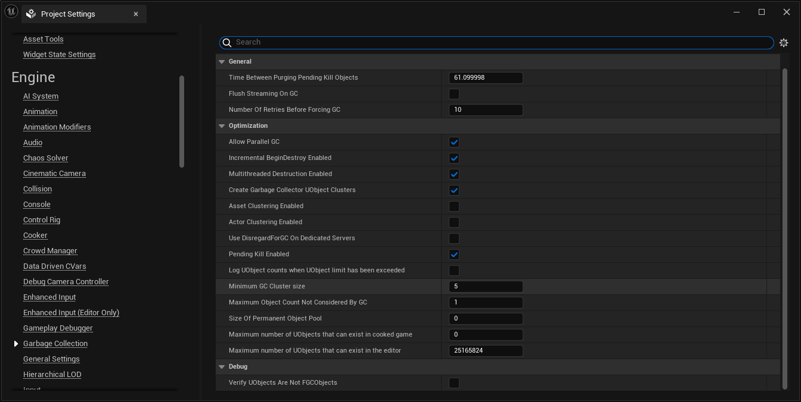
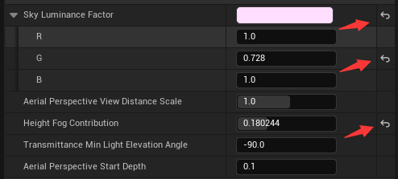
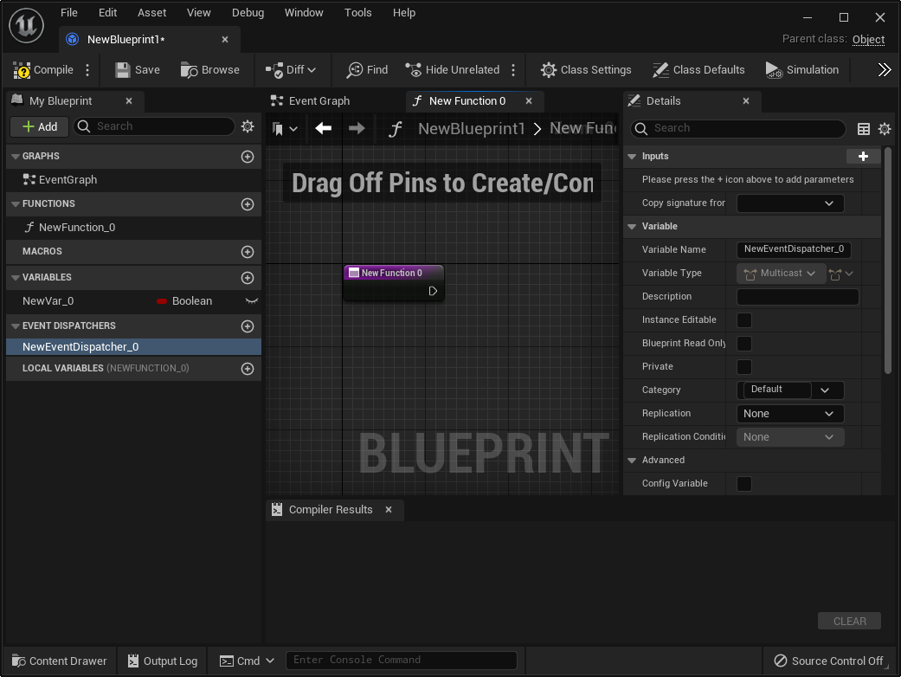
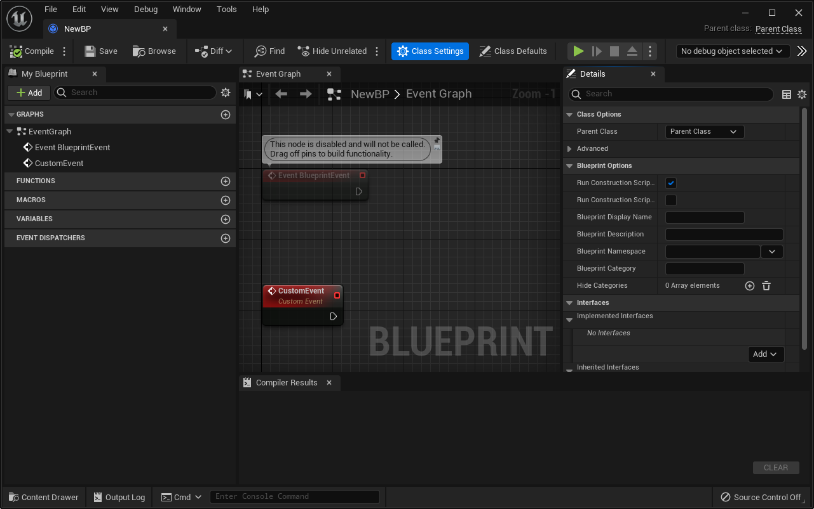

## UObject 核心

UObject 是 UE 对象系统的基类，它的结构层次如下：


它主要由三级结构构成，这三级结构有着不同的职责：

-   **UObjectBase** ：数据层，定义了UObject全部的基础数据，其中包括：

    -   **ObjectFlags** ：Object的各类标识
    -   **InternalIndex** ：UE中所有Object的指针都存放在一个数组中，这里记录index便于在数组中快速定位，主要用于GC
    -   **ClassPrivate** ：Object的元类型—UClass
    -   **NamePrivate** ：Object的名称
    -   **OuterPrivate** ：持有该Object的对象（与序列化有关， **跟生命周期无关** ）

-   **UObjectBaseUtility** ：数据接口层，提供了很多数据层的处理接口。

    

-   **UObject** ：功能层，提供了大量对象系统的基本函数接口。

在 **UObjectBase** 的构造函数中有这样的代码：

```c++
UObjectBase::UObjectBase(UClass* InClass, EObjectFlags InFlags, EInternalObjectFlags InInternalFlags, UObject *InOuter, FName InName)
:   ObjectFlags         (InFlags)
,   InternalIndex       (INDEX_NONE)
,   ClassPrivate        (InClass)
,   OuterPrivate        (InOuter)
{
    check(ClassPrivate);
    // Add to global table.
    AddObject(InName, InInternalFlags);
}
```

其中AddObject会将新建的UObject地址，存放到全局变量 **GUObjectArray** 中，它位于：`Runtime\CoreUObject\Private\UObject\UObjectHash.cpp`

```c++
// Global UObject array instance
FUObjectArray GUObjectArray;
```

**FUObjectArray** 的定义位于`Runtime\CoreUObject\Public\UObject\UObjectArray.h`，它内部主要用于管理所有的Object，簇，GC，其主要数据成员如下：

```c++
class FUObjectArray{
    //typedef TStaticIndirectArrayThreadSafeRead<UObjectBase, 8 * 1024 * 1024 /* Max 8M UObjects */, 16384 /* allocated in 64K/128K chunks */ > TUObjectArray;
    typedef FChunkedFixedUObjectArray TUObjectArray;

    // note these variables are left with the Obj prefix so they can be related to the historical GObj versions

    /** First index into objects array taken into account for GC.                           */
    int32 ObjFirstGCIndex;
    /** Index pointing to last object created in range disregarded for GC.                  */
    int32 ObjLastNonGCIndex;
    /** Maximum number of objects in the disregard for GC Pool */
    int32 MaxObjectsNotConsideredByGC;

    /** If true this is the intial load and we should load objects int the disregarded for GC range.    */
    bool OpenForDisregardForGC;
    /** Array of all live objects.                                          */
    TUObjectArray ObjObjects;
    /** Synchronization object for all live objects.                                            */
    mutable FCriticalSection ObjObjectsCritical;
    /** Available object indices.                                           */
    TArray<int32> ObjAvailableList;

    /**
     * Array of things to notify when a UObjectBase is created
     */
    TArray<FUObjectCreateListener* > UObjectCreateListeners;
    /**
     * Array of things to notify when a UObjectBase is destroyed
     */
    TArray<FUObjectDeleteListener* > UObjectDeleteListeners;
};
```

UE支持监听UObject的创建与销毁：

```c++
class FUObjectCreateListener
{
public:
    virtual ~FUObjectCreateListener() {}
    virtual void NotifyUObjectCreated(const class UObjectBase *Object, int32 Index)=0;
    virtual void OnUObjectArrayShutdown()=0;
};

class FUObjectDeleteListener
{
public:
    virtual ~FUObjectDeleteListener() {}
    virtual void NotifyUObjectDeleted(const class UObjectBase *Object, int32 Index)=0;
    virtual void OnUObjectArrayShutdown() = 0;
};
```

开发者可自定义派生这两类监听器，并调用 **GUObjectArray** 的以下函数，从而达到全局监控或修改UObject的目的（UnLua就是这么做的）：

```c++
class FUObjectArray{
    void AddUObjectCreateListener(FUObjectCreateListener* Listener);
    void RemoveUObjectCreateListener(FUObjectCreateListener* Listener);
    void AddUObjectDeleteListener(FUObjectDeleteListener* Listener);
    void RemoveUObjectDeleteListener(FUObjectDeleteListener* Listener);
};
```

还有一个关键结构是 **FUObjectHashTables** ，它是一个单例类，存放了大量用于快速查找的映射，其代码结构如下：

```c++
struct FHashBucket{
    void *ElementsOrSetPtr[2];  //可能是UObjectBase* ，也可能是 TSet<UObjectBase*>*
};

template <typename T>
class TBucketMap : private TMap<T, FHashBucket>{
    //...
};

class FUObjectHashTables
{
    /** 线程锁 */
    FCriticalSection CriticalSection;
public:

    TBucketMap<int32> Hash;                 //Id到Object的映射
    TMultiMap<int32, uint32> HashOuter;      //Id到父对象ID的映射

    TBucketMap<UObjectBase*> ObjectOuterMap;    //Object 到 子对象集合 的映射
    TBucketMap<UClass*> ClassToObjectListMap;   //UClass 到 其所有实例 的映射
    TMap<UClass*, TSet<UClass*> > ClassToChildListMap;  //UClass 到 其派生Class 的映射
    TAtomic<uint64> ClassToChildListMapVersion;         

    TBucketMap<UPackage*> PackageToObjectListMap;       //包 到 对象集 的映射

    TMap<UObjectBase*, UPackage*> ObjectToPackageMap;   //对象 到 包 的映射

    static FUObjectHashTables& Get()
    {
        static FUObjectHashTables Singleton;
        return Singleton;
    }
    //...
};
```

## 对象创建

一个简单的UObject类定义如下：

``` c++
#pragma once

#include "UObject/Object.h"
#include "CustomObject.generated.h"		//如果存在 #include "{文件名}.generated.h"	，UE则会使用UHT生成该文件的反射数据

UCLASS()
class UCustomObject :public UObject {
    GENERATED_BODY()	//GENERATED_BODY() 反射的入口宏，UHT会生成该宏的定义，里面定义了一些结构塞到UCustomObject的类定义中
public:
    UCustomObject() {}
};
```

创建UObject的对象实例一般情况下会使用函数`NewObject<>()`，例如`NewObject<UCustomObject>()`，它的完整函数定义如下：

```c++
/**
 * Convenience template for constructing a gameplay object
 *
 * @param	Outer		the outer for the new object.  If not specified, object will be created in the transient package.
 * @param	Class		the class of object to construct
 * @param	Name		the name for the new object.  If not specified, the object will be given a transient name via MakeUniqueObjectName
 * @param	Flags		the object flags to apply to the new object
 * @param	Template	the object to use for initializing the new object.  If not specified, the class's default object will be used
 * @param	bCopyTransientsFromClassDefaults	if true, copy transient from the class defaults instead of the pass in archetype ptr (often these are the same)
 * @param	InInstanceGraph						contains the mappings of instanced objects and components to their templates
 * @param	ExternalPackage						Assign an external Package to the created object if non-null
 *
 * @return	a pointer of type T to a new object of the specified class
 */
template< class T >
FUNCTION_NON_NULL_RETURN_START
	T* NewObject(UObject* Outer,
                 const UClass* Class, 
                 FName Name = NAME_None,
                 EObjectFlags Flags = RF_NoFlags,
                 UObject* Template = nullptr, 
                 bool bCopyTransientsFromClassDefaults = false,
                 FObjectInstancingGraph* InInstanceGraph = nullptr,
                 UPackage* ExternalPackage = nullptr)
{
	if (Name == NAME_None)
	{
		FObjectInitializer::AssertIfInConstructor(Outer, TEXT("NewObject with empty name can't be used to create default subobjects (inside of UObject derived class constructor) as it produces inconsistent object names. Use ObjectInitializer.CreateDefaultSubobject<> instead."));
	}

#if DO_CHECK
	// Class was specified explicitly, so needs to be validated
	CheckIsClassChildOf_Internal(T::StaticClass(), Class);
#endif

	FStaticConstructObjectParameters Params(Class);
	Params.Outer = Outer;
	Params.Name = Name;
	Params.SetFlags = Flags;
	Params.Template = Template;
	Params.bCopyTransientsFromClassDefaults = bCopyTransientsFromClassDefaults;
	Params.InstanceGraph = InInstanceGraph;
	Params.ExternalPackage = ExternalPackage;
	return static_cast<T*>(StaticConstructObject_Internal(Params));
}
```

关于Object的创建，这里需要注意几点：

-   **Outer 跟 Object 的生命周期没有任何关系** ：Outer 参数是为了指明当前对象 **在存储上** 隶属于哪个父对象，它跟资产序列化有关。

-   **可以通过UClass来创建对象** ：`NewObject<UCustomObject>()`等价于`NewObject<UObject>(GetTransientPackage(), UCustomObject::StaticClass())`

## 对象销毁

在UE中，可以使用`bool UObject::ConditionalBeginDestroy()`直接销毁对象，而不用等待GC

另外，需要特别注意的是，UE的 对象系统 和 反射系统 相辅相成，由于一些原因导致UObject对象 **没有使用析构函数** 去完成资源的释放逻辑，所以当需要实现析构逻辑时，请覆写UObject的虚函数 `virtual void BeginDestroy()`

### 垃圾回收

UE中通过垃圾回收来管理UObject对象的生命周期，这是一种基于对象引用 定时定量 的回收方式。

其核心机制可以简单理解为：

-   根对象不会被释放
-   如果一个对象不会被释放，那么它所引用的对象也不会被释放

作为开发者，主要需要了解以下几点：

-   如何让一个对象不能被释放？
-   如何构建对象间的引用？
-   如何配置和使用GC？

#### 让一个对象不可被释放

UE中想让一个对象不可被释放，主要有四种途径：

-   在`NewObject`时，使用`EObjectFlags::RF_Standalone`标识，该标识能保证创建的对象在编辑器中一直不会被GC回收（详见`GarbageCollection.h line28`）

-   使用函数 `void UObject::AddToRoot()` 可以将对象加入到根对象集合中，从而让对象不会被释放，使用`void UObject::RemoveFromRoot()`可以将对象从根对象集合中移除。

-   派生 **FGCObject** 类，它被广泛用于UE中各个模块的对象生命周期管理：

    UE在执行GC时，会调用 **所有FGCObject对象** 的 `virtual void AddReferencedObjects( FReferenceCollector& Collector )` 函数， **Collector** 是一个操作入口，添加到 **Collector** 中的对象在本次GC中不会被释放。

    而 **FGCObject** 的构造函数中，会把该对象注册到UE全局的 FGCObject对象列表 中，相当于派生了FGCObject类的对象就可以作为一个根对象

    因此开发者只需要在自己原生的结构定义上，增加`public FGCObject`，并派生它的相关函数：

    ```c++
    class FMyManager : public FGCObject {
    	virtual void AddReferencedObjects(FReferenceCollector& Collector) override {
    		//Collector.AddReferencedObject(...)
    		//..
    	}
    	virtual FString GetReferencerName() const override{ return TEXT("FMyManager"); }	
    };
    ```

-   使用智能指针 **TStrongObjectPtr** 来存储对象，它的本质其实依旧是使用了 **FGCObject** ，详见：
    -   [UE4的智能指针 UObject相关](https://zhuanlan.zhihu.com/p/371851019)

#### 构建对象间的引用

UE中主要是通过反射来构建对象间的引用，比如这样的代码：

``` c++
UCLASS()
class UCustomObject :public UObject {
public:
	UCustomObject() {}

	UPROPERTY()			
	UObject* Prop = nullptr;
};

int main() {
	auto A = NewObject<UCustomObject>();
	auto B = NewObject<UCustomObject>();
	A->Prop = B;		
	A->AddToRoot();
    // Engine Loop
	return 0;
}
```

-   由于`对象A`被添加到了根对象集合，因此它不会被释放，又因为UE根据反射确定了`对象A`的`Prop属性`引用了`对象B`，因此B也不会被释放

#### 配置和使用GC

可以在项目配置中对GC的参数细节进行调整：



在C++中，可以使用如下代码在当前帧手动执行GC：

```C++
bool bForceGarbageCollectionPurge = true;   //是否为全量GC
GEngine->ForceGarbageCollection(bForceGarbageCollectionPurge);
```

## 反射系统

反射是现代程序开发中一个兴起的概念，它旨在以 Meta 的角度去审视代码，将代码中的枚举、类、结构、函数...作为运行时可访问甚至操作的资产 **，** 它本质上是C++代码的自省。

关于反射的概念以及基本实现，详见：

-   [现代图形引擎入门指南（五）— 宏 模板 反射](https://zhuanlan.zhihu.com/p/600456225)

在UE中，一个相对完整的反射标记示例如下：

```c++
/*CustomStruct.h*/
#pragma once        
#include "UObject/Object.h"
#include "CustomStruct.generated.h"

UCLASS()
class UCustomClass :public UObject {
    GENERATED_BODY()
public:
    UCustomClass() {}
public:
    UFUNCTION()
    static int Add(int a, int b) {
        UE_LOG(LogTemp, Warning, TEXT("Hello World"));
        return a + b;
    }

private:
    UPROPERTY(meta = (Keywords = "This is keywords"))
    int SimpleValue = 123;

    UPROPERTY()
    TMap<FString, int> ComplexValue = { {"Key0",0},{"Key1",1} };
};

UENUM()
enum class ECustomEnum : uint8 {
    One UMETA(DisplayName = "This is 0"),
    Two UMETA(DisplayName = "This is 1"),
    Tree UMETA(DisplayName = "This is 2")
};

USTRUCT()
struct FCustomStruct
{
    GENERATED_BODY()

    UPROPERTY()
    int Value = 123;
};

//Interface的固定结构定义
UINTERFACE()
class UCustomInterface :public UInterface {
    GENERATED_BODY()
};
class ICustomInterface
{
    GENERATED_BODY()
public:
    UFUNCTION()
    virtual void SayHello() {}
};
```

对于上述宏标记的结构，UE都会创建相应的数据结构来保存它的元数据

-   **UCLASS()** ：UClass，存储类的描述信息
-   **USTRUCT()** ：UScriptStruct，存储结构体的描述信息
-   **UENUM()** ：UEnum，存储枚举的描述信息
-   **UPROPERTY()** ：FProperty，存储属性的描述信息
-   **UFUNCTION()** ：UFunction，存储函数的描述信息
-   **UINTERFACE()** ：无

在这些宏的括号中，可以添加一些参数，供给相关系统使用，具体的配置请参阅：

-   [Reflection System in Unreal Engine | Unreal Engine 5.2 Documentation](https://docs.unrealengine.com/5.2/en-US/reflection-system-in-unreal-engine/)
    -   [Objects in Unreal Engine | Unreal Engine 5.2 Documentation](https://docs.unrealengine.com/5.2/en-US/objects-in-unreal-engine/)
    -   [UFunctions in Unreal Engine | Unreal Engine 5.2 Documentation](https://docs.unrealengine.com/5.2/en-US/ufunctions-in-unreal-engine/)
    -   [Unreal Engine UProperties | Unreal Engine 5.2 Documentation](https://docs.unrealengine.com/5.2/en-US/unreal-engine-uproperties/)
    -   [Structs in Unreal Engine | Unreal Engine 5.2 Documentation](https://docs.unrealengine.com/5.2/en-US/structs-in-unreal-engine/)
    -   [Interfaces in Unreal Engine | Unreal Engine 5.2 Documentation](https://docs.unrealengine.com/5.2/en-US/interfaces-in-unreal-engine/)
    -   [Metadata Specifiers in Unreal Engine | Unreal Engine 5.2 Documentation](https://docs.unrealengine.com/5.2/en-US/metadata-specifiers-in-unreal-engine/)

-   其他：https://www.unrealengine.com/en-US/blog/unreal-property-system-reflection

这里有一个相对完整的反射使用示例：

```c++
UClass* MetaClassFromGlobalStatic = StaticClass<UCustomClass>();
UClass* MetaClassFromMemberStatic = UCustomClass::StaticClass();            //根据类型通过静态方法获取UClass
UCustomClass* Instance = NewObject<UCustomClass>();
UClass* MetaClassFromInstance = Instance->GetClass();                       //根据实例获取UClass，当实例指针退化为父类时依然有效
UClass* SuperMetaClass = MetaClassFromInstance->GetSuperClass();            //获取父类的UClass
bool IsCustomClass = MetaClassFromInstance->IsChildOf(UCustomClass::StaticClass()); //判断继承关系

UFunction* FuncAdd = MetaClassFromInstance->FindFunctionByName("Add");      //获取函数
UFunction* SuperFunc = FuncAdd->GetSuperFunction();                         //获取父函数，此时为null

/*调用函数*/
int A = 5, B = 10;
uint8* Params = (uint8*)FMemory::Malloc(FuncAdd->ReturnValueOffset);
FMemory::Memcpy((void*)Params, (void*)&A, sizeof(int));
FMemory::Memcpy((void*)(Params + sizeof(A)), (void*)&B, sizeof(int));
FFrame Frame(Instance, FuncAdd, Params, 0, FuncAdd->ChildProperties);
int Result;
FuncAdd->Invoke(Instance, Frame, &Result);
UE_LOG(LogTemp, Warning, TEXT("FuncAdd: a + b = %d"), Result);

/*覆盖函数*/
FuncAdd->SetNativeFunc(execCallSub);
Frame = FFrame(Instance, FuncAdd, Params, 0, FuncAdd->ChildProperties);
FuncAdd->Invoke(Instance, Frame, &Result);
UE_LOG(LogTemp, Warning, TEXT("FuncSub: a - b = %d"), Result);

/*读写属性信息*/
FIntProperty* SimpleProperty = FindFProperty<FIntProperty>(UCustomClass::StaticClass(), "SimpleValue");
int* SimplePropertyPtr = SimpleProperty->ContainerPtrToValuePtr<int>(Instance);	  //根据复合结构的地址，得到实际属性的地址
*SimplePropertyPtr = 789;

FMapProperty* ComplexProperty = FindFProperty<FMapProperty>(UCustomClass::StaticClass(), "ComplexValue");
TMap<FString, int>* ComplexPropertyPtr = ComplexProperty->ContainerPtrToValuePtr<TMap<FString, int>>(Instance);
ComplexPropertyPtr->FindOrAdd("Key02", 2);

bool HasBlueprintVisible = SimpleProperty->HasAllPropertyFlags(EPropertyFlags::CPF_BlueprintVisible);
FString MetaData = SimpleProperty->GetMetaData("Keywords");

/*枚举相关*/
UEnum* MetaEnum = StaticEnum<ECustomEnum>();            
UEnum* MetaEnumFromValueName = nullptr; 
UEnum::LookupEnumName("EMetaEnum::One", &MetaEnumFromValueName);        //根据枚举元素的名称获取
for (int i = 0; i < MetaEnum->NumEnums(); i++) {
    UE_LOG(LogTemp, Warning, TEXT("%s : %d - %s"), *(MetaEnum->GetNameByIndex(i).ToString()), MetaEnum->GetValueByIndex(i), *MetaEnum->GetMetaData(TEXT("DisplayName"), i));
}

/*UStruct相关*/
UStruct* MetaStructFromGlobalStatic = StaticStruct<FCustomStruct>();
UStruct* MetaStructFromMemberStatic = FCustomStruct::StaticStruct();
FCustomStruct* StructInstance = new FCustomStruct;
```

### CDO（Class Default Object）

UE的反射系统为UObject提供了一个名为 **Class Default Object** 的机制，即：每个类有一个默认对象

因为 CDO 的存在，使得每个Class都拥有了一个 **全局单例** 

通过如下函数可以获取 CDO：

``` c++
UObject* UClass::GetDefaultObject(bool bCreateIfNeeded = true) const
{
    if (ClassDefaultObject == nullptr && bCreateIfNeeded)   // 不存在则新建
    {
        UE_TRACK_REFERENCING_PACKAGE_SCOPED((GetOutermost()), PackageAccessTrackingOps::NAME_CreateDefaultObject);
        const_cast<UClass*>(this)->CreateDefaultObject();
    }
    return ClassDefaultObject;
}
```

UE也提供了一些便捷的方法获取：

```c++
const UObject* ConstCDO = GetDefault<UObject>();		 //获取CDO的Cosnt指针
UObject* MutableCDO = GetMutableDefault<UObject>(); 	 //获取可变的CDO指针
```

UE在`NewObject`的时候会以CDO作为模板，因此你可以修改CDO的属性值来调整 新对象属性 的初始值。

UE的细节面板也会以CDO作为参照，查看当前对象的哪些属性与CDO存在差异：



此外，CDO还与UE的Config机制紧密关联：

```c++
UCLASS(config = CustomSettings, defaultconfig)
class UCustomSettings : public UObject {
	GENERATED_BODY()
public:
	UPROPERTY(EditAnywhere, Config)
	FString ConfigValue;
};
```

因为 CDO 全局单例的特性，可以用它来存储一些配置，通过在`UCLASS`和`UPROPERTY`中增加Config相关的标识，使用如下代码可以将相关配置存储到项目的工程目录下：

```c++
CDO->SaveConfig();
```

如果想让配置文件进一步显示在编辑器的项目配置中，可以在插件的启动时机使用如下代码注册配置文件：

```c++
ISettingsModule* SettingsModule = FModuleManager::GetModulePtr<ISettingsModule>("Settings");
if (SettingsModule) {
    auto Settings = GetMutableDefault<UCustomSettings>();
    SettingsModule->RegisterSettings("Project", 
                                     TEXT("CustomSection"),
                                     TEXT("CustomSettingsName"),
                                     LOCTEXT("CustomSettingsName", "CustomSettingsName"),
                                     LOCTEXT("CCustomSettingsTooltip", "Custom Settings Tooltip"),
                                     Settings);
}
```

还需要注意的是，CDO也会执行UObject的构造函数，因此在做一些损耗比较高的操作时，需要考虑CDO是否也需要执行：

``` c++
UCustomObject::UCustomObject(const FObjectInitializer& ObjectInitializer){
    if (HasAnyFlags(EObjectFlags::RF_ClassDefaultObject)) {		//判断当前对象是否是CDO
	}
}
```

### 蓝图（Blueprint）

Unreal Engine 反射中最强大的点在于：开发者不仅可以通过 宏 去标记 原生C++代码 从而生成 反射数据，甚至还 **可以创建和自行组织反射的数据结构** 

这是一个使用代码去构造UClass的示例：

```c++
DEFINE_FUNCTION(execIntToString)                //自定义本地函数
{
    P_GET_PROPERTY(FIntProperty, IntVar);       //获取参数
    P_FINISH;                                   //获取结束
    *((FString*)RESULT_PARAM) = FString::FromInt(IntVar);       //设置返回值
}
```

``` c++
UClass* CustomClass = NewObject<UClass>(GetTransientPackage(),"CustomClass");       //自定义类
CustomClass->ClassFlags |= CLASS_EditInlineNew;         //设置类标识
CustomClass->SetSuperStruct(UObject::StaticClass());    //设置父类

FIntProperty* IntProp = new FIntProperty(CustomClass, TEXT("IntProp"), EObjectFlags::RF_NoFlags);//创建Int属性
FStrProperty* StringProp = new FStrProperty(CustomClass, TEXT("StringProp"), EObjectFlags::RF_NoFlags);

UPackage* CoreUObjectPkg = FindObjectChecked<UPackage>(nullptr, TEXT("/Script/CoreUObject"));   //创建Vector结构体属性
UScriptStruct* VectorStruct = FindObjectChecked<UScriptStruct>(CoreUObjectPkg, TEXT("Vector"));
FStructProperty* VectorProp = new FStructProperty(CustomClass, "VectorProp", RF_NoFlags);
VectorProp->Struct = VectorStruct;

CustomClass->ChildProperties = IntProp;                 //CustomClass->ChildProperties 是一个链表节点，通过链表来链接属性
IntProp->Next = StringProp;                 
StringProp->Next = VectorProp;

UFunction* CustomFucntion = NewObject<UFunction>(CustomClass, "IntToString", RF_Public);
CustomFucntion->FunctionFlags = FUNC_Public | FUNC_Native;  //本地函数指的是本地C++函数，否则是指蓝图脚本中的函数代码

FIntProperty* IntParam = new FIntProperty(CustomFucntion, "IntParam", EObjectFlags::RF_NoFlags);
IntParam->PropertyFlags = CPF_Parm;                         //用作函数参数

FStrProperty* StringReturnParam = new FStrProperty(CustomFucntion, "StringReturnParam", EObjectFlags::RF_NoFlags);
StringReturnParam->PropertyFlags = CPF_Parm | CPF_ReturnParm;       // 用作函数返回值（必须包含CPF_Parm）

CustomFucntion->ChildProperties = IntParam;                         // 函数返回值必须是最后的节点，用于计算后续的参数偏移
IntParam->Next = StringReturnParam;

CustomFucntion->SetNativeFunc(execIntToString);                     // 设置本地函数
CustomFucntion->Bind();                                                 
CustomFucntion->StaticLink(true);                                   // 链接所有属性，此操作会生成Property的内存大小、偏移值..
CustomFucntion->Next = CustomClass->Children;                       // 将Function添加Class Children链表的头部，以便Field访问
CustomClass->Children = CustomFucntion;

CustomClass->AddFunctionToFunctionMap(CustomFucntion, CustomFucntion->GetFName());  //将自定义函数添加到自定义类的函数表中

CustomClass->Bind();
CustomClass->StaticLink(true);                          // 链接所有属性
CustomClass->AssembleReferenceTokenStream();            // 关联属性的GC，完成自定义类的构建

UObject* CDO = CustomClass->GetDefaultObject();         

// 对CDO中的属性进行赋值
void* IntPropPtr = IntProp->ContainerPtrToValuePtr<void*>(CDO);
IntProp->SetPropertyValue(IntPropPtr, 789);

FVector Vector(1, 2, 3);
void* VectorPropPtr = VectorProp->ContainerPtrToValuePtr<void>(CDO);
VectorProp->CopyValuesInternal(VectorPropPtr, &Vector, 1);

// 调用自定义函数
int InputParam = 12345;
UFunction* Func = CustomClass->FindFunctionByName("IntToString");
uint8* Params = (uint8*)FMemory::Malloc(Func->ReturnValueOffset);		//分配参数缓冲区
FMemory::Memcpy((void*)Params, (void*)&InputParam, sizeof(int));
FFrame Frame(CDO, Func, Params, 0, Func->ChildProperties);
FString ReturnParam;
Func->Invoke(CDO, Frame, &ReturnParam);
```

而在这之后，我们甚至可以使用自己创建的UClass来创建UObject：

```c++
UObject* CustomObject = NewObject<UObject>(GetTransientPackage(), CustomClass);
```

而UE的蓝图，不过是对上面的操作进行了一些包装，并提供了相应的编辑器。

UE的蓝图对应的数据结构是 **UBlueprint** ，我们在蓝图编辑器上的绝大部分操作（属性、函数操作，节点编辑，类设置...），基本上都是在修改 **UBlueprint** 的参数：



使用如下接口可以创建一个蓝图：

```c++
static UBlueprint* FKismetEditorUtilities::CreateBlueprint(
    UClass* ParentClass,
    UObject* Outer, 
    const FName NewBPName,
    enum EBlueprintType BlueprintType,
    TSubclassOf<UBlueprint> BlueprintClassType,
    TSubclassOf<UBlueprintGeneratedClass> BlueprintGeneratedClassType, 
    FName CallingContext = NAME_None);
```

参数意义如下：

-   **ParentClass** ：父类，生成蓝图将继承该Class的属性和方法

-   **Outer** ：生成蓝图的Outer（持有者）

-   **NewBPname** ：生成蓝图的名称

-   **BlueprintType** ：蓝图的类型、可以是如下值：

    ``` c++
    enum EBlueprintType
    {
        /** Normal blueprint. */
        BPTYPE_Normal               UMETA(DisplayName="Blueprint Class"),
        /** Blueprint that is const during execution (no state graph and methods cannot modify member variables). */
        BPTYPE_Const                UMETA(DisplayName="Const Blueprint Class"),
        /** Blueprint that serves as a container for macros to be used in other blueprints. */
        BPTYPE_MacroLibrary         UMETA(DisplayName="Blueprint Macro Library"),
        /** Blueprint that serves as an interface to be implemented by other blueprints. */
        BPTYPE_Interface            UMETA(DisplayName="Blueprint Interface"),
        /** Blueprint that handles level scripting. */
        BPTYPE_LevelScript          UMETA(DisplayName="Level Blueprint"),
        /** Blueprint that serves as a container for functions to be used in other blueprints. */
        BPTYPE_FunctionLibrary      UMETA(DisplayName="Blueprint Function Library"),
    
        BPTYPE_MAX,
    };
    ```

-   **BlueprintClassType** ：蓝图类的基础模板，默认可以使用`UBlueprint::StaticClass()`，它可以用来自定义蓝图配置

-   **BlueprintGeneratedClassType** ：蓝图生成类的基础模板，默认可以使用`UBlueprintGeneratedClass::StaticClass()`，，它可以用来自定义生成策略

-   **CallingContext** ：调用上下文，默认为空

创建蓝图的逻辑可以简单看做是：

``` c++
UBlueprint* FKismetEditorUtilities::CreateBlueprint(
    UClass* ParentClass,
    UObject* Outer,
    TSubclassOf<UBlueprint> BlueprintClassType,
    TSubclassOf<UBlueprintGeneratedClass> BlueprintGeneratedClassType)
{
    UBlueprint* NewBP = NewObject<UBlueprint>(Outer,*BlueprintClassType);   //根据BlueprintClassType创建实例
    NewBP->ParentClass = ParentClass;

    UBlueprintGeneratedClass* NewGenClass =                                 //根据BlueprintGeneratedClassType创建实例
        NewObject<BlueprintGeneratedClassType>(NewBP->GetOutermost(),*BlueprintGeneratedClassType);

    NewGenClass->SetSuperStruct(ParentClass)            //设置NewGenClass的父类为ParentClass，这样就能访问其属性和方法

    NewBP->GeneratedClass = NewGenClass;            	//将新生成的UClass赋值给NewBP->GeneratedClass 
}
```

当点击蓝图编辑器的编译按钮时


实际会调用以下函数：

``` c++
static void FKismetEditorUtilities::CompileBlueprint(UBlueprint* BlueprintObj, 
                             EBlueprintCompileOptions CompileFlags = EBlueprintCompileOptions::None,
                             class FCompilerResultsLog* pResults = nullptr );
```

该函数的目标是依据 蓝图编辑器 的 `属性列表`  和 `逻辑图表` 再加上 `ParentClass` 来生成 UBlueprint 的 **成员变量GeneratedClass** 

通常情况下，在C++侧去使用蓝图的步骤如下：

``` c++
UClass * BlueprintGenClass = LoadObject<UClass>(nullptr, "/Game/NewBlueprint.NewBlueprint_C");  	//获取蓝图中的生成类
UObject* Instance = NewObject<UObject>(GetTransientPackage(),Blueprint->GeneratedClass);			//根据类来创建对象实例

UFunction* Func = Blueprint->GeneratedClass->FindFunctionByName("FuncName");     // 在类反射数据中查找名称为[FuncName]的函数
Instance->ProcessEvent(Func, nullptr);							 				 // 调用蓝图中定义的函数

FProperty* Prop = FindFProperty<FProperty>(Blueprint->GeneratedClass, "IntProp");// 在类反射数据中查找名称为[IntProp]的属性
int value = 0;
Prop->GetValue_InContainer(Instance,&value);		//获取属性
Prop->SetValue_InContainer(Instance,&value);		//设置属性
```

使用`/Game/NewBlueprint.NewBlueprint_C` 正是得到 `UBlueprint 的成员变量GeneratedClass` ，其中`/Game/NewBlueprint`是Package路径，`NewBlueprint_C`是`成员变量GeneratedClass`的 对象名称。

对于 **UBlueprint** 生成的 **UClass** ，可以访问 **UClass** 的成员变量 `ClassGeneratedBy`，来获取生成它的 **UBlueprint** ，也可以使用函数：

```c++
static UBlueprint* UBlueprint::GetBlueprintFromClass(const UClass* InClass);
```

理解蓝图的原理之后，它的使用并不困难，下面是一个使用代码来创建蓝图并打开编辑器的示例：

``` c++
UClass* ParentClass = NewObject<UClass>();      //创建ParentClass
ParentClass->SetSuperStruct(UObject::StaticClass());
ParentClass->ClassFlags = CLASS_Abstract | CLASS_MatchedSerializers | CLASS_Native | CLASS_ReplicationDataIsSetUp | CLASS_RequiredAPI | CLASS_TokenStreamAssembled | CLASS_HasInstancedReference  | CLASS_Constructed;

//为Class添加事件函数
UFunction* BPEvent = NewObject<UFunction>(ParentClass, "BlueprintEvent", RF_Public | RF_Transient);
BPEvent->FunctionFlags = FUNC_Public | FUNC_Event | FUNC_BlueprintEvent;
BPEvent->Bind();
BPEvent->StaticLink(true);

BPEvent->Next = ParentClass->Children;              //将函数添加到Parent的Field中
ParentClass->Children = BPEvent;
ParentClass->AddFunctionToFunctionMap(BPEvent, "BlueprintEvent");

ParentClass->Bind();
ParentClass->StaticLink(true);
ParentClass->AssembleReferenceTokenStream(true);

UBlueprint* NewBP = FKismetEditorUtilities::CreateBlueprint(                        //创建蓝图
    ParentClass,
    GetTransientPackage(),
    "NewBP",
    EBlueprintType::BPTYPE_Normal,
    UBlueprint::StaticClass(),
    UBlueprintGeneratedClass::StaticClass());

int32 NodePositionY = 0;

//在图表中创建事件节点
FKismetEditorUtilities::AddDefaultEventNode(NewBP, NewBP->UbergraphPages[0], "BlueprintEvent", ParentClass, NodePositionY); 

//当事件不存在时会创建自定义事件
FKismetEditorUtilities::AddDefaultEventNode(NewBP, NewBP->UbergraphPages[0], "CustomEvent", ParentClass, NodePositionY);    

//打开蓝图编辑器
FBlueprintEditorModule& BlueprintEditorModule = FModuleManager::LoadModuleChecked<FBlueprintEditorModule>("Kismet");
BlueprintEditorModule.CreateBlueprintEditor(EToolkitMode::Standalone, nullptr, NewBP);  
```



## 资产

UE的资产管理也是建立在对象系统之上，UObject支持序列化和反序列化，因此任何一个UObject都可以作为资产（Asset）。

UE的序列化接口如下：

``` c++
class UObject{
    /** 
     * Handles reading, writing, and reference collecting using FArchive.
     * This implementation handles all FProperty serialization, but can be overridden for native variables.
     */
    virtual void Serialize(FArchive& Ar);
};
```

UObject会自动序列化 `非Transient` 的反射属性，也可以覆写`Serialize`函数，使用`FArchive`增加非反射的数据。

使用 **FObjectReader** 、 **FObjectWriter** 可以将UObject和ByteArray互转。

关于序列化，详见：

-   [知乎 - UE序列化介绍及源码剖析](https://zhuanlan.zhihu.com/p/617464719)

UE中的资产不等同于物理文件，UE中物理文件的管理，实际上是依靠于 **UPackage**

**UPackage** 对应着 Content 目录下的`*.uasset`和`*.umap`文件

UE中创建资产时，首先会创建一个`UPackage`作为实际的物理文件映射，然后使用 `NewObject` 创建实际资产，此时会指定它的`Outer`为`Package`，当保存`Package`时，会将该`Package`持有的所有`UObject`都序列化到物理文件中，这个过程看上去就像是：

``` c++
// 创建一个新Package，/Game/CustomPackage为包路径，其中/Game代表工程的Content目录
UPackage* CustomPackage = CreatePackage(nullptr, TEXT("/Game/CustomPackage"));

// 创建一个新的资产，可以是任意UObject（这里使用的UObject是抽象类，会有警告）
UObject* CustomInstance = NewObject<UObject>(CustomPackage, UObject::StaticClass(),
                                             TEXT("CustomInstance"), 
                                             EObjectFlags::RF_Public | EObjectFlags::RF_Standalone);	

// 获取Package的本地磁盘路径
FPackagePath PackagePath = FPackagePath::FromPackageNameChecked(CustomPackage->GetName());
const FString PackageFileName = PackagePath.GetLocalFullPath();

// 将包存储到磁盘上
const bool bSuccess = UPackage::SavePackage(CustomPackage,
                                            CustomInstance, 
                                            RF_Public | RF_Standalone,
                                            *PackageFileName,
                                            GError, nullptr, false, true, SAVE_NoError);
```

该操作会在工程的Content目录下创建一个`CustomPackage.uasset`文件


我们可以通过如下代码去加载磁盘上的包和资产对象：

``` C++
UPackage* LoadedPackage = LoadPackage(nullptr, TEXT("/Game/CustomPackage"), LOAD_None);
UObject* LoadedAsset = LoadObject<UObject>(nullptr,TEXT("/Game/CustomPackage.CustomInstance"));
```

如果想让该资产能够在UE编辑器上被创建和预览，则需要：

-   派生 **UFactory** ，定义资产对象的生成工厂
-   派生 **FAssetTypeActions_Base** ，定义资产在编辑器上的预览，菜单等行为

关于资产管理的更多细节，请查阅：

-   [知乎 - UE4的资源管理](https://zhuanlan.zhihu.com/p/357904199)

## 常用操作

### 创建唯一对象名

``` c++
FName MakeUniqueObjectName(UObject* Parent,
                           const UClass* Class,
                           FName InBaseName/*=NAME_None*/,
                           EUniqueObjectNameOptions Options /*= EUniqueObjectNameOptions::None*/)
```

### 迭代

``` c++
 // 迭代当前所有类型
for(UClass* Class : TObjectRange<UClass>()) {     
}

 // 迭代当前所有对象实例
for(UObject* Object : TObjectRange<UObject>()) {  
}

 // 迭代UObject的所有属性
for(TFieldIterator<FProperty> PropertyIterator(UObject::StaticClass()); PropertyIterator; ++PropertyIterator){
}

// 获取所有派生自UObject的UClass
TArray<UClass*> DerivedClasses
GetDerivedClasses(UObject::StaticClass(),DerivedClasses,true);
```

### UObjectHash.h

`Runtime\CoreUObject\Public\UObject\UObjectHash.h`提供了一些静态方法来管理和访问 **FUObjectHashTables** 的数据

``` c++
UObject* StaticFindObjectFastInternal(const UClass* Class, const UObject* InOuter, FName InName, bool ExactClass = false, bool AnyPackage = false, EObjectFlags ExclusiveFlags = RF_NoFlags, EInternalObjectFlags ExclusiveInternalFlags = EInternalObjectFlags::None);

UObject* StaticFindObjectFastExplicit(const UClass* ObjectClass, FName ObjectName, const FString& ObjectPathName, bool bExactClass, EObjectFlags ExcludeFlags = RF_NoFlags);

COREUOBJECT_API void GetObjectsWithOuter(const class UObjectBase* Outer, TArray<UObject *>& Results, bool bIncludeNestedObjects = true, EObjectFlags ExclusionFlags = RF_NoFlags, EInternalObjectFlags ExclusionInternalFlags = EInternalObjectFlags::None);

COREUOBJECT_API void ForEachObjectWithOuterBreakable(const class UObjectBase* Outer, TFunctionRef<bool(UObject*)> Operation, bool bIncludeNestedObjects = true, EObjectFlags ExclusionFlags = RF_NoFlags, EInternalObjectFlags ExclusionInternalFlags = EInternalObjectFlags::None);

inline void ForEachObjectWithOuter(const class UObjectBase* Outer, TFunctionRef<void(UObject*)> Operation, bool bIncludeNestedObjects = true, EObjectFlags ExclusionFlags = RF_NoFlags, EInternalObjectFlags ExclusionInternalFlags = EInternalObjectFlags::None)
{
    ForEachObjectWithOuterBreakable(Outer, [Operation](UObject* Object) { Operation(Object); return true; }, bIncludeNestedObjects, ExclusionFlags, ExclusionInternalFlags);
}

COREUOBJECT_API class UObjectBase* FindObjectWithOuter(const class UObjectBase* Outer, const class UClass* ClassToLookFor = nullptr, FName NameToLookFor = NAME_None);

COREUOBJECT_API void GetObjectsWithPackage(const class UPackage* Outer, TArray<UObject *>& Results, bool bIncludeNestedObjects = true, EObjectFlags ExclusionFlags = RF_NoFlags, EInternalObjectFlags ExclusionInternalFlags = EInternalObjectFlags::None);

COREUOBJECT_API void ForEachObjectWithPackage(const class UPackage* Outer, TFunctionRef<bool(UObject*)> Operation, bool bIncludeNestedObjects = true, EObjectFlags ExclusionFlags = RF_NoFlags, EInternalObjectFlags ExclusionInternalFlags = EInternalObjectFlags::None);

COREUOBJECT_API void GetObjectsOfClass(const UClass* ClassToLookFor, TArray<UObject *>& Results, bool bIncludeDerivedClasses = true, EObjectFlags ExcludeFlags = RF_ClassDefaultObject, EInternalObjectFlags ExclusionInternalFlags = EInternalObjectFlags::None);

COREUOBJECT_API void ForEachObjectOfClass(const UClass* ClassToLookFor, TFunctionRef<void(UObject*)> Operation, bool bIncludeDerivedClasses = true, EObjectFlags ExcludeFlags = RF_ClassDefaultObject, EInternalObjectFlags ExclusionInternalFlags = EInternalObjectFlags::None);

COREUOBJECT_API void ForEachObjectOfClasses(TArrayView<const UClass*> ClassesToLookFor, TFunctionRef<void(UObject*)> Operation, EObjectFlags ExcludeFlags = RF_ClassDefaultObject, EInternalObjectFlags ExclusionInternalFlags = EInternalObjectFlags::None);

/*获取UClass所有派生类的UClass*/
COREUOBJECT_API void GetDerivedClasses(const UClass* ClassToLookFor, TArray<UClass *>& Results, bool bRecursive = true);

COREUOBJECT_API TMap<UClass*, TSet<UClass*>> GetAllDerivedClasses();

COREUOBJECT_API bool ClassHasInstancesAsyncLoading(const UClass* ClassToLookFor);

void HashObject(class UObjectBase* Object);

void UnhashObject(class UObjectBase* Object);

void HashObjectExternalPackage(class UObjectBase* Object, class UPackage* Package);

void UnhashObjectExternalPackage(class UObjectBase* Object);

UPackage* GetObjectExternalPackageThreadSafe(const class UObjectBase* Object);

UPackage* GetObjectExternalPackageInternal(const class UObjectBase* Object);
```

### ObjectTools.h

`Editor\UnrealEd\Public\ObjectTools.h`中的命名空间ObjectTools也提供了非常多 **编辑器下** 安全操作Object的方法，此外相似的还有 **ThumbnailTools** ， **AssetTools** ...

``` c++
namespace ObjectTools
{
    UNREALED_API bool IsObjectBrowsable( UObject* Obj );

    UNREALED_API void DuplicateObjects( const TArray<UObject*>& SelectedObjects, const FString& SourcePath = TEXT(""), const FString& DestinationPath = TEXT(""), bool bOpenDialog = true, TArray<UObject*>* OutNewObjects = NULL );

    UNREALED_API UObject* DuplicateSingleObject(UObject* Object, const FPackageGroupName& PGN, TSet<UPackage*>& InOutPackagesUserRefusedToFullyLoad, bool bPromptToOverwrite = true, TMap<TSoftObjectPtr<UObject>, TSoftObjectPtr<UObject>>* DuplicatedObjects = nullptr);

    UNREALED_API FConsolidationResults ConsolidateObjects( UObject* ObjectToConsolidateTo, TArray<UObject*>& ObjectsToConsolidate, bool bShowDeleteConfirmation = true );
    UNREALED_API FConsolidationResults ConsolidateObjects(UObject* ObjectToConsolidateTo, TArray<UObject*>& ObjectsToConsolidate, TSet<UObject*>& ObjectsToConsolidateWithin, TSet<UObject*>& ObjectsToNotConsolidateWithin, bool bShouldDeleteAfterConsolidate, bool bWarnAboutRootSet = true);
    UNREALED_API void CompileBlueprintsAfterRefUpdate(const TArray<UObject*>& ObjectsConsolidatedWithin);

    UNREALED_API void CopyReferences( const TArray< UObject* >& SelectedObjects ); // const

    UNREALED_API void ShowReferencers( const TArray< UObject* >& SelectedObjects ); // const

    UNREALED_API void ShowReferenceGraph( UObject* ObjectToGraph );

    UNREALED_API void ShowReferencedObjs( UObject* Object, const FString& CollectionName = FString(), ECollectionShareType::Type ShareType = ECollectionShareType::CST_Private);

    UNREALED_API void SelectActorsInLevelDirectlyReferencingObject( UObject* RefObj );

    UNREALED_API void SelectObjectAndExternalReferencersInLevel( UObject* Object, const bool bRecurseMaterial );

    UNREALED_API void AccumulateObjectReferencersForObjectRecursive( UObject* Object, TArray<UObject*>& Referencers, const bool bRecurseMaterial );

    bool ShowDeleteConfirmationDialog ( const TArray<UObject*>& ObjectsToDelete );

    UNREALED_API void CleanupAfterSuccessfulDelete ( const TArray<UPackage*>& ObjectsDeletedSuccessfully, bool bPerformReferenceCheck = true );

    UNREALED_API int32 DeleteObjects( const TArray< UObject* >& ObjectsToDelete, bool bShowConfirmation = true, EAllowCancelDuringDelete AllowCancelDuringDelete = EAllowCancelDuringDelete::AllowCancel);

    UNREALED_API int32 DeleteObjectsUnchecked( const TArray< UObject* >& ObjectsToDelete );

    UNREALED_API int32 DeleteAssets( const TArray<FAssetData>& AssetsToDelete, bool bShowConfirmation = true );

    UNREALED_API bool DeleteSingleObject( UObject* ObjectToDelete, bool bPerformReferenceCheck = true );

    UNREALED_API int32 ForceDeleteObjects( const TArray< UObject* >& ObjectsToDelete, bool ShowConfirmation = true );

    UNREALED_API void ForceReplaceReferences(UObject* ObjectToReplaceWith, TArray<UObject*>& ObjectsToReplace);
    UNREALED_API void ForceReplaceReferences(UObject* ObjectToReplaceWith, TArray<UObject*>& ObjectsToReplace, TSet<UObject*>& ObjectsToReplaceWithin);

    UNREALED_API void AddExtraObjectsToDelete(TArray< UObject* >& ObjectsToDelete);

    UNREALED_API bool ComposeStringOfReferencingObjects( TArray<FReferencerInformation>& References, FString& RefObjNames, FString& DefObjNames );

    UNREALED_API void DeleteRedirector(UObjectRedirector* Redirector);

    UNREALED_API bool GetMoveDialogInfo(const FText& DialogTitle, UObject* Object, bool bUniqueDefaultName, const FString& SourcePath, const FString& DestinationPath, FMoveDialogInfo& InOutInfo);

    UNREALED_API bool RenameObjectsInternal( const TArray<UObject*>& Objects, bool bLocPackages, const TMap< UObject*, FString >* ObjectToLanguageExtMap, const FString& SourcePath, const FString& DestinationPath, bool bOpenDialog );

    UNREALED_API bool RenameSingleObject(UObject* Object, FPackageGroupName& PGN, TSet<UPackage*>& InOutPackagesUserRefusedToFullyLoad, FText& InOutErrorMessage, const TMap< UObject*, FString >* ObjectToLanguageExtMap = NULL, bool bLeaveRedirector = true);

    UNREALED_API void AddLanguageVariants( TArray<UObject*>& OutObjects, TMap< UObject*, FString >& OutObjectToLanguageExtMap, USoundWave* Wave );

    UNREALED_API bool RenameObjects( const TArray< UObject* >& SelectedObjects, bool bIncludeLocInstances, const FString& SourcePath = TEXT(""), const FString& DestinationPath = TEXT(""), bool bOpenDialog = true );

    UNREALED_API FString SanitizeObjectName(const FString& InObjectName);

    UNREALED_API FString SanitizeObjectPath(const FString& InObjectPath);

    UNREALED_API FString SanitizeInvalidChars(const FString& InText, const FString& InvalidChars);

    UNREALED_API FString SanitizeInvalidChars(const FString& InText, const TCHAR* InvalidChars);

    UNREALED_API void SanitizeInvalidCharsInline(FString& InText, const TCHAR* InvalidChars);

    UNREALED_API void GenerateFactoryFileExtensions( const UFactory* InFactory, FString& out_Filetypes, FString& out_Extensions, TMultiMap<uint32, UFactory*>& out_FilterIndexToFactory );

    UNREALED_API void GenerateFactoryFileExtensions( const TArray<UFactory*>& InFactories, FString& out_Filetypes, FString& out_Extensions, TMultiMap<uint32, UFactory*>& out_FilterIndexToFactory );

    UNREALED_API void AppendFactoryFileExtensions( UFactory* InFactory, FString& out_Filetypes, FString& out_Extensions );

    UNREALED_API void AppendFormatsFileExtensions(const TArray<FString>& InFormats, FString& out_FileTypes, FString& out_Extensions);

    UNREALED_API void AssembleListOfExporters(TArray<UExporter*>& OutExporters);

    UNREALED_API void TagInUseObjects( EInUseSearchOption SearchOption, EInUseSearchFlags InUseSearchFlags = EInUseSearchFlags::None);

    UNREALED_API TSharedPtr<SWindow> OpenPropertiesForSelectedObjects( const TArray<UObject*>& SelectedObjects );

    UNREALED_API void RemoveDeletedObjectsFromPropertyWindows( TArray<UObject*>& DeletedObjects );

    UNREALED_API bool IsAssetValidForPlacing(UWorld* InWorld, const FString& ObjectPath);

    UNREALED_API bool IsClassValidForPlacing(const UClass* InClass);

    UNREALED_API bool IsClassRedirector( const UClass* Class );

    UNREALED_API bool AreObjectsOfEquivalantType( const TArray<UObject*>& InProposedObjects );

    UNREALED_API bool AreClassesInterchangeable( const UClass* ClassA, const UClass* ClassB );

    UNREALED_API void GatherObjectReferencersForDeletion(UObject* InObject, bool& bOutIsReferenced, bool& bOutIsReferencedByUndo, FReferencerInformationList* OutMemoryReferences = nullptr, bool bInRequireReferencingProperties = false);

    UNREALED_API void GatherSubObjectsForReferenceReplacement(TSet<UObject*>& InObjects, TSet<UObject*>& ObjectsToExclude, TSet<UObject*>& OutObjectsAndSubObjects);
};
```
