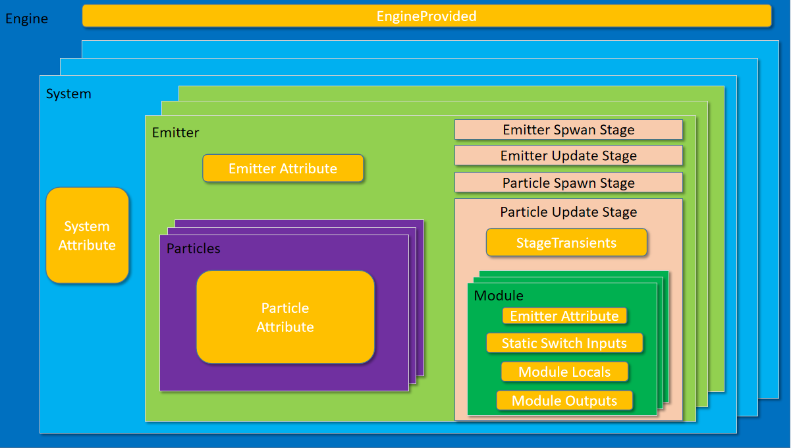
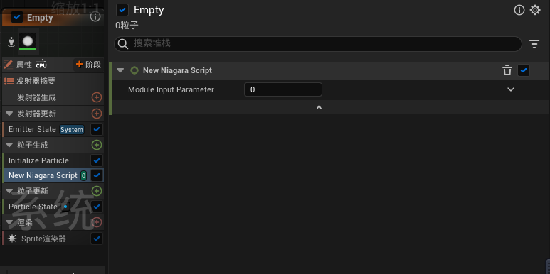
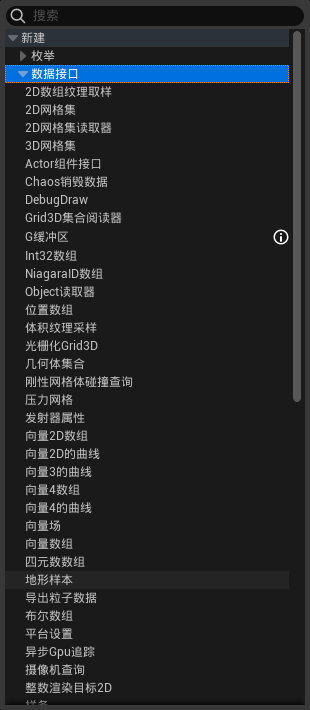
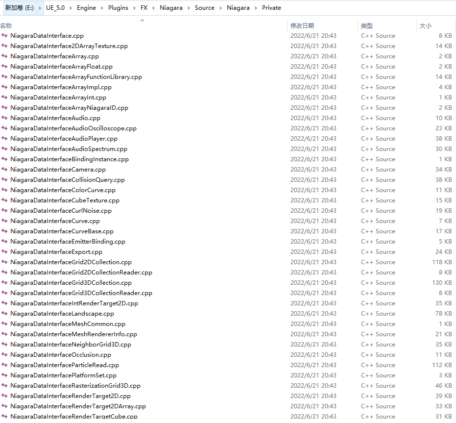
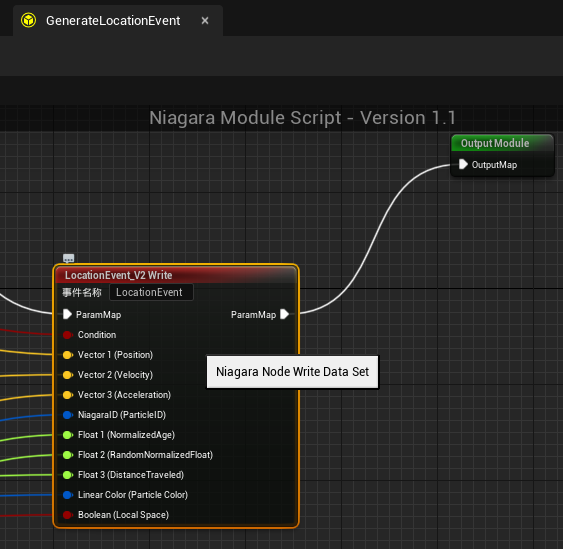
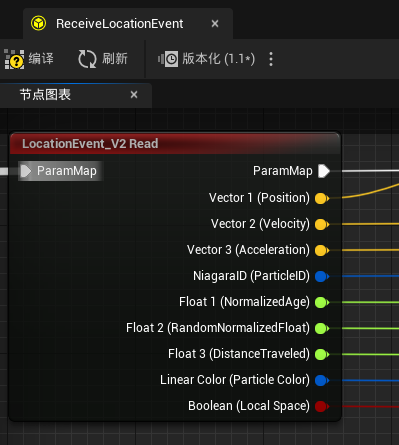
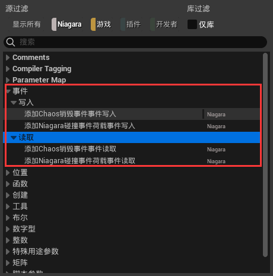

# 粒子系统（Particle System）

> 粒子系统（Particle System）表示三维计算机图形学中模拟一些特定的模糊现象的技术，而这些现象用其它传统的渲染技术难以实现真实感的物理运动规律。经常使用粒子系统模拟的现象有火、爆炸、烟、水流、火花、落叶、云、雾、雪、尘、流星尾迹或者象发光轨迹这样的抽象视觉效果等等。
>
> [《百度百科》— 粒子系统](https://baike.baidu.com/item/%E7%B2%92%E5%AD%90%E7%B3%BB%E7%BB%9F)

相信使用过游戏引擎的小伙伴都熟知粒子系统的作用，它主要适用于 **大量运动的** 物体。

## 原理

熟悉图形API的小伙伴都知道，使用GPU去绘制一个物体，需要调用`DrawCall`命令，由于粒子系统中存在非常多的微小粒子，常规的做法可能是这样：

``` c++
for(int i = 0; i < particles.num(); i++){
    drawParticle(particles[i]);
}
```

虽然说这样确实能达到效果，但由于大量的`DrawCall`调用，且粒子间存在许多重复数据，这样会导致粒子系统的渲染消耗会非常高，因此所能渲染的粒子数量十分有限。

为了能够极大程度的复用粒子数据和减少`DrawCall`，懂图形API的小伙伴们应该都想到了—— **实例化（Instancing）**

关于实例化的概念和使用，详见：

- [Learn OpenGL - Instancing](https://learnopengl-cn.github.io/04%20Advanced%20OpenGL/10%20Instancing/)

通过实例化可以将粒子系统的`DrawCall`进行合并，并且能复用粒子间相同的数据。

了解如上概念，可以知道粒子系统只是一个 使用 实例化渲染 的工作流程，从这一维度去思考怎么制作粒子效果，我们考虑的是：

- 如何构建粒子系统所需的实例化数据（Instance Data）。
- 如何利用实例化数据去渲染出粒子效果。

从这两个角度出发，相信大家都很容易搭建出粒子系统的工作管线，下文主要会从架构上去阐述一些粒子系统的细节：

对于一个简单的粒子，它可能使用这样的数据结构：

``` c++
struct Particle{   		//粒子的属性结构 
	vec3 position;
	vec3 rotation;
	float size;
  	float age;
	//...
}
```

我们通过一个名为 **粒子发射器（Particle Emitter）** ，它维护着一个存放数据的 **粒子池（Particle Pool）** ，并且负责 **生成（Spawn）** ， **更新（Update）** 和 **回收（Recycle）** 粒子，使用 **粒子渲染器（Particle Renderer）** 将粒子池中的数据渲染出来，也就得到了粒子效果，这个过程可以看作是：

``` c++
class ParticleEmitter{
protected:
    void Tick() override{
        Spawn();				//生成阶段:创建新粒子
        UpdateAndRecycle();		//更新阶段:更新每个粒子的状态数据并回收已死亡的粒子
        Render();				//渲染阶段:使用粒子渲染器将粒子效果渲染出来
    }
private:
    vector<Particle> mParticlePool;
    ParticleRenderer mParticleRenderer;
};
```

### 粒子池

因为计算机的内存资源是有限的，所以粒子系统需要保证 **粒子池的占用内存不会随程序运行一直膨胀** ，为此粒子系统往往会通过以下手段避免这个问题：

- 限制粒子的发射数量。
- 粒子具备生命周期，对于超出生命周期的粒子，及时进行回收。

这也为粒子池提供了内存优化的基础：

- 已知粒子的发射数量和生命周期，结合当前电脑的最大帧数，很容易估算出该发射器的最大粒子数量，而这个数量的内存往往会一开始就分配给粒子池，从而避免粒子池的内存重分配产生的开销.
- 为了让粒子池能够并行回收（避免当从数组中移除一个元素时，需要挪动后方元素填充到之前的位置），往往会使用两个相同大小的粒子池交替迭代。

假如我们想要更新和回收粒子，可能会写出这样的代码：

``` c++
vector<Particle> ParticlePool;
ParticlePool.reserve(10000);			//预分配能存放10000个粒子数据的内存

int index = -1;
for(int i = 0; i < ParticlePool.size(); i++){
    if(ParticlePool[i].isAlive()){
        index++;
        ParticlePool[index] = ParticlePool[i];
        ParticlePool[index].position = ...;
        ParticlePool[index].size = ...;
        ...;
    }
}
ParticlePool.reseize(index);
```

它的逻辑复杂度是O(n)，如果还要优化，我们可以并行处理for循环，但上面的代码结构却做不到，是因为：

- 内部的循环逻辑会对外部共有变量`index`进行读写。
- 对`ParticlePool`的不同区域同时进行读和写，并行会出现乱序执行导致数据混乱。

为了解决这个问题，我们一般会用两个`ParticlePool`交替处理，在局部线程中对index使用原子操作，所以ParticleEmitter的结构代码可能就变成了这样：

``` c++
class ParticleEmitter{
protected:
    void InitPool(){
        mParticlePool[0].reserve(...);
        mParticlePool[1].reserve(...);
        mCurrentPoolIndex = 0;
        mNextPoolIndex = 1;
        mCurrentNumOfParticle = 0;
    }
    void Tick() override{
        Spawn();				
        UpdateAndRecycle();		
        Render();				
    }
private:
    vector<Particle> mParticlePool[2];
    int mCurrentPoolIndex;
    int mNextPoolIndex;
    int mCurrentNumOfParticle;
    
    ParticleRenderer mParticleRenderer;
};
```

### 生成阶段

粒子的生成阶段主要是生成新的粒子存放到粒子池中并初始化，这个过程可以看做是：

``` c++
void Spwan(){ 
 	SpwanPerFrame(mParticlePool[mCurrentPoolIndex],mCurrentNumOfParticle,100);  	    //每帧生成100个粒子
}

// 发射机制 可自定义
void SpwanPerFrame(vector<Particle>& ParticlePool,int& NumOfParticle, int NumOfNewParticle){
    for(int i = 0; i < NumOfNewParticle ; i++ ){ 			//NumOfNewParticle为新增粒子的数量
        Particle& NewParticle =  ParticlePool[NumOfParticle];	
        NumOfParticle++;
        InitializeParticle(NewParticle);
    }
}

// 初始化机制 可自定义
void InitializeParticle(Particle& particle){
    particle.position = vec3(0.0f,0.0f,0.0f);
    //particle...
}
```

> 这里需要注意的是，`Spawn`函数是每帧调用，发射器除了有 **每帧** 发射固定数量的发射机制，还可能是 **每秒** 发射“固定”数量，但由于不同系统的环境下，游戏中每秒的帧数不可预知，因此，对于这类 **根据时段确定发射数量的发射机制** ，其粒子数量是很难精确可控制的。

### 更新回收阶段

此阶段的伪代码可以看做是：

``` c++
void UpdateAndRecycle(){ 	
    int IndexOfNextBuffer = -1;	  			//初始索引
    for_each_thread(int i = 0 ; i < mCurrentNumOfParticle ; i++){		//并行for
        const Particle& CurrentParticle = mParticlePool[mCurrentPoolIndex][i];
        if(CurrentParticle.isActive()){	
            int CurrentIndex = atomicAdd(IndexOfNextPool,1);			//使用原子操作读写外部公共变量
            Particle& NextParticle = mParticlePool[mNextPoolIndex][CurrentIndex];
            UpdateParticleStatus(CurrentParticle,NextParticle);
        }
    }
    CurrentParticlesBufferSize = IndexOfNextBuffer;	//更新当前存活的粒子数量
    swap(mCurrentPoolIndex,mNextPoolIndex);			//交换当前粒子池的索引
}

// 粒子状态更新机制 可自定义
void UpdateParticleStatus(const Particle& CurrentParticle, Particle& NextParticle){
    NextParticle.position = CurrentParticle.position;
    //NextParticle...
}
```

### 绘制阶段

绘制本身只是利用粒子的数据进行渲染，它的基本过程可以看做是：

``` c++
void Render(){
    mParticleRenderer.BindAttribute("position",mParticlePool[mCurrentPoolIndex],offset0,stride0);
    mParticleRenderer.BindAttribute("color",mParticlePool[mCurrentPoolIndex],offset1,stride1);
    ...;
    mParticleRenderer.drawInstancing();
}
```

该阶段体现了粒子的本质：粒子只是一堆数据，粒子系统（发射器）只不过是批量处理这些数据，而绘制粒子，只是将粒子数据绑定到对应渲染器的 **数据插槽** 。

### CPU VS GPU

上面提到粒子系统本质上都是围绕着一堆粒子数据进行处理，主要可划分为：

- **生成阶段** 和 **更新回收阶段** ：这两个阶段主要是在处理粒子数据，而Niagara提供了 **节点式的脚本** 来为这两个阶段提供自定义操作，最终脚本将会：
  - CPU：通过节点拼接的C++代码，会在Niagara的虚拟机中执行。
  - GPU：Niagara会根据节点图，通过 **NiagaraHlslTranslator** 将之翻译为对应的 **HLSL** 代码供 **ComputerShader** 调用。
- **绘制阶段** ：无论是CPU粒子还是GPU粒子，它们都可以使用相同的渲染器，区别在于： **CPU粒子需要将数据上传到GPU上， 而GPU粒子的数据本身就在GPU，无需传输** 。

上述过程在逻辑上大同小异，其中需要注意的是GPU粒子的回收，GPU粒子调用ComputeShader **并行** 处理每个粒子，但是在更新会回收阶段，就涉及到数据的重定位，GPU之所以可以能够高效的并行，正是因为每一条分支上的数据互不相通且互不影响，而我们要实现GPU粒子的回收，就必须“打破”这一规定，当下而言，要达到这样的效果主要有两条途径：

- 图形渲染管线：禁用光栅化，使用TransformFeedback（OpenGL）/ Stream Output（DX），Geometry Shader中回收（不提交）死亡粒子

  > Geometry Shader本身就带有线性操作，因为这个过程会生成不定数量的新顶点，GPU在执行它写入数据到内存时肯定会加锁重定位，这也是上面为什么会有人使用TransformFeedback和Stream Output制作GPU粒子的原因，当然这也是游戏中需要尽量避免GS的原因。顺带提一下，Stream Output属于DX的正统特性，TransformFeedback在Khronos的待遇就不咋滴了，Vulkan中甚至没有提供官方支持，Metal更是对应功能的API都没有。

- 通用计算管线：SSBO Atomic：随着硬件的更新，目前较高版本的渲染驱动都会支持SSBO（Shader Storage Buffer Object），这里我们的关注点主要是：SSBO支持Atomic操作。有了它的加持，就可以在CS中并行的处理粒子，并使用Atomic操作对粒子数据重定位（即上面伪代码中的NewIndex），对于新的粒子数据，则可以通过另一个特性——间接渲染（Indirect Draw）：直接利用GPU上的数据调用DrawCall，这样全程都避免了CPU与GPU的粒子传输，下面提供一个简易的GLSL 代码：

  ``` glsl
  layout (local_size_x = LOCAL_SIZE) in;
  struct Particle {
      vec3 position;
      vec3 rotation;
      vec3 scaling;
      vec3 velocity;
      float life;
  };
  layout(std140,binding = 0) buffer InputParticlesBuffer{
      Particle inputParticles[PARTICLE_MAX_SIZE];
  };
  layout(std140,binding = 1) buffer OutputParticlesBuffer{
      Particle outputParticles[PARTICLE_MAX_SIZE];
  };
  layout(std140,binding = 2) buffer ParticleRunContext{
  	uint inputCounter;			//初始值为当前粒子数
  	uint outputCounter;		 	//初始化为0
  	float duration;
  	float lifetime;
  };
  
  #define inID  gl_GlobalInvocationID.x
  #define inParticle inputParticles[inID]
      
  void main(){												//注意：GPU的并行是无序的
      if(inID >= inputCounter||inParticle.life>lifetime)		//此处可使用阶跃函数step优化
          return;
      uint outID = atomicAdd(outputCounter,1);				//atomicAdd是GLSL的原生函数，但需要操作对象来源于SSBO
      outputParticles[outID].life = inParticle.life + duration;
  }
  ```

> [ **Shader Storage Buffer Object** ](https://www.khronos.org/opengl/wiki/Shader_Storage_Buffer_Object)
>
> **着色器存储缓冲区对象** 是一个缓冲区[对象](https://www.khronos.org/opengl/wiki/Buffer_Object)。
>
> SSBO 很像[Uniform Buffer Objects](https://www.khronos.org/opengl/wiki/Uniform_Buffer_Object)。着色器存储块由[接口块 (GLSL)](https://www.khronos.org/opengl/wiki/Interface_Block_(GLSL))以与统一块几乎相同的方式定义。存储 SSBO 的缓冲区对象绑定到 SSBO 绑定点，就像制服的缓冲区对象绑定到 UBO 绑定点一样。等等。
>
> 它们之间的主要区别是：
>
> 1. SSBO 可以更大。OpenGL 规范保证 UBO 的大小可以达到 16KB（实现可以允许它们更大）。该规范保证 SSBO 可以达到 128 **MB** 。大多数实现将允许您分配最大 GPU 内存限制的大小。
> 2. SSBO 是可写的，甚至是 **原子的** ；UBO 是uniform。SSBO 读写使用[不连贯的内存访问](https://www.khronos.org/opengl/wiki/Incoherent_Memory_Access)，因此它们需要适当的屏障，就像[Image Load Store](https://www.khronos.org/opengl/wiki/Image_Load_Store)操作一样。
> 3. SSBO 可以有可变的存储空间，直到为该特定缓冲区绑定的任何缓冲区范围；UBO 必须具有特定的、固定的存储大小。这意味着您可以在 SSBO 中拥有任意长度的数组（而不是最后）。数组的实际大小，基于缓冲区绑定的范围，可以在运行时在着色器中使用无界数组变量的长度函数查询。
> 4. 在所有条件相同的情况下，SSBO 访问可能会比 UBO 访问慢。SSBO 通常像缓冲区纹理一样被访问，而 UBO 数据是通过内部着色器可访问的内存读取来访问的。至少，UBO 不会比 SSBO 慢。
>
> 从功能上讲，当通过[Image Load Store](https://www.khronos.org/opengl/wiki/Image_Load_Store)访问时，SSBO 可以被认为是[缓冲区纹理](https://www.khronos.org/opengl/wiki/Buffer_Texture)的更好接口。
>
> OpenGL提供了一个AtomicCounter的功能，其本质上就是该特性

上述完成了GPU粒子的回收，但它其实还带来了一个比较严重的问题——在GPU端调整了粒子的数量，但CPU上却不知道它是多少。

我们渲染粒子是肯定是需要知道这个值是多少，不然drawcall的参数填啥？

> 从GPU上回读数据肯定是不行的，因为现代图形API都是通过指令缓存的方式来加速渲染的，简单点说，就是在某一刻，GPU的指令缓存中可能存在着两帧甚至以上的指令还没处理，如果我们要回读数据的话，就必须保证当前指令被立即执行，也就是说得阻塞渲染线程，等待数据返回，这个操作对整个引擎而言简直就是致命打击，不过好在有解决方法。

在OpenGL4.0的更新中，提供了一个新特性——[Indirect Rendering](https://www.khronos.org/opengl/wiki/Vertex_Rendering#Indirect_rendering)（间接渲染，也叫 **Indirect Draw** ），它允许我们使用GPU上的数据调用DrawCall，以下是官方对它的定义：

> [ **Indirect Rendering** ](https://www.khronos.org/opengl/wiki/Vertex_Rendering#Indirect_rendering)
>
> 间接渲染是向 OpenGL 发出绘图命令的过程，除了该命令的大部分参数来自[Buffer Object](https://www.khronos.org/opengl/wiki/Buffer_Object)提供的 GPU 存储。例如，[glDrawArrays](https://www.khronos.org/opengl/wiki/GLAPI/glDrawArrays)采用原始类型、顶点数和起始顶点。当使用间接绘图命令[glDrawArraysIndirect](https://www.khronos.org/opengl/wiki/GLAPI/glDrawArraysIndirect)时，要渲染的起始顶点和顶点数将存储在缓冲区对象中。
>
> 这样做的目的是允许 GPU 进程填充这些值。这可能是一个[计算着色器](https://www.khronos.org/opengl/wiki/Compute_Shader)、一个专门设计的[几何着色器](https://www.khronos.org/opengl/wiki/Geometry_Shader)加上[Transform Feedback](https://www.khronos.org/opengl/wiki/Transform_Feedback)，或者一个 OpenCL/CUDA 进程。这个想法是避免 GPU->CPU->GPU 往返；通过 GPU 决定要渲染的参数，而 CPU 所做的只是决定何时发出绘图命令，以及该命令使用哪个[Primitive](https://www.khronos.org/opengl/wiki/Primitive)。

> 在Niagara源码中搜索Indirect，可以找到相关用法的定义，其主要的结构位于：
>
> - `NiagaraVertexFactories\Public\NiagaraDrawIndirect.h`
> - `Niagara\Private\NiagaraGPUInstanceCountManager.cpp`

#### 优缺点

- **CPU** 粒子
  - 优点
    - CPU端可访问完整的游戏环境，可以跟其他粒子或游戏逻辑进行互动。
    - 无需较高的硬件配置，显卡支持可编程管线和实例化渲染即可。

  - 缺点
    - 只能在CPU端线性地迭代粒子数据，对CPU的性能损耗严重。
    - 粒子数据位于CPU端内存中，渲染时需要统一将粒子数据上传到GPU中，这一传输过程的损耗极其严重。

- **GPU** 粒子
  - 优点

    - 粒子数据全程在GPU端生成和处理，避免了CPU和GPU之间的数据传输。
    - 依靠GPU中的并行单元处理粒子数据，大大降低了粒子处理所需的耗时。

  - 缺点

    - GPU粒子的数据位于显存中，无法实时计算包围盒边界
    - 不能很好地跟游戏环境交互，但可以通过深度，Scene Capture，距离场去逼近效果。
    - 对硬件配置有一定要求，需支持CS、SSBO Atomic、Indirect Draw（PC端有独显基本没问题，移动端的支持不是特别完善）

## 粒子系统架构示例

在本教程的代码中，也搭建了较为简单的粒子架构，具体请参考：

> 目前代码示例中还存在一些问题，QRhi并没有直接支持 **Indirect Rendering** ，笔者在此处嵌入了部分原生Vulkan代码，目前还没有改成内存屏障去做同步，而是直接提交次级指令缓冲区，阻塞等待：`mRhi->finish()`

- 代码：https://github.com/Italink/QEngineUtilities/blob/main/Source/Core/Source/Public/Asset/QParticleEmitter.h
- 示例1——[CPU和GPU粒子](https://github.com/Italink/ModernGraphicsEngineGuide/tree/main/Source/3-GraphicsTechnology/05-GPUParticles/Source/main.cpp)


- 示例2——[景深](https://github.com/Italink/ModernGraphicsEngineGuide/blob/main/Source/3-GraphicsTechnology/07-PostEffect/10-DepthOfField/Source/main.cpp)


## Niagara

Niagara相比上面的结构更加强大，它本质上只是提供了 **可编程的数据处理器（CPU or GPU） 和 实例化渲染器** ，从这一层面去思考，可以用它来实现非常多惊艳的效果。

### 作用域

大多数文章中称此处的作用域为“命名空间”，虽然它确实起着区分变量命名的作用，但对于开发者而言，更为重要的是这些变量作用域所代表的生命周期。

以下是UE中Niagara的大体结构，其中 **黄色部分** 代表Niagara中可管理变量的作用域：



在Niagara编辑器中，你可以通过参数面板来对这些作用域的变量进行增删改


- **EngineProvided** ：使用该作用域主要是为了从引擎中读取变量，常见的有DeltaTime


- **System Attribute** ：单个粒子系统持有的属性变量


- **Emitter Attribute** ：单个粒子发射器持有的属性变量

- **Particle Attribute** ：单个粒子持有的属性变量

- **Module Inputs** ：模块输入变量，即模块公开给外部设置的变量，它将显示在模块的设置面板：




- **Static Switch Inputs** ：模块静态分支输入变量，用作编译期优化脚本的逻辑分支。

- **Module Locals** ：模块本地变量

- **Module Outputs** ：模块输出变量

- **Stage Transients** ：阶段临时变量

- **User Expose** ：用户公开变量，这里里的变量主要是为了公开给Niagara外部的模块（C++或蓝图）调用，在底层上，它与其他变量有着本质上的不同，下文细说。

> 关于这些作用域所代表的详细意义，可参阅：[UE4：Niagara的变量与HLSL - 知乎 (zhihu.com)](https://zhuanlan.zhihu.com/p/342315125)

### 底层核心—FNiagaraDataSet

Niagara属性本身就是一堆数据，它在代码上对应的结构为 **FNiagaraDataSet** （除了 **User Expose** ），其简要结构如下：

``` c++
class FNiagaraDataSet{
	/** Table of free IDs available to allocate next tick. */
	TArray<int32> FreeIDsTable;

	/** Number of free IDs in FreeIDTable. */
	int32 NumFreeIDs;

	/** Max ID seen in last execution. Allows us to shrink the IDTable. */
	int32 MaxUsedID;

	/** Tag to use when new IDs are acquired. Should be unique per tick. */
	int32 IDAcquireTag;

	/** Table of IDs spawned in the last tick (just the index part, the acquire tag is IDAcquireTag for all of them). */
	TArray<int32> SpawnedIDsTable;

	/** GPU buffer of free IDs available on the next tick. */
	FRWBuffer GPUFreeIDs;

	/** NUmber of IDs allocated for the GPU simulation. */
	uint32 GPUNumAllocatedIDs;

	/**
	Actual data storage. These are passed to and read directly by the RT.
	This is effectively a pool of buffers for this simulation.
	Typically this should only be two or three entries and we search for a free buffer to write into on BeginSimulate();
	We keep track of the Current and Previous buffers which move with each simulate.
	Additional buffers may be in here if they are currently being used by the render thread.
	*/
	TArray<FNiagaraDataBuffer*, TInlineAllocator<2>> Data;
    
    	/** Buffer containing the current simulation state. */
	FNiagaraDataBuffer* CurrentData;

	/** Buffer we're currently simulating into. Only valid while we're simulating i.e between PrepareForSimulate and EndSimulate calls.*/
	FNiagaraDataBuffer* DestinationData;

	/* Max instance count is the maximum number of instances we allow. */
	uint32 MaxInstanceCount;
	/* Max allocation couns it eh maximum number of instances we can allocate which can be > MaxInstanceCount due to rounding. */
	uint32 MaxAllocationCount;
}
```

从上面的结构来看， **FNiagaraDataSet** 提供了开篇提到 粒子发射器 基本过程 中所需要的数据结构：

- 存储分配的最大值（容量，ID）
- `TArray<FNiagaraDataBuffer*, TInlineAllocator<2>> Data`为两个交替迭代的缓冲区，`FNiagaraDataBuffer* CurrentData`，`FNiagaraDataBuffer* DestinationData`则是指向缓冲器的两个指针，用于快速的Swap

其中核心的存储结构为 **FNiagaraDataBuffer** ，它的 **关注层面仅仅只是内存数据** ，其简要结构如下：

``` c++
class FNiagaraDataBuffer : public FNiagaraSharedObject{
//////////////////////////////////////////////////////////////////////////
	//CPU Data
	/** Float components of simulation data. */
	TArray<uint8> FloatData;
	/** Int32 components of simulation data. */
	TArray<uint8> Int32Data;
	/** Half components of simulation data. */
	TArray<uint8> HalfData;

	/** Table of IDs to real buffer indices. */
	TArray<int32> IDToIndexTable;
	//////////////////////////////////////////////////////////////////////////

	//////////////////////////////////////////////////////////////////////////
	// GPU Data
	/** Location in the frame where GPU data will be ready, for CPU this is always the first group, for GPU is depends on the features used as to which phase. */
	ENiagaraGpuComputeTickStage::Type GPUDataReadyStage = ENiagaraGpuComputeTickStage::First;
	/** The buffer offset where the instance count is accumulated. */
	uint32 GPUInstanceCountBufferOffset;
	/** GPU Buffer containing floating point values for GPU simulations. */
	FRWBuffer GPUBufferFloat;
	/** GPU Buffer containing integer values for GPU simulations. */
	FRWBuffer GPUBufferInt;
	/** GPU table which maps particle ID to index. */
	FRWBuffer GPUIDToIndexTable;
	/** GPU Buffer containing half values for GPU simulations. */
	FRWBuffer GPUBufferHalf;
#if NIAGARA_MEMORY_TRACKING
	int32 AllocationSizeBytes = 0;
#endif
	//////////////////////////////////////////////////////////////////////////

	/** Number of instances in data. */
	uint32 NumInstances;
	/** Number of instances the buffer has been allocated for. */
	uint32 NumInstancesAllocated;
	/** Stride between components in the float buffer. */
	uint32 FloatStride;
	/** Stride between components in the int32 buffer. */
	uint32 Int32Stride;
	/** Stride between components in the half buffer. */
	uint32 HalfStride;
	/** Number of instances spawned in the last tick. */
	uint32 NumSpawnedInstances;
	/** ID acquire tag used in the last tick. */
	uint32 IDAcquireTag;

	/** Table containing current base locations for all registers in this dataset. */
	TArray<uint8*> RegisterTable;//TODO: Should make inline? Feels like a useful size to keep local would be too big.
	RegisterTypeOffsetType RegisterTypeOffsets;
};
```

Niagara中持有FNiagaraDataSet的类有：

- **FNiagaraEmitterInstance** ：Niagara发射器实例

  ```c++
  class FNiagaraEmitterInstance{
      struct FEventInstanceData
  	{
  		TArray<FNiagaraScriptExecutionContext> EventExecContexts;
  		TArray<FNiagaraParameterDirectBinding<int32>> EventExecCountBindings;
  
  		TArray<FNiagaraDataSet*> UpdateScriptEventDataSets;			//更新阶段的数据集
  		TArray<FNiagaraDataSet*> SpawnScriptEventDataSets;			//生成阶段的数据集
  
  		TArray<bool> UpdateEventGeneratorIsSharedByIndex;
  		TArray<bool> SpawnEventGeneratorIsSharedByIndex;
  
  		/** Data required for handling events. */
  		TArray<FNiagaraEventHandlingInfo> EventHandlingInfo;
  		int32 EventSpawnTotal = 0;
  	};
      /** particle simulation data. Must be a shared ref as various things on the RT can have direct ref to it. */
  	FNiagaraDataSet* ParticleDataSet = nullptr;						//粒子数据
  };
  ```

- **FNiagaraSystemInstance** ：Niagara系统实例

  ``` c++
  class FNiagaraSystemInstance{
  	// registered events for each of the emitters
  	typedef TPair<FName, FName> EmitterEventKey;
  	typedef TMap<EmitterEventKey, FNiagaraDataSet*> EventDataSetMap;	
  	EventDataSetMap EmitterEventDataSetMap;							//Niagara系统事件集
  };
  ```

- **FNiagaraDICollisionQueryBatch** ：包含碰撞事件

  ``` c++
  class FNiagaraDICollisionQueryBatch{
      FNiagaraDataSet *CollisionEventDataSet = nullptr;
  };
  ```


- **FNiagaraScriptExecutionContextBase** ：Niagara脚本（Module）执行上下文

  ``` c++
  struct FNiagaraDataSetExecutionInfo{
      FNiagaraDataSet* DataSet;
  	FNiagaraDataBuffer* Input;
  	FNiagaraDataBuffer* Output;
  }
  struct FNiagaraScriptExecutionContextBase{
      UNiagaraScript* Script;
      TArray<FNiagaraDataSetExecutionInfo, TInlineAllocator<2>> DataSetInfo;
  }
  ```

由此可以看出，Niagara中的 **粒子数据** 和 **事件** 都是基于 **FNiagaraDataSet** ，当然这里有个特例就是前面提到的 **User Expose** ，它被存储在 **FNiagaraParameterStore** ，对模块不可见，在Niagara系统中只可以被读取，即通过 **FNiagaraParameterStoreBinding** 绑定到其他属性，使用它主要是为了提供一种Niagara与外部数据的交互手段。

在`Niagara\Classes\NiagaraDataSetAccessor.h`，提供了很多内部读写FNiagaraDataSet的模板函数，以Int32为例：

``` c++
template<typename TType>
struct FNiagaraDataSetAccessorInt32
{
	static FNiagaraDataSetReaderInt32<TType> CreateReader(const FNiagaraDataSet& DataSet, const FName VariableName) { }
	static FNiagaraDataSetWriterInt32<TType> CreateWriter(const FNiagaraDataSet& DataSet, const FName VariableName) { }
};
```

而Niagara的编辑器层面，并没有直接处理 **FNiagaraDataSet** ，而是对 **FNiagaraVariable** 进行管理编辑，存储到 **FNiagaraDataSetCompiledData** 中，最后进行编译：

``` c++
struct FNiagaraDataSetCompiledData
{
	GENERATED_BODY()

	/** Variables in the data set. */
	UPROPERTY()
	TArray<FNiagaraVariable> Variables;

	/** Data describing the layout of variable data. */
	UPROPERTY()
	TArray<FNiagaraVariableLayoutInfo> VariableLayouts;

    //...
};
```

至此，Niagara的底层核心就告一段落了，对于细节无需过多深入。

### 数据接口—Data Interface

基本数据类型（数值，向量...）不足以满足所有的应用场景，在有些情况下，粒子系统可能需要访问到很多复杂的数据结构，比如骨骼、纹理、距离场、音频...

对此，Niagara提供了一种名为 **Data Interface** 的机制专门用来处理复杂的数据结构，在新建任意作用域的属性时，可以在 **DateInterface** 下看到以下条目：



它在代码底层上对应结构— **UNiagaraDataInterface**

上面的所有接口均派生自它，这里提它的主要原因是：我们也 **可以在插件派生这个类，进行自定义** 。

Niagara源码中有大量的派生示例：



### 事件机制

Niagara的事件机制同样基于上文提到的 **FNiagaraDataSet**

以 **GenerateLocationEvent** 为例


打开它的脚本，你能看到：



该脚本的核心就是调用了 **LocationEvent_V2 Wirte** 这个节点，这个节点无法被创建，因为它是由引擎序列化产生的，它的节点原型是 **UNiagaraNodeWriteDataSet** ，其结构如下：

``` c++
class UNiagaraNodeDataSetBase : public UNiagaraNode
{
public:
	FNiagaraDataSetID DataSet;
	TArray<FNiagaraVariable> Variables;
	TArray<FString> VariableFriendlyNames;
};

class UNiagaraNodeWriteDataSet : public UNiagaraNodeDataSetBase{
	FName EventName;
};
```

再来看它的事件处理器 **Receive Location Event**




可以看到 **LocationEvent_V2_Read** 与之前的 **LocationEvent_V2 Wirte** 对应，节点原型为 **UNiagaraNodeWriteDataSet**

其中，Niagara中可自行创建的事件有：



它们也是通过 **UNiagaraNodeDataSetRead ** / **UNiagaraNodeDataSetWrite ** 对 **FNiagaraDataSet** 进行读写，其执行逻辑很简单，但我们只需要搞清楚：

- 这两个节点对什么地方的FNiagaraDataSet进行读写？
- 事件什么时候进行处理？

#### 事件数据的持有者

在 **FNiagaraSystemInstance** 的定义中有如下函数：

``` c++
class FNiagaraSystemInstance{
 //...
    typedef TPair<FName, FName> EmitterEventKey;
	typedef TMap<EmitterEventKey, FNiagaraDataSet*> EventDataSetMap;	
	EventDataSetMap EmitterEventDataSetMap;							//Niagara系统事件集
};

FNiagaraDataSet* FNiagaraSystemInstance::CreateEventDataSet(FName EmitterName, FName EventName)
{
    FNiagaraDataSet*& OutSet = EmitterEventDataSetMap.FindOrAdd(EmitterEventKey(EmitterName, EventName));
    if (!OutSet) {
        OutSet = new FNiagaraDataSet();
    }
    return OutSet;
}
```

Niagara发射器在初始化（可能由重置或重编译导致），会调用如下函数：

``` c++
void FNiagaraEmitterInstance::Init(int32 InEmitterIdx, FNiagaraSystemInstanceID InSystemInstanceID){
    const int32 UpdateEventGeneratorCount = CachedEmitter->UpdateScriptProps.EventGenerators.Num();
    const int32 SpawnEventGeneratorCount = CachedEmitter->SpawnScriptProps.EventGenerators.Num();
    const int32 NumEvents = CachedEmitter->GetEventHandlers().Num();
    
    if (UpdateEventGeneratorCount || SpawnEventGeneratorCount || NumEvents)
    {
        EventInstanceData = MakeUnique<FEventInstanceData>();
        EventInstanceData->UpdateScriptEventDataSets.Empty(UpdateEventGeneratorCount);
        EventInstanceData->UpdateEventGeneratorIsSharedByIndex.SetNumZeroed(UpdateEventGeneratorCount);
        int32 UpdateEventGeneratorIndex = 0;
        for (const FNiagaraEventGeneratorProperties &GeneratorProps : CachedEmitter->UpdateScriptProps.EventGenerators)
        {
            FNiagaraDataSet *Set = ParentSystemInstance->CreateEventDataSet(EmitterHandle.GetIdName(), GeneratorProps.ID);
            Set->Init(&GeneratorProps.DataSetCompiledData);

            EventInstanceData->UpdateScriptEventDataSets.Add(Set);
            EventInstanceData->UpdateEventGeneratorIsSharedByIndex[UpdateEventGeneratorIndex] = CachedEmitter->IsEventGeneratorShared(GeneratorProps.ID);
            ++UpdateEventGeneratorIndex;
        }

        EventInstanceData->SpawnScriptEventDataSets.Empty(SpawnEventGeneratorCount);
        EventInstanceData->SpawnEventGeneratorIsSharedByIndex.SetNumZeroed(SpawnEventGeneratorCount);
        int32 SpawnEventGeneratorIndex = 0;
        for (const FNiagaraEventGeneratorProperties &GeneratorProps : CachedEmitter->SpawnScriptProps.EventGenerators)
        {
            FNiagaraDataSet *Set = ParentSystemInstance->CreateEventDataSet(EmitterHandle.GetIdName(), GeneratorProps.ID);
            Set->Init(&GeneratorProps.DataSetCompiledData);

            EventInstanceData->SpawnScriptEventDataSets.Add(Set);
            EventInstanceData->SpawnEventGeneratorIsSharedByIndex[SpawnEventGeneratorIndex] = CachedEmitter->IsEventGeneratorShared(GeneratorProps.ID);
            ++SpawnEventGeneratorIndex;
        }

        EventInstanceData->EventExecContexts.SetNum(NumEvents);
        EventInstanceData->EventExecCountBindings.SetNum(NumEvents);

        for (int32 i = 0; i < NumEvents; i++)
        {
            ensure(CachedEmitter->GetEventHandlers()[i].DataSetAccessSynchronized());

            UNiagaraScript* EventScript = CachedEmitter->GetEventHandlers()[i].Script;

            //This is cpu explicitly? Are we doing event handlers on GPU?
            EventInstanceData->EventExecContexts[i].Init(EventScript, ENiagaraSimTarget::CPUSim);
            EventInstanceData->EventExecCountBindings[i].Init(EventInstanceData->EventExecContexts[i].Parameters, SYS_PARAM_ENGINE_EXEC_COUNT);
        }
    }
}
```

在这个函数里主要的操作有：

- 如果发射器中存在事件生成器，则会创建 **FEventInstanceData**

- 末尾会对所有的事件处理器进行初始化

- 代码中将遍历 **CachedEmitter->UpdateScriptProps.EventGenerators** 、 **CachedEmitter->SpawnScriptProps.EventGenerators** 来生成 **EventDataSet** ，追踪它的定义可找到如下代码：

  ``` c++
  void FNiagaraEmitterScriptProperties::InitDataSetAccess()
  {
  	EventReceivers.Empty();
  	EventGenerators.Empty();
  
  	if (Script && Script->IsReadyToRun(ENiagaraSimTarget::CPUSim))
  	{
  		//UE_LOG(LogNiagara, Log, TEXT("InitDataSetAccess: %s %d %d"), *Script->GetPathName(), Script->ReadDataSets.Num(), Script->WriteDataSets.Num());
  		// TODO: add event receiver and generator lists to the script properties here
  		//
  		for (FNiagaraDataSetID &ReadID : Script->GetVMExecutableData().ReadDataSets)
  		{
  			EventReceivers.Add( FNiagaraEventReceiverProperties(ReadID.Name, NAME_None, NAME_None) );
  		}
  
  		for (FNiagaraDataSetProperties &WriteID : Script->GetVMExecutableData().WriteDataSets)
  		{
  			FNiagaraEventGeneratorProperties Props(WriteID, NAME_None);
  			EventGenerators.Add(Props);
  		}
  	}
  }
  ```

  而它的定义如下：

  ``` c++
  class FNiagaraVMExecutableData{
      UPROPERTY()
  	TArray<FNiagaraDataSetProperties> WriteDataSets;
  };
  ```

  其中 **WriteDataSets** 又是由 **FHlslNiagaraTranslator** 通过脚本节点编译时生成的，调用堆栈如下：

  ``` C++
  void UNiagaraNodeWriteDataSet::Compile(...)
  {
      //...
  	Translator->WriteDataSet(AlteredDataSet, Variables, ENiagaraDataSetAccessMode::AppendConsume, Inputs, Outputs);
  }
  
  void FHlslNiagaraTranslator::WriteDataSet(...)
  {
      //...
  	TMap<int32, FDataSetAccessInfo>& Writes = DataSetWriteInfo[(int32)AccessMode].FindOrAdd(DataSet);
  }
  
   FNiagaraTranslateResults FHlslNiagaraTranslator::Translate(...){
      for (TPair <FNiagaraDataSetID, TMap<int32, FDataSetAccessInfo>> InfoPair : DataSetWriteInfo[0]){
          CompilationOutput.ScriptData.WriteDataSets.Add(SetProps);
      }
  }
  ```

至此我们可以得出：

- 在Niagara Module Script中，只要包含 **UNiagaraNodeWriteDataSet** 就会被定义为事件生成器
- 事件数据的持有者为 **FNiagaraSystemInstance**

#### 事件的处理时机

在`FNiagaraEmitterInstance::Tick`中，有如下代码：

``` c++
void FNiagaraEmitterInstance::Tick(float DeltaSeconds)
{
    //...
    if (EventInstanceData.IsValid())
	{
		// Set up the spawn counts and source datasets for the events. The system ensures that we will run after any emitters
		// we're receiving from, so we can use the data buffers that our sources have computed this tick.
		const int32 NumEventHandlers = CachedEmitter->GetEventHandlers().Num();
		EventInstanceData->EventSpawnTotal = 0;
		for (int32 i = 0; i < NumEventHandlers; i++)
		{
			const FNiagaraEventScriptProperties& EventHandlerProps = CachedEmitter->GetEventHandlers()[i];
			FNiagaraEventHandlingInfo& Info = EventInstanceData->EventHandlingInfo[i];

			Info.TotalSpawnCount = 0;//This was being done every frame but should be done in init?
			Info.SpawnCounts.Reset();

			//TODO: We can move this lookup into the init and just store a ptr to the other set?
			if (FNiagaraDataSet* EventSet = ParentSystemInstance->GetEventDataSet(Info.SourceEmitterName, EventHandlerProps.SourceEventName))
			{
				Info.SetEventData(&EventSet->GetCurrentDataChecked());
				uint32 EventSpawnNum = CalculateEventSpawnCount(EventHandlerProps, Info.SpawnCounts, EventSet);
				Info.TotalSpawnCount += EventSpawnNum;
				EventInstanceData->EventSpawnTotal += EventSpawnNum;
			}
		}
	}
}
```

上述代码表面了事件处理的逻辑：

- 发射器在Tick时，遍历所有事件处理器，从 **系统实例ParentSystemInstance** 读取事件的DataSet，并写入到 **FNiagaraEventHandlingInfo** 中，供脚本读取。

### 使用建议

特效在中追求艺术效果的同时，还必须保证：

-   粒子系统设置正确的包围盒和可延展性，否则在场景中可能就会出现 **粒子莫名其妙消失** 的问题
-   严格管控Spawn特效的生命周期，避免`Pool Method` 与生命周期处理操作（预裁剪，可延展性剔除，AutoDestroy）出现冲突。

关于优化，需要了解：

- 如何缩减粒子发射器的数量？

  >   理想的情况是：只要两个发射器所使用的渲染器参数是完全一致的，那么它们就应该使用同一个发射器
  >
  >   因为发射器中的一个渲染器对应一条图形渲染管线，粒子系统本质上是处理图形渲染管线所需的实例化数据
  >
  >   多一个发射器就会多一份渲染数据，并且要多维护一个粒子缓冲区
  >
  >   如果只是想调整粒子的运动机制，可以通过自定义Module的方式进行扩展

- 如何界定该使用CPU粒子还是GPU粒子？

  >   CPU粒子可以动态地计算包围盒边界，但它只适用于少量的粒子渲染，
  >
  >   GPU粒子可用来渲染大量的粒子数据，但必须为其设置 **准确的包围盒边界** 
  >
  >   界定的分割线主要是粒子数量，如果在千、万级别的粒子数量，必须使用GPU粒子
  >
  >   少量粒子，比如几个，建议使用CPU粒子

- 为了追求效果，不得以使用CPU粒子时，主要需要考虑两点：

  - CPU粒子的执行是串行的，随着粒子系统复杂度的增加，其性能损耗会成倍增加。

  - CPU粒子在渲染线程中的性能瓶颈，主要是粒子数据的传输（带宽有限），这也是为什么它并不适用于大量粒子的绘制。

- 粒子系统的工作方式不同于常规的Pipeline，如果是放置在场景中的单个物件，你需要考虑使用Actor（Game Object），而不是粒子系统。
- 除了控制粒子系统的复杂度和数量，还可以通过其他手段来降低粒子的性能消耗：
  - 避免粒子拥挤，减少Overdraw
  - 限制透明度
  - ...

- 离线（编辑器时）生成Niagara模拟所需的数据。
- 善用 Niagara 调试器 和 Insight 

## 相关文章

- UE4Niagara系列教程 - https://www.zhihu.com/column/c_1323697556422369280
