# Unreal  Engine 5 开放世界

笔者之前整理过一个讨论向的开放世界杂谈：

- [游戏开发杂谈-开放世界 - 知乎 / Italink](https://zhuanlan.zhihu.com/p/648572742)

这篇文章会更详细地说明使用UE5制作开放世界是需要注意什么，以及将会面临什么。

## 世界分区

在UE5中制作开放世界地图，要明确 **分区（Partition）** 和 **流送（Streaming）** 的概念，这里有一些 **必看！ 必看！ 必看！** 的内容：

- [在虚幻引擎中构建虚拟世界 | 虚幻引擎5.3文档 (unrealengine.com)](https://docs.unrealengine.com/5.3/zh-CN/building-virtual-worlds-in-unreal-engine/)
- [Unreal Fest 2023 - Building Bigger](https://www.bilibili.com/video/BV1UC4y1V7jt)

还有一些通俗易懂的讲解视频：

- [【UE地形】世界分区（World Partition）是什么？怎么用？- bilibili](https://www.bilibili.com/video/BV1ik4y1A77p/)
- [UE5 World Partition Part 1 Concepts - YouTube](https://www.youtube.com/watch?v=fDgKV3SjDTI)

简而言之，就是UE将地图划分成很多个 **单元格（Cell）** ，随着 **玩家（流送源）** 的移动去 **流送（Steaming）** 周围的单元


在上图中，我们看到的只是一个四向的划分，但事实上，UE的世界分区采用了一种 **稀疏四叉树** 的方式进行流送，它还具有多个网格级别（Level），我们看到的只是Level0：


### 分区

世界分区会根据 **物体的包围盒** 来确定它归属于哪个 **网格级别（Grid Level）** 的 **单元格（Cell）** 。

打个比方，假如我们世界分区域中存在如下物体，红色区域是它们 **包围盒（Bound）** 的 **水平面积（Area）** ：

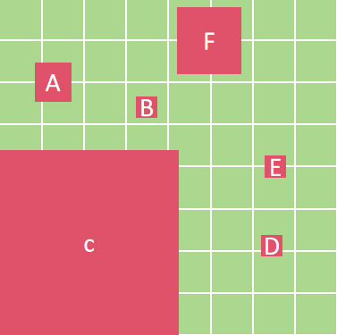

世界分区在划分时，会从最低的网格级别开始，将物体划分到刚好能囊括其面积的单元格之中

因此上述物体分布的最终划分情况如下：


在此处可以对分区相关的参数进行设置：

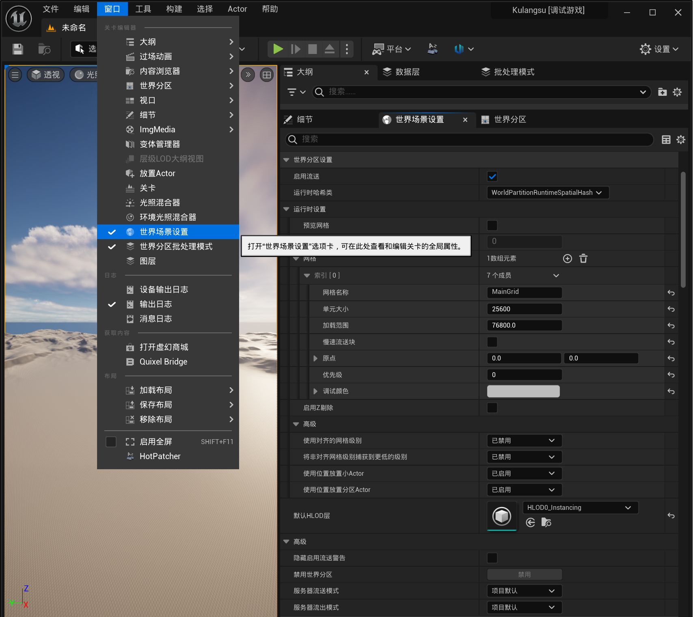

勾选 **预览网格** 能在编辑器视图下，看到场景的流送视图：

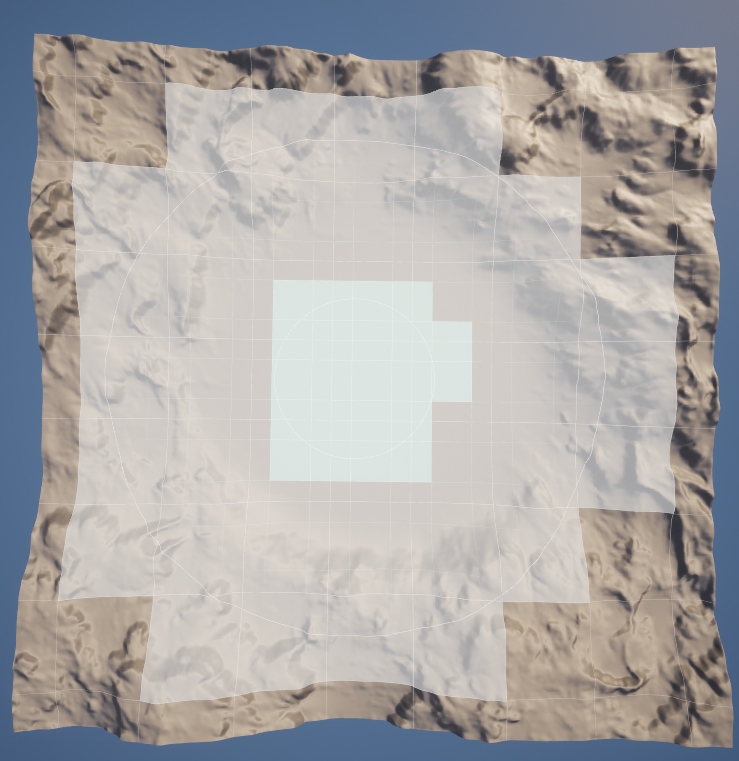

### 流送

场景中新建的Actor默认都会参与流送，也就是会被卸载，在Actor的细节面板上可以做相关调整：

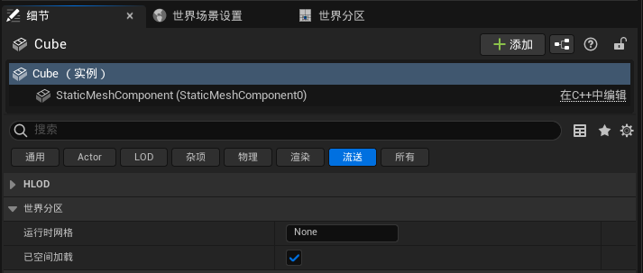

- **运行时网格** ：该Actor归属于哪个世界分区网格，如果为None会被指定到 **MainGrid** 中。
- **已空间加载** ：勾选后该Actor会参与世界分区的流送，取消勾选会让该Actor在场景中永远被加载，不参加流送。

世界分区的流送由 **流送源（Streaming Source）** 来触发。

流送源对应的C++接口为： **IWorldPartitionStreamingSourceProvider**


**玩家控制器（PlayerController）** 是一个默认的流送源:


假如此时人物位于地图的右下角，结合上面的划分情况，整体加载情况可能是这样的：


我们也可以通过 **世界分区流送源组件（WorldPartitionStreamingSourceComponent）** 来让其他actor也能作为流送源：


#### 调试视图

官方提供了一些指令可以预览流送的过程：

- `wp.Runtime.ToggleDrawRuntimeHash2D`

  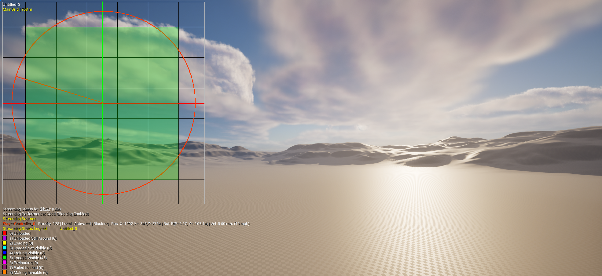

- `wp.Runtime.ToggleDrawRuntimeHash3D`

- 在开启预览视图后：

  - 使用指令 `wp.Runtime.ShowRuntimeSpatialHashGridLevel ${LevelIndex}`来调整预览的层级。

  - 使用指令 `wp.Runtime.ToggleDrawRuntimeCellsDetails` 可以看到单元格加载的耗时：

    

  - 使用指令 `wp.Runtime.ShowRuntimeSpatialHashCellStreamingPriority 1`查看单元格流送的优先级热图

    

#### 关键配置

##### 联机

在多人联机时，服务器默认不会启用流送，场景流送只是玩家的本地行为：


使用指令`wp.Runtime.EnableServerStreaming 1`可以开启服务器上的流送


##### 流送优化

世界分区默认是开启流送优化的，并非没一帧都会更新流送的状态，通过以下配置我们可以调整优化的策略：

- `wp.Runtime.UpdateStreaming.EnableOptimization true`：默认为true，开启流送优化
- `wp.Runtime.UpdateStreaming.ForceUpdateFrameCount 0`：默认为0，可以设置固定每多少帧去更新流送状态
- `wp.Runtime.UpdateStreaming.LocationQuantization 400`：默认为400，当移动距离大于400时触发流送状态的更新
- `wp.Runtime.UpdateStreaming.RotationQuantization 10`：默认为10，当旋转角度大于10时触发流送状态的更新

### 代码流程

对于开发者来说，深入了解世界分区的流程对整体项目的把控至关重要！美术人员可跳过。

这里挑出一些主要的步骤进行说明。

UE世界分区的核心结构为： **UWorldPartition**

它存放在 **AWorldSettings** 中，可以通过如下方法来获取到它：

``` c++
UWorldPartition* UWorld::GetWorldPartition() const
{
	AWorldSettings* WorldSettings = GetWorldSettings(/*bCheckStreamingPersistent*/false, /*bChecked*/false);
	return WorldSettings ? WorldSettings->GetWorldPartition() : nullptr;
}
```

Actor对世界分区的支持主要体现在，Actor基类中添加了一个 **编辑器下** 的虚函数，用于创建世界分区的Actor描述：

``` c++
class AActor: public UObject
#if WITH_EDITOR
	virtual TUniquePtr<class FWorldPartitionActorDesc> CreateClassActorDesc() const;
#endif
}
```

它可以由子类复写，来填充这样的结构：

``` c++
class FWorldPartitionActorDesc
{
	// Persistent
	FGuid							Guid;
	FTopLevelAssetPath				BaseClass;
	FTopLevelAssetPath				NativeClass;
	FName							ActorPackage;
	FSoftObjectPath					ActorPath;
	FName							ActorLabel;
	FVector							BoundsLocation;
	FVector							BoundsExtent;
	FName							RuntimeGrid;
	bool							bIsSpatiallyLoaded;
	bool							bActorIsEditorOnly;
	bool							bActorIsRuntimeOnly;
	bool							bActorIsHLODRelevant;
	bool							bIsUsingDataLayerAsset; // Used to know if DataLayers array represents DataLayers Asset paths or the FNames of the deprecated version of Data Layers
	FName							HLODLayer;
	TArray<FName>					DataLayers;
	TArray<FGuid>					References;
	TArray<FName>					Tags;
	FPropertyPairsMap				Properties;
	FName							FolderPath;
	FGuid							FolderGuid;
	FGuid							ParentActor; // Used to validate settings against parent (to warn on layer/placement compatibility issues)
	FGuid							ContentBundleGuid;
	
	// Transient
	mutable uint32					SoftRefCount;
	mutable uint32					HardRefCount;
	UClass*							ActorNativeClass;
	mutable TWeakObjectPtr<AActor>	ActorPtr;
	UActorDescContainer*			Container;
	TArray<FName>					DataLayerInstanceNames;
	bool							bIsForcedNonSpatiallyLoaded;
};
```

引擎之中有不少覆写：


在编辑器下，世界分区地图中新建Actor，会自动创建 **FWorldPartitionActorDesc** ：


在编辑器中，所有创建的ActorDesc存储在 **UWorldPartition** 的`ActorDescContainer`中：

``` c++
class UWorldPartition final 
    : public UObject
    , public FActorDescContainerCollection
    , public IWorldPartitionCookPackageGenerator
{

	UPROPERTY(Transient)
	TObjectPtr<UActorDescContainer> ActorDescContainer;		//存储ActorDesc的容器，也被称为**MainContainer**

	UPROPERTY()
	TObjectPtr<UWorldPartitionRuntimeHash> RuntimeHash;		//用于定制Actor的分区划分策略

	UPROPERTY(Transient)
	TObjectPtr<UWorld> World;
};
```

虽然`ActorDescContainer`是临时变量，不参与序列化，但会在打包时进行存储：

``` c++
bool UWorldPartition::GatherPackagesToCook(IWorldPartitionCookPackageContext& CookContext)
{
	TArray<FString> PackagesToCook;
	if (GenerateContainerStreaming(ActorDescContainer, &PackagesToCook))
	{
		FString PackageName = GetPackage()->GetName();
		for (const FString& PackageToCook : PackagesToCook)
		{
			CookContext.AddLevelStreamingPackageToGenerate(this, PackageName, PackageToCook);
		}
		return true;
	}
	return false;
}
```

#### 分区 

其中 **UWorldPartition** 的Actor分区划分策略由 `RuntimeHash` 实现，在编辑器下，`RuntimeHash`会在每次启动地图时都会重新进行划分，而在打包时，也会将划分的数据进行烘培：

``` c++
bool UWorldPartition::PrepareGeneratorPackageForCook(IWorldPartitionCookPackageContext& CookContext, TArray<UPackage*>& OutModifiedPackages)
{
	check(RuntimeHash);
	return RuntimeHash->PrepareGeneratorPackageForCook(OutModifiedPackages);
}

bool UWorldPartition::PopulateGeneratorPackageForCook(IWorldPartitionCookPackageContext& CookContext, const TArray<FWorldPartitionCookPackage*>& InPackagesToCook, TArray<UPackage*>& OutModifiedPackages)
{
	check(RuntimeHash);
	return RuntimeHash->PopulateGeneratorPackageForCook(InPackagesToCook, OutModifiedPackages);
}

bool UWorldPartition::PopulateGeneratedPackageForCook(IWorldPartitionCookPackageContext& CookContext, const FWorldPartitionCookPackage& InPackagesToCook, TArray<UPackage*>& OutModifiedPackages)
{
	check(RuntimeHash);
	return RuntimeHash->PopulateGeneratedPackageForCook(InPackagesToCook, OutModifiedPackages);
}

UWorldPartitionRuntimeCell* UWorldPartition::GetCellForPackage(const FWorldPartitionCookPackage& PackageToCook) const
{
	check(RuntimeHash);
	return RuntimeHash->GetCellForPackage(PackageToCook);
}
```

在编辑器下，启动开放世界地图时，会调用`UWorldPartition::OnBeginPlay`：

``` c++
void UWorldPartition::OnBeginPlay()
{
	TArray<FString> OutGeneratedStreamingPackageNames;
	GenerateStreaming((bIsPIE || IsRunningGame()) ? &OutGeneratedStreamingPackageNames : nullptr);

	// Prepare GeneratedStreamingPackages
	check(GeneratedStreamingPackageNames.IsEmpty());
	for (const FString& PackageName : OutGeneratedStreamingPackageNames)
	{
		// Set as memory package to avoid wasting time in UWorldPartition::IsValidPackageName (GenerateStreaming for PIE runs on the editor world)
		FString Package = FPaths::RemoveDuplicateSlashes(FPackageName::IsMemoryPackage(PackageName) ? PackageName : TEXT("/Memory/") + PackageName);
		GeneratedStreamingPackageNames.Add(Package);
	}

	RuntimeHash->OnBeginPlay();
}
```

其中`GenerateStreaming`函数会进一步调用到`UWorldPartition::GenerateContainerStreaming`，在该函数中，会从 **MainContainter** 中 **递归搜索出所有的Containter和ActorDesc**

有些ActorDesc会持有自己的Containter，就比如 **FLevelInstanceActorDesc** 就是一个特例，它是放置在场景中的关卡实例，其中主要的代码定义如下：

``` c++
class FLevelInstanceActorDesc : public FWorldPartitionActorDesc
{
public:
	FLevelInstanceActorDesc();
	virtual ~FLevelInstanceActorDesc() override;

	virtual bool IsContainerInstance() const override;
	virtual bool GetContainerInstance(const UActorDescContainer*& OutLevelContainer, 
                                      FTransform& OutLevelTransform, 
                                      EContainerClusterMode& OutClusterMode) const override;
protected:
	FTransform LevelInstanceTransform;
	ELevelInstanceRuntimeBehavior DesiredRuntimeBehavior;
	TWeakObjectPtr<UActorDescContainer> LevelInstanceContainer;  //关卡实例的ActorDescContai
private:
	void RegisterContainerInstance(UWorld* InWorld);
	void UnregisterContainerInstance();
};
```

在搜集到所有的Containter和ActorDesc之后，将会调用：

``` c++
bool UWorldPartitionRuntimeSpatialHash::GenerateStreaming(UWorldPartitionStreamingPolicy* StreamingPolicy,
                                                          const IStreamingGenerationContext* StreamingGenerationContext,
                                                          TArray<FString>* OutPackagesToGenerate);
```

该函数主体流程是：

- 搜集场景中所有的网格配置（不只是WorldSetting中含有网格配置，一些Actor也会提供，比如 **ASpatialHashRuntimeGridInfo** ，它目前主要用于HLOD）

- 遍历所有的ActorDesc，依据ActorDesc中的 `运行时网格（RuntmeGrid）` 配置 来将其划分到对应 Grid 的 **FActorSetInstance** 中

- 对于每个Grid的 **FActorSetInstance** ，将会调用：

  ``` c++
  FSquare2DGridHelper GetPartitionedActors(const FBox& WorldBounds, 
                                           const FSpatialHashRuntimeGrid& Grid, 
                                           const TArray<const FActorSetInstance*>& ActorSetInstances)
  ```

  来将该Grid中的所有Actor划分到具体的 **单元（Cell）** 中

#### 流送

流送的逻辑主要位于：

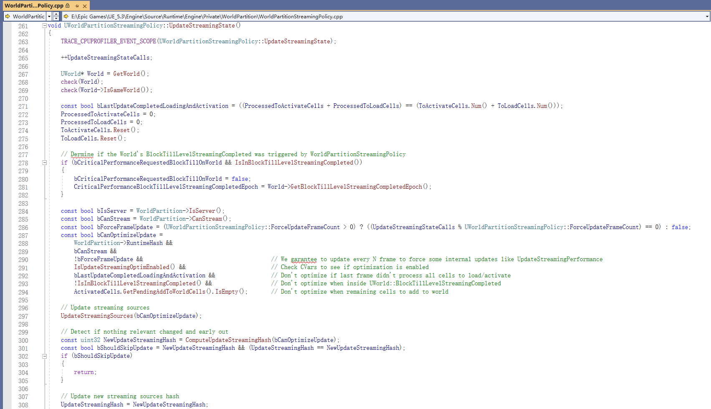

### 关键问题

世界分区（World Partition）可以让我们轻易实现无缝加载的大世界，但流送的特性也带来了很多限制和注意事项。

#### 跨边界

观察之前的物体划分和流送情况：


可以看到一些 “奇怪” 的现象，

- 由于 物体`E` 的包围盒位于世界分区的轴线上，结果被划分到了Level3，这将导致它会永远被加载，但是它的包围盒区域明明非常小。

这个问题非常容易出现：


##### 解决方案

引擎提供了一些指令有助于缓解该现象：

- `wp.Runtime.RuntimeSpatialHashUseAlignedGridLevels`：是否开启网格级别的向上对齐
- `wp.Runtime.RuntimeSpatialHashSnapNonAlignedGridLevelsToLowerLevels`：将未对齐的物体划分到更低的网格级别
- `wp.Runtime.RuntimeSpatialHashPlaceSmallActorsUsingLocation `：包围盒小于单元格尺寸的物体将直接使用Location进行划分。
- `wp.Runtime.RuntimeSpatialHashPlacePartitionActorsUsingLocation`：包围盒小于单元格尺寸的分区物体（植被，水体和地形）将直接使用Location进行划分。

此处有关于它的描述：

- [Tech Note: World Partition Spatially Loaded Actors are Always Loaded  - Epic Developer Community Forums ](https://forums.unrealengine.com/t/tech-note-world-partition-spatially-loaded-actors-are-always-loaded/661466)

但这并不是一个很好的解决方案，为了能规避这些问题，UE允许开发团队根据自己的场景需求定制 **RuntimeHashClass** ，在此处进行替换：


> 可参考：`Engine\Source\Runtime\Engine\Private\WorldPartition\RuntimeSpatialHash\RuntimeSpatialHashGridHelper.cpp`

在UE5.3中，官方把上述配置公开到了编辑器中，并允许调整世界分区的坐标原点，它能满足绝大部分的需求：

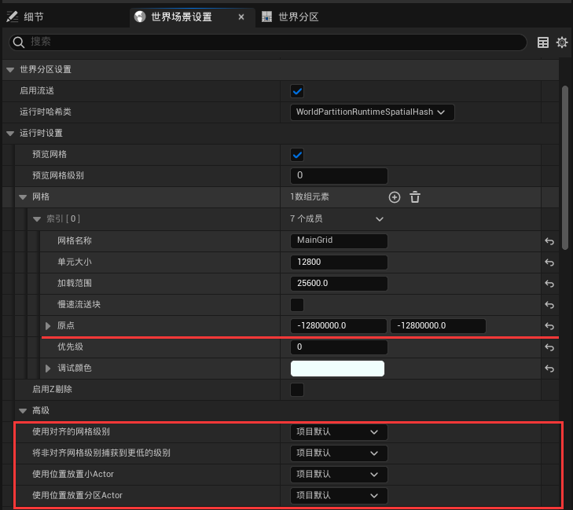

#### 加载优先级

因为世界分区流送的缘故，将导致场景中的一些运动物体出现异常，重力是其中最常见的：


上图中，存在的问题是：

- 部分立方体被划分到其中一个单元格中，由于划分算法的局限性，地面被划分到了另一个单元格中，由于地面所在的单元格不在加载范围之内，这将导致物体直接掉落到地底

还有其他情况也会触发这个问题：

- 世界分区的流送是 **逐单元（Cell）** 进行的，而 **不是逐Actor** ，当一个单元位于流送源的加载范围之内，会 **异步** 地 **加载（Loading** ） 该单元的所有Actor，这个加载顺序是无法保证的，如果先加载了立方体，再加载地面，这期间如果执行了物理Tick，物体也会掉到地面。（这在场景压力比较大时更容易出现）

##### 解决方案

解决这个问题的主要思路是：

- 让 重力承载物体 所在的世界分区网格具有更大的加载范围。
- 把 重力物体  移到比 重力承载物体  加载优先级更低的世界分区网格中。

#### 数据持久性

参与世界分区的Actor并不具有数据持久性，当我们对一个加载之后的物体进行了修改，卸载时，修改的数据并不会保存。

比如这个例子：


世界分区中有一群浮空的立方体，加载之后，因为重力，它会掉向地面，卸载之后再加载，可以发现立方体已经正确的保存了之前的状态，落在地面上，但当我们开启控制台指令 `gc.ForceCollectGarbageEveryFrame 1`，再来看：


这时重新加载立方体，立方体会回到起始位置。

第一个示例让我们产生 物体修改能被保存 的错觉，是因为超出加载范围的单元格不会立即被释放，而是处于 `Unloaded Still Around` 状态，这样能保证下次加载的时候可以立即复用，真正卸载单元格的时机是在下次GC。


##### 解决方案

这个问题是由流送的特性导致：

- 流入时会加载资产到内存，流出时会将资产卸载（销毁资源），而不会保存资产的修改。

那是否意味着我们需要在流出时保存资产的修改？

- 很明显，不需要，除非你想进行永久性的修改，即重新打开游戏之后，之前的修改还在，且无法还原。

通常情况下，这种修改只会维持在一定作用域（生命周期）之内，比如重进游戏，重进关卡，重开存档之后，这种修改就应该丢失。

只不过现在我们想要的是，流送不会导致数据的丢失。

那其实只需要：

- 让这部分数据不要参与流送，即数据存储在一个合理的作用域，而不是存到Actor中。

UE5.3中提供了一个实验性插件 **LevelStreamingPersistence** 可以帮助开发者解决该问题。


其核心结构如下：

``` c++
class ULevelStreamingPersistenceManager : public UWorldSubsystem
{
	GENERATED_BODY()

	// Serialization
	bool SerializeTo(TArray<uint8>& OutPayload);
	bool InitializeFrom(const TArray<uint8>& InPayload);

	// Sets property value and creates the entry if necessary, returns true on success.
	template <typename ClassType, typename PropertyType>
	bool SetPropertyValue(const FString& InObjectPathName, const FName InPropertyName, const PropertyType& InPropertyValue);

	// Sets the property value on existing entries, returns true on success.
	template <typename PropertyType>
	bool TrySetPropertyValue(const FString& InObjectPathName, const FName InPropertyName, const PropertyType& InPropertyValue);

	// Gets the property value if found, returns true on success.
	template<typename PropertyType>
	bool GetPropertyValue(const FString& InObjectPathName, const FName InPropertyName, PropertyType& OutPropertyValue) const;

	// Sets the property value converted from the provided string value on existing entries, returns true on success.
	bool TrySetPropertyValueFromString(const FString& InObjectPathName, const FName InPropertyName, const FString& InPropertyValue);

	// Gets the property value and converts it to a string if found, returns true on success.
	bool GetPropertyValueAsString(const FString& InObjectPathName, const FName InPropertyName, FString& OutPropertyValue);
};
```

####  运行时生成

世界分区划分是在编辑器中进行的，运行时生成（Spawn）的任何物体都不会参与世界分区的流送，试想一个这样的情景：

- 你在场景中Spawn了一个具有重力的小球，它落到了地面，当角色远离该区域导致地面被流出时，小球将会掉到地底。

这显然不是我们想要的，一般情况下，场景中除角色之外的所有常驻物体都应该在一开始就放置在地图关卡中。

但有时候确实存在一些特殊的需求：

- 一些场景物体可能存在一些运行时的事件依赖，因此必须放在运行时去 生成（Spawn）。

##### 解决方案

- 如果物体的位置是固定不变的，可以提前在场景中放置一个用于占位的Actor，这样可以使得它在Runtime时是可配置的。
- 如果物体位于一定区域，可以在该区域放置一个 **触发器体积（Trigger Volume）** ，通过触发器逻辑来控制物体的生命周期，如果触发区域的大小超过世界分区的加载范围，那么应该将触发器体积放置在一个加载优先级更高的网格中，并添加流送源组件。

#### 人物传送

在世界分区中进行人物传送（传送）时，由于流送需要一定时间，如果将人物直接转移到目标位置，很可能因为周边物体还没有加载完成，角色因为重力直接掉到地底。

##### 解决方案

针对这个问题，我们需要在目标区域进行预加载，并等待加载完成。

- 方案一：关闭角色Tick，将角色传送到目标点，以角色自身作为流送源触发周边区域的流送， **轮询（FTSTicker）** 到目标区域加载完成时开启Tick，在黑客帝国的Mass框架下也有相应的参考：

  

- 方案二：在目标位置Spawn一个带流送源组件的Actor，开启流送，轮询加载是否完成，完成后再将角色传送过去：

  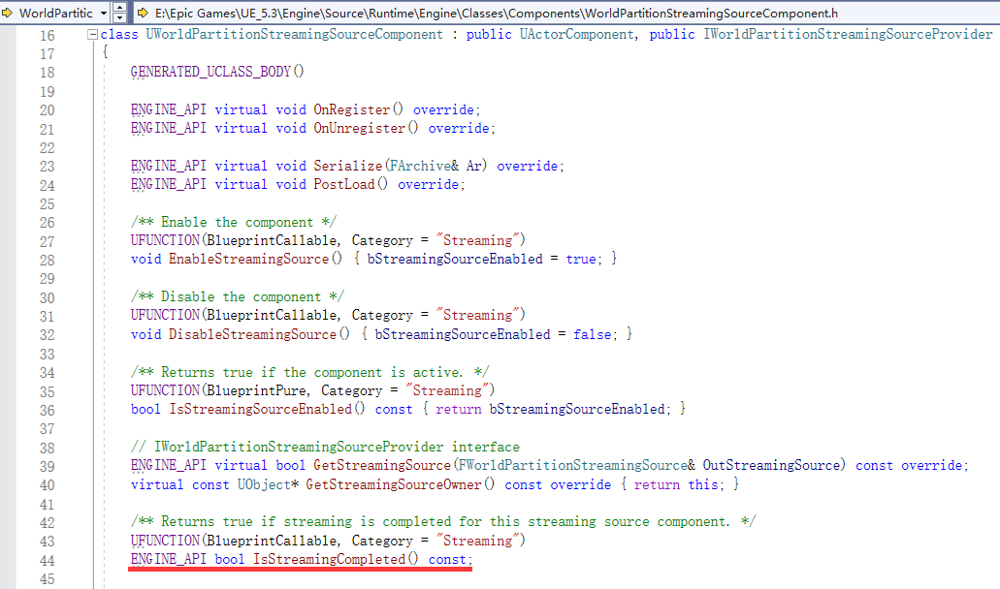

### One File Per Actor

OFPA 允许团队成员可以共同编辑同一地图的不同Actor

传统地图会将 所有Actor 存储在 World 对应的资产包中，而UE的开放世界地图默认启用了 [ **一Actor一文件（One File Per Actor，简称OFPA）** ](https://docs.unrealengine.com/5.3/zh-CN/one-file-per-actor-in-unreal-engine/)，即每个Actor都对应一个文件。

这些文件存储在项目Content目录下，`__ExternalActors__`和`__ExternalObjects__`文件夹中的对应地图路径下，下图表示了名为`OpenWorld`的地图中的所有Actor：


我们可以在场景大纲中获取Actor的真实文件路径：


通常情况下，所有Actor都存储在`__ExternalActors__`中，而`__ExternalObjects__`存储的是一些UObject（非Actor）对象，比如各类Setting，大纲分组等。

### HLOD

通过世界分区的流送，我们可以将全场景的性能压力缩减到只需关注流送源的周边区域：


对于游戏逻辑而言，这种流送固然是一种优化，但对场景来说，我们并不希望因为流送而卸载掉远处的场景，而HLOD正是为了解决这个问题。

**HLOD用于在世界分区中显示远景** ，在开放世界地图中，它的使用方式不同于普通地图（UE4）的HLOD：

- [虚幻引擎中的世界分区 - 分层细节级别 | 虚幻引擎5.3文档 (unrealengine.com)](https://docs.unrealengine.com/5.3/zh-CN/world-partition---hierarchical-level-of-detail-in-unreal-engine/)

官方文档中也缺乏HLOD相应的细节描述，对于不了解它定位的小伙伴，很容易滥用HLOD，在世界分区中使用HLOD的本意是：

- 将  **单元格（Cell）** 中 **所有Actor** 合并为一个低精度的 单元格模型代理，当单元格超出流送源的加载范围时，可以使用该简模显示，这样做，在显示远景的同时，即减少了渲染消耗（使用低精度模型和材质），又优化了遮挡剔除的计算量（减少了Actor的数量）

  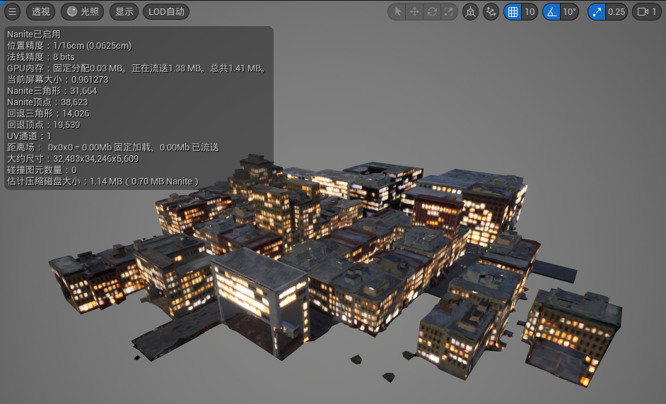

  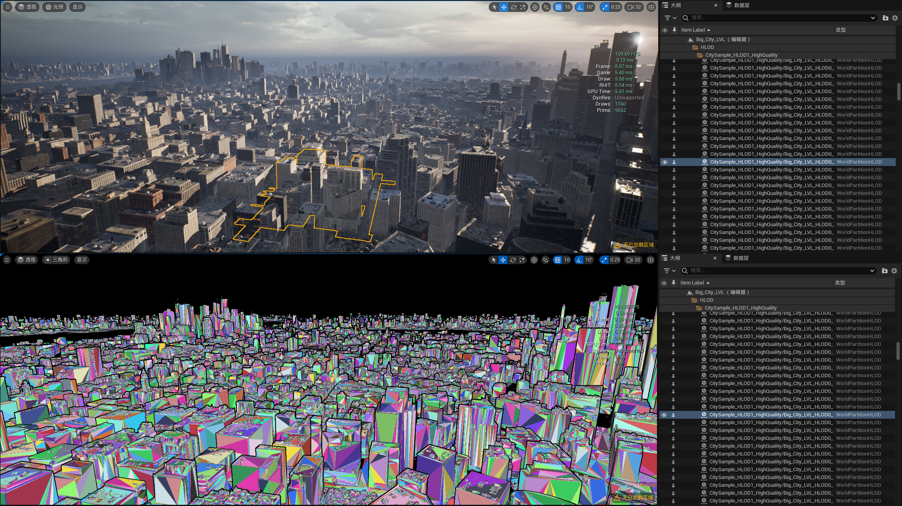

我们可以在此处设置整个地图的 默认（缺省）HLOD层 配置，它会对所有Actor生效：


它的资产配置面板如下：

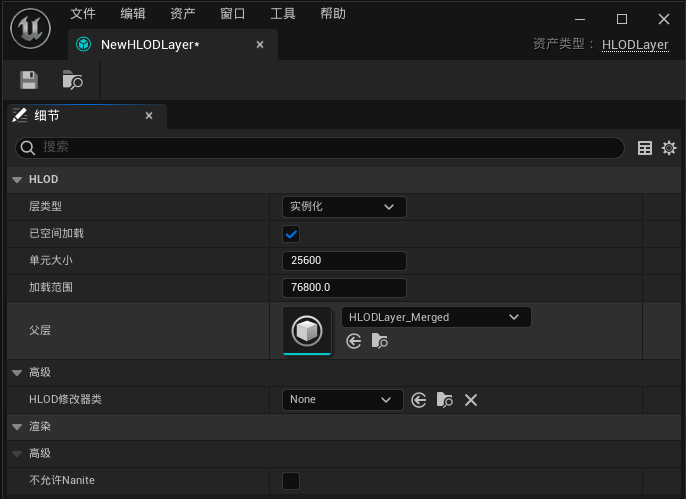

- **层类型：** 使用何种策略来生成HLOD
    - **实例化** ：使用对应模型最低级别的LOD（如果是Nanite模型则会使用该LOD生成新的Nanite数据）。
    - **合并** ：将分区内的静态网格体合并到一起。
    - **简化** ：对分区内的网格体进行合并，在合并网格体的基础上执行网格体简化，它更适合几何形状比较复杂的物体，比如枝繁叶茂的树木。
    - **近似** ：对分区内的网格体进行合并，在合并网格体的基础上执行网格体近似，它更适合几何形体比较圆润的物体，比如建筑，石头。
    - **自定义** ：自定义HLOD生成策略。

- **已空间加载：** 生成的HLOD是否需要开启流送，如果开启，那么会为该HLOD层创建一个 HLOD Grid，生成的HLODActor会放置在这个Grid中。
    - **单元大小：** 配置HLOD Grid的单元大小，数值最好是Main Grid单元大小的整数倍。
    - **加载范围：** 配置HLOD Grid的加载范围，数值最好是Main Grid单元大小的整数倍。
    - **父层：** 对生成的HLOD简模，使用父HLOD层再处理一遍，生成更精简的HLOD简模，通常它具有更大的加载范围。

注意事项：

- 黑客帝国的场景物体多是棱角分明的建筑，它统一使用了 定制的 近似网格 策略，当场景具有更复杂的物体种类时（比如树木，水体，植被），则需要定制更加细化的处理策略，深入了解HLOD相关代码流程和UE所提供的网格处理算法对开放世界项目的性能优化是非常有价值的。
- HLOD是将一个网格的单元合并为一个简模，但如果一块区域存在多个网格，那么该区域就会生成多个简模，且不同网格之间的模型不会合并，因此，在通常情况下，所有场景物体都应该该放在MainGrid中，只需要对MainGrid中的物体生成HLOD，对于小型物件，可以放到一个加载范围更小的网格中，不参与HLOD的生成。

### 数据层

数据层是 UE 5 为开放世界所提供的一项功能，它的用法类似于大纲文件夹：


但与文件夹不同的是，它还提供了两项关键功能：

- 可以在编辑器打开地图时，默认不加载该类别的Layer。
- 可以在运行时，通过相关接口来 加载和卸载 Layer

为什么需要使用数据层？

- 可以利用 数据层 将 场景物体 **根据 类别 分层** ， **根据 区域 分块** ，通过这样的分类可以 **缓解编辑器全场景加载的压力** ，在多人编辑时，各个人员可选择性地加载自己关注的区域，这在大型场景管理和多人协作中至关重要，如果它没有处理好，那将会是场景制作流程混乱的开端
- 编辑器下的分类能够 **给后续的场景优化提供有效的依据** 。
- 数据层是参与世界分区流送的 **子关卡** 。

在此处可以打开数据层面板：


右键创建 **该地图** 的 **数据层** ：

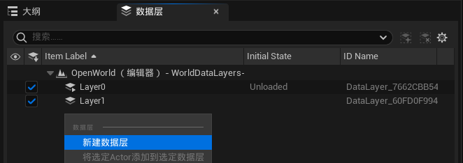

这样创建 **所有地图可公用** 的 **数据层资产**

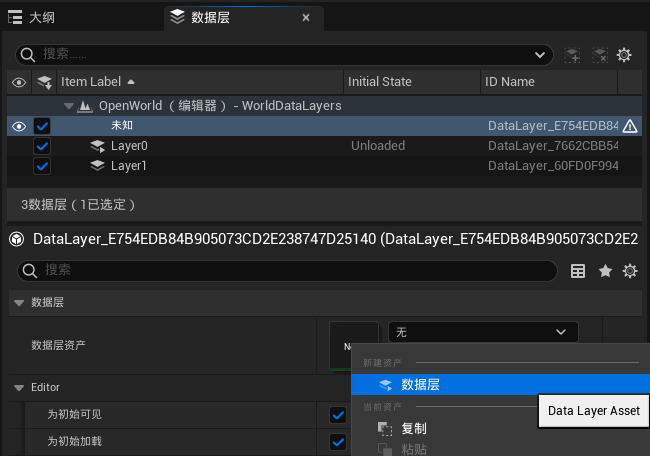

可以在此处手动设置Actor隶属于哪个Actor：


也可以这样：

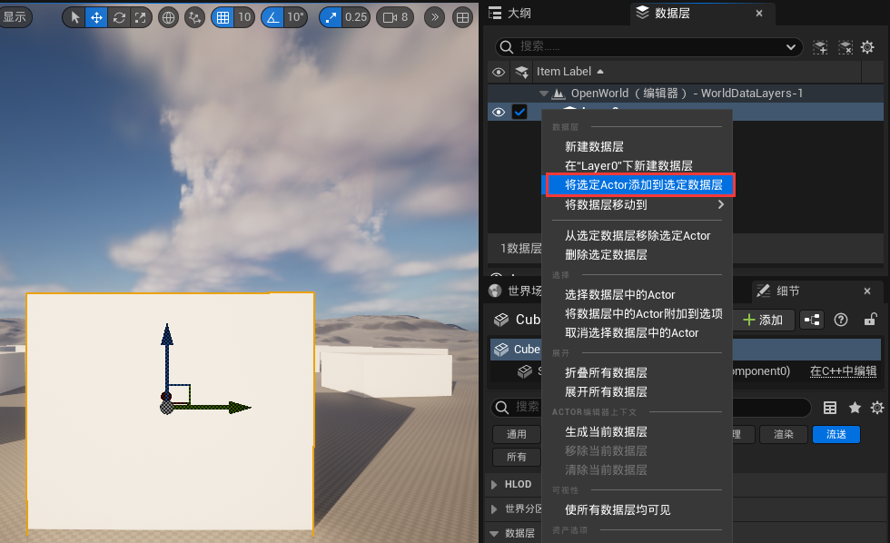

我们也可以设置数据层的 **当前上下文（Current Context）** ，新建的Actor会自动添加到当前数据层中：


按这样来移除或清理当前数据层：

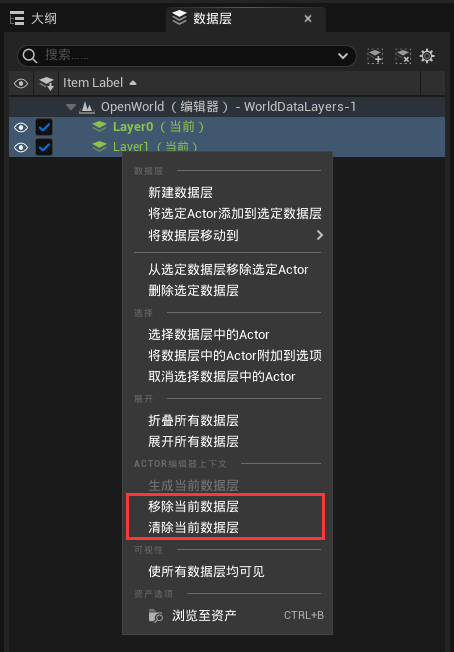

###  关卡实例

UE 5 中提供了 关卡实例化（Level Instancing）的功能，旨在改善和简化世界分区的编辑体验。

- [虚幻引擎中的关卡实例化 | 虚幻引擎5.3文档 (unrealengine.com)](https://docs.unrealengine.com/5.3/zh-CN/level-instancing-in-unreal-engine/)

关卡实例的本意是将一组Actor编组，这样就可以在整个世界内放置和复用的关卡实例，但由于它可以在打包时嵌入到主关卡的世界分区中，再加上目前UE5数据层的使用还未得到普及，很多习惯UE4的开发团队会喜欢将它作为 **开放世界地图的子关卡** 来使用。

在5.3中也解决了之前无法为关卡实例中的Actor设置 **运行时网格** 的问题：


对于关卡实例中的Actor，也多了一个`仅在主世界`的选项，勾选之后，该Actor只有在打开关卡实例地图时才会被加载，当作为关卡实例被其他地图加载时，不会加载此Actor：


## 场景制作

这里有一篇文章罗列了许多内容：

- [【UE5】目录、资产命名规范 - 知乎 (zhihu.com)](https://zhuanlan.zhihu.com/p/484119115)

这里有一些建议：

- UE只是引擎技术的供应商，它提供了许多优秀的技术能力和通用编辑器，但并不存在一套标准的场景制作解决方案，这是需要研发团队耗费大量的试错成本去做技术的积累和选型。

- 开放世界项目需要配备专业的引擎团队，以及更专业的制作人员（地编，策划，Gameplay...），在设计时充分考虑到世界分区的特性，甚至 **需要一名专业人员来监管世界分区的流送配置** 。

- 需要明白人的力量是有限的，因此在制作资产时尽可能采用程序化，在管控流程上尽可能使用自动化，寻找到合适的量化指标，来让制作流程变得可追溯，可迭代：
    - Houdini和UE5的PCG框架：
        - [[UE5 PCG] 官方公开课：深入研究Electric Dreams环境项目](https://link.zhihu.com/?target=https%3A//www.bilibili.com/video/BV1y8411U7Hs)
        - [Electric Dreams PCG技术详解（一）——术语、工具和图表介绍](https://link.zhihu.com/?target=https%3A//mp.weixin.qq.com/s/mGWiPKvWU_NHTktIWA6LnA)
        - [Electric Dreams PCG技术详解（二）——沟壑、大型Assembly](https://link.zhihu.com/?target=https%3A//mp.weixin.qq.com/s/xHdnrFTkywF_7OjqOuALbw)
        - [Electric Dreams PCG技术详解（三）——森林、岩石和场景背景](https://link.zhihu.com/?target=https%3A//mp.weixin.qq.com/s/YWcd8l-VphNLrOlg3zkSzA)
        - [Electric Dreams PCG技术详解（四）——远景、雾气、自定义节点及子图表](https://link.zhihu.com/?target=https%3A//mp.weixin.qq.com/s/CWTUcRIBTXw8WvhX3jrcBw)
    - [虚幻引擎自动化系统 | 虚幻引擎5.3文档 (unrealengine.com)](https://docs.unrealengine.com/5.3/zh-CN/automation-system-in-unreal-engine/)
    - [程序化生成和深度学习 | EA工作室](https://www.bilibili.com/video/BV1yh411M7pA)  
    
- 开放世界场景的性能优化不同于单个资产的优化，因为本身存在着大量需要维护的资产，很难靠人力进行维护，所以应该尽可能从宏观上寻求一些统一的管理策略，并舍弃一些小的优化要求来换取更大的性能平衡，做好 **场景资产的分类和隔离** 是非常非常非常重要的，它是性能优化的重要依据，研发团队可以根据不同的分类来制定相应的LOD Group，Texture Group和HLOD生成策略。此外，对于一些确实需要进行特化处理的资产，也应该保留特化的依据（白名单）。

- 场景制作流程不会混乱的前提是每个参与者都严格遵守场景的制作规范，因此需要研发团队建立公共的文档仓库用于公布和迭代场景规范， 尽可能依靠工具而非人工进行校验，这样可以很大程度地减少人为介入产生错误的概率，如果非要增加相关人员的手动工作量，也需要尽可能地评估出最精简的数据和流程。

- 开放世界的场景规范极度依赖于游戏的玩法设计，只有在明确核心角色玩法之后，开发团队才能制定与之对应的 **场景规范** ，确立 **性能优化指标** ，并制作相应的 **工具链** 。以王国之泪为例：

    - 根据角色的精力（游泳，攀爬，滑翔）机制，去定制地形高度，坡度和水体的规范。
    - 根据通天术的技能要求，去定制地形规范。
    - 根据究极手，余料建造，倒转乾坤这些技能的特性，去制作符合其要求的可交互物件。
    - 武器（单手剑，双手剑，长枪，盾牌，箭）可以进行余料建造，在对应的插槽上进行特性绑定，来制定余料物品的规范。
    - 已知角色的状态类别，可以去制作不同的场景效果，比如雷击，着火，寒冷，炎热，并为之提供相应的解决方案（服装 or 料理）。
    - 在没有与核心玩法设计规范出现冲突的前提下， 制作左纳乌科技的玩法。

    针对这些规范，引擎开发人员可以进行类似如下的开发工作：

    - 定制`地形可攀爬高度`，`水体可穿越区域`，`通天术可使用区域` 的调试视图（如果UE支持不改源码，能以插件的形式扩展调试视图就很舒服）。
    - 验证各种特效，场景效果的性能指数，调校效果与性能的平衡，并制作相应的管理和验收工具。

- 关于编辑器工具，这里有一些小建议：
    - 尽可能去追溯问题产生的起源，在源头解决问题的成本是最低的，比如说 **资产创建时（AssetCreated）** ， **资产保存时（AssetSaved）** ， **Actor创建时（NewActorsPlaced）** ...
    - 使用可忽略的 **通知（Notification）** ，而不是使用 **对话框（Dialog）** 强制阻塞用户输入。
    - 提供友好的用户体验，支持撤销，重做，批处理，自定义。

## 玩法设计

关于开放世界的关卡设计，这里有一些文档：

- [制作一个开放世界的游戏有哪些挑战？- 天美工作室 / 江岸栖](https://www.zhihu.com/question/336988349/answer/2174068590)
- [从零开始，做一款开放世界 - 游戏葡萄 / wenlon](https://link.zhihu.com/?target=https%3A//mp.weixin.qq.com/s%3F__biz%3DMjM5OTc2ODUxMw%3D%3D%26mid%3D2649897301%26idx%3D1%26sn%3D87e94966851b1d3a3e7abad542be6689)
- [游戏开发杂谈-开放世界 - 知乎 / Italink](https://zhuanlan.zhihu.com/p/648572742)
- [元宇宙杂谈 - 知乎 ](https://zhuanlan.zhihu.com/p/663939427)

开放世界的 **底层玩法设计** 非常重要，它应该是 **完备的，充满取巧** 的，为了达成某一效果而强塞不合理的模块只会给后续的开发工作造成 **毁灭性** 的打击。

- 在明确各种预算（时间，精力，金钱，算力）的上限后，制定好 **资源的调度分配** ， **取舍是必然的** 。
- 如果底层玩法设计不严谨，会让整个 **制作流程变得混乱甚至失控** ，随着玩法的堆叠，开放场景的 **制作难度会以指数级提升** ，如果不采用一些 **取巧** 的设计来让玩法内容收敛，将导致 **制作成本很容易飙升** 。

举两个例子：

- 塞尔达中通过底层的系统化玩法架起整个游戏的玩法体系，套用各种模板来完成各种玩法的扩充，开发者保证了 模板和系统化设计 在可管控的范围之内，艺术家和游戏创作者在这个 **限定范围之内** 去做游戏内容的衍生，才使得项目的复杂度不会随着体量变大而急剧上升。

- 黑神话中，悟空可以通过 72变 可以变成各种精英怪，这一玩法设计使得研发团队可以将更多的制作成本投入到精英怪的设计当中。

