# 音频开发

长久以来，渲染一直是图形引擎的热点，而音频似乎很难吸引开发者的注意力，但实际上，音频除了可以增加沉浸式的交互体验，还能进一步增加画面的表现力：

<p style="text-align:center"><iframe width="560" height="315" src="//player.bilibili.com/player.html?aid=797879954&bvid=BV1iy4y167pf&cid=259593464&p=1&autoplay=false" scrolling="no" border="0" frameborder="0" framespacing="0" allowfullscreen="true"></iframe></p>

笔者也正是因此，点燃了对程序开发的热情，为了让音频能有更好的图形表现效果，这才入了图形引擎的坑~

本篇文章会从基础的音频知识开始讲解，并介绍UE5中常用的音频接口，以及一些常见的 **数字信号处理（Digital Signal Process）** 算法，并且最后 —— 拥抱 **Meta Sound** 。

> 笔者并非专业的音频开发人员，如有纰漏，烦请赐教~

## 认识音频

### 什么是音频？

众所周知，声音是由震动产生的，就像是这样：

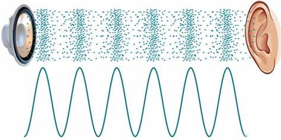

> 图片源自：[How Does Sound Travel From One Medium To Another? (scienceabc.com)](https://www.scienceabc.com/pure-sciences/movement-of-sound-waves-through-different-media.html)

这里有两个视频很好地讲解了声音的本质：

- [What is Sound-The Dr. Binocs Show](https://www.bilibili.com/video/BV16C4y187Xy)

- [What is Sound-BranchEducation](https://www.bilibili.com/video/BV1pR4y1L7WD)

我们通常会将声音视作一个连续的波形，就像是这样：

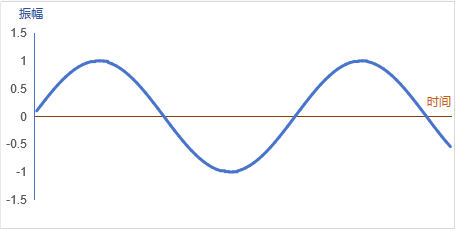

计算机的存储精度是有限的（0到1之间有无限个小数），如果我们想要把声音数据存储到计算机中，将会面临两个维度的精度处理问题：

- 时间
- 振幅

这会使用到 [脉冲编码调制技术（Pulse Code Modulation，简称PCM）](https://baike.baidu.com/item/脉冲编码调制/5143788?fromModule=lemma_inlink) 来将声音的 **连续信号（Continuous Signal）** 转换为 **离散信号（Discrete Signal）**

首先，我们会通过 **采样（Sampling）** 处理时间维度上的精度分割：

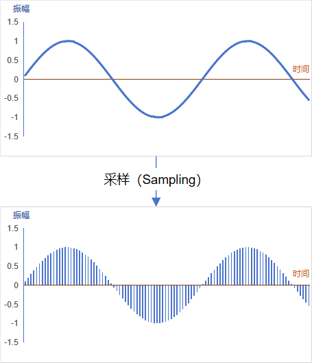

时间维度的采样精度参数是 **采样率（Sample Rate）** ，它代表单位时间（1s）内对声音信号的采样次数 ，常见的采样率有`44100 Hz`，`48000Hz`...

得到采样的数据后，会进一步通过 **量化（Quantize）** 处理振幅维度上的精度分割：

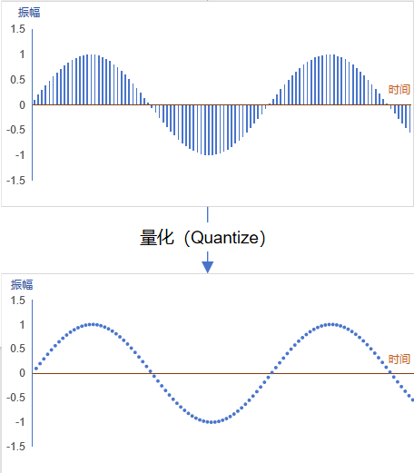

振幅维度的采样精度是 **位深（Bits Per Sample）** ，它代表一个音频样本的bit存储精度，常见的位深有`8 bit`，`16 bit`，`24 bit`，`32 bit`，以 `8 bit`为例，它等价于`1字节`，能表示的数有`256(2^8)`个，算上符号位，它的数值表示范围是`[-128,127]`，可以视为它具有128个振幅梯度。

关于采样和量化，这里有一篇优秀的文章：

- [音视频开发基础入门｜声音的采集与量化、音频数字信号质量、音频码率 - 知乎 (zhihu.com)](https://zhuanlan.zhihu.com/p/577850804)

最终我们得到的数据一般称之为 **波形表/图（Wave Table）** ，如果不考虑位深的存储精度，使用浮点表示振幅，在C++中，我们可以表示为这样的存储结构：

``` c++
std::vector<float> WaveTable = {
    sample0,sample1,sample2,sample3,sample4...
}
```

打开电脑的声音设置，我们可以发现每个音频设备（输入或输出），都具有相关的配置：

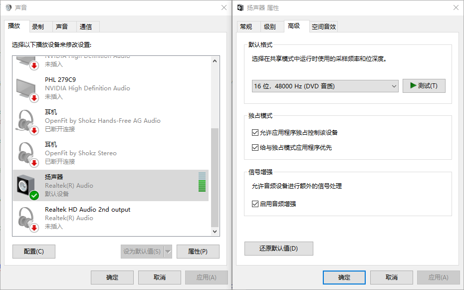

在现实世界中， **音源（Sound Source）** 会向四周迸发出大量的运动粒子，一部分粒子会直接进入到人耳，还有一部分粒子会与周边物体发生一次或多次碰撞再进入到人耳中，在这种复杂的周边环境下，通常会导致人的两只耳朵会接受到不同的音频数据，这也为音频营造出了所谓的 **空间感** 。

因此，为了在音频存储到计算机时保留这种空间感，我们会存储多份音频数据，这个份数，我们通常称为 **通道数（Number Of Channels）** ，只有一个通道的音频我们称为 **单声道（Mono）** ，具有`2个通道`的音频我们称为 **立体声（Stereo）** 。

多个通道的音频样本是交叉组合在一起的，每一个组合，我们称之为 **音频块（Block）**

对于立体声，它的存储结构如下：

``` c++
std::vector<float> WaveTable = {
    channel0_sample0, channel1_sample0,    	// Block 0
    channel0_sample1, channel1_sample1,		// Block 1
    channel0_sample2, channel1_sample2,		// Block 2
    channel0_sample3, channel1_sample3,		// Block 3
    channel0_sample4, channel1_sample4,		// Block 4
    ...
}
```

四声道同理：

``` c++
std::vector<float> WaveTable = {
    channel0_sample0, channel1_sample0, channel2_sample0, channel3_sample0,		// Block 0
    channel0_sample1, channel1_sample1, channel2_sample1, channel3_sample1,		// Block 1
    channel0_sample2, channel1_sample2, channel2_sample2, channel3_sample2,		// Block 2
    channel0_sample3, channel1_sample3, channel2_sample3, channel3_sample3,		// Block 3
    channel0_sample4, channel1_sample4, channel2_sample4, channel3_sample4,		// Block 4
    ...
}
```

通常情况下， Wave Table 是不可以直接被音频设备播放的，因为它是一堆波形数据，而不包括音频的格式信息，即采样率，位深，通道数...

想要它能被播放，我们还需要进一步将其编码为音频文件。

### WAVA

`*.WAV`是最常见的声音文件格式之一，它是Microsoft专为Windows开发的一种标准数字音频文件，它不同于`*.mp3`，`*.flac`，`*.aac` 等音频格式，它是一种无压缩的音频，仅仅是在WaveTable的数据之前，存储了音频的格式：


这里有一份完整的文档：

- [WAV文件格式解析及处理 - 简书 (jianshu.com)](https://www.jianshu.com/p/63d7aa88582b)

请仔细阅读上文，理解WAV格式中各个数据的意义。

之后，我们可以在C++中使用如下的内存对齐来描述WAV的文件头结构：

``` c++
struct WavFmtChunk {
	uint8_t chunkID[4] = { 'f','m','t',' ' };
	int32_t chunkSize;
	int16_t audioFormat;
	int16_t numChannels;
	int32_t sampleRate;
	int32_t byteRate;
	int16_t blockAlign;
	int16_t bitsPerSample;
};

struct WavDataChunkHeader {
	uint8_t chunkID[4] = { 'd','a','t','a' };
	int32_t chunkSize;
};

struct WavRiffChunk {
	uint8_t chunkID[4] = { 'R','I','F','F' };
	int32_t chunkSize;
	uint8_t format[4] = { 'W','A','V','E' };
	WavFmtChunk fmtChunk;
	WavDataChunkHeader dataChunkHeader;
};

typedef WavRiffChunk WavHeader;
```

在C++中存储一段数据，我们通常会使用`std::vector<uint8_t>` ，如果想要将一段波形数据写入到Wav文件中，就可以使用这样的函数：

``` c++
void writeWavFile(std::string filePath, int numChannels, int sampleRate, int bitsPerSample, std::vector<uint8_t> waveTable) {
	WavHeader header;
	header.fmtChunk.audioFormat = 0x0001;			// PCM格式对应的数值为0x0001
	header.fmtChunk.chunkSize = 16;					// PCM格式的音频格式占16字节，如果是其他格式，可能会>16，将导致总的文件头尺寸>44
	header.fmtChunk.numChannels = numChannels;
	header.fmtChunk.bitsPerSample = bitsPerSample;
	header.fmtChunk.sampleRate = sampleRate;
	header.fmtChunk.blockAlign = header.fmtChunk.numChannels * header.fmtChunk.bitsPerSample / 8;
	header.fmtChunk.byteRate = header.fmtChunk.sampleRate * header.fmtChunk.blockAlign;
	header.dataChunkHeader.chunkSize = waveTable.size();
	header.chunkSize = sizeof(header.format) + sizeof(header.fmtChunk) + sizeof(header.dataChunkHeader) + waveTable.size();
	std::ofstream out(filePath, std::ios::out | std::ios::binary);		//务必使用std::ios::binary，否则数据错乱
	assert(out.is_open() && "Can`t Write File");
	out.write(reinterpret_cast<char*>(&header), sizeof(WavHeader));
	out.write(reinterpret_cast<char*>(waveTable.data()), waveTable.size());
	out.close();
}

```

读取也非常简单：

``` c++
std::vector<uint8_t> readWavFile(std::string filePath) {
	WavHeader header;
	std::ifstream in(filePath, std::ios::in | std::ios::binary);				//务必使用std::ios::binary，否则数据错乱
	assert(in.is_open() && "Can`t Read File");
	in.read(reinterpret_cast<char*>(&header), sizeof(header));
	int waveTableSize = header.dataChunkHeader.chunkSize;						//获取到波形数据的大小
	std::vector<uint8_t> waveTable(waveTableSize);		
	in.read(reinterpret_cast<char*>(waveTable.data()), waveTableSize);
	return waveTable;
}
```

接下来我们来生成一段音频波形， **正弦波（Sine Wave）** 是基本的波形之一，它的函数式如下：
$$
y(Time) = Amplitude * sin(2 * PI * Frequency * Time + PhaseOffset) + Bias
$$
根据函数式，我们可以编写如下的函数：

```C++
const double M_PI = 3.1415926535;
std::vector<uint8_t> generateSineWave(int timeLengthSec,	// 正弦波的时长，单位为秒
                                            int frequency, 		// 正弦波的频率
                                            float amplitude,	// 正弦波的振幅
                                            int numChannels, 	// 音频的通道数
                                            int sampleRate, 	// 音频的采样率
                                            int bitsPerSample	// 音频的位深
                                           ) {
	int numBlocks = timeLengthSec * sampleRate;							// 音频块的数量
	amplitude = std::clamp(amplitude, 0.01f, 1.0f);						// 限制振幅的大小, std::clamp 需要C++17
	std::vector<uint8_t> waveTable;								
	waveTable.resize(numBlocks * numChannels * bitsPerSample / 8);		// 算出音频数据所需的内存大小
	int step = bitsPerSample / 8;
	for (int i = 0; i < numBlocks; i++) {
		float time = i / (float)numBlocks * timeLengthSec;		// 时间点
		float sampleValue = amplitude * std::sin(2 * M_PI * frequency * time);		//算出对应时间点的采样值
        // 我们得想个办法将sampleValue写入到waveTable里面
	}
	return waveTable;
}
```

上面的代码里面我们面临一个难题：

- 通过正弦波的函数，我们会得到一个类型为`float`的采样值，但位深可能是`8 bit`，`16 bit`，`24 bit`，`32 bit`，我们该怎么把float转换为对应位深的数据呢？

常见的做法借助已有的数据类型来进行对应数据位的赋值，就像是这样：

``` c++
const int PCMS16MaxAmplitude = 32767;	 // 16 bit的数值范围是[-32768,32767]，这里取最小绝对值（32767）避免越界

void write16BitSampleValue(uint8_t* dataPtr, float sampleValue) {
	(*reinterpret_cast<int16_t*>(dataPtr)) = sampleValue * PCMS16MaxAmplitude;
}
```

也可以利用位运算来进行填充：

``` c++
const int PCMS24MaxAmplitude = 8388607;
void write24BitSampleValue(uint8_t* dataPtr, float sampleValue) {
    int value = sampleValue * PCMS24MaxAmplitude;
    dataPtr[0] = value & 0xFF;
    dataPtr[1] = (value >> 8) & 0xFF;
    dataPtr[2] = (value >> 16) & 0xFF;
}
```

综上，我们可以整理出一个这样的转换函数表：

``` c++
const int PCMS8MaxAmplitude = 127;
const int PCMS16MaxAmplitude = 32767;
const int PCMS24MaxAmplitude = 8388607;
const int PCMS32MaxAmplitude = 2147483647;

typedef std::function<void(uint8_t*, float)> SampleValueWriteFunction;
static std::map<uint8_t, SampleValueWriteFunction> SampleValueWriteFunctions = {
	{8,[](uint8_t* dataPtr, float sampleValue) {
         // 笔者不清楚为什么这里需要加上一个偏差波形才是正确的=.=
		(*reinterpret_cast<int8_t*>(dataPtr)) = sampleValue * PCMS8MaxAmplitude + PCMS8MaxAmplitude;  
	}},
	{16,[](uint8_t* dataPtr, float sampleValue) {
		(*reinterpret_cast<int16_t*>(dataPtr)) = sampleValue * PCMS16MaxAmplitude;
	}},
	{24,[](uint8_t* dataPtr, float sampleValue) {
		int value = sampleValue * PCMS24MaxAmplitude;
		dataPtr[0] = value & 0xFF;
		dataPtr[1] = (value >> 8) & 0xFF;
		dataPtr[2] = (value >> 16) & 0xFF;
	}},
	{32,[](uint8_t* dataPtr, float sampleValue) {
		(*reinterpret_cast<int32_t*>(dataPtr)) = sampleValue * PCMS32MaxAmplitude;
	}}
};

typedef std::function<float(uint8_t*)> SampleValueReadFunction;
static std::map<uint8_t, SampleValueReadFunction> SampleValueReadFunctions = {
	{8,[](uint8_t* dataPtr) {
		return ((*reinterpret_cast<int8_t*>(dataPtr)) - PCMS8MaxAmplitude) / float(PCMS8MaxAmplitude);
	}},
	{16,[](uint8_t* dataPtr) {
		return (*reinterpret_cast<int16_t*>(dataPtr)) / float(PCMS16MaxAmplitude);
	}},
	{24,[](uint8_t* dataPtr) {
		int value = dataPtr[2];
		value <<= 8;
		value |= dataPtr[1];
		value <<= 8;
		value |= dataPtr[0];
		return value / float(PCMS24MaxAmplitude);
	}},
	{32,[](uint8_t* dataPtr) {
		return (*reinterpret_cast<int32_t*>(dataPtr)) / float(PCMS32MaxAmplitude);
	}}
};
```

综上，加上测试代码，完整的代码如下：

``` c++
#include <stdint.h>
#include <assert.h>
#include <map>
#include <vector>
#include <functional>
#include <string>
#include <fstream>
#include <algorithm>
#include <iostream>

struct WavFmtChunk {
	uint8_t chunkID[4] = { 'f','m','t',' ' };
	int32_t chunkSize;
	int16_t audioFormat;
	int16_t numChannels;
	int32_t sampleRate;
	int32_t byteRate;
	int16_t blockAlign;
	int16_t bitsPerSample;
};

struct WavDataChunkHeader {
	uint8_t chunkID[4] = { 'd','a','t','a' };
	int32_t chunkSize;
};

struct WavRiffChunk {
	uint8_t chunkID[4] = { 'R','I','F','F' };
	int32_t chunkSize;
	uint8_t format[4] = { 'W','A','V','E' };
	WavFmtChunk fmtChunk;
	WavDataChunkHeader dataChunkHeader;
};

typedef WavRiffChunk WavHeader;

const int PCMS8MaxAmplitude = 127;
const int PCMS16MaxAmplitude = 32767;
const int PCMS24MaxAmplitude = 8388607;
const int PCMS32MaxAmplitude = 2147483647;

typedef std::function<void(uint8_t*, float)> SampleValueWriteFunction;
static std::map<uint8_t, SampleValueWriteFunction> SampleValueWriteFunctions = {
	{8,[](uint8_t* dataPtr, float sampleValue) {
		(*reinterpret_cast<int8_t*>(dataPtr)) = sampleValue * PCMS8MaxAmplitude + PCMS8MaxAmplitude;   // 笔者不清楚为什么这里需要加上一个偏差波形才是正确的=.=
	}},
	{16,[](uint8_t* dataPtr, float sampleValue) {
		(*reinterpret_cast<int16_t*>(dataPtr)) = sampleValue * PCMS16MaxAmplitude;
	}},
	{24,[](uint8_t* dataPtr, float sampleValue) {
		int value = sampleValue * PCMS24MaxAmplitude;
		dataPtr[0] = value & 0xFF;
		dataPtr[1] = (value >> 8) & 0xFF;
		dataPtr[2] = (value >> 16) & 0xFF;
	}},
	{32,[](uint8_t* dataPtr, float sampleValue) {
		(*reinterpret_cast<int32_t*>(dataPtr)) = sampleValue * PCMS32MaxAmplitude;
	}}
};

typedef std::function<float(uint8_t*)> SampleValueReadFunction;
static std::map<uint8_t, SampleValueReadFunction> SampleValueReadFunctions = {
	{8,[](uint8_t* dataPtr) {
		return ((*reinterpret_cast<int8_t*>(dataPtr)) - PCMS8MaxAmplitude) / float(PCMS8MaxAmplitude);
	}},
	{16,[](uint8_t* dataPtr) {
		return (*reinterpret_cast<int16_t*>(dataPtr)) / float(PCMS16MaxAmplitude);
	}},
	{24,[](uint8_t* dataPtr) {
		int value = dataPtr[2];
		value <<= 8;
		value |= dataPtr[1];
		value <<= 8;
		value |= dataPtr[0];
		return value / float(PCMS24MaxAmplitude);
	}},
	{32,[](uint8_t* dataPtr) {
		return (*reinterpret_cast<int32_t*>(dataPtr)) / float(PCMS32MaxAmplitude);
	}}
};

const double M_PI = 3.1415926535;

std::vector<uint8_t> generateSineWave(int timeLengthSec, int frequency, float amplitude, int numChannels, int sampleRate, int bitsPerSample) {
	int numBlocks = timeLengthSec * sampleRate;							// 音频块的数量
	amplitude = std::clamp(amplitude, 0.01f, 1.0f);						// 限制振幅的大小, std::clamp 需要C++17
	std::vector<uint8_t> waveTable;								
	waveTable.resize(numBlocks * numChannels * bitsPerSample / 8);
	int step = bitsPerSample / 8;										//计算每个样本的字节跨度
	uint8_t* waveTablePtr = waveTable.data();
	SampleValueWriteFunction writer = SampleValueWriteFunctions.at(bitsPerSample);
	for (int i = 0; i < numBlocks; i++) {
		float time = i / (float)numBlocks * timeLengthSec;				// 当前音频块所对应的时间
		float sampleValue = amplitude * std::sin(2 * M_PI * frequency * time);		//当前时间对应的正弦值
		for (int channelIndex = 0; channelIndex < numChannels; channelIndex++) {	//所有通道都使用一样的值
			writer(waveTablePtr, sampleValue);
			waveTablePtr += step;
		}
	}
	return waveTable;
}

void writeWavFile(std::string filePath, int numChannels, int sampleRate, int bitsPerSample, std::vector<uint8_t> waveTable) {
	WavHeader header;
	header.fmtChunk.audioFormat = 0x0001;			// PCM格式对应的数值为0x0001
	header.fmtChunk.chunkSize = 16;					// PCM格式的音频格式占16字节，如果是其他格式，可能会>16，将导致总的文件头尺寸>44
	header.fmtChunk.numChannels = numChannels;
	header.fmtChunk.bitsPerSample = bitsPerSample;
	header.fmtChunk.sampleRate = sampleRate;
	header.fmtChunk.blockAlign = header.fmtChunk.numChannels * header.fmtChunk.bitsPerSample / 8;
	header.fmtChunk.byteRate = header.fmtChunk.sampleRate * header.fmtChunk.blockAlign;
	header.dataChunkHeader.chunkSize = waveTable.size();
	header.chunkSize = sizeof(header.format) + sizeof(header.fmtChunk) + sizeof(header.dataChunkHeader) + waveTable.size();
	std::ofstream out(filePath, std::ios::out | std::ios::binary);		//务必使用std::ios::binary，否则数据错乱
	assert(out.is_open() && "Can`t Write File");
	out.write(reinterpret_cast<char*>(&header), sizeof(WavHeader));
	out.write(reinterpret_cast<char*>(waveTable.data()), waveTable.size());
	out.close();
}

std::vector<uint8_t> readWavFile(std::string filePath) {
	WavHeader header;
	std::ifstream in(filePath, std::ios::in | std::ios::binary);				//务必使用std::ios::binary，否则数据错乱
	assert(in.is_open() && "Can`t Read File");
	in.read(reinterpret_cast<char*>(&header), sizeof(header));
	int waveTableSize = header.dataChunkHeader.chunkSize;						//获取到波形数据的大小
	std::vector<uint8_t> waveTable(waveTableSize);		
	in.read(reinterpret_cast<char*>(waveTable.data()), waveTableSize);
	return waveTable;
}

int main() {
	assert(sizeof(WavHeader) == 44 && "WAV Header Size Error");

	int numChannels = 2;			//单通道
	int sampleRate = 48000;			//采样率为48000HZ
	int bitsPerSample = 16;			//每个音频样本占16Bit，即2字节
	int auidoLengthSec = 2;			//生成2s的正弦波
	int sineFrequency = 440;		//正弦波的频率
	float sineAmplitude = 0.8f;		//正弦波的振幅

	std::vector<uint8_t> waveTable = generateSineWave(auidoLengthSec, sineFrequency, sineAmplitude, numChannels, sampleRate, bitsPerSample);

	writeWavFile("./sineWave.wav", numChannels, sampleRate, bitsPerSample, waveTable);

	std::vector<uint8_t> readData = readWavFile("./sineWave.wav");

	assert(readData == waveTable && "Audio Data Error");

	return 0;
}
```

执行该程序会在输出目录生成一个`sineWave.wav`音频文件，尝试播放它~

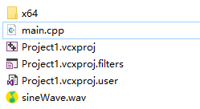

你还可以修改一下参数，重新生成音频，听听不同频率下的正弦波有什么区别。

此外，你还可以尝试模拟空间音频的效果：

``` c++
std::vector<uint8_t> generateSineSurroundWave(int timeLengthSec, int frequency, float amplitude, int numChannels, int sampleRate, int bitsPerSample) {
	assert(numChannels == 2);

	int numBlocks = timeLengthSec * sampleRate;							// 音频块的数量
	amplitude = std::clamp(amplitude, 0.01f, 1.0f);						// 限制振幅的大小, std::clamp 需要C++17
	std::vector<uint8_t> waveTable;
	waveTable.resize(numBlocks * numChannels * bitsPerSample / 8);
	int step = bitsPerSample / 8;										//计算每个样本的字节跨度
	uint8_t* waveTablePtr = waveTable.data();
	SampleValueWriteFunction writer = SampleValueWriteFunctions.at(bitsPerSample);

	float leftEarPos[2]	 = { -5,0 };									// 左耳的位置（X，Y）
	float rightEarPos[2] = {  5,0 };									// 右耳的位置（X，Y）
	float radiusOfSurround = 10;										// 环绕音频的半径
	float audioAttenuationFactor = 0.7;									// 声音的衰减因子，例如0.7，代表每隔一个单位长度，音频会衰减为原来的0.7倍
	float periodSec = 2;												// 旋转一圈的耗时，单位为秒，2代表每两秒旋转一圈

	for (int i = 0; i < numBlocks; i++) {
		float time = i / (float)numBlocks * timeLengthSec;							// 当前音频块所对应的时间
		float sampleValue = amplitude * std::sin(2 * M_PI * frequency * time);		// 当前时间对应的正弦值

		float angle = 2 * M_PI * time / periodSec;									// 算出当前旋转的角度
		float audioSourcePos[2] = {													// 算出当前音源所在的位置
			radiusOfSurround * std::cos(angle),
			radiusOfSurround * std::sin(angle)
		};

		float leftEarDistance  = sqrt(pow(leftEarPos[0] - audioSourcePos[0], 2) + pow(leftEarPos[1] - audioSourcePos[1], 2));		// 音源离左耳的距离
		float leftSampleValue = sampleValue * pow(audioAttenuationFactor, leftEarDistance);											// 根据距离，算出衰减后的音频样本值
		writer(waveTablePtr, leftSampleValue);																						// 写入左声道
		waveTablePtr += step;

		float rightEarDistance = sqrt(pow(rightEarPos[0] - audioSourcePos[0], 2) + pow(rightEarPos[1] - audioSourcePos[1], 2));		// 音源离右耳的距离
		float rightSampleValue = sampleValue * pow(audioAttenuationFactor, rightEarDistance);										// 根据距离，算出衰减后的音频样本值
		writer(waveTablePtr, rightSampleValue);																						// 写入右声道
		waveTablePtr += step;
	}
	return waveTable;
}

int main() {
	assert(sizeof(WavHeader) == 44 && "WAV Header Size Error");
	int numChannels = 2;            //单通道
	int sampleRate = 48000;         //采样率为48000HZ
	int bitsPerSample = 16;         //每个音频样本占16Bit，即2字节
	int auidoLengthSec = 2;         //生成2s的正弦波
	int sineFrequency = 150;        //正弦波的频率
	float sineAmplitude = 0.8f;     //正弦波的振幅
	std::vector<uint8_t> waveTable = generateSineSurroundWave(auidoLengthSec, sineFrequency, sineAmplitude, numChannels, sampleRate, bitsPerSample);
	writeWavFile("./sineWave.wav", numChannels, sampleRate, bitsPerSample, waveTable);
	std::vector<uint8_t> readData = readWavFile("./sineWave.wav");
	assert(readData == waveTable && "Audio Data Error");
	return 0;
}
```

在这个网站上，可以上传文件查看音频的波形：

- [Musiscope (sciencemusic.org)](https://oscilloscope.sciencemusic.org/)

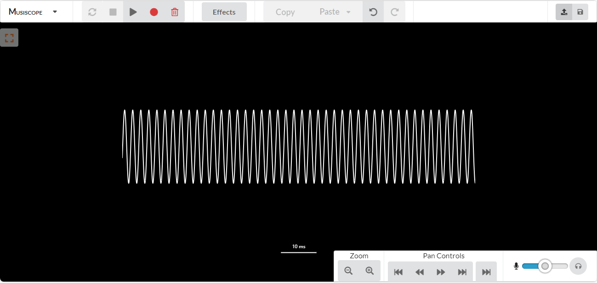

至此，我们应该大致搞明白了音频在计算机上的原始形态。

## 音频框架

### 音频IO接口

有了音频，我们还需要清楚，怎么跟音频设备打交道，而常见的音频设备有：

- 输入：麦克风
- 输出：扬声器，音响，耳机

这些设备厂商会提供或支持相关的音频驱动，通常情况下，我们无需直接跟音频驱动打交道，而是利用操作系统提供的音频接口来处理音频的输入输出，例如：

- **Windows：** DirectSound，ASIO，WASAPI
- **Linux： ** native ALSA，Jack， OSS
- **Mac OS：** CoreAudio ，Jack

为了跨平台的音频处理，很多框架也会对这些接口进行统一的封装，就比如：

- **Qt Multimedia** 中的音频IO模块：[Audio Overview | Qt Multimedia 6.6.1](https://doc.qt.io/qt-6/audiooverview.html)
- **UE** 引入的 **RtAudio** ： http://www.music.mcgill.ca/~gary/rtaudio/

### 傅里叶变换库

傅里叶变换（Fourier Transform）是信号处理的重要工具。

已知声音是一段随时间变换的连续信号，就像是这样：


但我们听到的声音往往不会只有一种频率，实际上，可能会是由很多频率的声波堆叠到一起，就像是这样：

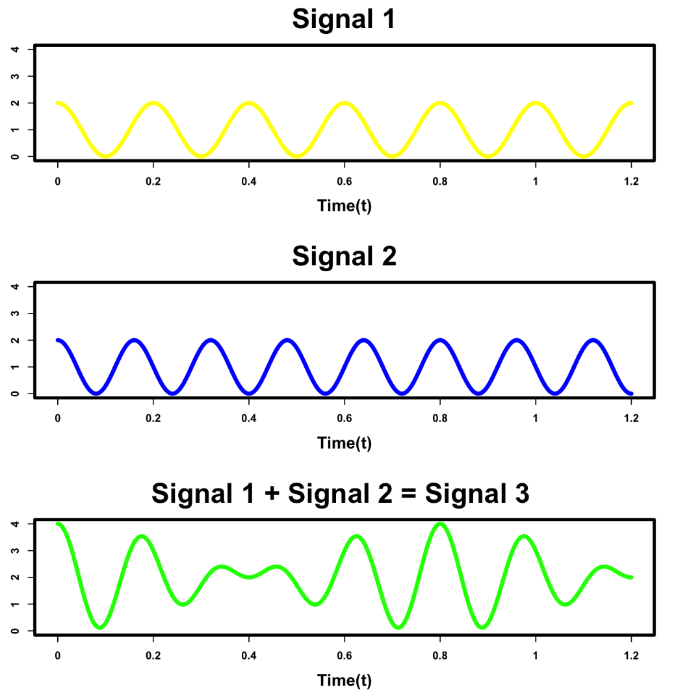

而傅里叶能帮助我们，分析 **一段时间内** 已经混合了大量不同频率波形 的 **时域信号（Time Domain Signal）** ，得出该时间段内声音波形的频率分布，即 **频域信号（Frequency Domain Signal）** ，整个过程看起来就像是这样的：

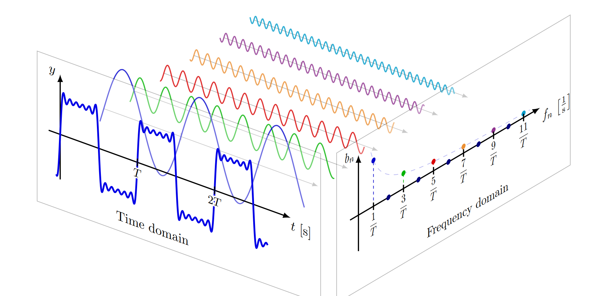

这里有一个非常好的视频讲解了傅里叶变换的原理：

- [【官方双语】形象展示傅里叶变换 |3Blue1Brown](https://www.bilibili.com/video/BV1pW411J7s8)

一些看起来比较混乱的时序信号，在转换到频域之后，我们会更容易发现数据的特征，就比如这是一段音乐的实时分析结果：

> 虽然听不到声音，但相信你也能从跃动的图形能看出音乐的节奏变化。

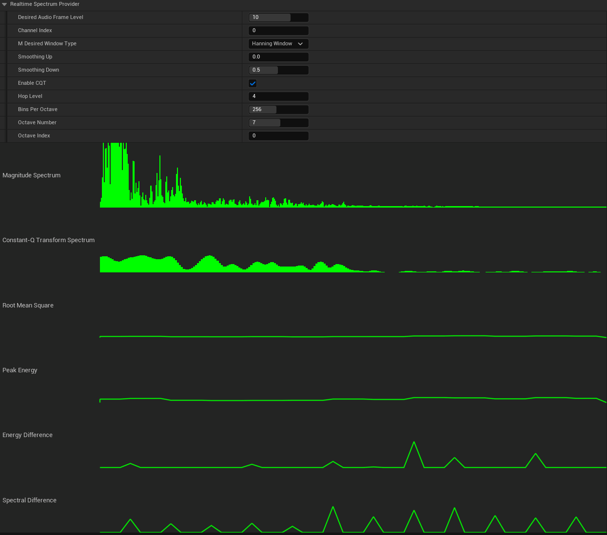

此外，傅里叶变换不仅仅是一个数学处理的工具，它还引导我们在频域去思考问题，如果你喜欢玩 Shader Toy 或 GLSL Sandbox，里面很多代码其实都是基于频域思考的。

这里有一个有趣的视频，每条线都在按固定的频率匀速转动：

- [傅里叶变换之美 | 科学小视](https://www.bilibili.com/video/BV1So4y1T7ae)

这里有一些比较成熟的傅里叶算法实现：

- [fftw3](https://github.com/FFTW/fftw3)：西方最快的傅里叶变换库
- [pffft](https://bitbucket.org/jpommier/pffft)：一个小巧的傅里叶变换库
- [ffts](https://github.com/anthonix/ffts)：南方最快的傅里叶变换库（狗头）

如果你也像笔者一样喜欢音频可视化，这里推荐两个开源库：

- [adamstark/Gist: A C++ Library for Audio Analysis (github.com)](https://github.com/adamstark/Gist)
- [jmerkt/rt-cqt: Real-Time Constant-Q Transform (github.com)](https://github.com/jmerkt/rt-cqt)

### DSP算法库

DSP的全称是 **数字信号处理（Digital Signal Processor）**

在 `认识音频` 的小节中，我们生成了一个正弦波，并写入到wav文件，通常情况下，这些功能会囊括在DSP库中，此外，它往往还会提供一些其他功能，例如：

- 滤波器
- 重采样
- 音频合成
- 频谱分析
- ...

开源DSP库有：

- [KFR | Fast, modern C++ DSP framework (kfrlib.com)](https://www.kfrlib.com/)
- [Maximilian | C++ Audio and Music DSP Library](https://github.com/micknoise/Maximilian)

### 音频开发引擎

通常情况下，对于游戏项目的音频开发人员，无需了解上面的一些底层接口和框架，一般游戏引擎都会提供基本的音频模块，涉及到复杂的音频机制，我们会直接使用音频引擎提供的编辑器来进行开发。

常见的音频引擎有：

- [CRIWARE ADX](https://www.criware.com/en/products/adx2.html)：ADX 几乎没有学习曲线，因为它的创作工具充分利用了 DAW 范式所提供的功能，并添加了直观的功能来创建交互式声音。在项目规模越来越大、期限越来越紧的时候，使用 ADX 提高您的工作效率！
- [FMOD](https://fmod.com/)：FMOD 是一种端到端解决方案，用于为任何游戏添加声音和音乐。使用 FMOD Studio 构建自适应音频，并使用 FMOD 引擎在游戏中播放。
- [Wwise | Audiokinetic](https://www.audiokinetic.com/zh/products/wwise/)：可提供一整套互动音频设计与开发工具，无论项目规模如何都能帮您轻松完成原型设计，并在此基础上将自己的音频创作构想变为现实。

这些音频软件都会提供独特的编辑器，并在相关的游戏引擎（UE，Unity，Cocos...）中提供插件支持。

关于音频引擎的选择，知乎上面有一些相关的讨论：

- [有哪些国内的游戏使用了音频引擎来做音频部分的开发？比如FMOD和wwise? - 知乎 (zhihu.com)](https://www.zhihu.com/question/29992299)

- [使用Unity5开发手游，使用FMOD或wwise音频插件而不是自带的声音系统有哪些好处？ - 知乎 (zhihu.com)](https://www.zhihu.com/question/61882604)

**Meta Sound** 算是UE5提供的一个内置的音频引擎，虽然目前它的功能并不能媲美上面的几个音频引擎，但这种一站式的解决方案，无疑会让UE变得越来越强大。

就像 UE5 的建模工具一样，其最大的价值不是让美术人员也能在UE里进行建模，本质上最大的受益者其实是开发人员（应该算TA？）

开发人员可以针对自身项目的场景资产在编辑器下进行快速的算法效果验证，在策略稳定后，利用UE底层提供的一系列网格处理算法，搭建出一条从DCC模型到高品质引擎资产的自动化管线。

> 在之前开放世界的章节提到，HLOD是将Cell中的所有模型合成一个低精度的模型，在具有复杂类别的场景中使用统一的策略往往很难得到好的效果，在熟悉了UE底层的网格处理算法，如果有恰当的资产分类，想要生成高品质的HLOD并不困难。

## UE 音频

 在 Unreal Fest 2023 ，大佬介绍了 UE 的音频架构：

- [Sounds Good: Unreal Engine Audio | Unreal Fest 2023](https://www.bilibili.com/video/BV1EC4y1J7Bs)

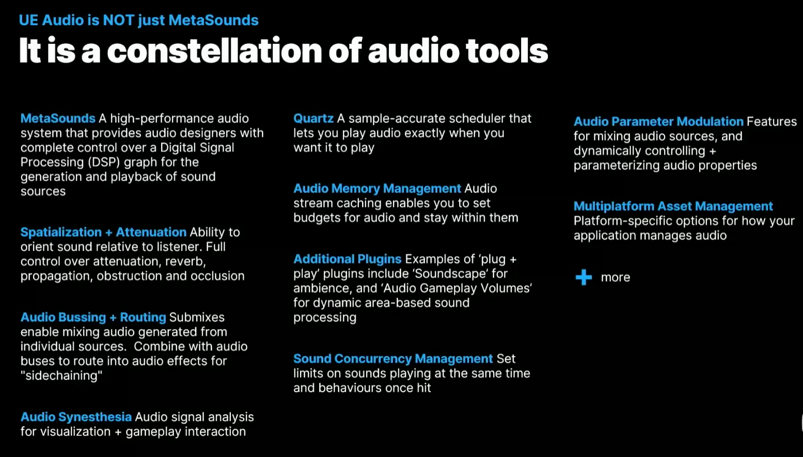

我们能从如下站点获取到一些信息，但可惜的是，虚幻中关于音频的文档相对而言比较少，并且混杂着大量已过时的文档：

- [在虚幻引擎中使用音频 |虚幻引擎 5.3 文档 (unrealengine.com)](https://docs.unrealengine.com/5.3/en-US/working-with-audio-in-unreal-engine/)
- [Latest unreal-engine topics in Audio - Epic Developer Community Forums (unrealengine.com)](https://forums.unrealengine.com/tags/c/development-discussion/audio/42/unreal-engine)

### 音频设备

音频设备分为输入设备和输出设备，它们的相关信息分别存储在UE的 **Audio::FCaptureDeviceInfo** 和 **Audio::FAudioPlatformDeviceInfo** ，我们可以通过如下接口获取到所有的设备：

``` c++
// 获取所有的输入设备
Audio::FAudioCapture AudioCapture;
TArray<Audio::FCaptureDeviceInfo> CaptureDevices;
AudioCapture.GetCaptureDevicesAvailable(CaptureDevices);
for (auto InputDeviceInfo : CaptureDevices) {
    UE_LOG(LogTemp, Warning,TEXT("[Input Device] Name: %s, Device Id: %s, Num Channels: %u, Sample Rate: %u, Supports Hardware AEC: %u, "),
        *InputDeviceInfo.DeviceName,
        *InputDeviceInfo.DeviceId,
        InputDeviceInfo.InputChannels,
        InputDeviceInfo.PreferredSampleRate,
        InputDeviceInfo.bSupportsHardwareAEC);
}

// 获取当前（默认）音频输入设备
Audio::FCaptureDeviceInfo CurrentInputDevice;
AudioCapture.GetCaptureDeviceInfo(CurrentInputDevice);
UE_LOG(LogTemp, Warning, TEXT("[Current Input Device] %s"),
    *CurrentInputDevice.DeviceName);

// 获取所有的输出设备
Audio::FMixerDevice* AudioMixerDevice = FAudioDeviceManager::GetAudioMixerDeviceFromWorldContext(GWorld);		//使用当前GWorld作为WorldContentObject
if (AudioMixerDevice){
    if (Audio::IAudioMixerPlatformInterface* MixerPlatform = AudioMixerDevice->GetAudioMixerPlatform()){
        uint32 NumOutputDevices = 0;
        MixerPlatform->GetNumOutputDevices(NumOutputDevices);
        for (uint32 i = 0; i < NumOutputDevices; ++i){
            Audio::FAudioPlatformDeviceInfo OutputDeviceInfo;
            MixerPlatform->GetOutputDeviceInfo(i, OutputDeviceInfo);
            UE_LOG(LogTemp, Warning, TEXT("[Output Device] Name: %s, Device Id: %s, Num Channels: %u, Sample Rate: %u, "),
                *OutputDeviceInfo.Name,
                *OutputDeviceInfo.DeviceId,
                OutputDeviceInfo.NumChannels,
                OutputDeviceInfo.SampleRate);
        }

        // 获取当前（默认）音频输出设备
        Audio::FAudioPlatformDeviceInfo CurrentOutputDevice = MixerPlatform->GetPlatformDeviceInfo();
        UE_LOG(LogTemp, Warning, TEXT("[Current Output Device] %s"),
            *CurrentOutputDevice.Name);
    }
}
```


### 输出音频

UE 中的音源基类是 **USoundBase** ：

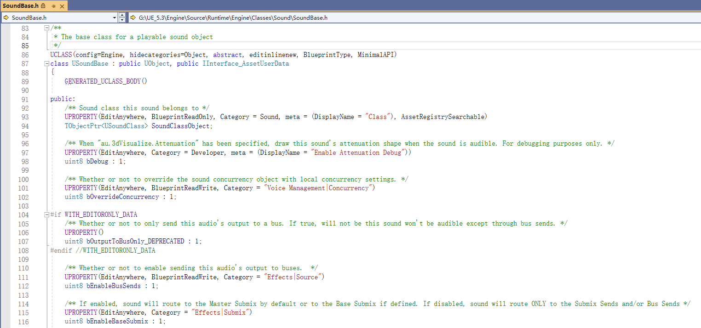

引擎中有许多派生：

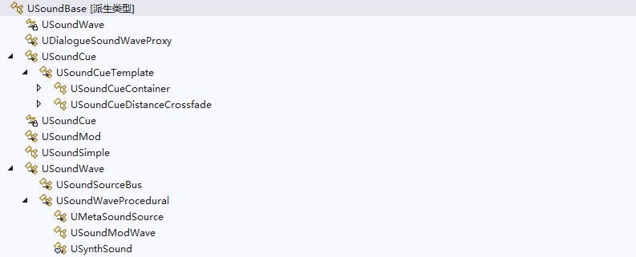

我们的关注点主要在 **USoundWave** 上，它会将波形数据传输给音频设备进行播放。

结合我们之前编写的正弦波生成函数，我们也可以在UE里播放我们自定义的波形数据，就像是这样：

```  c++
void UTestBlueprintLibrary::PlayTestAudio(UObject* WorldContext)		// 用于测试的蓝图函数库
{
    int numChannels = 2;			//单通道
    int sampleRate = 48000;			//采样率为48000HZ
    int bitsPerSample = 16;			//每个音频样本占16Bit，即2字节
    int auidoLengthSec = 2;			//生成2s的正弦波
    int sineFrequency = 440;		//正弦波的频率
    float sineAmplitude = 0.8f;		//正弦波的振幅

    USoundWaveProcedural* Wave = NewObject<USoundWaveProcedural>();
    Wave->NumChannels = numChannels;
    Wave->SampleByteSize = bitsPerSample / 8;		// UE只支持int16
    Wave->SetSampleRate(sampleRate);
    std::vector<uint8_t> waveTable = generateSineWave(auidoLengthSec,
                                                      sineFrequency, 
                                                      sineAmplitude, 
                                                      numChannels, 
                                                      sampleRate, 
                                                      bitsPerSample);
    Wave->QueueAudio(waveTable.data(), waveTable.size());
    UGameplayStatics::PlaySound2D(WorldContext, Wave);
}
```

这里用到了函数`UGameplayStatics::PlaySound2D`，我们可以看下它的内部实现：

``` c++
void UGameplayStatics::PlaySound2D(const UObject* WorldContextObject, 
                                   USoundBase* Sound, 
                                   float VolumeMultiplier,
                                   float PitchMultiplier, 
                                   float StartTime, 
                                   USoundConcurrency* ConcurrencySettings, 
                                   const AActor* OwningActor,
                                   bool bIsUISound)
{
	if (!Sound || !GEngine || !GEngine->UseSound())
	{
		return;
	}

	UWorld* ThisWorld = GEngine->GetWorldFromContextObject(WorldContextObject, EGetWorldErrorMode::LogAndReturnNull);
	if (!ThisWorld || !ThisWorld->bAllowAudioPlayback || ThisWorld->IsNetMode(NM_DedicatedServer))
	{
		return;
	}

	if (FAudioDeviceHandle AudioDevice = ThisWorld->GetAudioDevice())   // 获取当前世界的音频输出设备
	{
		FActiveSound NewActiveSound;									// 创建一个激活的音频
		NewActiveSound.SetSound(Sound);
		NewActiveSound.SetWorld(ThisWorld);

		NewActiveSound.SetPitch(PitchMultiplier);
		NewActiveSound.SetVolume(VolumeMultiplier);

		NewActiveSound.RequestedStartTime = FMath::Max(0.f, StartTime);

		NewActiveSound.bIsUISound = bIsUISound;
		NewActiveSound.bAllowSpatialization = false;

		if (ConcurrencySettings)
		{
			NewActiveSound.ConcurrencySet.Add(ConcurrencySettings);
		}

		NewActiveSound.Priority = Sound->Priority;
		NewActiveSound.SubtitlePriority = Sound->GetSubtitlePriority();

		// If OwningActor isn't supplied to this function, derive an owner from the WorldContextObject
		const AActor* ActiveSoundOwner = OwningActor ? OwningActor : GameplayStatics::GetActorOwnerFromWorldContextObject(WorldContextObject);

		NewActiveSound.SetOwner(ActiveSoundOwner);

		TArray<FAudioParameter> Params;
		UActorSoundParameterInterface::Fill(ActiveSoundOwner, Params);

		AudioDevice->AddNewActiveSound(NewActiveSound, &Params);	// 将激活音频扔给输出设备处理
	}
}
```

我们调用`USoundWaveProcedural::QueueAudio`添加的Wave数据，会存储到内部的AudioBuffer中，后续会被音频设备调用`USoundWaveProcedural::GeneratePCMData`来接受，并播放声音。

``` c++
int32 USoundWaveProcedural::GeneratePCMData(uint8* PCMData, const int32 SamplesNeeded)
{
    // ...
  	FMemory::Memcpy((void*)PCMData, &AudioBuffer[0], BytesToCopy);
}
```

使用 **USoundWaveProcedural** 我们可以播放PCM数据，但如果涉及到一些复杂的音频生成策略，我们可能需要派生 **USoundWaveProcedural** ， **UMetaSoundSource** 的实现是一个很好的参考示例，我们只需自定义一个 **ISoundGenerator** ，覆写它的音频生成函数：

``` c++
class ISoundGenerator
{
public:
	ENGINE_API ISoundGenerator();
	ENGINE_API virtual ~ISoundGenerator();

	// Called when a new buffer is required. 
	virtual int32 OnGenerateAudio(float* OutAudio, int32 NumSamples) = 0;

	// Returns the number of samples to render per callback
	virtual int32 GetDesiredNumSamplesToRenderPerCallback() const { return 1024; }

	// Optional. Called on audio generator thread right when the generator begins generating.
	virtual void OnBeginGenerate() {}

	// Optional. Called on audio generator thread right when the generator ends generating.
	virtual void OnEndGenerate() {}

	// Optional. Can be overridden to end the sound when generating is finished.
	virtual bool IsFinished() const { return false; }

	// Retrieves the next buffer of audio from the generator, called from the audio mixer
	ENGINE_API int32 GetNextBuffer(float* OutAudio, int32 NumSamples, bool bRequireNumberSamples = false);

	virtual Audio::AudioTaskQueueId GetSynchronizedRenderQueueId() const { return 0; }

protected:

	// Protected method to execute lambda in audio render thread
	// Used for conveying parameter changes or events to the generator thread.
	ENGINE_API void SynthCommand(TUniqueFunction<void()> Command);

private:

	ENGINE_API void PumpPendingMessages();

	// The command queue used to convey commands from game thread to generator thread 
	TQueue<TUniqueFunction<void()>> CommandQueue;

	friend class USynthComponent;
};
```

再派生自己的 **USoundWaveProcedural** ，覆写：

``` c++
virtual ISoundGeneratorPtr USoundBase::CreateSoundGenerator(const FSoundGeneratorInitParams& InParams) { return nullptr; }
```

UE的音频设备在播放音频源时，如果它是程序化音频`(USoundWave.bProcedural == true)`，那么将会调用`CreateSoundGenerator`为其创建 **SoundGenerator** ：


在实际解析音频时，会调用如下接口生成音频：


详细的实现可参考  **UMetaSoundSource** 和 **FMetasoundGenerator**

### 捕获音频

游戏项目中很少会有音频捕获的需求，因此这里只做简单介绍。

关于音频捕获，主要分为两类：

- 捕获系统的音频
- 捕获游戏内的音频

#### 系统音频捕获

系统音频捕获 特指 输入设备（麦克风）的采集，UE目前并不支持输出设备的捕获，如果有相应的需求，则需要使用更低级别的API来实现（如WASAPI）。

``` c++
TSharedPtr<Audio::FAudioCapture> AudioCapture = MakeShared<Audio::FAudioCapture>();
Audio::FOnCaptureFunction OnCapture = [](const float* AudioData,
                                             int32 NumFrames, 
                                             int32 InNumChannels,
                                             int32 InSampleRate, 
                                             double StreamTime, 
                                             bool bOverFlow) {
    // 处理采集到的音频数据，此时是在异步线程
};
Audio::FAudioCaptureDeviceParams Params;									// 音频采集的参数配置，不填设备则会使用默认输入设备
if (mAudioCapture->OpenCaptureStream(Params, MoveTemp(OnCapture), 1024)) {	// 开始音频捕获
    Audio::FCaptureDeviceInfo Info;
    if (mAudioCapture->GetCaptureDeviceInfo(Info)){
        OnAudioFormatChanged.ExecuteIfBound(Info.InputChannels, Info.PreferredSampleRate);  // 音频格式变换的通知信号
    }
}
```

#### 游戏内音频捕获

游戏内音频捕获使用UE提供的接口 **ISubmixBufferListener** ：

``` c++
/** Abstract interface for receiving audio data from a given submix. */
class ISubmixBufferListener
{
public:
	virtual ~ISubmixBufferListener() = default;
	
	/**
	Called when a new buffer has been rendered for a given submix
	@param OwningSubmix	The submix object which has rendered a new buffer
	@param AudioData		Ptr to the audio buffer
	@param NumSamples		The number of audio samples in the audio buffer
	@param NumChannels		The number of channels of audio in the buffer (e.g. 2 for stereo, 6 for 5.1, etc)
	@param SampleRate		The sample rate of the audio buffer
	@param AudioClock		Double audio clock value, from start of audio rendering.
	*/
	virtual void OnNewSubmixBuffer(const USoundSubmix* OwningSubmix, float* AudioData, int32 NumSamples, int32 NumChannels, const int32 SampleRate, double AudioClock) = 0;

	/**
	 * Called if the submix is evaluating disabling itself for the next buffer of audio in FMixerSubmix::IsRenderingAudio()
	 * if this returns true, FMixerSubmix::IsRenderingAudio() will return true.
	 * Otherwise the submix will evaluate playing sounds, children submixes, etc to see if it should auto-disable
	 *
	 * This is called every evaluation.
	 * ISubmixListeners that intermittently render audio should only return true when they have work to do.
	 */
	virtual bool IsRenderingAudio() const
	{
		return false;
	}
};
```

我们只需派生 **ISubmixBufferListener** ，覆写`OnNewSubmixBuffer`处理音频数据，并将其注册到需要捕获 **FAudioDevice** 的 **USoundSubmix** 即可，这块代码依赖比较多，贴在文章中会比较乱，具体的实现大家可参考 **FNiagaraSubmixListener** 。

### DSP 

UE内置了一个非常完善的DSP模块—— **SignalProcessing**

你几乎能在其中找到你想要的任何东西：

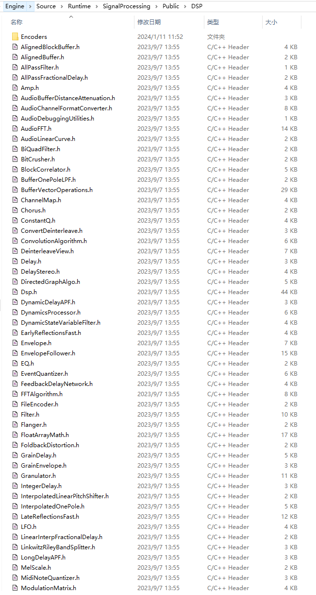

这是一些常用的结构和函数：

- **Audio::TCircularAudioBuffer** ：环形缓冲区，常用于流式音频的存储。
- **Audio::TSampleBuffer** ：用于将RawPCM数据转换为对应位深的可采样数据，类似于提供之前我们提供的`SampleValueWriteFunction`，不过只支持`int16`和`float`。
- **Audio::FResampler** ：重采样器，用于修改音频的采样率。
- **Audio::FWindow** ：用于生成窗函数，支持`Hamming`，`Hann`，`Blackman`。
- **Audio::TSlidingWindow** ：滑动窗口。
- **Audio::IFFTAlgorithm** ：提供基础的FFT算法，提供`FFFTFactory::NewFFTAlgorithm(...)`创建。
- **Audio::FBiquadFilter** ：双二阶滤波器。
- **Audio::FSpectrumAnalyzer** ：频谱分析仪，支持振幅谱，CQT谱。
- **Audio::FAsyncSpectrumAnalyzer** ：执行在异步线程的频谱分析仪，功能同上。
- `ConstantQ.h`：提供了一系列支持常量Q变换的结构，CQT常用于音乐的频谱可视化，它相较于FFT有更好的节奏表现效果。

对于频谱分析，UE还有一个模块`AudioSynesthesia`来扩展相关的功能。


它支持 **CQT** ， **Onset（迸发）** ， **Loudness（响度）** ， **Meter** 的分析，可惜的是大多是一些 **NRT（非实时）** 接口，它要求音频数据必须是在编辑器时导入的资产，不过它里面很多算法结构可以供大家参考。

### MetaSound

**Meta Sound** 是UE5推出的新一代音频系统，相较于旧版的 **Sound Cues** ， **Meta Sound** 不仅具有更好的性能， 更重要的是它支持 **程序化 ( Procedural )**

目前 Meta Sound 在 **UGC** 方面 展现出了非常大的潜力：

- **Mix Universe** ：[活动演讲 | 将音乐带入《Mix Universe》(官方字幕)](https://www.bilibili.com/video/BV1y84y1a7rr)
- **Fortnite** ：[堡垒之夜 - AR 编曲](https://www.bilibili.com/video/BV1F94y1L7fW)

如果你还不了解 Meta Sound，强烈建议去看这个基础视频：

- [活动演讲 | 初学者的MetaSound指南(官方字幕)](https://www.bilibili.com/video/BV15G4y1A7B5)

新建一个 **MetaSoundSource** ，创建如下的图表，点击播放，你能听到熟悉的正弦波：


Meta Sound  的图表是一种数据流图，这个图每帧都会执行，它的每个节点是一个功能函数块，每个节点会接受Input，并结合MetaSound执行的当前上下文，来填充Output数据，每一帧执行产生的音频会存储到MetaSoundSource 的 AudioBuffer 中，等待音频引擎播放。

> Trigger Pin 可以简单当成一个bool变量，输出节点会将它置为true，输入节点会读取它的值来判断该节点的逻辑是否要执行

以上面的正弦波为例，引擎在播放MetaSound时，会经过如下步骤：

- 首先会创建构建MetaSound图表的异步任务，其对应的函数堆栈如下：

    

- 在异步任务中，会加载所有节点（没有依赖的节点会被剔除），并根据依赖关系对剩下的节点进行拓扑排序，相应的代码堆栈如下：

    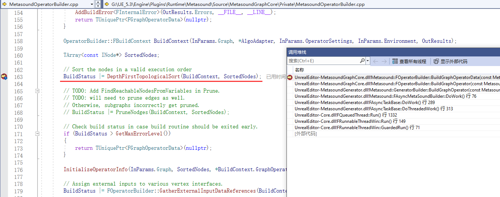

- 最终会通过节点内部的 **INodeOperatorFactory** 来创建 **IOperator** ， **IOperator** 的部分定义如下，它提供了`BindInput`，`ResetFunction`，`ExecuteFunction`，`PostExecuteFunction`来编写相关逻辑：

    ``` c++
    class IOperator
    {
    public:
        /** FResetOperatorParams holds the parameters provided to an IOperator's 
         * reset function.
         */
        struct FResetParams
        {
            /** General operator settings for the graph. */
            const FOperatorSettings& OperatorSettings; 
    
            /** Environment settings available. */
            const FMetasoundEnvironment& Environment;
        };
    
        virtual ~IOperator() {}
        
        /** BindInputs binds data references in the IOperator with the FInputVertexInterfaceData.
         *
         * All input data references should be bound to the InVertexData to support
         * other MetaSound systems such as MetaSound BP API, Operator Caching, 
         * and live auditioning. 
         *
         * Note: The virtual function IOPerator::BindInputs(...) will be made a
         * pure virtual when IOperator::GetInputs() is removed at or after release 5.5
         *
         * Note: Binding an data reference may update the which underlying object 
         * the reference points to. Any operator which caches pointers or values 
         * from data references must update their cached pointers in the call to 
         * BindInputs(...).  Operators which do not cache the underlying pointer 
         * of a data reference do not need to update anything after BindInputs(...)
         *
         * Example:
         * 	FMyOperator::FMyOperator(TDataReadReference<float> InGain, TDataReadReference<FAudioBuffer> InAudioBuffer)
         * 	: Gain(InGain)
         * 	, AudioBuffer(InAudioBuffer)
         * 	{
         * 		MyBufferPtr = AudioBuffer->GetData();		
         * 	}
         *
         * 	void FMyOperator::BindInputs(FInputVertexInterfaceData& InVertexData)
         * 	{
         * 		InVertexData.BindReadVertex("Gain", Gain);
         * 		InVertexData.BindReadVertex("Audio", AudioBuffer);
         *
         * 		// Update MyBufferPtr in case AudioBuffer references a new FAudioBuffer.
         * 		MyBufferPtr = AudioBuffer->GetData();
         * 	}
         */
        virtual void METASOUNDGRAPHCORE_API BindInputs(FInputVertexInterfaceData& InVertexData);
    
        /** BindOutputs binds data references in the IOperator with the FOutputVertexInterfaceData.
         *
         * All output data references should be bound to the InVertexData to support
         * other MetaSound systems such as MetaSound BP API, Operator Caching, 
         * and live auditioning. 
         *
         * Note: The virtual function IOPerator::BindOutputs(...) will be made a
         * pure virtual when IOperator::GetOutputs() is removed at or after release 5.5
         *
         * Note: Binding an data reference may update the which underlying object 
         * the reference points to. Any operator which caches pointers or values 
         * from data references must update their cached pointers in the call to 
         * BindOutputs(...).  Operators which do not cache the underlying pointer 
         * of a data reference do not need to update anything after BindOutputs(...)
         *
         * Example:
         * 	FMyOperator::FMyOperator(TDataWriteReference<float> InGain, TDataWriteReference<FAudioBuffer> InAudioBuffer)
         * 	: Gain(InGain)
         * 	, AudioBuffer(InAudioBuffer)
         * 	{
         * 		MyBufferPtr = AudioBuffer->GetData();		
         * 	}
         *
         * 	void FMyOperator::BindOutputs(FOutputVertexInterfaceData& InVertexData)
         * 	{
         * 		InVertexData.BindReadVertex("Gain", Gain);
         * 		InVertexData.BindReadVertex("Audio", AudioBuffer);
         *
         * 		// Update MyBufferPtr in case AudioBuffer references a new FAudioBuffer.
         * 		MyBufferPtr = AudioBuffer->GetData();
         * 	}
         */
        virtual void METASOUNDGRAPHCORE_API BindOutputs(FOutputVertexInterfaceData& InVertexData);
    
        /** Pointer to initialize function for an operator.
         *
         * @param IOperator* - The operator associated with the function pointer.
         */
        using FResetFunction = void(*)(IOperator*, const FResetParams& InParams);
    
        /** Return the reset function to call during graph execution.
         *
         * The IOperator* argument to the FExecutionFunction will be the same IOperator instance
         * which returned the execution function.
         *
         * nullptr return values are valid and signal an IOperator which does not need to be
         * reset.
         */
        virtual FResetFunction GetResetFunction() = 0;
    
        /** Pointer to execute function for an operator.
         *
         * @param IOperator* - The operator associated with the function pointer.
         */
        using FExecuteFunction = void(*)(IOperator*);
    
        /** Return the execution function to call during graph execution.
         *
         * The IOperator* argument to the FExecutionFunction will be the same IOperator instance
         * which returned the execution function.
         *
         * nullptr return values are valid and signal an IOperator which does not need to be
         * executed.
         */
        virtual FExecuteFunction GetExecuteFunction() = 0;
    
        /** Pointer to post execute function for an operator.
         *
         * @param IOperator* - The operator associated with the function pointer.
         */
        using FPostExecuteFunction = void(*)(IOperator*);
    
        /** Return the FPostExecute function to call during graph post execution.
         *
         * The IOperator* argument to the FPostExecutionFunction will be the same IOperator instance
         * which returned the execution function.
         *
         * nullptr return values are valid and signal an IOperator which does not need to be
         * post executed.
         */
        virtual FPostExecuteFunction GetPostExecuteFunction() = 0;
    };
    ```

    

- 经过上面的流程后，图表已经构建完毕，还记得我们之前提到过，如果 **USoundWave** 的`bProcedural`为`true`，它会创建一个相应的 **ISoundGenerator** ，并在音频引擎的每一帧，调用`ISoundGenerator::OnGenerateAudio`来填充数据，没错， **Meta Sound** 正是这样的流程：

    

- 来看看我们的正弦节点在这一帧执行时做了什么：

    > 每一帧播放，它会根据`DeltaPhase`递增`Phase`，然后从 **FSineWaveTableGenerator** 的`WaveTable`中获取到相关的样本值，填充到输出的AudioBuffer中

    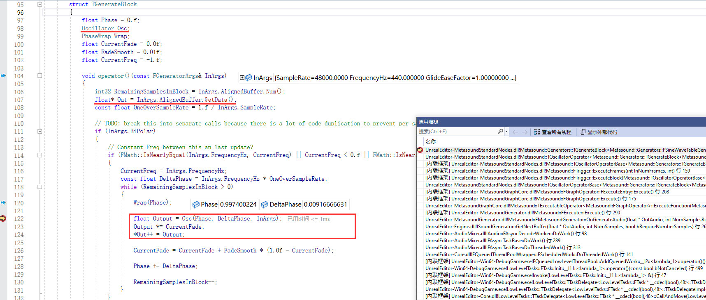

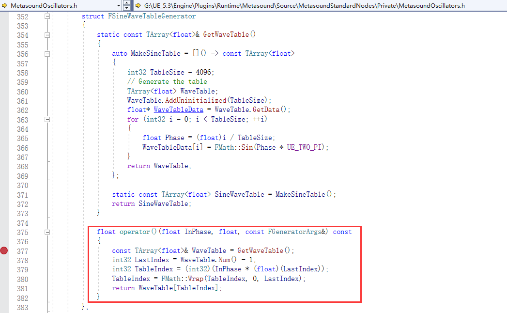

至此，相信你已经基本搞懂了 **Meta Sound** 的基本原理。

但要想用好Meta Sound，还需要更多专业的音频知识，这方面笔者也是一个菜鸡，有点爱莫能助~

它里面提供了很多的函数节点，试一试，电脑又不会爆炸：

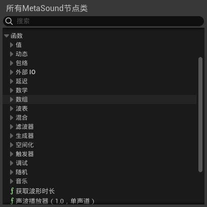

但有时候并不能完全满足我们的需求，现在，你可以试着做一些自定义的扩展。

#### 蓝图交互

**Meta Sound** 与蓝图并不相同，它支持的变量比较有限：


你同样也可以在C++中扩展这些变量，只需要找到合适的参考。

这些参数并没有直接暴露到属性编辑器，想要修改这些变量值有点复杂，我们可以借助 **UAudioComponent** 来简化这个过程，它派生自 **IAudioParameterControllerInterface** ，该接口提供了很多音频参数设置的便捷接口：


如果不想使用 **UAudioComponent** ，可以参考相关函数的具体实现。

这里需要特意提一下 UE 音频系统中的 `Trigger`，它与C++代码中常用的`Delegate`并不相同，我们可以简单把它当作一个bool变量，比如这样的图表：

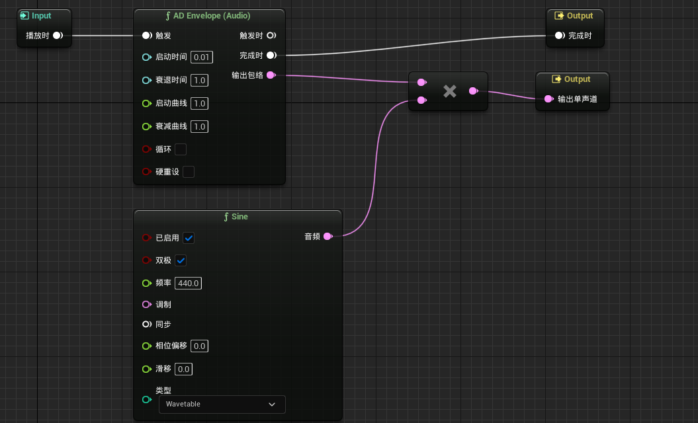

已知每一个节点都会根据依赖关系的拓扑排序来执行，Input在执行时，会将输出的委托`播放时`置为true，在执行`AD Envelope`的时候，会读取输入委托`触发`与之相连的节点（即`播放时`），如果发现它为true才会执行该节点，在`AD Envelope`执行完毕后，会将输出委托`完成时`置为`true`，此时`Output`节点执行时检测到输入委托`完成时`为true，才会通知`MetaSoundSource`结束播放，也就是这里：

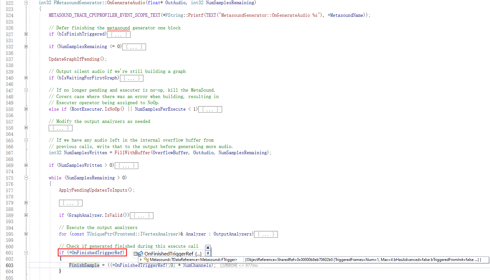


#### 运行时构建

在 [Sounds Good](https://www.bilibili.com/video/BV1EC4y1J7Bs) 中，大佬提到了Meta Sound已经支持了运行时构建 Sound Graph，但是目前而言并不是很完善，还处于测试阶段，在 **MetasoundEngineTest** 中，能找到很多测试代码：

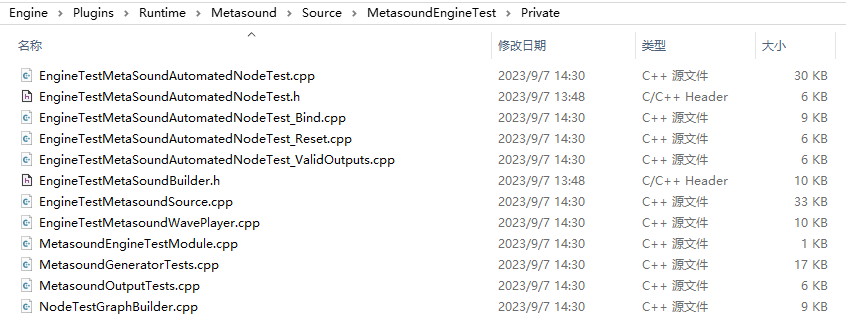

考虑到这部分代码后续可能会有较大的变动，因此暂不展开，后续官方版本稳定后再更新本节内容~

演示中还提到， Meta Sound 将推出大量新的音频控件！！！！！！！！！！！！

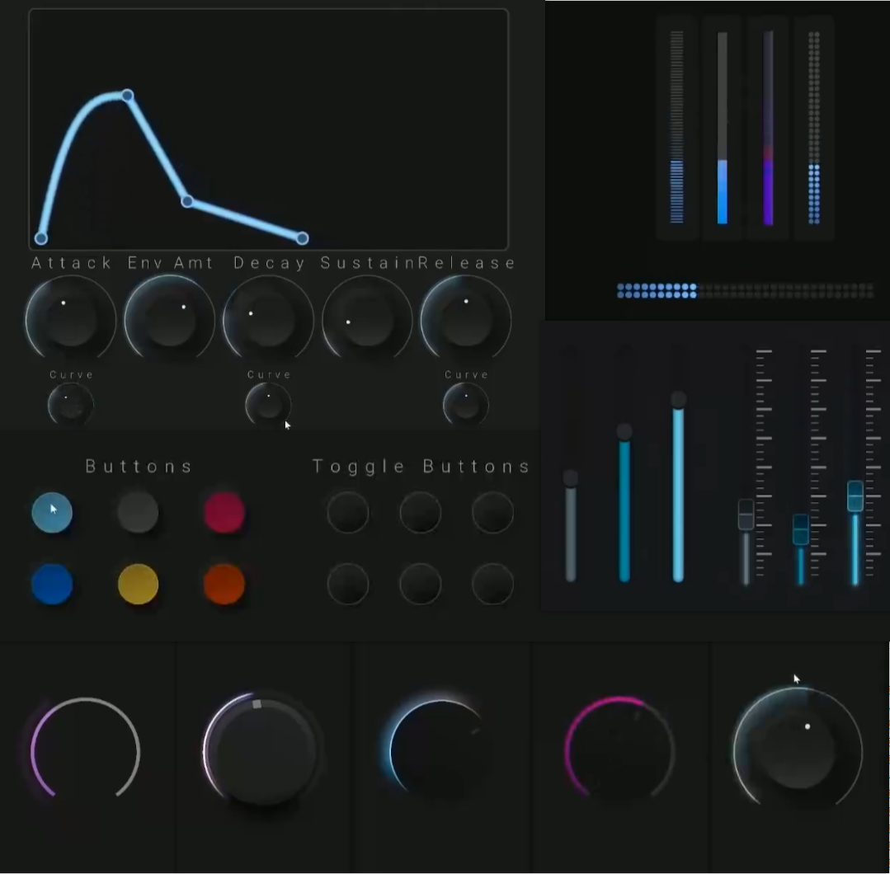


