# 音频可视化软件—Specinker（已闭源）

## **前言**

相信很多小伙伴都喜欢音乐吧，笔者也是一个忠实的音乐爱好者，总是喜欢一个人什么也不做，静静地听音乐。

你可能很早之前已经接触过一些音频可视化软件，如后期渲染软件AE，WallpaperEngine，雨滴，Avee等。不得不说AE的频谱效果绝对是很强的，但其渲染时间一直是个很头疼的问题，而WE，雨滴主打的是壁纸软件，频谱的素材少之又少。Avee是一个不错的选择，如果Spec不满足你的需求，笔者强烈推荐使用它，它可以输入音频并编码视频，效果也不俗。

Spec的初衷是为了让笔者自己能学到一些音视频、图形相关的知识，没想到越做越深，软件定位也从一开始的显示频谱的音乐播放器，到频谱设计器，再到如今的音频可视化图形引擎，之所以敢称之为图形引擎，是因为它确实已经具备了不少图形引擎的功能。

如果你对up及spec的开发过程感兴趣，结尾处有简单说明-.

## **下载地址：**

下载地址：[specinker5.1.exe - 蓝奏云](https://italink.lanzoui.com/iYOAZp16qib)（崩溃请更新显卡驱动，并使用独立显卡打开）

旧版博客：[Specinker旧版博客_ItaLink-CSDN博客](https://blog.csdn.net/qq_40946921/article/details/108539935)

使用教程：[Spec 使用教程_ItaLink-CSDN博客_spec软件](https://blog.csdn.net/qq_40946921/article/details/108528317)

本科毕业答辩PPT演示：

 
    <iframe width="560" height="315" src="//player.bilibili.com/player.html?bvid=BV1f44y1z7qi&cid=348421166&p=1&share_source=copy_web&autoplay=false" scrolling="no" border="0" frameborder="no" framespacing="0" allowfullscreen="true">		
    </iframe> 

## **Specinker是什么？**

Specinker是up耗时一年呕心沥血制作的一个音频可视化图形引擎， 它具备很多的图形效果，包含一些基础的频谱图形，特效滤镜，粒子系统，3D模型等，up把这些图形进行了封装，公开了一些可调整的参数，你甚至可以为这些参数编写lua脚本以实现动态的效果（比如说自动旋转、跟踪鼠标、跟随节奏移动......）

## **视频教程**

 
    <iframe width="560" height="315" src="//player.bilibili.com/player.html?isOutside=true&aid=335187087&bvid=BV1XA411c7vb&cid=398619724&p=1&autoplay=false" scrolling="no" border="0" frameborder="no" framespacing="0" allowfullscreen="true">		
    </iframe> 

## **Specinker的功能亮点**

### **简洁高效的UI**

Spec的图形界面的整体框架随着软件定位的变动总共有五个版本，以下是四个历史界面的部分设计草图：目前Spec使用更为精简的图形界面，单窗口，高可控。

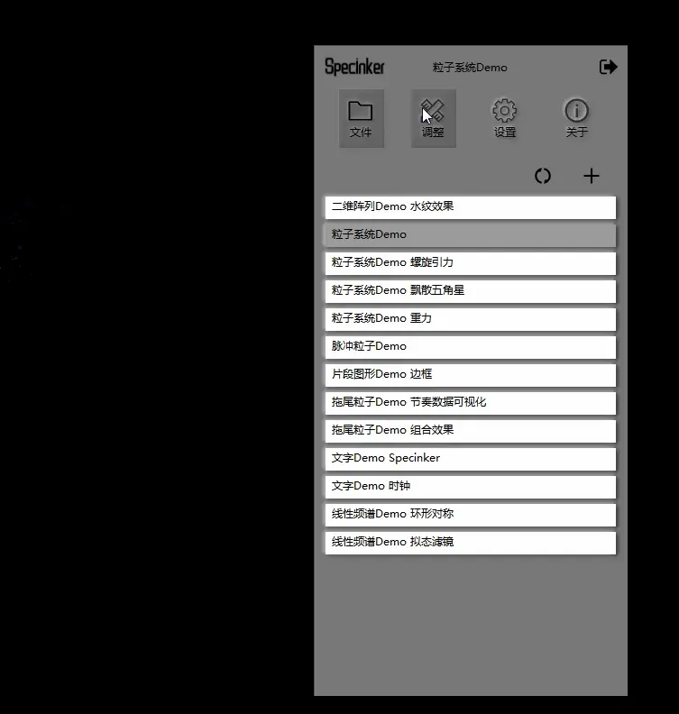

其中笔者重新实现了高性能的轻量级调节控件：

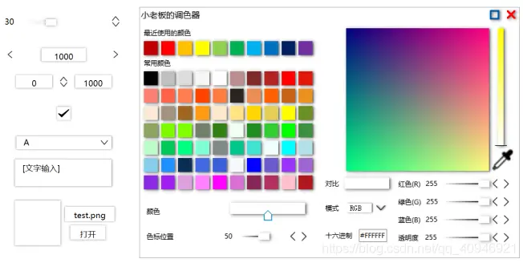

### **素材管理**

在【调整】界面点击【+】可添加素材，添加之后会为该素材分配一个默认的ID，右键能对该素材进行操作，单次点击能打开素材的位置调节控件。

**编组 ：** 键盘按住Ctrl能够多选素材方块，选取之后鼠标右键能打开菜单进行编组，编组之后能够进行整体移动。
### **属性管理**

对于任何素材的属性，你可以右键点击打开菜单，可以对其继续复制【Ctrl+C】粘贴【Ctrl+V】，还能使用撤销【Ctrl+Z】重做【Ctrl+Y】，需要注意的是这些操作是对当前属性进行操作。

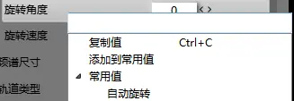

除此之外，你还能将属性【添加到常用值】，这样的话这个属性就可以一直出现在同名属性的【常用值】列表里了，笔者就添加过一些，比如【旋转角度】的【自动旋转】。

你还可以在Spec【设置】界面的常用值管理中去管理这些值：

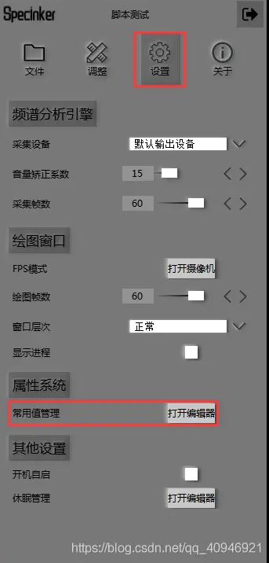

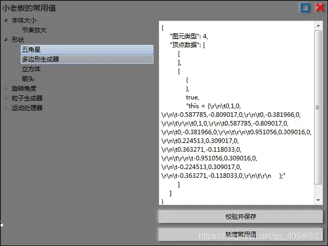

### **基础图形** 

spec实现了一些简单的基础图形供用户使用，可以通过将这些图形组合形成新的效果，比如下面这样：

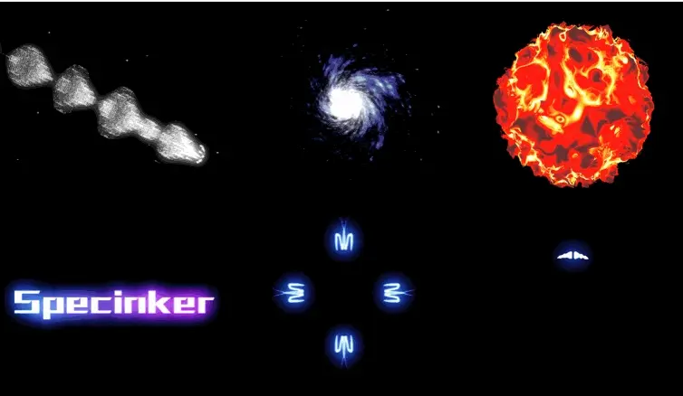

### **实时滤镜**

spec中实现了很多实时滤镜，使用滤镜能够让图形变得很好看，不过需要注意的是滤镜的占用比较高，因此请尽量把滤镜区域弄小一点。

### **脚本引擎**

为了让素材的某个属性能动态变化，比如说经常想让一个图形自动旋转，早期的Spec是通过增加一个【旋转速度】的选项配合【旋转角度】来实现的，这样的实现方式有很多弊病：

- 【旋转速度】容易跟【旋转角度】出现冲突，且不容易同步
- 只能实现单纯的自动旋转，无法进行扩展，比如想让图形跟着节奏来自动旋转是做不到的

Spec目前采用的方式是使用Lua脚本，可以直接编写Lua代码，让素材的属性能动态变化。能够使用代码的属性前会有一个勾选框，如下：

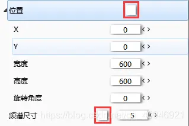

只需勾选，该属性则会使用代码进行计算。比如想实现一个自动旋转的效果：

1. 勾选代码勾选框

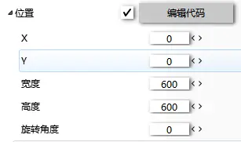

2. 点击编辑代码按钮打开代码编辑器并写入代码

3. 点击测试运行，能看到图形已经开始自动旋转了

4. 我们还可以公开自己的参数，右键位置，添加一个float1变量

5. 并命名为【旋转速度】

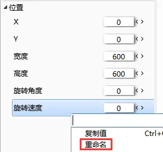

6. 然后再用【旋转速度】替换代码中的100

7. 之后就可以使用【旋转速度】参数进行调整啦。

### **粒子系统**

Spec在脚本引擎和OpenGL的基础上实现了一个可编程的GPU粒子系统。

默认的粒子系统的添加了重力和引力的代码，并增加了鼠标跟随。为它添加一个辉光滤镜，你会发现效果其实还是不错的。

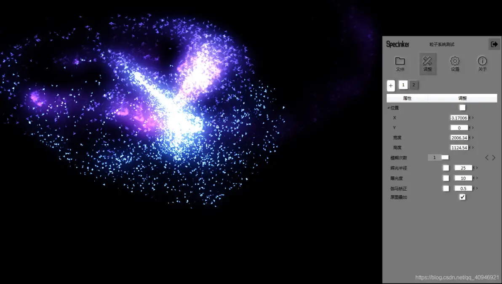

下面详细的来说明一下如何使用粒子系统：

**控制粒子的形状：**

粒子的形状是由【图元类型】和【顶点数据】控制，默认采用的【图元类型】是三角扇，使用Lua代码生成n多边形：

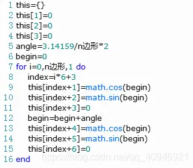

代码你可能看不太懂，没关系，但你一定要知道Spec是怎么解析顶点数据的格式，你需要构造一个Lua数组，其中每三个数据分别代表一个顶点的xyz，需要注意两点：

- 顶点坐标采用标准化坐标，即xyz的取值范围为[-1,1]
- Lua数组的起始下标为1

比如想弄一个正方形的粒子形状，那么我们可以在代码中构造这样的数据：

点击【测试运行】，并把【图元类型】更改为【三角带】，就能看到粒子的形状变成正方形了：

**【生成数量】** ：表示每秒生成多少个粒子

**【生命周期】** ：表示每个粒子存活多少秒

**下面讲解粒子的可编程性：**

粒子说白了就是带有一些状态的数据组合（比如速度，大小，位置，旋转等），粒子运动，则是更改这些粒子状态。Spec的粒子系统使用了两个代码接口：

**【粒子生成器】：** 用来生成粒子的初始状态，可以当作是第一帧的状态（这个状态不会显示出来）。

**【运动处理器】：** 粒子生成之后每一帧都会调用该代码处理粒子的状态。

需要特别提醒的是：

- 这里不再是通过Lua代码进行实现，由于Spec采用的是GPU粒子，通过变换反馈进行实现，也就是这个代码最终是在GPU中运行的，因此这里使用的代码格式为GLSL（着色器语言）
- 请仔细阅读运动处理器中控制台日志，其中in表示输入变量，笔者为了区分，命名以i开头，比如变量【iPosition】代表的是上一帧的【position】，代码中只需对【position】进行赋值即可。

通过GLSL代码，可以定义任何的粒子运动规则，比如说你可以添加重力，阻力，甚至能做一些碰撞效果，由于内容很多，之后UP会用一篇详细的文章进行说明。

## **关于UP及Specinker**

**up** 是一个喜欢躲在角落搞黑科技的小兄弟，首次接触到音乐频谱，是无意间在朋友的壁纸上看到的，也太酷了吧！可能大家已经猜到是什么软件了——对的，Rainmeter（雨滴）。我回去之后立马去找资料学，结果发现雨滴的编程语法跟我所学的C/C++的用法完全不一样，太古老了，当时我就在想：“我花时间去学这个，有用吗？”，很显然，我放弃了，当时也想过自己尝试去做，但是却无从下手。

直到笔者之后学习Qt的时候，在官方例程中找到了一个频谱仪的项目，当时不知道有多激动，可是七八千行的代码对当时的我来说，简直就是泰山压顶，我不了解音视频编码，不了解多媒体驱动，甚至Qt，也才学了几个月，可是难道有项目给我抄我都做不了吗？

 于是我根据代码的逻辑，不断地剔除无用代码，就跟拆炸弹一样的，项目崩了使用之前的备份重新删，花了两个多星期的时间，终于是让我改了只有一千多行的核心代码，在这个过程中，我对音频处理的流程也基本有了个大概的认知，于是我用这部分代码，结合Qt的绘图机制，完成了Specinker的第一个版本：

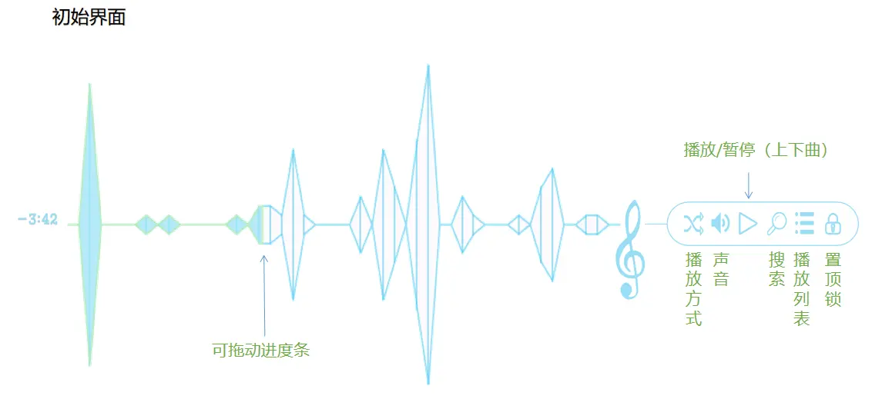

现在回头看看，是不是很烂，但这么点东西，我做了两个多月，不过当时收到了同学的鼓励，也是挺开心的，然后我把这个项目发到了网上，结果，还真有人用！然后我就跟磕了药一样，开始进行疯狂的扩展，我开始把原来的频谱播放器改成了频谱设计器：

结果写到一半，我突然发现我是不是脑袋有毛病，既然这个是制作好显示在桌面上，那我为什么不直接在桌面上进行设计，还弄个预览框，脱裤子放屁。

然后只能把一部分代码抛弃了重新写，然后有了下面这个版本（也就是动音，网上使用的多的可能就是这一个版本，多谢大家的宣传哈）：

这一版在使用体验有了很大的变化，简单了很多，比较容易上手，代码量已经很多了，破万了已经，当时还很激动的跟老师说：“我嫌弃Qt的调色器太丑，自己做了一个，写了两千多行代码呢”，我本打算在这个版本上持续扩展下去，结果问题来了：“博主，桌面感觉频谱有点延迟啊，图形还有点卡顿。”，然后我苦口婆心的说的，“这个东西很耗性能的，有点卡顿应该是正常的。”，我一直以为是这样的，直到有人拿spec的效果跟wallpaper engine做了对比，我才知道是我低估了C++，高估了自己，那咋办？只能改，难道我能认怂？然后我把原本从Qt官方例程中拿到的核心代码基本重写了，不使用Qt的多媒体框架，而是直接使用windows底层的声卡驱动API采集声卡的数据（IMMDevice），并使用了一些信号处理的技术，对音频数据进行平滑，然后音频的节奏感可以说是有了质的飞跃！延迟没有了，节奏感还不错，那个时候我感觉我tm是真的nb，结果转折又来了：

  有个学弟找我问编程题，我跟他说完之后，他一阵吹捧，然后洋洋自得的把spec的效果发给他看了一下，我至今都还记得那段对话：

-   up：【视频】
-   up： 厉害吧
-   学弟：这是什么？
-   up：我自己做的软件，用来做频谱的。
-   学弟：哦哦，我知道是频谱。
-   up：我做了好长时间，写了 **代码呢
-   学弟：兄弟，说实话，你这个真的太烂了，我看过很多频谱视频，比你这个炫酷多了，你等一下我给你翻翻。
-   学弟：【视频】
-   学弟：怎么样？

看完视频我就没说话了，因为我觉得自己就是个笑话，那个视频是AE做的，Spec的频谱效果跟AE相比简直是天壤之别，那天晚上一夜没睡，想啥呢？“AE是怎么做出这样的效果的”，然后搜一下，“哦，原来它有个辉光效果”，再一找：“原来辉光就是把图像变模糊，然后再调亮一点就好了”，然后我立马动手，去找模糊原理，写模糊算法，折腾了几个小时，结果发现我模糊一张1000*1000得跑好几秒，“哦，对了，Qt不是有模糊效果吗？我把那个代码拿过来用用看”，又折腾几个小时，还是得一两秒，对了，他们不是总说图像处理用opencv吗，我再试试这个，然后时间确实是快多了，但是接近100ms，实时绘制得卡成ppt，最后我终于了解到高性能绘图需要使用GPU，然后又再知乎上搜，GPU绘图用什么？就这样折腾到天亮，室友都去上课了，我上床睡觉了，之后就闲了一个多星期，回到家，开始了我的OpenGL学习之路，那段时间很枯燥，写着写着就趴桌子上睡着了，不过好在我拉我弟弟垫背，我学OpenGL的时候他也得看书，QQ微信也没怎么用，跟人间蒸发了一样，不过好在坚持了下来，学完OpenGL我没有直接动手，而是去简单学了3d max，UE4，没有学的很深入，但是特别留意他们的架构和功能，最后才开始写代码的，刚好，也到大四了，这个项目也成为了我的毕业设计，然后，也就有了现在的Spec。

  这一路走来，真的有很多感慨，我曾经也深处谷底，遇到了很多困难，好在得到了很多人的帮助，才能够坚守本心，突破自己。曾经我总是在逃避现实，短暂清醒的瞬间总感觉到很绝望，可是总有那么一天你会知道：总有那么一个人，或是一些人，让你不得不站出来，因为你是他们的希望啊。

 与Spec无关，希望看到的大伙能够积极乐观的过好每一天=.=

** 关于Spec的开发过程，可以查看这个链接： **

https://github.com/Italink/Italink-s-Undergraduate-Design

up也在制作OpenGL相关的教程，可以在专栏里找到。

由于工作的原因，spec可能暂时不能更新了，但是up绝对不会放弃！

等到up将来经验足够，一定会制作一个更好，更炫酷的Spec，那时候可能就不只是在电脑上显示了0.0
